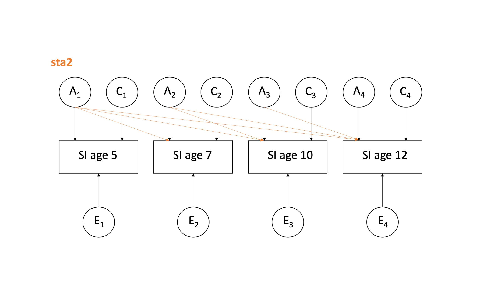
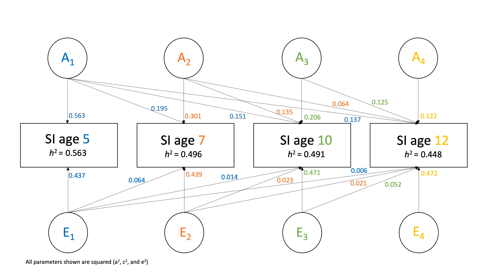

```{r setup, include=FALSE}
knitr::opts_chunk$set(echo = TRUE,
                      comment = NA,
                      prompt = FALSE,
                      cache = FALSE,
                      message = FALSE,
                      warning = FALSE,
                      results = 'markup')

options(bitmapType = 'quartz') # to render fonts better
```

```{r Clear global environment, include=FALSE}
remove(list = ls())
```

```{r Load packages, include=FALSE}
library(knitr)
library(haven)
library(psych)  
library(bestNormalize)
library(OpenMx)
library(tidyr)
library(tidyverse)
library(dplyr) #conflicts with tidyverse for e.g. rename and row_number
```

# Source functions

```{r source functions, include=FALSE}
source("isolation_mhealth_functions.R")
```

# Read in data

```{r source the data file path, include=FALSE}
# source raw data directory
source("../isolation_mentalhealth_data_path.R")
```

```{r read in dta data file, include=FALSE}
dat.raw <- read_dta(paste0(data_path_raw, "Katie_23Sep22.dta"))
colnames(dat.raw)
```

### Column names

```{r select variables needed}
dat <- dat.raw %>%
  dplyr::select(
         atwinid,
         btwinid,
         familyid,
         rorderp5,
         torder,
         zygosity,
         sampsex,
         seswq35,
         sethnic,
         sisoe5,
         sisoe7,
         sisoe10,
         sisoe12,
         sisoy5,
         sisoy7,
         sisoy10,
         sisoy12
  )

colnames(dat)
```

### Recode variables into factors {.tabset .tabset-fade}

#### Sex

```{r recode sex}
dat <- dat %>%
  mutate(
    sex = 
      recode_factor(as_factor(sampsex),
        "1" = "Male",
        "2" = "Female"))

table(dat$sex)
```


#### Zygosity

```{r recode zygosity}
dat <- dat %>%
  mutate(
    zygosity = 
      recode_factor(as_factor(zygosity),
        "1" = "MZ",
        "2" = "DZ"))

table(dat$zygosity)
```

### Convert variables to numeric

```{r create numeric isolation variables}
dat <- dat %>%
  mutate(
    sisoe5 = as.numeric(sisoe5),      # isolation elder
    sisoe7 = as.numeric(sisoe7),
    sisoe10 = as.numeric(sisoe10),
    sisoe12 = as.numeric(sisoe12),
    sisoy5 = as.numeric(sisoy5),      # isolation younger
    sisoy7 = as.numeric(sisoy7),
    sisoy10 = as.numeric(sisoy10),
    sisoy12 = as.numeric(sisoy12) 
  ) %>%
    select(
      -c(sampsex, 
         seswq35)
         )
```

# Variable lists

```{r select variables for correlations}
selvars <- c("sisoe5", "sisoe7", "sisoe10", "sisoe12", "sisoy5", "sisoy7", "sisoy10", "sisoy12")
selvars_norm <- c("sisoe5norm", "sisoe7norm", "sisoe10norm", "sisoe12norm", "sisoy5norm", "sisoy7norm", "sisoy10norm", "sisoy12norm")
selvars_stand <- c("z_score_sisoe5", "z_score_sisoe7", "z_score_sisoe10", "z_score_sisoe12", "z_score_sisoy5", "z_score_sisoy7", "z_score_sisoy10", "z_score_sisoy12")
selvars_norm_all <- c("sisoe5", "sisoe7", "sisoe10", "sisoe12", "sisoy5", "sisoy7", "sisoy10", "sisoy12", "sisoe5norm", "sisoe7norm", "sisoe10norm", "sisoe12norm", "sisoy5norm", "sisoy7norm", "sisoy10norm", "sisoy12norm")
selvars_norm_reg <- c("sisoe5norm_reg", "sisoe7norm_reg", "sisoe10norm_reg", "sisoe12norm_reg", "sisoy5norm_reg", "sisoy7norm_reg", "sisoy10norm_reg", "sisoy12norm_reg")
```

# Data prep

## Skewness

```{r histograms}
# isolation - all not normal
hist(dat$sisoe5)    
hist(dat$sisoe7)  
hist(dat$sisoe10)
hist(dat$sisoe12)   
```

## Rank transformation

All variables are non-normal. We will use the van der Waerden's rank-based transformation as used in [Rimfeld et al 2021](https://acamh.onlinelibrary.wiley.com/doi/full/10.1002/jcv2.12053). For analyses using transformed data, they conducted the van der Waerden transformation prior to residualizing for age and sex as recommended by [Pain et al. 2018](https://www.nature.com/articles/s41431-018-0159-6).  

I will transform all variables to get the normalised estimate.

```{r rank transform variables elder variables}
# elder variables
# isolation age 5
sisoe5_n <- bestNormalize(dat$sisoe5)    # select the type of transformation needed
dat$sisoe5norm <- predict(sisoe5_n)      # create normalised variable
hist(dat$sisoe5norm)                  
summary(dat$sisoe5norm)

# isolation age 7
sisoe7_n <- bestNormalize(dat$sisoe7)   
dat$sisoe7norm <- predict(sisoe7_n)      
hist(dat$sisoe7norm)                  
summary(dat$sisoe7norm)

# isolation age 10
sisoe10_n <- bestNormalize(dat$sisoe10)   
dat$sisoe10norm <- predict(sisoe10_n)      
hist(dat$sisoe10norm)                  
summary(dat$sisoe10norm)

# isolation age 12
sisoe12_n <- bestNormalize(dat$sisoe12)   
dat$sisoe12norm <- predict(sisoe12_n)      
hist(dat$sisoe12norm)                  
summary(dat$sisoe12norm)

# younger variables
# isolation age 5
sisoy5_n <- bestNormalize(dat$sisoy5)   
dat$sisoy5norm <- predict(sisoy5_n)     
hist(dat$sisoy5norm)                  
summary(dat$sisoy5norm)

# isolation age 7
sisoy7_n <- bestNormalize(dat$sisoy7)   
dat$sisoy7norm <- predict(sisoy7_n)      
hist(dat$sisoy7norm)                  
summary(dat$sisoy7norm)

# isolation age 10
sisoy10_n <- bestNormalize(dat$sisoy10)   
dat$sisoy10norm <- predict(sisoy10_n)      
hist(dat$sisoy10norm)                  
summary(dat$sisoy10norm)

# isolation age 12
sisoy12_n <- bestNormalize(dat$sisoy12)   
dat$sisoy12norm <- predict(sisoy12_n)      
hist(dat$sisoy12norm)                  
summary(dat$sisoy12norm)
```

## Regress out sex

```{r Regress out sex}
# Twin 1
dat$sisoe5norm_reg <- (resid(lm(data = dat, sisoe5norm ~ sex, na.action = na.exclude))) 
dat$sisoe7norm_reg <- (resid(lm(data = dat, sisoe7norm ~ sex, na.action = na.exclude)))
dat$sisoe10norm_reg <- (resid(lm(data = dat, sisoe10norm ~ sex, na.action = na.exclude)))
dat$sisoe12norm_reg <- (resid(lm(data = dat, sisoe12norm ~ sex, na.action = na.exclude)))

# Twin 2
dat$sisoy5norm_reg <- (resid(lm(data = dat, sisoy5norm ~ sex, na.action = na.exclude)))
dat$sisoy7norm_reg <- (resid(lm(data = dat, sisoy7norm ~ sex, na.action = na.exclude)))
dat$sisoy10norm_reg <- (resid(lm(data = dat, sisoy10norm ~ sex, na.action = na.exclude)))
dat$sisoy12norm_reg <- (resid(lm(data = dat, sisoy12norm ~ sex, na.action = na.exclude)))
```

## Standardising

Create *z scores* for all variables. 

```{r scale variables and combine to MZ dataset}
# create a scaled version of the continuous variables - z scores for all variables
scaled_continuous_data <- as.data.frame(scale(dat[selvars_norm_all], center = TRUE, scale = TRUE))

# rename variables to show that they are z scores 
colnames(scaled_continuous_data) <- paste0("z_score_", colnames(scaled_continuous_data))

# combine the scaled data to the main dataset for  and DZ twins
dat <- cbind(dat, scaled_continuous_data)

colnames(dat)
```

Sex does not predict any of the isolation variables. 

# Create twin dataset

To remove the double entry in the data, we will remove everyone who has a "random twin order" variable of 0. This will then remove any birth order effects. 

```{r remove one twin pair row}
dat.twin <- dat %>% filter(rorderp5 == "1")
```

```{r datasets for MZ and DZ}
# with all data to check numbers
dat.MZ <- dat %>% filter(zygosity == "MZ")
dat.DZ <- dat %>% filter (zygosity == "DZ")

# twin layout
dat.twin.MZ <- dat.twin %>% filter(zygosity == "MZ")
dat.twin.DZ <- dat.twin %>% filter (zygosity == "DZ")
```

# Summary of MZ and DZ data

```{r describe MZ and DZ data}
MZ_summary <- describe(dat.twin.MZ, 
                       skew = FALSE, 
                       range = FALSE)

DZ_summary <- describe(dat.twin.DZ, 
                       skew = FALSE, 
                       range = FALSE)
```

##  Correlation matrices

The rule of thumb for choosing an ACE or ADE model is: 

 - if 2*rdz>rmz, choose an ACE model; 
 - if 2*rdz<rmz, choose a ADE model

```{r MZ matrices}
# covariance matrix
covar.mz <- cov(dat.twin.MZ[, selvars], use = "complete")

# correlation matrix (standardized covariance)
cor.mz <- cor(dat.twin.MZ[, selvars], use = "complete")
#round(cor.mz, 3)
```

```{r DZ matrices}
# covariance matrix
covar.dz <- cov(dat.twin.DZ[, selvars], use = "complete")

# correlation matrix (standardized covariance)
cor.dz <- cor(dat.twin.DZ[, selvars], use = "complete")
#round(cor.dz, 3)
```

ADE vs ACE estimation:

|                         | rMZ   | rDZ   | 2*rDZ | Model |
|------------------------ | ----- | ----- | ----- | ----- |
| Social isolation age 5  | 0.585 | 0.056 | 0.112 | ADE   | 
| Social isolation age 7  | 0.444 | 0.159 | 0.318 | ADE   | 
| Social isolation age 10 | 0.453 | 0.174 | 0.348 | ADE   | 
| Social isolation age 12 | 0.453 | 0.110 | 0.220 | ADE   | 


As the MZ correlations are relatively low, an AE would be the suggested model - so that A captures all additive and dominant genetic effects. The rDZ for age five seems *particularly* low here. 

# Select which variables to use (selvars)

```{r select which variables to use}
# selvars_chosen <- selvars                  # raw
# selvars_chosen <- selvars_z_score          # standardised
# selvars_chosen <- selvars_norm             # normalised
# selvars_chosen <- selvars_z_score_norm     # standardised and normalised
  selvars_chosen <- selvars_norm_reg         # normalised and sex regressed
```

# Saturated model

## Parameter labels

Notation for the labeling:

      xph   = cross phenotype/variable/trait
      xt    = cross twin
      xtxph = cross twin cross phenotype

Full correlation matrix:
  
   4x4       | sisoe5  | sisoe7   | sisoe10  | sisoe12  | sisoy5 | sisoy7  | sisoy10  | sisoy12 |
------------ | ------- | -------- | -------- | -------- | ------ | ------- | -------- | ------  |        
**sisoe5**   | 1.000   |          |          |          |        |         |          |         | 
**sisoe7**   | xph1    | 1.000    |          |          |        |         |          |         |
**sisoe10**  | xph2    | xph3     | 1.000    |          |        |         |          |         |    
**sisoe12**  | xph4    | xph5     | xph6     | 1.000    |        |         |          |         |            
**sisoy5**   | xt1     | xtxph1   | xtxph2   | xtxph3   | 1.000  |         |          |         |                             
**sisoy7**   | xtxph4  | xt2      | xtxph5   | xtxph6   | xph7   | 1.000   |          |         |                     
**sisoy10**  | xtxph7  | xtxph8   | xt3      | xtxph9   | xph8   | xph9    | 1.000    |         |                        
**sisoy12**  | xtxph10 | xtxph11  | xtxph12  | xt4      | xph10  | xph11   | xph12    | 1.000   |


We first specify the start values and labels to make the code less busy. For the start values, I used the summary tables to check the approximate value the model should be looking for. The list should reflect the same order as in `selvars`. 

```{r number of variables (phenotypes)}
nv	<- 4			# number of variables for a twin 
ntv	<- 2*nv		# number of variables for a pair 
```

```{r specify saturated model}
# start values
svM	  <- c(0.7, 0.7, 0.7, 0.7, 0.7, 0.7, 0.7, 0.7)	  # means               
svSD  <- c(1.1, 1.1, 1.1, 1.1, 1.1, 1.1, 1.1, 1.1)    # standard deviations
svRmz <- 0.3                              # correlations for MZ - 28 correlations in total
svRdz <- 0.15                            # correlations for DZ 

# labels
labMZm	<- c("MZme5", "MZme7", "MZme10", "MZme12", "MZmy5", "MZmy7", "MZmy10", "MZmy12")	         # MZ means       
labDZm	<- c("DZme5", "DZme7", "DZme10", "DZme12", "DZmy5", "DZmy7", "DZmy10", "DZmy12")           # DZ means

labMZsd	<- c("MZsde5", "MZsde7", "MZsde10", "MZsde12", "MZsdy5", "MZsdy7", "MZsdy10", "MZsdy12")   # MZ standard deviations
labDZsd	<- c("DZsde5", "DZsde7", "DZsde10", "DZsde12", "DZsdy5", "DZsdy7", "DZsdy10", "DZsdy12")   # DZ standard deviations

labMZr	<- c("MZrxph1"   ,
				     "MZrxph2"   , "MZrxph3"   ,
				     "MZrxph4"   , "MZrxph5"   , "MZrxph6"   , 
				     "MZrxt1"    , "MZrxtxph1" , "MZrxtxph2" , "MZrxtxph3",
				     "MZrxtxph4" , "MZrxt2"    , "MZrxtxph5" , "MZrxtxph6", "MZrxph7" ,
				     "MZrxtxph7" , "MZrxtxph8" , "MZrxt3"    , "MZrxtxph9", "MZrxph8" , "MZrxph9" ,
				     "MZrxtxph10", "MZrxtxph11", "MZrxtxph12", "MZrxt4"   , "MZrxph10", "MZrxph11", "MZrxph12")

labDZr	<- c("DZrxph1"   ,
				     "DZrxph2"   , "DZrxph3"   ,
				     "DZrxph4"   , "DZrxph5"   , "DZrxph6"   , 
				     "DZrxt1"    , "DZrxtxph1" , "DZrxtxph2" , "DZrxtxph3",
				     "DZrxtxph4" , "DZrxt2"    , "DZrxtxph5" , "DZrxtxph6", "DZrxph7" ,
				     "DZrxtxph7" , "DZrxtxph8" , "DZrxt3"    , "DZrxtxph9", "DZrxph8" , "DZrxph9" ,
				     "DZrxtxph10", "DZrxtxph11", "DZrxtxph12", "DZrxt4"   , "DZrxph10", "DZrxph11", "DZrxph12")
```

## Set up

Matrix algebra to calculate covariance:

            covariace = SD * r * t(SD) 
            
* %*% is matrix multiplication
* t() is transpose
* full list of operators [here](https://openmx.ssri.psu.edu/wiki/matrix-operators-and-functions) 

The result matrix of the algebra calculation S*R*S’ is the symmetric variance-covariance matrix of the model, with the expected variances on the diagonal and covariance on the off-diagonal. Since we are dealing with two types of Twin pairs, we will specify a different S and R matrix for MZ and DZ pairs and fit a separate Saturated model to each of the sub-data files, the MZ data and the DZ data. 

```{r specify saturated model}
# Means and sd
meanMZ	<- mxMatrix(type = "Full", nrow = 1, ncol = ntv, free = TRUE, values = svM,	labels = labMZm, name = "ExpMeanMZ") # MZ
sdMZ		<- mxMatrix(type = "Diag", nrow = ntv, ncol = ntv, free = TRUE, values = svSD,	labels = labMZsd, name = "sdMZ")
corMZ		<- mxMatrix(type = "Stand", nrow = ntv, ncol = ntv, free = TRUE, values = svRmz, labels = labMZr,	name = "corMZ") 

meanDZ	<- mxMatrix(type = "Full", nrow = 1, ncol = ntv, free = TRUE, values = svM,	labels = labDZm, name = "ExpMeanDZ") # DZ
sdDZ		<- mxMatrix(type = "Diag", nrow = ntv, ncol = ntv, free = TRUE, values = svSD,	labels = labDZsd, name = "sdDZ")
corDZ		<- mxMatrix(type = "Stand", nrow = ntv, ncol = ntv, free = TRUE, values = svRdz, labels = labDZr,	name = "corDZ") 

# covariance 
covMZ	<- mxAlgebra(expression = sdMZ %*% corMZ %*% t(sdMZ), name = "ExpCovMZ")
covDZ	<- mxAlgebra(expression = sdDZ %*% corDZ %*% t(sdDZ), name = "ExpCovDZ")

# data
datMZ <- mxData(observed = dat.twin.MZ, type = "raw")
datDZ <- mxData(observed = dat.twin.DZ, type = "raw")

# objectives
objMZ <- mxExpectationNormal(covariance = "ExpCovMZ", means = "ExpMeanMZ", dimnames = selvars_chosen)
objDZ <- mxExpectationNormal(covariance = "ExpCovDZ", means = "ExpMeanDZ", dimnames = selvars_chosen)

# fit function
fitFunction <- mxFitFunctionML()
```

## Estimation

```{r run saturated model}
# models for MZ and DZ
modelMZ	<- mxModel(meanMZ, sdMZ, corMZ, covMZ, datMZ, objMZ, fitFunction, name = "MZ")
modelDZ	<- mxModel(meanDZ, sdDZ, corDZ, covDZ, datDZ, objDZ, fitFunction, name = "DZ")

# estimation
minus2ll <- mxAlgebra(expression = MZ.objective + DZ.objective, name = "m2LL")
obj	<- mxFitFunctionAlgebra("m2LL")

# Saturated model 
SatModel <- mxModel("Sat", modelMZ, modelDZ, minus2ll, obj)
```

## Output {.tabset .tabset-fade}

The goal of the saturated model is to obtain the best possible (maximum likelihood) estimation of the twin correlations. 

The cross-twin correlations (rxt) are expected to be different, and the cross-twin cross-trait (rxtxph) are expected to be different. However, the within-twin cross trait (rxph) are not supposed to differ for the elder and younger twins.

### Overall summary

```{r saturated model output summary}
# Run the saturated model
SatFit	<- mxRun(SatModel, intervals = FALSE)
(SatSumm	<- summary(SatFit))
```

### MZ 

```{r saturated model output MZ}
round(SatFit$MZ.corMZ$values, 3)     # correlations
SatFit$MZ.ExpCovMZ                   # covariance
```

### DZ 

```{r saturated model output DZ}
round(SatFit$DZ.corDZ$values, 3)     # correlations
SatFit$DZ.ExpCovDZ                   # covariance
```

# Saturated sub-models {.tabset .tabset-fade}

Saturated sub-models can test assumptions that are implicit in the ACE model:

- Variances should be non-significantly different across twin order and zygosity
- Means hsould be non-significantly different across twin order and zygosity
- Thus, Var1 = Var2 = Var3 = Var4 and Mean1 = Mean2 = Mean3 = Mean4

We change parameters in the model using the 'omxSetParameters' function with the original 'labels' and 'newlabels' to indicate the changes. The correlations estimated by the saturated Model correct for missingness. The saturated model also gives a baseline fit index (-2 * the likelihood, -2LL) for the observed data, to be used as a reference for comparison with the likelihood (-2LL) of the genetic models. 

## Saturated sub-model 1

**Constraining everything at once. Equal means and variances across twin order and zygosity with one set of cross-phenotype correlations and symmetric xtwin-xpheno correlations** 

We have equated means and variances across twin order and zygosity. Then created one overall set of within-twin cross-phenotype correlations and symmetric xtwin-xpheno correlation matrices in MZ and DZ groups. 

Labeling for the full matrix that has been constrained:

  4x4        | sisoe5  | sisoe7   | sisoe10  | sisoe12 |    |sisoy5 | sisoy7  | sisoy10  | sisoy12 |
------------ | ------- | -------- | -------- | ------- | -- | ----- | ------- | -------- | ------- |         
**sisoe5**   | 1.000   |          |          |         |    |       |         |          |         |            
**sisoe7**   | xph1    | 1.000    |          |         |    |       |         |          |         |             
**sisoe10**  | xph2    | xph3     | 1.000    |         |    |       |         |          |         |                 
**sisoe12**  | xph4    | xph5     | xph6     | 1.000   |    |       |         |          |         |              
             |         |          |          |         |    |       |         |          |         |       
**sisoy5**   | xt1     | xtxph1   | xtxph2   | xtxph3  |    | 1.000 |         |          |         |    
**sisoy7**   | xtxph1  | xt2      | xtxph4   | xtxph5  |    | xph1  | 1.000   |          |         |            
**sisoy10**  | xtxph2  | xtxph4   | xt3      | xtxph6  |    | xph2  | xph3    | 1.000    |         |              
**sisoy12**  | xtxph3  | xtxph5   | xtxph6   | xt4     |    | xph4  | xph5    | xph6     | 1.000   |                   

*	One overall set of Within-person cross-trait correlations
*	Symmetric xtwin-xtrait cor matrices in MZ and DZ group 

```{r specify saturday submodel 1 new labels}
# start values
sub1svR <- 0.3                     #  one set of start values for MZ and DZ

# labels
sub1labm	<- c("m5", "m7", "m10", "m12", "m5", "m7", "m10", "m12")	         # means       
sub1labsd	<- c("sd5", "sd7", "sd10", "sd12", "sd5", "sd7", "sd10", "sd12")   # standard deviations

## CHANGE LATER - read across rather than down
sub1labrMZ	<- c("rxph1"    ,
				         "rxph2"    , "rxph3"     ,
				         "rxph4"    , "rxph5"     , "rxph6"    ,
				         "MZrxt1"   , "MZrxtxph1" , "MZrxtxph2", "MZrxtxph3",
				         "MZrxtxph1", "MZrxt2"    , "MZrxtxph4", "MZrxtxph5", "rxph1",
				         "MZrxtxph2", "MZrxtxph4" , "MZrxt3"   , "MZrxtxph6", "rxph2", "rxph3",
				         "MZrxtxph3", "MZrxtxph5" , "MZrxtxph6", "MZrxt4"   , "rxph4", "rxph5", "rxph6")

sub1labrDZ	<- c("rxph1"    ,
				         "rxph2"    , "rxph3"     ,
				         "rxph4"    , "rxph5"     , "rxph6"    ,
				         "DZrxt1"   , "DZrxtxph1" , "DZrxtxph2", "DZrxtxph3",
				         "DZrxtxph1", "DZrxt2"    , "DZrxtxph4", "DZrxtxph5", "rxph1",
				         "DZrxtxph2", "DZrxtxph4" , "DZrxt3"   , "DZrxtxph6", "rxph2", "rxph3",
				         "DZrxtxph3", "DZrxtxph5" , "DZrxtxph6", "DZrxt4"   , "rxph4", "rxph5", "rxph6")
```

```{r specify saturated submodel 1}
# create model 
Sub1Model	<- mxModel(SatModel, name = "Sub1")

# equal means
Sub1Model	<- omxSetParameters(Sub1Model, free = TRUE, values = svM, labels = labMZm, newlabels = sub1labm)
Sub1Model	<- omxSetParameters(Sub1Model, free = TRUE, values = svM, labels = labDZm, newlabels = sub1labm)
# equal variances
Sub1Model	<- omxSetParameters(Sub1Model, free = TRUE, values = svSD, labels = labMZsd, newlabels = sub1labsd)
Sub1Model	<- omxSetParameters(Sub1Model, free = TRUE, values = svSD, labels = labDZsd, newlabels = sub1labsd)
# equal correlations
Sub1Model	<- omxSetParameters(Sub1Model, free = TRUE, values = sub1svR, labels = labMZr, newlabels = sub1labrMZ)
Sub1Model	<- omxSetParameters(Sub1Model, free = TRUE, values = sub1svR, labels = labDZr, newlabels = sub1labrDZ)
```

```{r run saturated sub model 1}
Sub1Fit	<- mxRun(Sub1Model, intervals = TRUE)
(Sub1Summ	<- summary(Sub1Fit))
```

```{r submodel 1 output}
# compare the fit to the saturated model
mxCompare(SatFit, Sub1Fit)
```

As the p-value is significant, the sub-model is significantly worse fit compared to the saturated model. Now we will constrain different aspects here to see where the inequality in variance is coming up. 

## Saturated sub-model 2

**Equal variances/sd across twin order**

```{r specify submodel 2 new labels - only changing sd values to be equal across elder and younger twins}
sub2labMZsd	<- c("MZsd5", "MZsd7", "MZsd10", "MZsd12", "MZsd5", "MZsd7", "MZsd10", "MZsd12")   # MZ standard deviations
sub2labDZsd	<- c("DZsd5", "DZsd7", "DZsd10", "DZsd12", "DZsd5", "DZsd7", "DZsd10", "DZsd12")   # DZ standard deviations
```

```{r sub model 2 - equal variances across twin order}
Sub2Model <- mxModel(SatModel, name = "Sub2")
Sub2Model <- omxSetParameters(Sub2Model, free = TRUE, values = svSD, labels = labMZsd, newlabels = sub2labMZsd)
Sub2Model <- omxSetParameters(Sub2Model, free = TRUE, values = svSD, labels = labDZsd, newlabels = sub2labDZsd)

# fit model
Sub2Fit	<- mxRun(Sub2Model, intervals = TRUE)
(Sub2Summ	<- summary(Sub2Fit))

# compare to saturated
mxCompare(SatFit, Sub2Fit)
```

This is significant, suggesting that the variance is not equal across elder and younger twins within MZ and DZ groups separately. 

## Saturated sub-model 3 

**Equal variances/sd across zygosity**

We will run equal variances across zygosity only (as the twin order test was significant). 

```{r specify saturday submodel 3 new labels}
sub3labMZsd	<- c("sde5", "sde7", "sde10", "sde12", "sdy5", "sdy7", "sdy10", "sdy12")   # MZ standard deviations
sub3labDZsd	<- c("sde5", "sde7", "sde10", "sde12", "sdy5", "sdy7", "sdy10", "sdy12")   # DZ standard deviations
```

```{r sub model 3 - equal variances zygosity}
sub3Model <- mxModel(SatModel, name = "sub3")
sub3Model <- omxSetParameters(sub3Model, free = TRUE, values = svSD, labels = labMZsd, newlabels = sub3labMZsd)
sub3Model <- omxSetParameters(sub3Model, free = TRUE, values = svSD, labels = labDZsd, newlabels = sub3labDZsd)

# fit model
sub3Fit	<- mxRun(sub3Model, intervals = TRUE)
(sub3Summ	<- summary(sub3Fit))

# compare to saturated
mxCompare(SatFit, sub3Fit)
```

This is also significant, suggesting that the variance is not equal across MZ and DZ groups, even when not restricting to twin-order. 

## Saturated sub-model 4 

**Equal means across twin order**

```{r specify saturday submodel 4 new labels}
sub4labMZm	<- c("MZm5", "MZm7", "MZm10", "MZm12", "MZm5", "MZm7", "MZm10", "MZm12")	  # MZ means       
sub4labDZm	<- c("DZm5", "DZm7", "DZm10", "DZm12", "DZm5", "DZm7", "DZm10", "DZm12")    # DZ means
```

```{r sub model 4 - equal means across twin order}
sub4Model <- mxModel(SatModel, name = "sub4")
sub4Model <- omxSetParameters(sub4Model, free = TRUE, values = svM, labels = labMZm, newlabels = sub4labMZm)
sub4Model <- omxSetParameters(sub4Model, free = TRUE, values = svM, labels = labDZm, newlabels = sub4labDZm)

# fit model
sub4Fit	<- mxRun(sub4Model, intervals = TRUE)
(sub4Summ	<- summary(sub4Fit))

# compare to saturated
mxCompare(SatFit, sub4Fit)
```

This p value would round to p = 0.05 so I would interpret this as not significant. This suggests there are equal means across twin order (elder and younger variables). 

## Saturated sub-model 5 

**Equal means across twin order and zygosity**

The labels for these have already been done in the sub1 model (which constrains everything at once). 

```{r sub model 5 - equal means across twin order and zygosity}
sub5Model <- mxModel(SatModel, name = "sub5")
sub5Model <- omxSetParameters(sub5Model, free = TRUE, values = svM, labels = labMZm, newlabels = sub1labm)
sub5Model <- omxSetParameters(sub5Model, free = TRUE, values = svM, labels = labDZm, newlabels = sub1labm)

# fit model
sub5Fit	<- mxRun(sub5Model, intervals = TRUE)
(sub5Summ	<- summary(sub5Fit))

# compare to saturated
mxCompare(SatFit, sub5Fit)
```

This is significant, which suggests that although the means are equal across twin order, they are not equal across twin order and zygosity.

***

# ACE model 

The structure of the Cholesky decomposition matrix, is one where the first latent A, C, and E factors (A1, C1 and E1) influence both variables, but the second factors (A2, C2 and E2) only influence the second variable. This is matrix type ‘Lower’. The factor loadings a11 and a21 and a22 follow a pattern where the matrix has the diagonal and lower elements, but the upper diagonal element is zero. 

Reminder: **Matrices are always (row, column)**.

Here we have 4 variables (social isolation at ages 5, 7, 10, 12), so this will be a 4x4 matrix: 

|                          | A1   | A2   | A3   | A4 |
| ------------------------ | ---- | ---- | ---- | -- |
| Isolation age 5 Twin 1   | a11  | 0    | 0    | 0  |   
| Isolation age 7 Twin 1   | a21  | a22  | 0    | 0  |   
| Isolation age 10 Twin 1  | a31  | a32  | a33  | 0  |
| Isolation age 12 Twin 1  | a41  | a42  | a43  | a44|

a11 = genetic influence on time point 1
a21 = genetic influence of time point 1 shared with time point 2
a22 = new genetic influence at time point 2

We compute the covariance matrix (V) which is the sum of the ACE variance components. Using row-by-col multiplication of a and a transpose, we get the 4x4 A variance covariance matrix of the four variables. We do this multiplication for c and e as well to get the C and E Var/Cov matrix. We can then standardise them to get h2, c2, and e2. 

We use the genetic Var/Cov matrix A to get the genetic correlation matrix with rA21 indicating the correlation between the A1 and A2 factors in the Bivariate model. 

The A factors are correlated across twins either by 1 for MZ pairs or 0.5 for DZ pairs, whereas the C factors are correlated 1 for either type of pairs. For the bivariate + model we have to correlate both the A1 and A2 factors across twins and both the C1 and C2 factors across twins.

## Spcify

```{r specify ACE model}
pathA	<- mxMatrix(type = "Lower", nrow = nv, ncol = nv, free = TRUE, values = c(rep(0.5, 10)), 
                  labels = c("a11", "a21","a31","a41","a22","a32","a42","a33","a43","a44"), name = "a") 
pathC	<- mxMatrix(type = "Lower", nrow = nv, ncol = nv, free = TRUE, values = c(rep(0.5, 10)), 
                  labels = c("c11", "c21","c31","c41","c22","c32","c42","c33","c43","c44"), name = "c")
pathE	<- mxMatrix(type = "Lower", nrow = nv, ncol = nv, free = TRUE, values = c(rep(0.5, 10)), 
                  labels = c("e11", "e21","e31","e41","e22","e32","e42","e33","e43","e44"), name = "e")

MeanG	<-mxMatrix(type = "Full", nrow = 1, ncol = ntv, free = TRUE, values = svM, labels = sub1labm, name = "ExpMean")

# Non-standardized variance components
covA	<- mxAlgebra(expression = a %*% t(a), name = "A")
covC	<- mxAlgebra(expression = c %*% t(c), name = "C") 
covE	<- mxAlgebra(expression = e %*% t(e), name = "E")

# Standardized variance components
covP <- mxAlgebra(expression = A + C + E, name = "V" )  # total variance in the phenotype
StA	<- mxAlgebra(expression = A/V, name = "h2")         # proportion of variance explained by additive genetic factors
StC	<- mxAlgebra(expression = C/V, name = "c2")         # proportion of variance explained by shared environment
StE	<- mxAlgebra(expression = E/V, name = "e2")         # proportion of variance explained by unique environment

matI <- mxMatrix(type = "Iden", nrow = nv, ncol = nv, name = "I")
matIsd <-mxAlgebra(solve(sqrt(I*V)), name = "isd") # extracting the variances from the diagonal of the covariance matrix V 
rph	<- mxAlgebra(expression = solve(sqrt(I*V)) %*% V %*% solve(sqrt(I*V)), name = "Rph") # new identity matrix for standardising 
rA	<- mxAlgebra(expression = solve(sqrt(I*A)) %*% A %*% solve(sqrt(I*A)), name = "Ra")
rC	<- mxAlgebra(expression = solve(sqrt(I*C)) %*% C %*% solve(sqrt(I*C)), name = "Rc") 
rE	<- mxAlgebra(expression = solve(sqrt(I*E)) %*% E %*% solve(sqrt(I*E)), name = "Re")

# Cholesky 
# path estimates
Sta <- mxAlgebra(isd%*%a, name = "sta")
Stc <- mxAlgebra(isd%*%c, name = "stc")
Ste <- mxAlgebra(isd%*%e, name = "ste")

# path estimates squared
Sta2 <- mxAlgebra(sta*sta, name = "sta2")
Stc2 <- mxAlgebra(stc*stc, name = "stc2")
Ste2 <- mxAlgebra(ste*ste, name = "ste2")

# standardise estimates
rowVars	<- rep('Vars', nv)
colVars	<- rep(c('h2', 'c2', 'e2'), each = nv)
estVars	<- mxAlgebra(expression = cbind(h2,c2,e2), name = "Est", dimnames = list(rowVars,colVars))

# expected variance/covariance matrices
covMZ	<- mxAlgebra(expression = rbind(cbind(A+C+E, A+C),
                                          cbind(A+C, A+C+E)), name = "expCovMZ" )
covDZ	<- mxAlgebra(expression = rbind(cbind(A+C+E, 0.5%x%A+C),
                                          cbind(0.5%x%A+C, A+C+E)), name = "expCovDZ" )

# data objects 
dataMZ <- mxData(observed = dat.twin.MZ, type = "raw")
dataDZ <- mxData(observed = dat.twin.DZ, type = "raw")
```

## Confidence intervals

```{r ACE confidence intervals}
# h2, c2, e2 
Conf1 <- mxCI(c('h2[1,1]', 'h2[2,2]','h2[3,3]', 'h2[4,4]', 'c2[1,1]', 'c2[2,2]', 'c2[3,3]', 'c2[4,4]', 'e2[1,1]', 'e2[2,2]', 'e2[3,3]', 'e2[4,4]')) # drop C if non-sig
# factor correlation - off-diagonal
Conf2	<- mxCI(c('Rph[2,1]', 'Ra[2,1]', 'Rc[2,1]', 'Re[2,1]', 'Rph[3,1]', 'Ra[3,1]', 'Rc[3,1]', 'Re[3,1]', 'Rph[4,1]', 'Ra[4,1]', 'Rc[4,1]', 'Re[4,1]', 'Rph[3,2]', 'Ra[3,2]', 'Rc[3,2]', 'Re[3,2]', 'Rph[4,2]', 'Ra[4,2]', 'Rc[4,2]', 'Re[4,2]', 'Rph[4,3]', 'Ra[4,3]', 'Rc[4,3]', 'Re[4,3]')) 
# Cholesky paths - off-diagonal
Conf3	<- mxCI(c('sta2[2,1]', 'stc2[2,1]', 'ste2[2,1]', 'sta2[3,1]', 'stc2[3,1]', 'ste2[3,1]', 'sta2[4,1]', 'stc2[4,1]', 'ste2[4,1]', 'sta2[3,2]', 'stc2[3,2]', 'ste2[3,2]', 'sta2[4,2]', 'stc2[4,2]', 'ste2[4,2]', 'sta2[4,3]', 'stc2[4,3]', 'ste2[4,3]')) 
# Cholesky paths - diagonal
Conf4	<- mxCI(c('sta2[1,1]', 'stc2[1,1]', 'ste2[1,1]', 'sta2[2,2]', 'stc2[2,2]', 'ste2[2,2]', 'sta2[3,3]', 'stc2[3,3]', 'ste2[3,3]', 'sta2[4,4]', 'stc2[4,4]', 'ste2[4,4]')) 
Conf5	<- mxCI(c('h2', 'c2', 'e2'))
```

## Estimation

```{r ACE model estimation}
# enter the variables 
objMZ	<- mxExpectationNormal(covariance = "expCovMZ", means = "ExpMean", dimnames = selvars_chosen)
objDZ	<- mxExpectationNormal(covariance = "expCovDZ", means = "ExpMean", dimnames = selvars_chosen)

# all parameters to be estimated 
pars <- list(pathA, pathC, pathE, covA, covC, covE, covP, StA, StC, StE, matI, rph, rA, rC, rE, MeanG, estVars, matIsd, Sta, Sta2, Stc, Stc2, Ste, Ste2)

# add these to the model for MZ and DZ with the matrices we have created
modelMZ	<- mxModel(pars, covMZ, dataMZ, objMZ, fitFunction, name = "MZ")
modelDZ	<- mxModel(pars, covDZ, dataDZ, objDZ, fitFunction, name = "DZ")

# fitting
minus2ll <- mxAlgebra(expression = MZ.objective + DZ.objective, name = "m2LL")
obj <- mxFitFunctionAlgebra("m2LL")

# full model
AceModel <- mxModel("ACE", pars, modelMZ, modelDZ, minus2ll, obj, Conf1, Conf3, Conf4)

# run ACE
AceFit <- mxRun(AceModel, intervals = TRUE)
```

## Output {.tabset .tabset-fade}

### Estimates of ACE

First we have the h^2^, c^2^, and e^2^ matrices. This is the proportion of individual differences explained by A, C, and E for each phenotype, so you can view these as percentages. 

These matrices are set up like this: 

|                  | age 5 | age 7 | age 10  | age 12 |
| ---------------- | ----- | ----- | ------- | ------ |
| Isolation age 5  |   a11 |    0  |     0   |     0  |   
| Isolation age 7  |   a21 |  a22  |     0   |     0  |   
| Isolation age 10 |   a31 |  a32  |   a33   |     0  |
| Isolation age 12 |   a41 |  a42  |   a43   |   a44  |

For the h2 matrix:

* Heritability is on the diagonal
* % of the phenotypic correlation that is due to genetics is on the off-diagonal
* The bivariate A, C, and E are on the off-diagonal
* Therefore, the off-diagonals are the contribution of ACE to the covariance between each time point 

```{r run ACE model}
# summary - this shows the position in the cells for each matrix 
AceSumm <- summary(AceFit, verbose = TRUE)
AceSumm

# full list of A, C, and E estimates 
round(AceFit@output$estimate, 3)
```

```{r ACE model output h2, c2, e2}
# All h2, c2, e2 in one matrix 
round(AceFit$Est@result, 3)

# h2 
round(mxEval(ACE.h2, AceFit), 3) 

# c2
round(mxEval(ACE.c2, AceFit), 3) 

# e2
round(mxEval(ACE.e2, AceFit), 3) 
```

**Estimates of full ACE model at each time point (diagonal estimates):**

|                         |  Heritability  | Shared environment | Individual environment |
| ----------------------- | -------------- | ------------------ | ---------------------- |
| Social isolation age 5  | 0.563          |     0              |  0.437                 |
| Social isolation age 7  | 0.496          | 0.001              |  0.504                 |
| Social isolation age 10 | 0.489          | 0.002              |  0.509                 |
| Social isolation age 12 | 0.447          | 0.001              |  0.552                 |

* The C estimates here are all almost 0, this will probably mean that an AE model will be the best fit

**Shared effect estimates for ACE across time (off-diagonal estimates):**

* The % of the total variance that is due to shared genetic effects 

|                |  % Shared genetic effects  | 
| -------------- | -------------------------- | 
| Age 5 and 7    | 66%   (0.664)              |
| Age 5 and 10   | 79%   (0.787)              |  
| Age 5 and 12   | 85%   (0.846)              |  
| Age 7 and 10   | 74%   (0.744)              |  
| Age 7 and 12   | 72%   (0.720)              |  
| Age 10 and 12  | 68%   (0.680)              |

### Correlations between ACE factors

* Ra = the correlation between A1, A2, A3, and A4 - correlations between all the genetic factors
* Rc = the correlation between C1, C2, C3, and C4 - correlations between all shared environmental factors
* Re = the correlation between E1, E2, E3, and E4 - correlations between all individual environmental factors

For example:
 

```{r ACE phenotypic correlations output}
# correlation between the A, C, and E factors - to what extend is variable one the same as variable two 
AceFit$ACE.Rph # total phenotypic correlation (including A, C, and E)
AceFit$ACE.Ra  # correlations between the a factors
AceFit$ACE.Rc  # correlations between the c factors
AceFit$ACE.Re  # correlations between the e factors
```

* The Rc estimate here is NULL - I'm assuming this is because the original estimates are 0 so this algebra would not work?


### Cholesky paths

Cholesky paths are directed for longitudinal data. A1 directly influences the next time point, and so on. 

For example:
 

The squared paths can be interpreted as the % of variance explained. This is equivalent to the correlations between factors, but now you are assuming that age 5 came before age 7 etc. All these paths are written in terms of square roots - so we have to square them in order to interpret them. This is the same for the A C and E paths, always interpreted as a^2^, c^2^ and e^2^. 

* The diagonal in the a^2^ matrix represents *new* genetic effects
* The off-diagonal in the a^2^ matrix represents the directed path to [2,1] represents A1 influence on isolation at age 7. 

```{r ACE cholesky paths output}
# A
#AceFit$ACE.sta
round(mxEval(ACE.sta2, AceFit), 3)

# C
#AceFit$ACE.stc
round(mxEval(ACE.stc2, AceFit), 3)

# E
#AceFit$ACE.ste
round(mxEval(ACE.ste2, AceFit), 3)
```

The diagonal of the sta^2^ matrix represents:

|         |  % new genetic effects  | 
| ------- | ----------------------- | 
| Age 5   |          56%   (0.563)  |
| Age 7   |          30%   (0.300)  |  
| Age 10  |          20%   (0.201)  |  
| Age 12  |          12%   (0.117)  |  


The off-diagonal of the sta^2^ matrix represents:

|                |  % Shared genetic effects  | 
| -------------- | -------------------------- | 
| Age 5 to 7     |             20%   (0.195)  |
| Age 5 to 10    |             15%   (0.151)  |  
| Age 5 to 12    |             14%   (0.136)  |  
| Age 7 to 10    |             14%   (0.137)  |  
| Age 7 to 12    |              6%   (0.064)  |  
| Age 10 to 12   |             13%   (0.130)  |

### Compare ACE and saturated model fit 

```{r compare the ACE and saturated model}
mxCompare(SatFit, AceFit)
```

**The ACE model fits significantly worse than the saturated model**. This may be because we are estimating C when this doesn't actually fit to our data. The next step is to run the AE model.  

***

# AE model 

As C was almost zero in our ACE model, we can consider dropping this to see if it improves model fit. 

## Estimation 

Labels for the c parameters are:

|                  | age 5 | age 7 | age 10  | age 12 |
| ---------------- | ----- | ----- | ------- | ------ |
| Isolation age 5  |   c11 |    0  |     0   |     0  |   
| Isolation age 7  |   c21 |  c22  |     0   |     0  |  
| Isolation age 10 |   c31 |  c32  |   c33   |     0  |
| Isolation age 12 |   c41 |  c42  |   c43   |   c44  |

```{r specify AE model}
# create the new model
AEModel	<-mxModel(AceFit, name = "AE", Conf3, Conf4)

# set the C parameters to 0
AEModel	<- omxSetParameters(AEModel, 
                            labels = c("c11", 
                                       "c21", "c22",
                                       "c31", "c32", "c33", 
                                       "c41", "c42", "c43", "c44"), # labels ordered by diagonal (see above)
                            free = FALSE, 
                            values = 0) 

# run the model
AEFit <- mxRun(AEModel, intervals = TRUE)
```

## Output

```{r run AE model output}
AESumm <- summary(AEFit, verbose = TRUE)
AESumm

# estimates
round(AEFit@output$estimate, 4)
```

### Estimates of A, C, and E, for each time point 

```{r AE model output h2, c2, e2}
# All h2, c2, e2 in one matrix 
round(AEFit$Est@result, 3)

# h2 
round(mxEval(AE.h2, AEFit), 3) 

# c2
round(mxEval(AE.c2, AEFit), 3)  # check that these are all now zero

# e2
round(mxEval(AE.e2, AEFit), 3) 
```

### Correlations between A, C, and E factors across all time points

```{r AE phenotypic correlations output}
# total phenotypic correlation (including A, C, and E)
AEFit$AE.Rph 

# correlations between the a factors
AEFit$AE.Ra  

# correlations between the c factors - check this is zero
AEFit$AE.Rc  

# correlations between the e factors
AEFit$AE.Re  
```

### Cholesky paths

```{r AE cholesky paths output}
# A
AEFit$AE.sta
round(mxEval(AE.sta2, AEFit), 3)

# C
AEFit$AE.stc
round(mxEval(AE.stc2, AEFit), 3)

# E
AEFit$AE.ste
round(mxEval(AE.ste2, AEFit), 3)
```

Here are the Choleksy estimates shown in a figure:
 

### Compare AE model fit to ACE and sat

```{r compare the AE fit to ACE and Sat}
mxCompare(AceFit, AEFit)
mxCompare(SatFit, AEFit)
```

* The AE model fits significantly better than the ACE model
* The AE model still fits significantly worse than the saturated model. 

***
