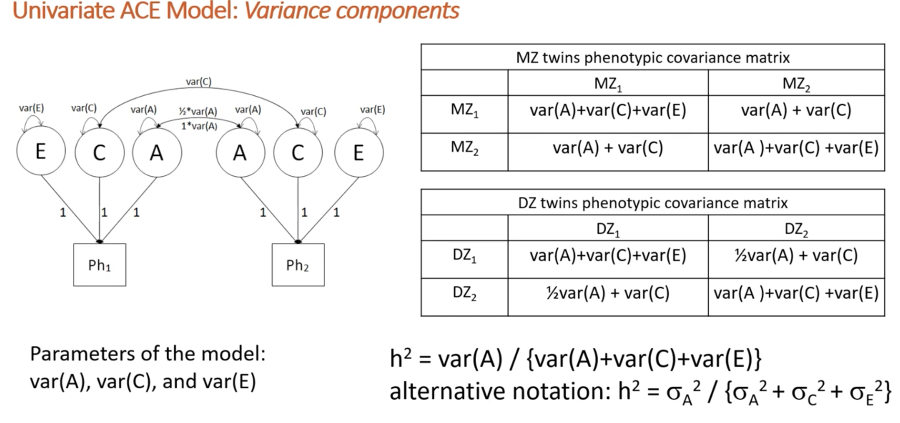

```{r setup, include=FALSE}
knitr::opts_chunk$set(echo = TRUE,
                      comment = NA,
                      prompt = FALSE,
                      cache = FALSE,
                      message = FALSE,
                      warning = FALSE,
                      results = 'markup')

options(bitmapType = 'quartz') # to render fonts better
```

```{r Clear global environment, include=FALSE}
remove(list = ls())
```

```{r Load packages, include=FALSE}
library(knitr)
library(haven)
library(psych)   
library(OpenMx)
library(tidyr)
library(tidyverse)
library(dplyr) #conflicts with tidyverse for e.g. rename and row_number
```

```{r source the data file path, include=FALSE}
# source raw data directory
source("../isolation_mentalhealth_data_path.R")
```

```{r read in dta data file, include=FALSE}
dat.raw <- read_dta(paste0(data_path_raw, "Katie_23Sep22.dta"))
colnames(dat.raw)
```

# Data prep

### Column names

```{r select variables needed}
dat <- dat.raw %>%
  dplyr::select(
         atwinid,
         btwinid,
         familyid,
         rorderp5,
         torder,
         zygosity,
         sampsex,
         seswq35,
         sethnic,
         sisoe12,
         sisoy12,
         masce12,     # anxiety
         mascy12,   
         cdie12,      # depression
         cdiy12,
         conec12,     # antisocial behaviour / conduct disorder
         conyc12,
         psysympe12,  # psychosis - why is this not the tot scale variable - to give more variation?
         psysympy12,
         socisoe18,
         socisoy18,
         gadsxe18,    # anxiety
         gadsxy18,
         mdesxe18,    # depression
         mdesxy18,
         cdsxe18,     # antisocial behaviour / conduct disorder
         cdsxy18,
         psyexpe18,   # psychotic experiences
         psyexpy18
  )

colnames(dat)
```

### Recode variables into factors {.tabset .tabset-fade}

#### Sex

```{r recode sex}
dat <- dat %>%
  mutate(
    sex = 
      recode_factor(as_factor(sampsex),
        "1" = "Male",
        "2" = "Female"))

table(dat$sex)
```

#### SES

```{r recode SES}
dat <- dat %>%
  mutate(
    ses = 
      recode_factor(as_factor(seswq35),
        "1" = "Low",
        "2" = "Middle", 
        "3" = "High"))

table(dat$ses)
```

#### Zygosity

```{r recode zygosity}
dat <- dat %>%
  mutate(
    zygosity = 
      recode_factor(as_factor(zygosity),
        "1" = "MZ",
        "2" = "DZ"))

table(dat$zygosity)
```

#### Ethnicity

```{r recode ethnicity variable}
dat <- dat %>%
  mutate(
    ethnicity = 
      recode_factor(as_factor(sethnic),
        "1" = "White",
        "2" = "Asian", 
        "3" = "Black",
        "4" = "Mixed race",
        "5" = "Other"))

table(dat$ethnicity)
```

### Convert variables to numeric

```{r create numeric isolation variables}
dat <- dat %>%
  mutate(
    sisoe12 = as.numeric(sisoe12),
    sisoy12 = as.numeric(sisoy12),
    masce12 = as.numeric(masce12),       # anxiety
    mascy12 = as.numeric(mascy12),   
    cdie12 = as.numeric(cdie12),         # depression
    cdiy12 = as.numeric(cdiy12),
    conec12 = as.numeric(conec12),       # antisocial behaviour / conduct disorder
    conyc12 = as.numeric(conyc12),
    psysympe12 = as.numeric(psysympe12), # psychosis - why is this not the tot scale variable - to give more variation?
    psysympy12 = as.numeric(psysympy12),
    socisoe18 = as.numeric(socisoe18),
    socisoy18 = as.numeric(socisoy18),
    gadsxe18 = as.numeric(gadsxe18),     # anxiety
    gadsxy18 = as.numeric(gadsxy18),
    mdesxe18 = as.numeric(mdesxe18),     # depression
    mdesxy18 = as.numeric(mdesxy18),
    cdsxe18 = as.numeric(cdsxe18),       # antisocial behaviour / conduct disorder
    cdsxy18 = as.numeric(cdsxy18),
    psyexpe18 = as.numeric(psyexpe18),   # psychotic experiences
    psyexpy18 = as.numeric(psyexpy18)
  ) %>%
  select(                                # remove variables not needed
    -c(sampsex,
       seswq35)
  )
```

### Create twin dataset

To remove the double entry in the data, we will remove everyone who has a "random twin order" variable of 0. This will then remove any birth order effects. 

```{r remove one twin pair row}
dat.twin <- dat %>% filter(rorderp5 == "1")
```

```{r datasets for MZ and DZ}
dat.twin.MZ <- dat.twin %>% filter(zygosity == "MZ")
dat.twin.DZ <- dat.twin %>% filter(zygosity == "DZ")

# male only
dat.twin.MZm <- dat.twin.MZ %>% filter(sex == "Male")
dat.twin.DZm <- dat.twin.DZ %>% filter(sex == "Male")
# female only
dat.twin.MZf <- dat.twin.MZ %>% filter(sex == "Female")
dat.twin.DZf <- dat.twin.DZ %>% filter(sex == "Female")
```

### Summary of MZ and DZ data

```{r describe MZ and DZ data}
MZ_summary <- describe(dat.twin.MZ, 
                       skew = FALSE, 
                       range = FALSE)
MZ_summary

DZ_summary <- describe(dat.twin.DZ, 
                       skew = FALSE, 
                       range = FALSE)
DZ_summary
```

# Variables in the model

```{r select variables for correlations}
# anxiety
selvars_anx <- c("sisoe12", "sisoy12", "masce12", "mascy12", 
                "socisoe18", "socisoy18", "gadsxe18", "gadsxy18")
# depression
selvars_dep <- c("sisoe12", "sisoy12", "cdie12", "cdiy12", 
                "socisoe18", "socisoy18", "mdesxe18", "mdesxy18")
# conduct
selvars_con <- c("sisoe12", "sisoy12", "conec12", "conyc12", 
                 "socisoe18", "socisoy18", "cdsxe18", "cdsxy18")
# psychosis
selvars_psy <- c("sisoe12", "sisoy12", "psysympe12", "psysympy12", 
                 "socisoe18", "socisoy18", "psyexpe18", "psyexpy18")
# all 
selvars <- c("sisoe12", "sisoy12", "masce12", "mascy12", "cdie12", "cdiy12", "conec12", "conyc12", "psysympe12", "psysympy12", 
             "socisoe18", "socisoy18", "gadsxe18", "gadsxy18", "mdesxe18", "mdesxy18", "cdsxe18", "cdsxy18", "psyexpe18", "psyexpy18")
```

# Correlation matrices

## MZ

```{r MZ matrices}
# covariance matrix
covar.mz <- cov(dat.twin.MZ[, selvars], use = "complete")
# correlation matrix (standardized covariance)
cor.mz <- cor(dat.twin.MZ[, selvars], use = "complete")
round(cor.mz, 3)
```

## DZ

```{r DZ matrices}
# covariance matrix
covar.dz <- cov(dat.twin.DZ[, selvars], use = "complete")
# correlation matrix (standardized covariance)
cor.dz <- cor(dat.twin.DZ[, selvars], use = "complete")
round(cor.dz, 3)
```

# Sex as a covariate

```{r check for sex as a covariate - RENAME THESE CORRELATIONS}
# regression analyses in elder twin members (MZ and DZ)
r11 <- summary(lm(sisoe12 ~ sex, data = dat.twin))
r12 <- summary(lm(masce12 ~ sex, data = dat.twin))
r13 <- summary(lm(socisoe18 ~ sex, data = dat.twin))
r14 <- summary(lm(gadsxe18 ~ sex, data = dat.twin))
# regression analyses in younger twin members (MZ and DZ)
r21 <- summary(lm(sisoy12 ~ sex, data = dat.twin))
r22 <- summary(lm(mascy12 ~ sex, data = dat.twin))
r23 <- summary(lm(socisoy18 ~ sex, data = dat.twin))
r24 <- summary(lm(gadsxy18 ~ sex, data = dat.twin))
# see the R2 – proportion of explained variance
print(c(r11$r.squared, r12$r.squared, r13$r.squared, r14$r.squared))
print(c(r21$r.squared, r22$r.squared, r23$r.squared, r24$r.squared))
# print(c(r11,r12,r13,r14,r21,r22,r23,r24))
```

Based on these R squared estimates, we can see that the explained variances range from 0.2% to 2.2% of the variance in this association.  

Significant variables: r12, r13, r14, r22, r23, r24. 
Therefore, sex significantly predicts all variables, apart from social isolation at age 12, for both elder and younger variables. 

**Do we want to control for sex based on this?**

*** 

# BOULDER

In the boulder workshop, they use S to mean covariance, and R for correlations. 
In boulder they have opposite sex twins, here we have the same sex twins so we can just use the variable "sex". 

## Saturated model - BOULDER

We use the saturated model rather than just estimating the MZ and DZ correlations, to use maximum likelihood - which accounts for missing data and uses all available information. We can also account for sex differences if we want to here. 

* Here, I will hash out all code that accounts for sex. If we decode to account for sex in the model, we can unhash. 

```{r number of variables (phenotypes)}
selVars <- selvars_anx    # the array with the anxiety variable names specified above 
nv      <- 4    				  # number of variables (phenotypes) - 2 at age 12 and 2 at age 18
ntv     <- nv*2 		      # number of twin variables
```

```{r correlation and covariance matruces: anxiety}
# the 4 here indicates the 4 variable model
Smz4 <- cov(dat.twin.MZ[, selvars_anx], use = 'complete')
Rmz4 <- cor(dat.twin.MZ[, selvars_anx], use = 'complete')
Sdz4 <- cov(dat.twin.DZ[, selvars_anx], use = 'complete')
Rdz4 <- cor(dat.twin.DZ[, selvars_anx], use = 'complete')
```

```{r starting values anxiety}
# MZ twins
svRmz <- Rmz4                       # starting values correlation matrix MZ
svSdmz <- diag(sqrt(diag(Smz4)))    # starting values standard deviations MZ
# DZ twins                               
svRdz <- Rdz4                       # starting values correlation matrix DZ
svSddz <- diag(sqrt(diag(Sdz4)))    # starting values standard deviations DZ

svb0 <- c(18, 21, 20, 20)           # intercepts b0 in isolation/mhealth = b0 + b1*sex + residual
svb1 <- c(0.01, 0.01, 0.01, 0.01)   # slope b1 in isolation/mhealth = b0 + b1*sex + residual
```

Create regression model for expected Mean Matrices
* To account for sex in the model, we include an intercept (mean) and a slope (sex effect) for each of the variables. In the boulder script, they model 2 sexes (twin 1 and twin 2), as our twins are the same sex, we should be able to only model one here. 
* I wonder if you don't need to do this for the `si12` variable - but not sure how to specify this. 
* `labels =` specifies that the cells in the matrices have names, and by adding `data.` to the name of the variable, this calls the data from that variable in your dataset, for example `labels = c('data.sex')`. 
* We are modeling two sex interactions here - one for each twin, but the sex variables used here are the same - I am not sure if this is right
**I don't know how to change this to work for this data set - can we just take out the sex differences??**

* **I have removed the sex differences here, and estimated a grand mean** I need to figure out how to apply the sex differences into my code. 
* The output is the same if I model one mean or two for MZ and DZ separately, so I will do this separately as in the Cholesky script. 

```{r expected means while controlling for sex in SAT: anxiety}
# # account for sex differences in the saturated model 
# B0_   <- mxMatrix(type = "Full", nrow = 1, ncol = nv, free = TRUE,  values = svb0, labels = c("b0si12", "b0an12", "b0si18", "b0an18"), name = "b0sex")
# B1_   <- mxMatrix(type = "Full", nrow = 1, ncol = nv, free = TRUE,  values = svb1, labels = c("b1si12", "b1an12", "b1si18", "b1an18"), name = "b1sex")
# 
# Sex1 <- mxMatrix(type = "Full", nrow = 1, ncol = 1, free = FALSE, labels = c('data.sex'), name = "sex1")
# Sex2 <- mxMatrix(type = "Full", nrow = 1, ncol = 1, free = FALSE, labels = c('data.sex'), name = "sex2")
# 
# ExpMean <- mxAlgebra(expression = cbind(b0sex + b1sex*sex1, b0sex + b1sex*sex2), name = 'expMean') # set up the sex interaction equation
```

```{r expected means *without* controlling for sex in SAT: anxiety}
# # To estimate one mean across MZ and DZ
# ExpMean	<- mxMatrix(type = "Full", nrow = 1, ncol = ntv, free = TRUE, values = 0.7, name = "expMean")

# To estimate separate means for MZ and DZ 
meanMZ	<- mxMatrix(type = "Full", nrow = 1, ncol = ntv, free = TRUE, values = 0.7, name = "expMeanMZ")
meanDZ	<- mxMatrix(type = "Full", nrow = 1, ncol = ntv, free = TRUE, values = 0.7, name = "expMeanDZ")
```

```{r saturated model: anxiety}
# Model covariance matrix as function of correlation matrix (RMZ RDZ) and sds 
corMZ    <- mxMatrix(type = "Stand", nrow = ntv, ncol = ntv, free = TRUE, values = svRmz,  name = "RMZ") 
corDZ    <- mxMatrix(type = "Stand", nrow = ntv, ncol = ntv, free = TRUE, values = svRdz,  name = "RDZ")
sdMZ     <- mxMatrix(type = "Diag",  nrow = ntv, ncol = ntv, free = TRUE, values = svSdmz, name = "sdMZ")
sdDZ     <- mxMatrix(type = "Diag",  nrow = ntv, ncol = ntv, free = TRUE, values = svSddz, name = "sdDZ")

# calculate the expected covariance matrix
ExpCovMZ <- mxAlgebra(expression = sdMZ%*%RMZ%*%t(sdMZ), name = "expCovMZ")
ExpCovDZ <- mxAlgebra(expression = sdDZ%*%RDZ%*%t(sdDZ), name = "expCovDZ")

# specify dataset
dataMZ   <- mxData(observed = dat.twin.MZ, type = "raw")
dataDZ   <- mxData(observed = dat.twin.DZ, type = "raw")

# set the objectives 
expMZ    <- mxExpectationNormal(covariance = "expCovMZ", means = "expMeanMZ", dimnames = selVars)
expDZ    <- mxExpectationNormal(covariance = "expCovDZ", means = "expMeanDZ", dimnames = selVars)
funML    <- mxFitFunctionML()

# model
modelMZ  <- mxModel(# B0_, B1_, Sex1, Sex2, 
                    corMZ, sdMZ, meanMZ,  ExpCovMZ, dataMZ, expMZ, funML, name = "MZ")
modelDZ  <- mxModel(# B0_, B1_, Sex1, Sex2, 
                    corDZ, sdDZ, meanDZ,  ExpCovDZ, dataDZ, expDZ, funML, name = "DZ")	
multi    <- mxFitFunctionMultigroup(c("MZ", "DZ"))
#
modelSAT4<- mxModel("SAT", modelMZ, modelDZ, multi)
```

```{r run saturated model: anxiety}
fitSAT4    <- mxRun( modelSAT4) 
sumSAT4    <- summary(fitSAT4)
#
round(fitSAT4$MZ$RMZ$values,3)  # MZ and DZ correlations using maximum likelihood
round(fitSAT4$DZ$RDZ$values,3)
# round(fitSAT4$MZ$b1sex$values,3)
# round(fitSAT4$MZ$b0sex$values,3)
```
The MZ correlations here are over double what the DZ correlations are for social isolation at age 12 and 18, and anxiety at age 18 suggesting an ACDE model. However, anxiety at age 12 where the MZ correlations are not over double the DZ, suggesting an ACE model. 

***
I NEED TO WORK OUT HOW TO RUN THIS FOR THE 4 PHENOTYPES - DO WE JUST SPECIFY DIFFERENT SELVARS OR DO WE HAVE SEPARATE SCRIPTS OR CLEAR THE ENVIRONMENT OR DO WE ATTEMPT TO PUT ALL IN ONE MODEL AS IN MONIKAS SCRIPT, WITHOUT ASSINGING NAMES TO EVERYTHING
***

## ACE model (standard multivariate)

**This code should match what we have in the Cholesky script but I think they are estimated slightly differently - need to rewatch the boulder lecture. Here they don't specify paths, only calculate variance components**

There are two ways to paramatise the twin model. Either through variance components or through path coefficients. 

For the variance components, you estimate the variance of A, C, and E, and you set all the paths to 1. 
In a univariate model, this would look like this: 
 

For the variance components, you estimate the variance of A, C, and E, and you set all the paths to 1. 
In a univariate model, this would look like this: 
 

### Falconer's equations

    VA = 2*rmz-rdz
    VC = 1-VA+VE
    VE= 1-rmz

Reminder: Matrices are always (row, column)

```{r function for ACE falconers estimates - 4 variable model}
# function to calculate the variance ACE components using Falconer's equations of all variables
falc_ACE = function(rmz, rdz){
  VA = 2*rmz-rdz
  VE = 1-rmz
  VC = 1-VA+VE
  V <- as.tibble(round(c(VA,VC,VE),3)) %>%
    mutate(ACE = c(rep("A",4), rep("C",4), rep("E",4))) %>%
    mutate(variable = c(rep(c("Isolation 12", "Mhealth 12", "Isolation 18", "Mhealth 18"),3))) %>%
    select(ACE, variable, value)
  return(V)
  } 

# call the correlations from the matrices above - isolation and anxiety variables at 12 and 18
rmz <- c(cor.mz[1,2], cor.mz[3,4], cor.mz[11,12], cor.mz[13,14])
rdz <- c(cor.dz[1,2], cor.dz[3,4], cor.dz[11,12], cor.dz[13,14])

# ACE variance components
falc_ACE(rmz, rdz)
```

The Falconer's equations here estimate C to be above 1 for the anxiety variables. 

### Start values 

```{r start values boulder}
# starting values based on the phenotypic covariance matrix 
phenovar <- c("sisoe12", "masce12", "socisoe18", "gadsxe18") # variables before splitting to MZ and DZ
S4   <- cov(dat[, phenovar], use = 'complete')               # calculate covariance matrix of these variables
svS  <- matrix(S4,4,4)                                       # save as a matrix called svS

# rough guess of ACE covariance matrices based on falconer's values above
svVA <- svS*.5  # This implies 50% of the phenotypic variances and covariances is due to additive genetic effects 
svVC <- svS*.1  
svVE <- svS*.4   

rvA <- round(cov2cor(svVA),2)  # rough guess of A correlation matrix 
rvC <- round(cov2cor(svVC),2)  # rough guess of C correlation matrix
rvE <- round(cov2cor(svVE),2)  # rough guess of E correlation matrix

svsA <- sqrt(diag(svVA))       # A standard deviations 
svsC <- sqrt(diag(svVC))       # C standard deviations
svsE <- sqrt(diag(svVE))       # E standard deviations 

svb0 <- c(18,21,20,20)         # not too sure how to select these 
svb1 <- c(0.0,0.0,0.0,0.0)     # not too sure how to select these 
```

### Covariates - sex?

```{r expected means controlling for sex in ACE: anxiety}
# # to account for the influence of sex on the means
# B0_   <- mxMatrix(type = "Full", nrow = 1, ncol = nv, free = TRUE,  values = svb0, 
#                   labels = c("b0si12", "b0an12", "b0si18", "b0an18"), name = "b0sex")
# B1_   <- mxMatrix(type = "Full", nrow = 1, ncol = nv, free = TRUE,  values = svb1, 
#                   labels = c("b1si12", "b1an12", "b1si18", "b1an18"), name = "b1sex")
# 
# Sex1  <- mxMatrix(type = "Full", nrow = 1, ncol = 1, free = FALSE, labels = c('data.sex'), name = "sex1")
# Sex2  <- mxMatrix(type = "Full", nrow = 1, ncol = 1, free = FALSE, labels = c('data.sex'), name = "sex2")
# 
# ExpMean <- mxAlgebra(expression = cbind(b0sex + b1sex*sex1, b0sex + b1sex*sex2), name = 'expMean')
```

```{r expected means *without* controlling for sex in SAT: anxiety}
# # To estimate one mean across MZ and DZ with no sex differences included
ExpMean	<- mxMatrix(type = "Full", nrow = 1, ncol = ntv, free = TRUE, values = 0.7, name = "expMean")
```

### Covariance matrices

```{r matrices for variance components ACE: anxiety}
# correlations for ACE
corA      <- mxMatrix(type = "Stand", nrow = nv, ncol = nv, free = TRUE, values = rvA, 
                     label = c("rA21", "rA31", "rA41", "rA32", "rA42", "rA43"), name = "RA")
corC      <- mxMatrix(type = "Stand", nrow = nv, ncol = nv, free = TRUE, values = rvC, 
                     label = c("rC21", "rC31", "rC41", "rC32", "rC42", "rC43"), name = "RC")
corE      <- mxMatrix(type = "Stand", nrow = nv, ncol = nv, free = TRUE, values = rvE, 
                     label = c("rE21", "rE31", "rE41", "rE32", "rE42", "rE43"), name = "RE")                                          

# standard deviations for ACE
sdA       <- mxMatrix(type = "Diag", nrow = nv, ncol = nv, free = TRUE, values = svsA, 
                     label = c("sA1", "sA2", "sA3", "sA4"), name = "sA")
sdC       <- mxMatrix(type = "Diag", nrow = nv, ncol = nv, free = TRUE, values = svsC, 
                     label = c("sC1", "sC2", "sC3", "sC4"), name = "sC")
sdE       <- mxMatrix(type = "Diag", nrow = nv, ncol = nv, free = TRUE, values = svsE, 
                     label = c("sE1", "sE2", "sE3", "sE4"), name = "sE")
```

```{r algebra for expected Variance/Covariance Matrices in MZ & DZ twins: anxiety}
# estimate the covariance based on the correlations and variance above
VA        <- mxAlgebra(expression = sA%*%RA%*%t(sA), name = "VA")
VC        <- mxAlgebra(expression = sC%*%RC%*%t(sC), name = "VC")
VE        <- mxAlgebra(expression = sE%*%RE%*%t(sE), name = "VE")

covP      <- mxAlgebra(expression = VA + VC + VE, name = "V")
covMZ     <- mxAlgebra(expression = VA + VC, name = "cMZ")
covDZ     <- mxAlgebra(expression = 0.5%x%VA + VC, name = "cDZ") 

expCovMZ  <- mxAlgebra(expression = rbind(cbind(V, cMZ), cbind(t(cMZ), V)), name = "expCovMZ")
expCovDZ  <- mxAlgebra(expression = rbind(cbind(V, cDZ), cbind(t(cDZ), V)), name = "expCovDZ")
```

### Data and objects

```{r data and expectation objects}
# Create Data Objects for Multiple Groups
dataMZ    <- mxData(observed = dat.twin.MZ, type = "raw" )
dataDZ    <- mxData(observed = dat.twin.DZ, type = "raw" )
#
# Create Expectation Objects for Multiple Groups
expMZ     <- mxExpectationNormal(covariance = "expCovMZ", means = "expMean", dimnames = selVars)
expDZ     <- mxExpectationNormal(covariance = "expCovDZ", means = "expMean", dimnames = selVars)
funML     <- mxFitFunctionML()
```

### Define the model

```{r define parameters}
pars      <- list(# B0_, B1_, 
                  corA, corC, corE, sdA, sdC, sdE, VA, VC, VE, covP)
modelMZ   <- mxModel(# Sex1, Sex2,
                     pars, ExpMean, covMZ, expCovMZ, dataMZ, expMZ, funML, name = "MZ")
modelDZ   <- mxModel(# Sex1, Sex2,
                     pars, ExpMean, covDZ, expCovDZ, dataDZ, expDZ, funML, name = "DZ")	
multi     <- mxFitFunctionMultigroup(c("MZ","DZ"))
```

### Run the model

```{r run 4 variable ACE model}
modelACE4  <- mxModel("ACE4", pars, modelMZ, modelDZ, multi)
# Run Model
fitACE4    <- mxTryHard(modelACE4, 20)
sumACE4    <- summary(fitACE4)
mxCompare(fitSAT4, fitACE4)
```

This model fits the data significantly *worse* than the saturated model. 

Unfortunately the multivariate twin models do not often fit the data well, it's likely C here is also an issue. 

***
Something is not right here
* I am getting negative variances and correlations above 1
* The E correlations seem fine, but the A and C correlations exceed 1 - what

```{r ACE model output}
VA_ = fitACE4$VA$result # covariance matrix of A 
v# standardised correlation matrix of A
sA_ = fitACE4$sA$values # standard deviation of A

# check that the estimated variance is the same as sA_%*%RA_%*%t(sA_)
print(VA_)
sA_%*%RA_%*%sA_

# 
VA_ = fitACE4$VA$result[1:2,1:2]
VC_ = fitACE4$VC$result[1:2,1:2]
VE_ = fitACE4$VE$result[1:2,1:2]
# 
RA_ = fitACE4$RA$values 
RC_ = fitACE4$RC$values 
RE_ = fitACE4$RE$values 

RA_
RC_
RE_

# we can set all the C correlations to 1 and use the mxCompare() function to test whether these constraints are ok statistically
tmp <- omxSetParameters(fitACE4, labels = c("rC21","rC31","rC41","rC32","rC42","rC43"), values = 1.0, free = FALSE)
fittmp <- mxRun(tmp)
mxCompare(fitACE4, fittmp)

# what if now we set the isoaltion age 12 A to 1?? 
tmp <- omxSetParameters(fitACE4, labels = c("rA21","rA31","rA41","rC21","rC31","rC41","rC32","rC42","rC43"), values = 1.0, free = FALSE) 
fittmp <- mxRun(tmp)
mxCompare(fitACE4, fittmp)

RA_tmp = tmp$RA$values 
RC_tmp = tmp$RC$values 
RE_tmp = tmp$RE$values 

RA_tmp
RC_tmp
RE_tmp
```
 
We can conclude that the correlations are equal to 1 (p=0.9083305). This result suggests that shared environmental effects are common to all phenotypes. There are no phenotype-specific shared environmental effects.
 
However, we still get correlations of above 1 for the additative genetic effects - **what do we do with this?** It seems to be the isolation at age 12 (variable 1 in this output) that is causing this. 
 
We can conclude that the correlations are equal to 1 (p=0.7696074). This result suggests that additative influences on social isolation at age 12 and all shared environmental effects are common to all phenotypes. There are no phenotype-specific additative genetic effects at age 12. 

**What about if we drop C from the model?**

****

## Second boulder script for ACE 

```{r expected means}
B0_     <- mxMatrix( type="Full", nrow=1, ncol=nv, free=TRUE, values=svb0, labels=c("b01","b02","b03","b04"), name="b0" )
ExpMean <- mxAlgebra(expression=cbind(b0,b0), name='expMean')
```

```{r matrices for variance components}
SA      <- mxMatrix( type="Symm", nrow=nv, ncol=nv, free=TRUE, values=svVA,
                     label=c("SA11","SA21","SA31","SA41","SA22","SA32","SA42","SA33","SA43","SA44"), 
                     name="VA" )

SC      <- mxMatrix( type="Symm", nrow=nv, ncol=nv, free=TRUE, values=svVC,
                     label=c("SC11","SC21","SC31","SC41","SC22","SC32","SC42","SC33","SC43","SC44"), 
                     name="VC" )

SE      <- mxMatrix( type="Symm", nrow=nv, ncol=nv, free=TRUE, values=svVE,
                     label=c("SE11","SE21","SE31","SE41","SE22","SE32","SE42","SE33","SE43","SE44"), 
                     name="VE" )
```

```{r correlations}
RA <- mxAlgebra( expression = cov2cor(VA), name="RA")
RC <- mxAlgebra( expression = cov2cor(VC), name="RC")
RE <- mxAlgebra( expression = cov2cor(VE), name="RE")
```

```{r covariance}
covP      <- mxAlgebra( expression= VA+VC+VE, name="V" )
covMZ     <- mxAlgebra( expression= VA+VC, name="cMZ" )
covDZ     <- mxAlgebra( expression= 0.5%x%VA+ VC, name="cDZ" )
expCovMZ  <- mxAlgebra( expression= rbind( cbind(V, cMZ), cbind(t(cMZ), V)), name="expCovMZ" )
expCovDZ  <- mxAlgebra( expression= rbind( cbind(V, cDZ), cbind(t(cDZ), V)), name="expCovDZ" )
```

```{r data and objects}
dataMZ    <- mxData(observed = dat.twin.MZ, type = "raw" )
dataDZ    <- mxData(observed = dat.twin.DZ, type = "raw" )
# Create Expectation Objects for Multiple Groups
expMZ     <- mxExpectationNormal( covariance="expCovMZ", means="expMean", dimnames=selVars )
expDZ     <- mxExpectationNormal( covariance="expCovDZ", means="expMean", dimnames=selVars )
funML     <- mxFitFunctionML()
```

```{r build model}
pars      <- list(B0_, SA, SC, SE, RA, RE, RC, covP )
modelMZ   <- mxModel( pars, ExpMean,covMZ, expCovMZ, ExpMean, dataMZ, expMZ, funML, name="MZ" )
modelDZ   <- mxModel( pars, ExpMean, covDZ, expCovDZ, ExpMean, dataDZ, expDZ, funML, name="DZ" )	
multi     <- mxFitFunctionMultigroup( c("MZ","DZ") )
```

```{r run model}
modelACE4V  <- mxModel("ACE4V", pars, modelMZ, modelDZ, multi)
# ------------------------
# Run ADE Model
fitACE4V    <- mxTryHard( modelACE4V, 20)
sumACE4V    <- summary( fitACE4V )
```

```{r drop C}
modelAE4V <- omxSetParameters(fitACE4V,
                              label=c("SC11","SC21","SC31","SC41","SC22","SC32","SC42","SC33","SC43","SC44"),
                              free=FALSE, 
                              values=c(0))
fitAE4V    <- mxRun( modelAE4V)

mxCompare(fitACE4V, fitAE4V)
sumAE4V    <- summary( fitAE4V )


rA=round(fitAE4V$RA$result,3)   # A correlations 
sA=diag(sqrt(round(fitAE4V$VA$values,3)))  # A standard deviations
SA=round(fitAE4V$VA$values,3) # A cov matrix
#
rE=round(fitAE4V$RE$result,3)  # E correlations
sE=diag(sqrt(round(fitAE4V$VE$values,3))) # E standard deviations
SE=round(fitAE4V$VE$values,3) # E cov matrix 
rA # correlation matrix A
sA
SA
rE
sE
SE
```

**This can't find the A correlations????????? what the hell is going on with these models??**


**************************************************************************

# FRUHLING

## ACE model

```{r specify fruhling ACE model}
# start values
svM	  <- c(0.7, 0.7, 0.7, 0.7, 0.7, 0.7, 0.7, 0.7)	  # means               
svSD  <- c(1.1, 1.1, 1.1, 1.1, 1.1, 1.1, 1.1, 1.1)    # standard deviations
svRmz <- c(rep(0.3, 28))                              # correlations for MZ - 28 correlations in total
svRdz <- c(rep(0.15, 28))                             # correlations for DZ 

# labels
labMZm	<- c("MZme5", "MZme7", "MZme10", "MZme12", "MZmy5", "MZmy7", "MZmy10", "MZmy12")	         # MZ means       
labDZm	<- c("DZme5", "DZme7", "DZme10", "DZme12", "DZmy5", "DZmy7", "DZmy10", "DZmy12")           # DZ means

labMZsd	<- c("MZsde5", "MZsde7", "MZsde10", "MZsde12", "MZsdy5", "MZsdy7", "MZsdy10", "MZsdy12")   # MZ standard deviations
labDZsd	<- c("DZsde5", "DZsde7", "DZsde10", "DZsde12", "DZsdy5", "DZsdy7", "DZsdy10", "DZsdy12")   # DZ standard deviations

labMZr	<- c("MZrxph1", "MZrxph2", "MZrxph3", "MZrxt1",	"MZrxtxph1", "MZrxtxph2", "MZrxtxph3",     # MZ correlations
            "MZrxph4", "MZrxph5", "MZrxtxph4", "MZrxt2", "MZrxtxph5", "MZrxtxph6", 
            "MZrxph6", "MZrxtxph7", "MZrxtxph8", "MZrxt3", "MZrxtxph9",
            "MZrxtxph10", "MZrxtxph11", "MZrxtxph12", "MZrxt4",
            "MZrxph7", "MZrxph8", "MZrxph9", 
            "MZrxph10", "MZrxph11",
            "MZrxph12")     
labDZr	<- c("DZrxph1", "DZrxph2", "DZrxph3", "DZrxt1",	"DZrxtxph1", "DZrxtxph2", "DZrxtxph3",     # DZ correlations
            "DZrxph4", "DZrxph5", "DZrxtxph4", "DZrxt2", "DZrxtxph5", "DZrxtxph6", 
            "DZrxph6", "DZrxtxph7", "DZrxtxph8", "DZrxt3", "DZrxtxph9",
            "DZrxtxph10", "DZrxtxph11", "DZrxtxph12", "DZrxt4",
            "DZrxph7", "DZrxph8", "DZrxph9", 
            "DZrxph10", "DZrxph11",
            "DZrxph12") 
```

```{r fit function for all models}
fitFunction <- mxFitFunctionML()
```

```{r ace matrices}
pathA	<- mxMatrix(type = "Lower", nrow = nv, ncol = nv, free = TRUE, values = c(rep(0.5, 10)), 
                  labels = c("a11", "a21","a31","a41","a22","a32","a42","a33","a43","a44"), name = "a") 
pathC	<- mxMatrix(type = "Lower", nrow = nv, ncol = nv, free = TRUE, values = c(rep(0.5, 10)), 
                  labels = c("c11", "c21","c31","c41","c22","c32","c42","c33","c43","c44"), name = "c")
pathE	<- mxMatrix(type = "Lower", nrow = nv, ncol = nv, free = TRUE, values = c(rep(0.5, 10)), 
                  labels = c("e11", "e21","e31","e41","e22","e32","e42","e33","e43","e44"), name = "e")
```

```{r matrix for the expected means}
MeanG	<-mxMatrix(type = "Full", nrow = 1, ncol = ntv, free = TRUE, values = svM, name = "ExpMean")
```

## Algebra 

We compute the covariance matrix (V) which is the sum of the ACE variance components. Using row-by-col multiplication of a and a transpose, we get the 4x4 A variance covariance matrix of the four variables. We do this multiplication for c and e as well to get the C and E Var/Cov matrix. We can then standardise them to get h2, c2, and e2. 

```{r algebra to generate A, C, E variance components}
# Non-standardized variance components
covA	<- mxAlgebra(expression = a %*% t(a), name = "A")
covC	<- mxAlgebra(expression = c %*% t(c), name = "C") 
covE	<- mxAlgebra(expression = e %*% t(e), name = "E")

# Standardized variance components
covP <- mxAlgebra(expression = A + C + E, name = "V" )  # total variance in the phenotype
StA	<- mxAlgebra(expression = A/V, name = "h2")         # proportion of variance explained by additive genetic factors
StC	<- mxAlgebra(expression = C/V, name = "c2")         # proportion of variance explained by shared environment
StE	<- mxAlgebra(expression = E/V, name = "e2")         # proportion of variance explained by unique environment
```

### Factor correlations

We use the genetic Var/Cov matrix A to get the genetic correlation matrix with rA21 indicating the correlation between the A1 and A2 factors in the Bivariate model. 

```{r algebra to compute phenotypic ACE correlations}
matI <- mxMatrix(type = "Iden", nrow = nv, ncol = nv, name = "I")
matIsd <-mxAlgebra(solve(sqrt(I*V)), name = "isd") # extracting the variances from the diagonal of the covariance matrix V 
rph	<- mxAlgebra(expression = solve(sqrt(I*V)) %*% V %*% solve(sqrt(I*V)), name = "Rph") # new identity matrix for standardising 
rA	<- mxAlgebra(expression = solve(sqrt(I*A)) %*% A %*% solve(sqrt(I*A)), name = "Ra")
rC	<- mxAlgebra(expression = solve(sqrt(I*C)) %*% C %*% solve(sqrt(I*C)), name = "Rc") 
rE	<- mxAlgebra(expression = solve(sqrt(I*E)) %*% E %*% solve(sqrt(I*E)), name = "Re")
```

### Cholesky parameters

```{r cholesky parameters}
# path estimates
Sta <- mxAlgebra(isd%*%a, name = "sta")
Stc <- mxAlgebra(isd%*%c, name = "stc")
Ste <- mxAlgebra(isd%*%e, name = "ste")

# path estimates squared
Sta2 <- mxAlgebra(sta*sta, name = "sta2")
Stc2 <- mxAlgebra(stc*stc, name = "stc2")
Ste2 <- mxAlgebra(ste*ste, name = "ste2")
```

```{r algebra to put standardised parameter estimates into a matrix with col and row labels *}
rowVars	<- rep('Vars', nv)
colVars	<- rep(c('h2', 'c2', 'e2'), each = nv)
estVars	<- mxAlgebra(expression = cbind(h2,c2,e2), name = "Est", dimnames = list(rowVars,colVars))
```

### Proportional to phenotypic correlation 

If you want to work out the amount of the phenotypic correlation that is due to A, C or E, you can use the below: 

```{r algebra to compute Rph-A, Rph-C, and Rph-E between the two variables in a bivariate model (this would be different for more than two variables I guess)}
rphace <- mxAlgebra(expression = cbind((sqrt(h2[1,1])*Ra[2,1]*sqrt(h2[2,2])),
							(sqrt(c2[1,1])*Rc[2,1]*sqrt(c2[2,2])),
							(sqrt(e2[1,1])*Re[2,1]*sqrt(e2[2,2])) ), name = "RphACE" )
```

### Covariance estimation

The A factors are correlated across twins either by 1 for MZ pairs or 0.5 for DZ pairs, whereas the C factors are correlated 1 for either type of pairs. For the bivariate + model we have to correlate both the A1 and A2 factors across twins and both the C1 and C2 factors across twins.

```{r algebra for expected variance/covariance matrices in MZ and DZ twins}
covMZ	<- mxAlgebra(expression = rbind(cbind(A+C+E, A+C),
                                          cbind(A+C, A+C+E)), name = "expCovMZ" )
covDZ	<- mxAlgebra(expression = rbind(cbind(A+C+E, 0.5%x%A+C),
                                          cbind(0.5%x%A+C, A+C+E)), name = "expCovDZ" )
```

## Data

```{r data objects for ACE - this is repetition from earlier?}
# data objects 
dataMZ <- mxData(observed = dat.twin.MZ, type = "raw")
dataDZ <- mxData(observed = dat.twin.DZ, type = "raw")
```

```{r objective objects - is this is repetition from earlier?}
objMZ	<- mxExpectationNormal(covariance = "expCovMZ", means = "ExpMean", dimnames = selVars)
objDZ	<- mxExpectationNormal(covariance = "expCovDZ", means = "ExpMean", dimnames = selVars)
```

## Confidence intervals

```{r ACE confidence intervals}
# h2, c2, e2 
Conf1 <- mxCI(c('h2[1,1]', 'h2[2,2]','h2[3,3]', 'h2[4,4]', 'c2[1,1]', 'c2[2,2]', 'c2[3,3]', 'c2[4,4]', 'e2[1,1]', 'e2[2,2]', 'e2[3,3]', 'e2[4,4]')) # drop C if non-sig
# factor correlation - off-diagonal
Conf2	<- mxCI(c('Rph[2,1]', 'Ra[2,1]', 'Rc[2,1]', 'Re[2,1]', 'Rph[3,1]', 'Ra[3,1]', 'Rc[3,1]', 'Re[3,1]', 'Rph[4,1]', 'Ra[4,1]', 'Rc[4,1]', 'Re[4,1]', 'Rph[3,2]', 'Ra[3,2]', 'Rc[3,2]', 'Re[3,2]', 'Rph[4,2]', 'Ra[4,2]', 'Rc[4,2]', 'Re[4,2]', 'Rph[4,3]', 'Ra[4,3]', 'Rc[4,3]', 'Re[4,3]')) 
# Cholesky paths - off-diagonal
Conf3	<- mxCI(c('sta2[2,1]', 'stc2[2,1]', 'ste2[2,1]', 'sta2[3,1]', 'stc2[3,1]', 'ste2[3,1]', 'sta2[4,1]', 'stc2[4,1]', 'ste2[4,1]', 'sta2[3,2]', 'stc2[3,2]', 'ste2[3,2]', 'sta2[4,2]', 'stc2[4,2]', 'ste2[4,2]', 'sta2[4,3]', 'stc2[4,3]', 'ste2[4,3]')) 
# Cholesky paths - diagonal
Conf4	<- mxCI(c('sta2[1,1]', 'stc2[1,1]', 'ste2[1,1]', 'sta2[2,2]', 'stc2[2,2]', 'ste2[2,2]', 'sta2[3,3]', 'stc2[3,3]', 'ste2[3,3]', 'sta2[4,4]', 'stc2[4,4]', 'ste2[4,4]')) 
Conf5	<- mxCI(c('h2', 'c2', 'e2'))
```

## Estimation

```{r ACE model estimation}
# all parameters to be estimated 
pars <- list(pathA, pathC, pathE, covA, covC, covE, covP, StA, StC, StE, matI, rph, rA, rC, rE, MeanG, estVars, matIsd, Sta, Sta2, Stc, Stc2, Ste, Ste2
             )

# add these to the model for MZ and DZ with the matrices we have created
modelMZ	<- mxModel(pars, covMZ, dataMZ, objMZ, fitFunction, name = "MZ")
modelDZ	<- mxModel(pars, covDZ, dataDZ, objDZ, fitFunction, name = "DZ")

# fitting
minus2ll <- mxAlgebra(expression = MZ.objective + DZ.objective, name = "m2LL")
obj <- mxFitFunctionAlgebra("m2LL")

# full model
AceModel <- mxModel("ACE", pars, modelMZ, modelDZ, minus2ll, obj, Conf1, Conf3, Conf4)
```

```{r run ACE model}
# run ACE
AceFit <- mxRun(AceModel, intervals = TRUE)
AceFit <- mxTryHard(AceFit, 20)

# summary - this shows the position in the cells for each matrix 
AceSumm <- summary(AceFit)
AceSumm

# full list of A, C, and E estimates 
round(AceFit@output$estimate, 3)
```

```{r ACE model output h2, c2, e2}
# All h2, c2, e2 in one matrix 
round(AceFit$Est@result, 3)

# h2 
round(mxEval(ACE.h2, AceFit), 3) 

# c2
round(mxEval(ACE.c2, AceFit), 3) 

# e2
round(mxEval(ACE.e2, AceFit), 3) 
```
```{r ACE phenotypic correlations output}
# correlation between the A, C, and E factors - to what extend is variable one the same as variable two 
AceFit$ACE.Rph # total phenotypic correlation (including A, C, and E)
AceFit$ACE.Ra  # correlations between the a factors
AceFit$ACE.Rc  # correlations between the c factors
AceFit$ACE.Re  # correlations between the e factors
```
* this output also looks weird as the esitmation of the heritability is suddenly so low - why is this??


To do:
* Run AE model using Fruhling's script - what does this look like here?
* rewatch lecture on the path coefficients versus variance estimation and include a description of that here 
* Decide which estimation we will go for (I think path as I trust Fruhling's scripts) but also not sure what the benefit of the variance estimation is??
* Figure out why the corerlations of A are above one in boulder script??
* finish rest of practical recording from boulder course (part 1 and part 2)
* Work out why some of the common paths were not free in monika's script - is this also the case the boulder script?
* What is the Scalar multiplier in monika's scirpt? Ask someone about this? 


*******************************************************************************************

# MONIKA W

* I need to compare the Waszczuk and boulder scripts
* Go through the boulder practical to better understand what each bit is doing 
* Also want to run one single model with all in 8 variable independent pathway model

## No sex differences 

### Fit 2A, 2C, and 2E Factor Independent Pathway Model

```{r number of variables (phenotypes)}
nv <- 4    					      # number of variables - 2 at age 12 and 2 at age 18
ntv <- nv*2 				      # number of twin variables
nlower <- nv*(nv+1)/2 		# number of free elements in an nv*nv lower matrix 
```

```{r NOT SURE WHAT THIS DOES YET}
# Change Dimension of Additive Genetic Factor Matrix Ac to have *2* common factors
nfAc <- 2 # number of factors A (common)
nf <- 1   # number of factors (specific??)
```

#### Start values

* For `Ac2Free`, we want to indicate `TRUE` for the first 4 variables (all variables), then for the **second** A factor, we want this to be only for the second set of 2 variables (at age 18), so for this we want the first two variables (age 12) set to `FALSE`. 
* Similarly, we then want to set the second common start values to be 0 using `Ac2Values`. 

```{r start values - think about renaming these to be consistent with start values for Cholesky}
# Set if the parameters are estimated (TRUE) or not (FALSE) 
Ac2Free   <- c(rep(TRUE, nv), rep(FALSE, nv/2), rep(TRUE, nv/2))  

# Create start values for 2 common ACE Factors - set the start values for common 
Ac2Values <- c(rep(.1, nv),  rep(0, nv/2), rep(.1, nv/2))  
Cc2Values <- c(rep(.1, nv),  rep(0, nv/2), rep(.1, nv/2))
Ec2Values <- c(rep(.1, nv),  rep(0, nv/2), rep(.1, nv/2))
```

#### Specify ACE IPM 

**Below the entire ACE model is specified in one chunk to avoid naming all parts of the model**. 

In Waszczuk (2021) : "There were scalar (variance) sex differences in all variables except self-report time 1 depression, and time 2 self-report hyperactivity and parent-report conduct. Scalar models were fitted to account for these differences. Furthermore, there were quantitative sex differences in self-report depression at time 2, as previously reported in Waszczuk et al. [62]." 

* Therefore, I think Monika corrected for sex differences by estimating means for males and females. 
* We need to decode if we are going to do this too or not 
* Still not quite sure makes these "scalar variance sex differences"
* In the scalar correction, I'm not sure what the difference is between `Scalar` and `oScalar` - The `oScalar` is for siblings of opposite sex. So this is not needed for our script. 
* The `Scalar` correction is `TRUE` only for the variables that need sex correction. In our case this would be all variables apart from social isolation at age 12. **This is only based on linear regressions, rather than estimating sex differences in OpenMx**. 
* mxBounds() creates bounds for the objects, but I'm not entirely sure what these are??
* Monika ran univariate ACE models for all her variables and tested for sex differences that way before applying the IPM. She also said that multivariate analyses were conducted separately for self and parent-report data due to significantly different univari- ate estimates for corresponding symptoms across raters. **We need to think if we should separate the reporters of social isolation - I think it would be doing weird things to the model**. 
* TO DO NEXT:
  + Interpret the output of this model - are there negative variances?? Do the h2, c2, e2 line up with the univariate ACE models (they probably wont because of the inclusion of separate means by sex). Do the overlap estimates look weird? 
  + Need to look at running univariate ACE models for all variables 
  + Look at how to test for sex differences officially through univariate twin models
  + Abandon boulder scripts???? Because we actually do want the Cholesky parameters in this case as we have the same constructs over time, we know that the first 2 variables come before the second 2 variables. 
  + Can we run an "all-encompassing" model with he 4 constructs at 12 then 18? 
  + Also run all IPM separately too
  + Decide on the sex correction based on univariate models 
  + Try and distinguish between Monika's "no sex diffs" script and the normal one
  + Think about running this separately based on reporter - the other constructs are self report?? 
  + Make really clear notes on what each part of the model does - especially the bits I didn't initially understand 

```{r ACE model for anxiety}
IPM_anxiety <- mxModel("IPM_anxiety",
	mxModel("ACE",
    # Common ace paths
    mxMatrix("Full", nrow = nv, ncol = nfAc, free = Ac2Free, values = Ac2Values, name = "ac"),
    mxMatrix("Full", nrow = nv, ncol = nfAc, free = Ac2Free, values = Cc2Values, name = "cc"),
    mxMatrix("Full", nrow = nv, ncol = nfAc, free = Ac2Free, values = Ec2Values, name = "ec"),
    		
    # Specific ace paths
    mxMatrix("Diag", nrow = nv, ncol = nv, free = TRUE, values = 0.6,  name = "as"),
    mxMatrix("Diag", nrow = nv, ncol = nv, free = TRUE, values = 0.01, name = "cs"),
    mxMatrix("Diag", nrow = nv, ncol = nv, free = TRUE, values = 0.6,  name = "es"),
		
		# ACE variance components
    mxAlgebra(ac %*% t(ac) + as %*% t(as), name = "A"), 
    mxAlgebra(cc %*% t(cc) + cs %*% t(cs), name = "C"),
    mxAlgebra(ec %*% t(ec) + es %*% t(es), name = "E"),
    mxAlgebra(A + C + E, name = "V"),
		
		# Calculate standard deviation for standardization
    mxMatrix("Iden", nrow = nv, ncol = nv, name = "I"),
    mxAlgebra(solve(sqrt(I*V)), name = "iSD"), # extracting the variances from the diagonal of the covariance matrix V 
		
		# Expected means vector
    mxMatrix("Full", nrow = 1, ncol = nv, free = TRUE, values = 0.01, name = "MeanM"), # is this for males?
    mxAlgebra(cbind(MeanM, MeanM), name = "expMeanM"),
    
    mxMatrix("Full", nrow = 1, ncol = nv, free = TRUE, values = 0.01, name = "MeanF"), # and this for females??
    mxAlgebra(cbind(MeanF,MeanF), name = "expMeanF"),

    # Genetic and environmental correlations (correlated factor solution)
    mxAlgebra(solve(sqrt(I*V)) %&% V, name = "Rph"),
    mxAlgebra(solve(sqrt(I*A)) %&% A, name = "Ra"),
    mxAlgebra(solve(sqrt(I*C)) %&% C, name = "Rc"),
    mxAlgebra(solve(sqrt(I*E)) %&% E, name = "Re"),

    # Standardised components of variance
    mxAlgebra(A/V, name = "h2"),
    mxAlgebra(C/V, name = "c2"),
    mxAlgebra(E/V, name = "e2"),
    
    # Standardise common parameters (unsquared)
    mxAlgebra(iSD %*% ac, name = "stac"),
    mxAlgebra(iSD %*% cc, name = "stcc"),
    mxAlgebra(iSD %*% ec, name = "stec"),
    
    # Standardise common parameters (Squared)
    mxAlgebra(stac*stac, name = "stac2"),
    mxAlgebra(stcc*stcc, name = "stcc2"),
    mxAlgebra(stec*stec, name = "stec2"),
    
    # Standardise specific parameters (unsquared)
    mxAlgebra(iSD %*% as, name = "stas"),
    mxAlgebra(iSD %*% cs, name = "stcs"),
    mxAlgebra(iSD %*% es, name = "stes"),
    
    # Standardise specific parameters (Squared)
    mxAlgebra(stas*stas, name = "stas2"),
    mxAlgebra(stcs*stcs, name = "stcs2"),
    mxAlgebra(stes*stes, name = "stes2"),	
		
    # Scalar multiplier - sex differences? 
    mxMatrix("Diag", nrow = ntv, ncol = ntv, free = c( F, T, T, T, F, T, T, T), # TRUE for sex difference variables (not isolation age 12)
             values = 1,
             label  = c("sc1", "sc2", "sc3", "sc4", "sc1", "sc2", "sc3", "sc4"), 
             name   = "Scalar"),

    mxBounds(c("sc2", "sc3", "sc4"), 0, NA), # creates bounds for these objects - what are these? Only ones that are sex correated (not isolated age 12)
	
		# MZ expected covariance matrix
		mxAlgebra(Scalar %&% rbind(cbind(A+C+E, A+C), cbind(A+C, A+C+E)), name = "expCovMZm"),
		mxAlgebra(rbind(cbind(A+C+E, A+C), cbind(A+C, A+C+E)), name = "expCovMZf"),
		
		# DZ expected covariance matrix
		mxAlgebra(Scalar %&% rbind(cbind(A+C+E, (0.5%x%A)+C), cbind((0.5%x%A)+C, A+C+E)), name = "expCovDZm"),
		mxAlgebra(rbind(cbind(A+C+E, (0.5%x%A)+C), cbind((0.5%x%A)+C, A+C+E)), name = "expCovDZf")
		
	),
	
	mxModel("MZM",
		mxData(observed = dat.twin.MZm, type = "raw"),
		mxFIMLObjective(covariance = "ACE.expCovMZm", means = "ACE.expMeanM", dimnames = selvars_anx)
	),
	mxModel("MZF",
		mxData(observed = dat.twin.MZf, type = "raw"),
		mxFIMLObjective(covariance = "ACE.expCovMZf", means = "ACE.expMeanF", dimnames = selvars_anx)
	),
	mxModel("DZM",
		mxData(observed = dat.twin.DZm, type = "raw"),
		mxFIMLObjective(covariance = "ACE.expCovDZm", means = "ACE.expMeanM", dimnames = selvars_anx)
	),
	mxModel("DZF",
		mxData(observed = dat.twin.DZf, type = "raw"),
		mxFIMLObjective(covariance = "ACE.expCovDZf", means = "ACE.expMeanF", dimnames = selvars_anx)
	),

	mxAlgebra(MZM.objective + DZM.objective + MZF.objective + DZF.objective, name = "neg2ll"),
	mxAlgebraObjective("neg2ll"),
	mxCI(c("ACE.stac2", "ACE.stcc2", "ACE.stec2", "ACE.stas2", "ACE.stcs2", "ACE.stes2", "ACE.Rph"))
)
```

```{r run ACE mdoel for anxiety}
IPM_anxiety_fit <- mxRun(IPM_anxiety, intervals = TRUE)
summary(IPM_anxiety_fit)
```

```{r parameter estimates ACE anxiety}
# common standardised squared parameters
mxEval(ACE.stac2, IPM_anxiety_fit)
mxEval(ACE.stcc2, IPM_anxiety_fit)
mxEval(ACE.stec2, IPM_anxiety_fit)

# specific standardised squared parameters
mxEval(ACE.stas2, IPM_anxiety_fit)
mxEval(ACE.stcs2, IPM_anxiety_fit)
mxEval(ACE.stes2, IPM_anxiety_fit)

# phenotypic correlations
mxEval(ACE.Rph, IPM_anxiety_fit)
mxEval(ACE.Ra, IPM_anxiety_fit)
mxEval(ACE.Rc, IPM_anxiety_fit)
mxEval(ACE.Re, IPM_anxiety_fit)

# ACE estimates
mxEval(ACE.h2, IPM_anxiety_fit)
mxEval(ACE.c2, IPM_anxiety_fit)
mxEval(ACE.e2, IPM_anxiety_fit)
```

```{r fit AE model}
# specify AE IPM
IPM_anxiety_AE <- mxModel(IPM_anxiety, name = "IPM_anxiety_AE",
     mxModel(IPM_anxiety_fit$ACE,
     mxMatrix("Full", nrow = nv, ncol = nfAc, free = FALSE, values = 0, name = "cc"),
     mxMatrix("Diag", nrow = nv, ncol = nv, free = FALSE, values = 0, name = "cs")   # drop C at 0
    )
)

# run AE IPM
IPM_anxiety_AE_fit <- mxRun(IPM_anxiety_AE, intervals = FALSE)

# Summary and comparison to ACE
summary(IPM_anxiety_AE_fit)
mxCompare(IPM_anxiety_fit, IPM_anxiety_AE_fit)
```

```{r AE model output}
# common standardised squared parameters
mxEval(ACE.stac2, IPM_anxiety_AE_fit)
mxEval(ACE.stcc2, IPM_anxiety_AE_fit)
mxEval(ACE.stec2, IPM_anxiety_AE_fit)

# specific standardised squared parameters
mxEval(ACE.stas2, IPM_anxiety_AE_fit)
mxEval(ACE.stcs2, IPM_anxiety_AE_fit)
mxEval(ACE.stes2, IPM_anxiety_AE_fit)

# phenotypic correlations
mxEval(ACE.Rph, IPM_anxiety_AE_fit)
mxEval(ACE.Ra, IPM_anxiety_AE_fit)
mxEval(ACE.Rc, IPM_anxiety_AE_fit)
mxEval(ACE.Re, IPM_anxiety_AE_fit)

# ACE estimates
mxEval(ACE.h2, IPM_anxiety_AE_fit)
mxEval(ACE.c2, IPM_anxiety_AE_fit)
mxEval(ACE.e2, IPM_anxiety_AE_fit)
```

