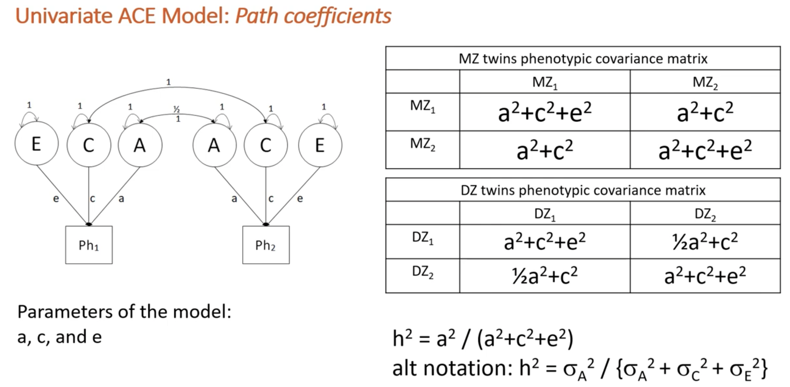

```{r setup, include=FALSE}
knitr::opts_chunk$set(echo = TRUE,
                      comment = NA,
                      prompt = FALSE,
                      cache = FALSE,
                      message = FALSE,
                      warning = FALSE,
                      results = 'markup')

options(bitmapType = 'quartz') # to render fonts better
```

```{r Clear global environment, include=FALSE}
remove(list = ls())
```

```{r Load packages, include=FALSE}
library(knitr)
library(haven)
library(psych)   
library(bestNormalize)
library(OpenMx)
library(tidyr)
library(tidyverse)
library(dplyr) #conflicts with tidyverse for e.g. rename and row_number
```

# Source functions

```{r source functions, include=FALSE}
source("isolation_mhealth_functions.R")
```

# Read in data

```{r source the data file path, include=FALSE}
# source raw data directory
source("../isolation_mentalhealth_data_path.R")
```

```{r read in dta data file, include=FALSE}
dat.raw <- read_dta(paste0(data_path_raw, "Katie_23Sep22.dta"))
colnames(dat.raw)
```

## Column names

```{r select variables needed}
dat <- dat.raw %>%
  dplyr::select(
         atwinid,
         btwinid,
         familyid,
         rorderp5,
         torder,
         zygosity,
         sampsex,
         sisoe12,
         sisoy12,
         masce12,     # anxiety
         mascy12,   
         cdie12,      # depression
         cdiy12,
         conec12,     # antisocial behaviour / conduct disorder
         conyc12,
         psysympe12,  # psychosis - why is this not the tot scale variable - to give more variation?
         psysympy12,
         socisoe18,
         socisoy18,
         gadsxe18,    # anxiety
         gadsxy18,
         mdesxe18,    # depression
         mdesxy18,
         cdsxe18,     # antisocial behaviour / conduct disorder
         cdsxy18,
         psyexpe18,   # psychotic experiences
         psyexpy18
  )

colnames(dat)
```

## Recode variables into factors {.tabset .tabset-fade}

### Sex

```{r recode sex}
dat <- dat %>%
  mutate(
    sex = 
      recode_factor(as_factor(sampsex),
        "1" = "Male",
        "2" = "Female"))

table(dat$sex)
```

### Zygosity

```{r recode zygosity}
dat <- dat %>%
  mutate(
    zygosity = 
      recode_factor(as_factor(zygosity),
        "1" = "MZ",
        "2" = "DZ"))
table(dat$zygosity)
```

## Convert variables to numeric

```{r create numeric isolation variables}
dat <- dat %>%
  mutate(
    sisoe12 = as.numeric(sisoe12),
    sisoy12 = as.numeric(sisoy12),
    masce12 = as.numeric(masce12),       # anxiety
    mascy12 = as.numeric(mascy12),   
    cdie12 = as.numeric(cdie12),         # depression
    cdiy12 = as.numeric(cdiy12),
    conec12 = as.numeric(conec12),       # antisocial behaviour / conduct disorder
    conyc12 = as.numeric(conyc12),
    psysympe12 = as.numeric(psysympe12), # psychosis - why is this not the tot scale variable - to give more variation?
    psysympy12 = as.numeric(psysympy12),
    socisoe18 = as.numeric(socisoe18),
    socisoy18 = as.numeric(socisoy18),
    gadsxe18 = as.numeric(gadsxe18),     # anxiety
    gadsxy18 = as.numeric(gadsxy18),
    mdesxe18 = as.numeric(mdesxe18),     # depression
    mdesxy18 = as.numeric(mdesxy18),
    cdsxe18 = as.numeric(cdsxe18),       # antisocial behaviour / conduct disorder
    cdsxy18 = as.numeric(cdsxy18),
    psyexpe18 = as.numeric(psyexpe18),   # psychotic experiences
    psyexpy18 = as.numeric(psyexpy18)
  ) %>%
  select(                                # remove variables not needed
    -c(sampsex)
  )
```

# Variable lists

```{r select variables - raw}
# social isolation
selvars_si <- c("sisoe12", "socisoe18", "sisoy12", "socisoy18")

# anxiety
selvars_anxe <- c("sisoe12", "masce12", "socisoe18", "gadsxe18")
selvars_anx <- c("sisoe12", "masce12", "socisoe18", "gadsxe18", 
                 "sisoy12", "mascy12", "socisoy18", "gadsxy18")
selvars_anxonly <- c("masce12", "gadsxe18", "mascy12", "gadsxy18")

# depression
selvars_depe <- c("sisoe12", "cdie12", "socisoe18", "mdesxe18")
selvars_dep <- c("sisoe12", "cdie12", "socisoe18", "mdesxe18", 
                 "sisoy12", "cdiy12", "socisoy18", "mdesxy18")
selvars_deponly <- c("cdie12", "mdesxe18", "cdiy12", "mdesxy18")

# conduct
selvars_cone <- c("sisoe12", "conec12", "socisoe18", "cdsxe18")
selvars_con <- c("sisoe12", "conec12", "socisoe18", "cdsxe18", 
                 "sisoy12", "conyc12", "socisoy18", "cdsxy18")
selvars_cononly <- c("conec12", "cdsxe18", "conyc12", "cdsxy18")

# psychosis
selvars_psye <- c("sisoe12", "psysympe12", "socisoe18", "psyexpe18")
selvars_psy <- c("sisoe12", "psysympe12", "socisoe18", "psyexpe18",
                 "sisoy12", "psysympy12", "socisoy18", "psyexpy18")
selvars_psyonly <- c("psysympe12", "psyexpe18", "psysympy12", "psyexpy18")

# age 12
selvars_anx12 <- c("sisoe12",  "masce12",   "sisoy12", "mascy12")
selvars_dep12 <- c("sisoe12",  "cdie12",    "sisoy12", "cdiy12")
selvars_con12 <- c("sisoe12",  "conec12",   "sisoy12", "conyc12")
selvars_psy12 <- c("sisoe12",  "psysympe12","sisoy12",  "psysympy12")

# age 18
selvars_anx18 <- c("socisoe18", "gadsxe18", "socisoy18", "gadsxy18")
selvars_dep18 <- c("socisoe18", "mdesxe18", "socisoy18", "mdesxy18")
selvars_con18 <- c("socisoe18", "cdsxe18",  "socisoy18", "cdsxy18")
selvars_psy18 <- c("socisoe18", "psyexpe18","socisoy18",  "psyexpy18")

# all 
selvars <- c("sisoe12", "masce12", "cdie12", "conec12", "psysympe12", "socisoe18", "gadsxe18", "mdesxe18", "cdsxe18", "psyexpe18",
             "sisoy12", "mascy12", "cdiy12", "conyc12", "psysympy12", "socisoy18", "gadsxy18", "mdesxy18", "cdsxy18", "psyexpy18")
```

```{r select variables - normalised}
# social isolation
selvars_si_norm <- c("sisoe12norm", "socisoe18norm", "sisoy12norm", "socisoy18norm")

# anxiety
selvars_anxe_norm <- c("sisoe12norm", "masce12norm", "socisoe18norm", "gadsxe18norm")
selvars_anx_norm <- c("sisoe12norm", "masce12norm", "socisoe18norm", "gadsxe18norm", 
                 "sisoy12norm", "mascy12norm", "socisoy18norm", "gadsxy18norm")
selvars_anxonly_norm <- c("masce12norm", "gadsxe18norm", "mascy12norm", "gadsxy18norm")

# depression
selvars_depe_norm <- c("sisoe12norm", "cdie12norm", "socisoe18norm", "mdesxe18norm")
selvars_dep_norm <- c("sisoe12norm", "cdie12norm", "socisoe18norm", "mdesxe18norm", 
                 "sisoy12norm", "cdiy12norm", "socisoy18norm", "mdesxy18norm")
selvars_deponly_norm <- c("cdie12norm", "mdesxe18norm", "cdiy12norm", "mdesxy18norm")

# conduct
selvars_cone_norm <- c("sisoe12norm", "conec12norm", "socisoe18norm", "cdsxe18norm")
selvars_con_norm <- c("sisoe12norm", "conec12norm", "socisoe18norm", "cdsxe18norm", 
                 "sisoy12norm", "conyc12norm", "socisoy18norm", "cdsxy18norm")
selvars_cononly_norm <- c("conec12norm", "cdsxe18norm", "conyc12norm", "cdsxy18norm")

# psychosis
selvars_psye_norm <- c("sisoe12norm", "psysympe12norm", "socisoe18norm", "psyexpe18norm")
selvars_psy_norm <- c("sisoe12norm", "psysympe12norm", "socisoe18norm", "psyexpe18norm",
                 "sisoy12norm", "psysympy12norm", "socisoy18norm", "psyexpy18norm")
selvars_psyonly_norm <- c("psysympe12norm", "psyexpe18norm", "psysympy12norm", "psyexpy18norm")

# age 12norm
selvars_anx12_norm <- c("sisoe12norm",  "masce12norm",   "sisoy12norm", "mascy12norm")
selvars_dep12_norm <- c("sisoe12norm",  "cdie12norm",    "sisoy12norm", "cdiy12norm")
selvars_con12_norm <- c("sisoe12norm",  "conec12norm",   "sisoy12norm", "conyc12norm")
selvars_psy12_norm <- c("sisoe12norm",  "psysympe12norm","sisoy12norm",  "psysympy12norm")

# age 18norm
selvars_anx18_norm <- c("socisoe18norm", "gadsxe18norm", "socisoy18norm", "gadsxy18norm")
selvars_dep18_norm <- c("socisoe18norm", "mdesxe18norm", "socisoy18norm", "mdesxy18norm")
selvars_con18_norm <- c("socisoe18norm", "cdsxe18norm",  "socisoy18norm", "cdsxy18norm")
selvars_psy18_norm <- c("socisoe18norm", "psyexpe18norm","socisoy18norm",  "psyexpy18norm")

# all 
selvars_norm <- c("sisoe12norm", "masce12norm", "cdie12norm", "conec12norm", "psysympe12norm", "socisoe18norm", "gadsxe18norm", "mdesxe18norm", "cdsxe18norm", "psyexpe18norm",
             "sisoy12norm", "mascy12norm", "cdiy12norm", "conyc12norm", "psysympy12norm", "socisoy18norm", "gadsxy18norm", "mdesxy18norm", "cdsxy18norm", "psyexpy18norm")

# all with non-normalised - not in the twin modelling specific order here only used to standardise all variables at once
selvars_norm_all <- c("sisoe12", "sisoy12", "masce12", "mascy12", "cdie12", "cdiy12", "conec12", "conyc12", "psysympe12", "psysympy12", 
                      "socisoe18", "socisoy18", "gadsxe18", "gadsxy18", "mdesxe18", "mdesxy18", "cdsxe18", "cdsxy18", "psyexpe18", "psyexpy18",
                      "sisoe12norm", "sisoy12norm", "masce12norm", "mascy12norm", "cdie12norm", "cdiy12norm", "conec12norm", "conyc12norm", "psysympe12norm", "psysympy12norm", 
                      "socisoe18norm", "socisoy18norm", "gadsxe18norm", "gadsxy18norm", "mdesxe18norm", "mdesxy18norm", "cdsxe18norm", "cdsxy18norm", "psyexpe18norm", "psyexpy18norm")
```

```{r select variables - standardised}
# z_score_social isolation
selvars_si_z_score <- c("z_score_sisoe12", "z_score_socisoe18", "z_score_sisoy12", "z_score_socisoy18")

# anxiety
selvars_anxe_z_score <- c("z_score_sisoe12", "z_score_masce12", "z_score_socisoe18", "z_score_gadsxe18")
selvars_anx_z_score <- c("z_score_sisoe12", "z_score_masce12", "z_score_socisoe18", "z_score_gadsxe18", 
                 "z_score_sisoy12", "z_score_mascy12", "z_score_socisoy18", "z_score_gadsxy18")
selvars_anxonly_z_score <- c("z_score_masce12", "z_score_gadsxe18", "z_score_mascy12", "z_score_gadsxy18")

# depression
selvars_depe_z_score <- c("z_score_sisoe12", "z_score_cdie12", "z_score_socisoe18", "z_score_mdesxe18")
selvars_dep_z_score <- c("z_score_sisoe12", "z_score_cdie12", "z_score_socisoe18", "z_score_mdesxe18", 
                 "z_score_sisoy12", "z_score_cdiy12", "z_score_socisoy18", "z_score_mdesxy18")
selvars_deponly_z_score <- c("z_score_cdie12", "z_score_mdesxe18", "z_score_cdiy12", "z_score_mdesxy18")

# conduct
selvars_cone_z_score <- c("z_score_sisoe12", "z_score_conec12", "z_score_socisoe18", "z_score_cdsxe18")
selvars_con_z_score <- c("z_score_sisoe12", "z_score_conec12", "z_score_socisoe18", "z_score_cdsxe18", 
                 "z_score_sisoy12", "z_score_conyc12", "z_score_socisoy18", "z_score_cdsxy18")
selvars_cononly_z_score <- c("z_score_conec12", "z_score_cdsxe18", "z_score_conyc12", "z_score_cdsxy18")

# psychosis
selvars_psye_z_score <- c("z_score_sisoe12", "z_score_psysympe12", "z_score_socisoe18", "z_score_psyexpe18")
selvars_psy_z_score <- c("z_score_sisoe12", "z_score_psysympe12", "z_score_socisoe18", "z_score_psyexpe18",
                 "z_score_sisoy12", "z_score_psysympy12", "z_score_socisoy18", "z_score_psyexpy18")
selvars_psyonly_z_score <- c("z_score_psysympe12", "z_score_psyexpe18", "z_score_psysympy12", "z_score_psyexpy18")

# age 12
selvars_anx12_z_score <- c("z_score_sisoe12",  "z_score_masce12",   "z_score_sisoy12", "z_score_mascy12")
selvars_dep12_z_score <- c("z_score_sisoe12",  "z_score_cdie12",    "z_score_sisoy12", "z_score_cdiy12")
selvars_con12_z_score <- c("z_score_sisoe12",  "z_score_conec12",   "z_score_sisoy12", "z_score_conyc12")
selvars_psy12_z_score <- c("z_score_sisoe12",  "z_score_psysympe12","z_score_sisoy12",  "z_score_psysympy12")

# age 18
selvars_anx18_z_score <- c("z_score_socisoe18", "z_score_gadsxe18", "z_score_socisoy18", "z_score_gadsxy18")
selvars_dep18_z_score <- c("z_score_socisoe18", "z_score_mdesxe18", "z_score_socisoy18", "z_score_mdesxy18")
selvars_con18_z_score <- c("z_score_socisoe18", "z_score_cdsxe18",  "z_score_socisoy18", "z_score_cdsxy18")
selvars_psy18_z_score <- c("z_score_socisoe18", "z_score_psyexpe18","z_score_socisoy18",  "z_score_psyexpy18")

# all 
selvars_z_score <- c("z_score_sisoe12", "z_score_masce12", "z_score_cdie12", "z_score_conec12", "z_score_psysympe12", "z_score_socisoe18", "z_score_gadsxe18", "z_score_mdesxe18", "z_score_cdsxe18", "z_score_psyexpe18",
             "z_score_sisoy12", "z_score_mascy12", "z_score_cdiy12", "z_score_conyc12", "z_score_psysympy12", "z_score_socisoy18", "z_score_gadsxy18", "z_score_mdesxy18", "z_score_cdsxy18", "z_score_psyexpy18")
```

```{r select variables - normalised and sex regressed}
# social isolation
selvars_si_norm_reg <- c("sisoe12norm_reg", "socisoe18norm_reg", "sisoy12norm_reg", "socisoy18norm_reg")

# anxiety
selvars_anxe_norm_reg <- c("sisoe12norm_reg", "masce12norm_reg", "socisoe18norm_reg", "gadsxe18norm_reg")
selvars_anx_norm_reg <- c("sisoe12norm_reg", "masce12norm_reg", "socisoe18norm_reg", "gadsxe18norm_reg", 
                 "sisoy12norm_reg", "mascy12norm_reg", "socisoy18norm_reg", "gadsxy18norm_reg")
selvars_anxonly_norm_reg <- c("masce12norm_reg", "gadsxe18norm_reg", "mascy12norm_reg", "gadsxy18norm_reg")

# depression
selvars_depe_norm_reg <- c("sisoe12norm_reg", "cdie12norm_reg", "socisoe18norm_reg", "mdesxe18norm_reg")
selvars_dep_norm_reg <- c("sisoe12norm_reg", "cdie12norm_reg", "socisoe18norm_reg", "mdesxe18norm_reg", 
                 "sisoy12norm_reg", "cdiy12norm_reg", "socisoy18norm_reg", "mdesxy18norm_reg")
selvars_deponly_norm_reg <- c("cdie12norm_reg", "mdesxe18norm_reg", "cdiy12norm_reg", "mdesxy18norm_reg")

# conduct
selvars_cone_norm_reg <- c("sisoe12norm_reg", "conec12norm_reg", "socisoe18norm_reg", "cdsxe18norm_reg")
selvars_con_norm_reg <- c("sisoe12norm_reg", "conec12norm_reg", "socisoe18norm_reg", "cdsxe18norm_reg", 
                 "sisoy12norm_reg", "conyc12norm_reg", "socisoy18norm_reg", "cdsxy18norm_reg")
selvars_cononly_norm_reg <- c("conec12norm_reg", "cdsxe18norm_reg", "conyc12norm_reg", "cdsxy18norm_reg")

# psychosis
selvars_psye_norm_reg <- c("sisoe12norm_reg", "psysympe12norm_reg", "socisoe18norm_reg", "psyexpe18norm_reg")
selvars_psy_norm_reg <- c("sisoe12norm_reg", "psysympe12norm_reg", "socisoe18norm_reg", "psyexpe18norm_reg",
                 "sisoy12norm_reg", "psysympy12norm_reg", "socisoy18norm_reg", "psyexpy18norm_reg")
selvars_psyonly_norm_reg <- c("psysympe12norm_reg", "psyexpe18norm_reg", "psysympy12norm_reg", "psyexpy18norm_reg")

# age 12norm_reg
selvars_anx12_norm_reg <- c("sisoe12norm_reg",  "masce12norm_reg",   "sisoy12norm_reg", "mascy12norm_reg")
selvars_dep12_norm_reg <- c("sisoe12norm_reg",  "cdie12norm_reg",    "sisoy12norm_reg", "cdiy12norm_reg")
selvars_con12_norm_reg <- c("sisoe12norm_reg",  "conec12norm_reg",   "sisoy12norm_reg", "conyc12norm_reg")
selvars_psy12_norm_reg <- c("sisoe12norm_reg",  "psysympe12norm_reg","sisoy12norm_reg",  "psysympy12norm_reg")

# age 18norm_reg
selvars_anx18_norm_reg <- c("socisoe18norm_reg", "gadsxe18norm_reg", "socisoy18norm_reg", "gadsxy18norm_reg")
selvars_dep18_norm_reg <- c("socisoe18norm_reg", "mdesxe18norm_reg", "socisoy18norm_reg", "mdesxy18norm_reg")
selvars_con18_norm_reg <- c("socisoe18norm_reg", "cdsxe18norm_reg",  "socisoy18norm_reg", "cdsxy18norm_reg")
selvars_psy18_norm_reg <- c("socisoe18norm_reg", "psyexpe18norm_reg","socisoy18norm_reg",  "psyexpy18norm_reg")

# all 
selvars_norm_reg <- c("sisoe12norm_reg", "masce12norm_reg", "cdie12norm_reg", "conec12norm_reg", "psysympe12norm_reg", "socisoe18norm_reg", "gadsxe18norm_reg", "mdesxe18norm_reg", "cdsxe18norm_reg", "psyexpe18norm_reg",
             "sisoy12norm_reg", "mascy12norm_reg", "cdiy12norm_reg", "conyc12norm_reg", "psysympy12norm_reg", "socisoy18norm_reg", "gadsxy18norm_reg", "mdesxy18norm_reg", "cdsxy18norm_reg", "psyexpy18norm_reg")

# all with non-norm_regalised - not in the twin modelling specific order here only used to standardise all variables at once
selvars_norm_reg_all <- c("sisoe12", "sisoy12", "masce12", "mascy12", "cdie12", "cdiy12", "conec12", "conyc12", "psysympe12", "psysympy12", 
                      "socisoe18", "socisoy18", "gadsxe18", "gadsxy18", "mdesxe18", "mdesxy18", "cdsxe18", "cdsxy18", "psyexpe18", "psyexpy18",
                      "sisoe12norm_reg", "sisoy12norm_reg", "masce12norm_reg", "mascy12norm_reg", "cdie12norm_reg", "cdiy12norm_reg", "conec12norm_reg", "conyc12norm_reg", "psysympe12norm_reg", "psysympy12norm_reg", 
                      "socisoe18norm_reg", "socisoy18norm_reg", "gadsxe18norm_reg", "gadsxy18norm_reg", "mdesxe18norm_reg", "mdesxy18norm_reg", "cdsxe18norm_reg", "cdsxy18norm_reg", "psyexpe18norm_reg", "psyexpy18norm_reg")
```

# Data prep

## Skewness

```{r histograms}
# isolation
hist(dat$sisoe12)    # not normal
hist(dat$socisoe18)  # not normal
# anxiety
hist(dat$masce12)    # normal
hist(dat$gadsxe18)   # not normal
# depression
hist(dat$cdie12)     # not normal
hist(dat$mdesxe18)   # not normal
# conduct
hist(dat$conec12)    # not normal
hist(dat$cdsxe18)    # not normal
# psychosis
hist(dat$psysympe12) # not normal
hist(dat$psyexpe18)  # not normal
```

## Rank transformation

Almost all variables are non-normal. We will use the van der Waerden's rank-based transformation as used in [Rimfeld et al 2021](https://acamh.onlinelibrary.wiley.com/doi/full/10.1002/jcv2.12053). For analyses using transformed data, they conducted the van der Waerden transformation prior to residualizing for age and sex as recommended by [Pain et al. 2018](https://www.nature.com/articles/s41431-018-0159-6).  

I will transform all variables to get the normalised estimate.

```{r rank transform variables elder variables}
# isolation age 12
sisoe12_n <- bestNormalize(dat$sisoe12)    # select the type of transformation needed
dat$sisoe12norm <- predict(sisoe12_n)      # create normalised variable
hist(dat$sisoe12norm)                  
summary(dat$sisoe12norm)

# isolation age 18
socisoe18_n <- bestNormalize(dat$socisoe18)    
dat$socisoe18norm <- predict(socisoe18_n)  
hist(dat$socisoe18norm)                  
summary(dat$socisoe18norm)

# anxiety age 12 - wont actually use this as it's already normally distributed
masce12_n <- bestNormalize(dat$masce12)    
dat$masce12norm <- predict(masce12_n)  
hist(dat$masce12norm)                  
summary(dat$masce12norm)

# anxiety age 18
gadsxe18_n <- bestNormalize(dat$gadsxe18)    
dat$gadsxe18norm <- predict(gadsxe18_n)  
hist(dat$gadsxe18norm)                  
summary(dat$gadsxe18norm)

# depression age 12
cdie12_n <- bestNormalize(dat$cdie12)    
dat$cdie12norm <- predict(cdie12_n)  
hist(dat$cdie12norm)                  
summary(dat$cdie12norm)

# depression age 18
mdesxe18_n <- bestNormalize(dat$mdesxe18)    
dat$mdesxe18norm <- predict(mdesxe18_n)  
hist(dat$mdesxe18norm)                  
summary(dat$mdesxe18norm)

# conduct age 12
conec12_n <- bestNormalize(dat$conec12)    
dat$conec12norm <- predict(conec12_n)  
hist(dat$conec12norm)                  
summary(dat$conec12norm)

# conduct age 18
cdsxe18_n <- bestNormalize(dat$cdsxe18)    
dat$cdsxe18norm <- predict(cdsxe18_n)  
hist(dat$cdsxe18norm)                  
summary(dat$cdsxe18norm)

# psychosis age 12
psysympe12_n <- bestNormalize(dat$psysympe12)    
dat$psysympe12norm <- predict(psysympe12_n)  
hist(dat$psysympe12norm)                  
summary(dat$psysympe12norm)

# psychosis age 18
psyexpe18_n <- bestNormalize(dat$psyexpe18)    
dat$psyexpe18norm <- predict(psyexpe18_n)  
hist(dat$psyexpe18norm)                  
summary(dat$psyexpe18norm)
```

```{r rank transform variables younger variables}
# isolation age 12
sisoy12_n <- bestNormalize(dat$sisoy12)    # select the type of transformation needed
dat$sisoy12norm <- predict(sisoy12_n)  # create normalised variable
hist(dat$sisoy12norm)                  
summary(dat$sisoy12norm)

# isolation age 18
socisoy18_n <- bestNormalize(dat$socisoy18)    
dat$socisoy18norm <- predict(socisoy18_n)  
hist(dat$socisoy18norm)                  
summary(dat$socisoy18norm)

# anxiety age 12 - wont actually use this as it's already normally distributed
mascy12_n <- bestNormalize(dat$mascy12)    
dat$mascy12norm <- predict(mascy12_n)  
hist(dat$mascy12norm)                  
summary(dat$mascy12norm)

# anxiety age 18
gadsxy18_n <- bestNormalize(dat$gadsxy18)    
dat$gadsxy18norm <- predict(gadsxy18_n)  
hist(dat$gadsxy18norm)                  
summary(dat$gadsxy18norm)

# depression age 12
cdiy12_n <- bestNormalize(dat$cdiy12)    
dat$cdiy12norm <- predict(cdiy12_n)  
hist(dat$cdiy12norm)                  
summary(dat$cdiy12norm)

# depression age 18
mdesxy18_n <- bestNormalize(dat$mdesxy18)    
dat$mdesxy18norm <- predict(mdesxy18_n)  
hist(dat$mdesxy18norm)                  
summary(dat$mdesxy18norm)

# conduct age 12
conyc12_n <- bestNormalize(dat$conyc12)    
dat$conyc12norm <- predict(conyc12_n)  
hist(dat$conyc12norm)                  
summary(dat$conyc12norm)

# conduct age 18
cdsxy18_n <- bestNormalize(dat$cdsxy18)    
dat$cdsxy18norm <- predict(cdsxy18_n)  
hist(dat$cdsxy18norm)                  
summary(dat$cdsxy18norm)

# psychosis age 12
psysympy12_n <- bestNormalize(dat$psysympy12)    
dat$psysympy12norm <- predict(psysympy12_n)  
hist(dat$psysympy12norm)                  
summary(dat$psysympy12norm)

# psychosis age 18
psyexpy18_n <- bestNormalize(dat$psyexpy18)    
dat$psyexpy18norm <- predict(psyexpy18_n)  
hist(dat$psyexpy18norm)                  
summary(dat$psyexpy18norm)
```

## Regress out sex

We first normalised the twin variables, then regress out sex. We don't regress out age here as all twins were measured as close to thir birthday as possible. 

```{r Regress out age and sex}
# twin 1 - elder
## isolation
dat$sisoe12norm_reg <- (resid(lm(data = dat, sisoe12norm ~ sex, na.action = na.exclude))) 
dat$socisoe18norm_reg <- (resid(lm(data = dat, socisoe18norm ~ sex, na.action = na.exclude)))
## anxiety
dat$masce12norm_reg <- (resid(lm(data = dat, masce12norm ~ sex, na.action = na.exclude)))
dat$gadsxe18norm_reg <- (resid(lm(data = dat, gadsxe18norm ~ sex, na.action = na.exclude)))
## depression
dat$cdie12norm_reg <- (resid(lm(data = dat, cdie12norm ~ sex, na.action = na.exclude)))
dat$mdesxe18norm_reg <- (resid(lm(data = dat, mdesxe18norm ~ sex, na.action = na.exclude)))
## conduct
dat$conec12norm_reg <- (resid(lm(data = dat, conec12norm ~ sex, na.action = na.exclude)))
dat$cdsxe18norm_reg <- (resid(lm(data = dat, cdsxe18norm ~ sex, na.action = na.exclude)))
## psychosis
dat$psysympe12norm_reg <- (resid(lm(data = dat, psysympe12norm ~ sex, na.action = na.exclude)))
dat$psyexpe18norm_reg <- (resid(lm(data = dat, psyexpe18norm ~ sex, na.action = na.exclude)))

# twin 2 - younger
## isolation
dat$sisoy12norm_reg <- (resid(lm(data = dat, sisoy12norm ~ sex, na.action = na.exclude))) 
dat$socisoy18norm_reg <- (resid(lm(data = dat, socisoy18norm ~ sex, na.action = na.exclude)))
## anxiety
dat$mascy12norm_reg <- (resid(lm(data = dat, mascy12norm ~ sex, na.action = na.exclude)))
dat$gadsxy18norm_reg <- (resid(lm(data = dat, gadsxy18norm ~ sex, na.action = na.exclude)))
## depression
dat$cdiy12norm_reg <- (resid(lm(data = dat, cdiy12norm ~ sex, na.action = na.exclude)))
dat$mdesxy18norm_reg <- (resid(lm(data = dat, mdesxy18norm ~ sex, na.action = na.exclude)))
## conduct
dat$conyc12norm_reg <- (resid(lm(data = dat, conyc12norm ~ sex, na.action = na.exclude)))
dat$cdsxy18norm_reg <- (resid(lm(data = dat, cdsxy18norm ~ sex, na.action = na.exclude)))
## psychosis
dat$psysympy12norm_reg <- (resid(lm(data = dat, psysympy12norm ~ sex, na.action = na.exclude)))
dat$psyexpy18norm_reg <- (resid(lm(data = dat, psyexpy18norm ~ sex, na.action = na.exclude)))
```

## Standardising

Create *z scores* for all variables. 

```{r scale variables and combine to MZ dataset}
# create a scaled version of the continuous variables - z scores for all variables
scaled_continuous_data <- as.data.frame(scale(dat[selvars_norm_all], center = TRUE, scale = TRUE))

# rename variables to show that they are z scores 
colnames(scaled_continuous_data) <- paste0("z_score_", colnames(scaled_continuous_data))

# combine the scaled data to the main dataset for  and DZ twins
dat <- cbind(dat, scaled_continuous_data)

colnames(dat)
```

## Create twin dataset

To remove the double entry in the data, we will remove everyone who has a "random twin order" variable of 0. This will then remove any birth order effects. 

```{r remove one twin pair row}
dat.twin <- dat %>% filter(rorderp5 == "1")
```

```{r datasets for MZ and DZ}
dat.twin.MZ <- dat.twin %>% filter(zygosity == "MZ")
dat.twin.DZ <- dat.twin %>% filter(zygosity == "DZ")

# male only
dat.twin.MZm <- dat.twin.MZ %>% filter(sex == "Male")
dat.twin.DZm <- dat.twin.DZ %>% filter(sex == "Male")
# female only
dat.twin.MZf <- dat.twin.MZ %>% filter(sex == "Female")
dat.twin.DZf <- dat.twin.DZ %>% filter(sex == "Female")
```

## Summary of MZ and DZ data

### Overall

```{r describe MZ and DZ data}
MZ_summary <- describe(dat.twin.MZ, 
                       skew = FALSE, 
                       range = FALSE)

DZ_summary <- describe(dat.twin.DZ, 
                       skew = FALSE, 
                       range = FALSE)
```

### Correlation matrices

```{r pheno correlations}
cor(dat[, selvars_anxe], use = "complete")
cor(dat[, selvars_depe], use = "complete")
cor(dat[, selvars_cone], use = "complete")
cor(dat[, selvars_psye], use = "complete")
```

#### MZ

```{r MZ matrices}
# covariance matrix
covar.mz <- cov(dat.twin.MZ[, selvars], use = "complete")
# correlation matrix (standardized covariance)
cor.mz <- cor(dat.twin.MZ[, selvars], use = "complete")
# round(cor.mz, 3)
```

#### DZ

```{r DZ matrices}
# covariance matrix
covar.dz <- cov(dat.twin.DZ[, selvars], use = "complete")
# correlation matrix (standardized covariance)
cor.dz <- cor(dat.twin.DZ[, selvars], use = "complete")
# round(cor.dz, 3)
```

# ACE model

There are two ways to paramatise the twin model. Either through variance components or through path coefficients. 

For the variance components, you estimate the variance of A, C, and E, and you set all the paths to 1. 
In a univariate model, this would look like this: 
 

For the variance components, you estimate the variance of A, C, and E, and you set all the paths to 1. 
In a univariate model, this would look like this: 
 

I will run two sets of bivariate models using the path *coefficient parametisation*:

* Bivariate models for each phenotype across age 12 and 18
* Bivariate models for cross-phenotype within each age (only if needed)

## Specify

```{r number of variables (phenotypes)}
# number of variables
nv <- 2    					      # number of variables - 2 at age 12 and 2 at age 18
ntv <- nv*2 				      # number of twin variables

# default optimizer 
mxOption(NULL, "Default optimizer", "CSOLNP")
```

```{r start values}
# start values
svM	  <- c(rep(0.7, ntv))	   # means               
svSD  <- c(rep(1.1, ntv))   # standard deviations
svRmz <- c(rep(0.3, 6))   # correlations for MZ
svRdz <- c(rep(0.15, 6))    # correlations for DZ 

rowVars	<- rep('Vars', nv)                          
colVars	<- rep(c('h2', 'c2', 'e2'), each = nv)
```

```{r model estimation}
pathA	<- mxMatrix(type = "Lower", nrow = nv, ncol = nv, free = TRUE, values = c(rep(0.5, 3)), labels = c("a11", "a21","a22"), name = "a") 
pathC	<- mxMatrix(type = "Lower", nrow = nv, ncol = nv, free = TRUE, values = c(rep(0.5, 3)), labels = c("c11", "c21","c22"), name = "c")
pathE	<- mxMatrix(type = "Lower", nrow = nv, ncol = nv, free = TRUE, values = c(rep(0.5, 3)), labels = c("e11", "e21","e22"), name = "e")

MeanG	<-mxMatrix(type = "Full", nrow = 1, ncol = ntv, free = TRUE, values = svM, name = "ExpMean")

# Non-standardized variance components
covA	<- mxAlgebra(expression = a %*% t(a), name = "A")
covC	<- mxAlgebra(expression = c %*% t(c), name = "C") 
covE	<- mxAlgebra(expression = e %*% t(e), name = "E")

# Standardized variance components
covP <- mxAlgebra(expression = A + C + E, name = "V" )  # total variance in the phenotype
StA	<- mxAlgebra(expression = A/V, name = "h2")         # proportion of variance explained by additive genetic factors
StC	<- mxAlgebra(expression = C/V, name = "c2")         # proportion of variance explained by shared environment
StE	<- mxAlgebra(expression = E/V, name = "e2")         # proportion of variance explained by unique environment

matI <- mxMatrix(type = "Iden", nrow = nv, ncol = nv, name = "I")
matIsd <-mxAlgebra(solve(sqrt(I*V)), name = "isd") # extracting the variances from the diagonal of the covariance matrix V 

rph	<- mxAlgebra(expression = solve(sqrt(I*V)) %*% V %*% solve(sqrt(I*V)), name = "Rph") # new identity matrix for standardising 
rA	<- mxAlgebra(expression = solve(sqrt(I*A)) %*% A %*% solve(sqrt(I*A)), name = "Ra")
rC	<- mxAlgebra(expression = solve(sqrt(I*C)) %*% C %*% solve(sqrt(I*C)), name = "Rc") 
rE	<- mxAlgebra(expression = solve(sqrt(I*E)) %*% E %*% solve(sqrt(I*E)), name = "Re")

# path estimates
Sta <- mxAlgebra(isd%*%a, name = "sta")
Stc <- mxAlgebra(isd%*%c, name = "stc")
Ste <- mxAlgebra(isd%*%e, name = "ste")

# path estimates squared
Sta2 <- mxAlgebra(sta*sta, name = "sta2")
Stc2 <- mxAlgebra(stc*stc, name = "stc2")
Ste2 <- mxAlgebra(ste*ste, name = "ste2")

rowVars	<- rep('Vars', nv)
colVars	<- rep(c('h2', 'c2', 'e2'), each = nv)
estVars	<- mxAlgebra(expression = cbind(h2,c2,e2), name = "Est", dimnames = list(rowVars,colVars))

rphace <- mxAlgebra(expression = cbind((sqrt(h2[1,1])*Ra[2,1]*sqrt(h2[2,2])),
							(sqrt(c2[1,1])*Rc[2,1]*sqrt(c2[2,2])),
							(sqrt(e2[1,1])*Re[2,1]*sqrt(e2[2,2])) ), name = "RphACE" )

covMZ	<- mxAlgebra(expression = rbind(cbind(A+C+E, A+C),
                                          cbind(A+C, A+C+E)), name = "expCovMZ")
covDZ	<- mxAlgebra(expression = rbind(cbind(A+C+E, 0.5%x%A+C),
                                          cbind(0.5%x%A+C, A+C+E)), name = "expCovDZ")

dataMZ <- mxData(observed = dat.twin.MZ, type = "raw")
dataDZ <- mxData(observed = dat.twin.DZ, type = "raw")
```

## Bivariate models by phenotype

### Social isolation 

**Select which variable list to use: raw, standardised, normalised, standardised and normalised, or normalised and sex regressed.**

```{r select which variables to use}
# selvars_si_chosen <- selvars_si                 # raw
# selvars_si_chosen <- selvars_si_z_score         # standardised
# selvars_si_chosen <- selvars_si_norm            # normalised
# selvars_si_chosen <- selvars_si_z_score_norm    # standardised and normalised
 selvars_si_chosen <- selvars_si_norm_reg         # normalised and sex regressed
```

```{r run social isolation at age 12 and 18 ACE}
objMZ	<- mxExpectationNormal(covariance = "expCovMZ", means = "ExpMean", dimnames = selvars_si_chosen)
objDZ	<- mxExpectationNormal(covariance = "expCovDZ", means = "ExpMean", dimnames = selvars_si_chosen)

fitFunction <- mxFitFunctionML()

Conf1		<- mxCI(c('h2[1,1]', 'h2[2,2]', 'c2[1,1]', 'c2[2,2]', 'e2[1,1]', 'e2[2,2]'))
Conf2		<- mxCI(c('Rph[2,1]', 'Ra[2,1]', 'Rc[2,1]', 'Re[2,1]'))

# all parameters to be estimated 
pars <- list(pathA, pathC, pathE, covA, covC, covE, covP, StA, StC, StE, matI, rph, rA, rC, rE, MeanG, estVars, matIsd, Sta, Sta2, Stc, Stc2, Ste, Ste2)

# add these to the model for MZ and DZ with the matrices we have created
modelMZ	<- mxModel(pars, covMZ, dataMZ, objMZ, fitFunction, name = "MZ")
modelDZ	<- mxModel(pars, covDZ, dataDZ, objDZ, fitFunction, name = "DZ")

# fitting
minus2ll <- mxAlgebra(expression = MZ.objective + DZ.objective, name = "m2LL")
obj <- mxFitFunctionAlgebra("m2LL")

# full model
AceModel <- mxModel("ACE", pars, modelMZ, modelDZ, minus2ll, obj, Conf1)

# run ACE
AceFit_isolation1218 <- mxTryHard(AceModel, intervals = TRUE)
```

```{r run ACE model}
# summary 
# summary(AceFit_isolation1218, verbose = TRUE)
AceFit_isolation1218_summary <- summary(AceFit_isolation1218)

# Table
isolation1218_table <- ACE_esitmates_table_crosstime(data = AceFit_isolation1218_summary, variable = "Social isolation")
isolation1218_table
```

univariate raw:
Social isolation	12	h2	0.421	
Social isolation	18	h2	0.457

univariate normalised and sex regressed:
Social isolation	12	h2	0.419
Social isolation	18	h2	0.450

bivariate raw:
Social isolation	12	h2	0.422	
Social isolation	18	h2	0.457	

bivariate normalised and sex regressed:
Social isolation	12	h2	0.42	
Social isolation	18	h2	0.45	

***

### Anxiety

```{r select which variables to use}
# selvars_anx_chosen <- selvars_anxonly                 # raw
# selvars_anx_chosen <- selvars_anxonly_z_score         # standardised
# selvars_anx_chosen <- selvars_anxonly_norm            # normalised
# selvars_anx_chosen <- selvars_anxonly_z_score_norm    # standardised and normalised
 selvars_anx_chosen <- selvars_anxonly_norm_reg         # normalised and sex regressed
```

```{r run anxiety at age 12 and 18 ACE}
dataMZ <- mxData(observed = dat.twin.MZ, type = "raw")
dataDZ <- mxData(observed = dat.twin.DZ, type = "raw")

objMZ	<- mxExpectationNormal(covariance = "expCovMZ", means = "ExpMean", dimnames = selvars_anx_chosen)
objDZ	<- mxExpectationNormal(covariance = "expCovDZ", means = "ExpMean", dimnames = selvars_anx_chosen)

fitFunction <- mxFitFunctionML()

Conf1		<- mxCI(c('h2[1,1]', 'h2[2,2]', 'c2[1,1]', 'c2[2,2]', 'e2[1,1]', 'e2[2,2]'))
Conf2		<- mxCI(c('Rph[2,1]', 'Ra[2,1]', 'Rc[2,1]', 'Re[2,1]'))

# all parameters to be estimated 
pars <- list(pathA, pathC, pathE, covA, covC, covE, covP, StA, StC, StE, matI, rph, rA, rC, rE, MeanG, estVars, matIsd, Sta, Sta2, Stc, Stc2, Ste, Ste2)

# add these to the model for MZ and DZ with the matrices we have created
modelMZ	<- mxModel(pars, covMZ, dataMZ, objMZ, fitFunction, name = "MZ")
modelDZ	<- mxModel(pars, covDZ, dataDZ, objDZ, fitFunction, name = "DZ")

# fitting
minus2ll <- mxAlgebra(expression = MZ.objective + DZ.objective, name = "m2LL")
obj <- mxFitFunctionAlgebra("m2LL")

# full model
AceModel <- mxModel("ACE", pars, modelMZ, modelDZ, minus2ll, obj, Conf1)

# run ACE
AceFit_anxiety1218 <- mxTryHard(AceModel, intervals = TRUE)
```

```{r run ACE model}
# summary - this shows the position in the cells for each matrix 
# summary(AceFit_anxiety1218, verbose = TRUE)
AceFit_anxiety1218_summary <- summary(AceFit_anxiety1218)
AceFit_anxiety1218_summary

# Table
anxiety1218_table <- ACE_esitmates_table_crosstime(data = AceFit_anxiety1218_summary, variable = "Anxiety")
anxiety1218_table
```

univariate normalised and sex regressed:
Anxiety	12	h2	0.272
Anxiety	18	h2	0.235

bivariate normalised and sex regressed:
Anxiety	12	h2	0.272	
Anxiety	18	h2	0.226	

***

### Depression

```{r select which variables to use}
# selvars_dep_chosen <- selvars_deponly                 # raw
# selvars_dep_chosen <- selvars_deponly_z_score         # standardised
# selvars_dep_chosen <- selvars_deponly_norm            # normalised
# selvars_dep_chosen <- selvars_deponly_z_score_norm    # standardised and normalised
 selvars_dep_chosen <- selvars_deponly_norm_reg         # normalised and sex regressed
```

```{r run depression at age 12 and 18 ACE}
dataMZ <- mxData(observed = dat.twin.MZ, type = "raw")
dataDZ <- mxData(observed = dat.twin.DZ, type = "raw")

objMZ	<- mxExpectationNormal(covariance = "expCovMZ", means = "ExpMean", dimnames = selvars_dep_chosen)
objDZ	<- mxExpectationNormal(covariance = "expCovDZ", means = "ExpMean", dimnames = selvars_dep_chosen)

fitFunction <- mxFitFunctionML()

Conf1		<- mxCI(c('h2[1,1]', 'h2[2,2]', 'c2[1,1]', 'c2[2,2]', 'e2[1,1]', 'e2[2,2]'))
Conf2		<- mxCI(c('Rph[2,1]', 'Ra[2,1]', 'Rc[2,1]', 'Re[2,1]'))

# all parameters to be estimated 
pars <- list(pathA, pathC, pathE, covA, covC, covE, covP, StA, StC, StE, matI, rph, rA, rC, rE, MeanG, estVars, matIsd, Sta, Sta2, Stc, Stc2, Ste, Ste2)

# add these to the model for MZ and DZ with the matrices we have created
modelMZ	<- mxModel(pars, covMZ, dataMZ, objMZ, fitFunction, name = "MZ")
modelDZ	<- mxModel(pars, covDZ, dataDZ, objDZ, fitFunction, name = "DZ")

# fitting
minus2ll <- mxAlgebra(expression = MZ.objective + DZ.objective, name = "m2LL")
obj <- mxFitFunctionAlgebra("m2LL")

# full model
AceModel <- mxModel("ACE", pars, modelMZ, modelDZ, minus2ll, obj, Conf1)

# run ACE
AceFit_depression1218 <- mxRun(AceModel, intervals = TRUE)
```

```{r run ACE model}
# summary - this shows the position in the cells for each matrix 
# summary(AceFit_anxiety1218, verbose = TRUE)
AceFit_depression1218_summary <- summary(AceFit_depression1218)
AceFit_depression1218_summary

# Table
depression1218_table <- ACE_esitmates_table_crosstime(data = AceFit_depression1218_summary, variable = "Depression")
depression1218_table
```

univariate normalised and sex regressed:
Depression	12	h2	0.211
Depression	18	h2	0.315

bivariate normalised and sex regressed:
Depression	12	h2	0.187	
Depression	18	h2	0.310

***

### Conduct disorder

```{r select which variables to use}
# selvars_con_chosen <- selvars_cononly                 # raw
# selvars_con_chosen <- selvars_cononly_z_score         # standardised
# selvars_con_chosen <- selvars_cononly_norm            # normalised
# selvars_con_chosen <- selvars_cononly_z_score_norm    # standardised and normalised
 selvars_con_chosen <- selvars_cononly_norm_reg         # normalised and sex regressed
```

```{r run conduct at age 12 and 18 ACE}
dataMZ <- mxData(observed = dat.twin.MZ, type = "raw")
dataDZ <- mxData(observed = dat.twin.DZ, type = "raw")

objMZ	<- mxExpectationNormal(covariance = "expCovMZ", means = "ExpMean", dimnames = selvars_con_chosen)
objDZ	<- mxExpectationNormal(covariance = "expCovDZ", means = "ExpMean", dimnames = selvars_con_chosen)

fitFunction <- mxFitFunctionML()

Conf1		<- mxCI(c('h2[1,1]', 'h2[2,2]', 'c2[1,1]', 'c2[2,2]', 'e2[1,1]', 'e2[2,2]'))
Conf2		<- mxCI(c('Rph[2,1]', 'Ra[2,1]', 'Rc[2,1]', 'Re[2,1]'))

# all parameters to be estimated 
pars <- list(pathA, pathC, pathE, covA, covC, covE, covP, StA, StC, StE, matI, rph, rA, rC, rE, MeanG, estVars, matIsd, Sta, Sta2, Stc, Stc2, Ste, Ste2)

# add these to the model for MZ and DZ with the matrices we have created
modelMZ	<- mxModel(pars, covMZ, dataMZ, objMZ, fitFunction, name = "MZ")
modelDZ	<- mxModel(pars, covDZ, dataDZ, objDZ, fitFunction, name = "DZ")

# fitting
minus2ll <- mxAlgebra(expression = MZ.objective + DZ.objective, name = "m2LL")
obj <- mxFitFunctionAlgebra("m2LL")

# full model
AceModel <- mxModel("ACE", pars, modelMZ, modelDZ, minus2ll, obj, Conf1)

# run ACE
AceFit_conduct1218 <- mxTryHard(AceModel, intervals = TRUE)
```

```{r run ACE model}
# summary - this shows the position in the cells for each matrix 
# summary(AceFit_anxiety1218, verbose = TRUE)
AceFit_conduct1218_summary <- summary(AceFit_conduct1218)
AceFit_conduct1218_summary

# Table
conduct1218_table <- ACE_esitmates_table_crosstime(data = AceFit_conduct1218_summary, variable = "Conduct Disorder")
conduct1218_table

mxEval(ACE.Ra, AceFit_conduct1218)
mxEval(ACE.Rc, AceFit_conduct1218)
mxEval(ACE.Re, AceFit_conduct1218)
```

From the univariate models (raw):
Conduct disorder	12	h2	0.137
Conduct disorder	18	h2	0.209

univariate normalised:
Conduct disorder	12	h2	0.187
Conduct disorder	18	h2	0.184

univariate normalised and sex regressed:
Conduct disorder	12	h2	0.197
Conduct disorder	18	h2	0.195

From the bivariate models (raw):
Conduct Disorder	12	h2	0.114	
Conduct Disorder	18	h2	0.198	

From the bivariate models (normalised):
Conduct Disorder	12	h2	0.176	
Conduct Disorder	18	h2	0.173

bivariate normalised and sex regressed:
Conduct Disorder	12	h2	0.093	
Conduct Disorder	18	h2	0.184


***

### Psychotic experiences

```{r select which variables to use}
# selvars_psy_chosen <- selvars_psyonly                 # raw
# selvars_psy_chosen <- selvars_psyonly_z_score         # standardised
# selvars_psy_chosen <- selvars_psyonly_norm            # normalised
# selvars_psy_chosen <- selvars_psyonly_z_score_norm    # standardised and normalised
 selvars_psy_chosen <- selvars_psyonly_norm_reg         # normalised and sex regressed
```

```{r run psychosis at age 12 and 18 ACE}
dataMZ <- mxData(observed = dat.twin.MZ, type = "raw")
dataDZ <- mxData(observed = dat.twin.DZ, type = "raw")

objMZ	<- mxExpectationNormal(covariance = "expCovMZ", means = "ExpMean", dimnames = selvars_psy_chosen)
objDZ	<- mxExpectationNormal(covariance = "expCovDZ", means = "ExpMean", dimnames = selvars_psy_chosen)

fitFunction <- mxFitFunctionML()

Conf1		<- mxCI(c('h2[1,1]', 'h2[2,2]', 'c2[1,1]', 'c2[2,2]', 'e2[1,1]', 'e2[2,2]'))
Conf2		<- mxCI(c('Rph[2,1]', 'Ra[2,1]', 'Rc[2,1]', 'Re[2,1]'))

# all parameters to be estimated 
pars <- list(pathA, pathC, pathE, covA, covC, covE, covP, StA, StC, StE, matI, rph, rA, rC, rE, MeanG, estVars, matIsd, Sta, Sta2, Stc, Stc2, Ste, Ste2)

# add these to the model for MZ and DZ with the matrices we have created
modelMZ	<- mxModel(pars, covMZ, dataMZ, objMZ, fitFunction, name = "MZ")
modelDZ	<- mxModel(pars, covDZ, dataDZ, objDZ, fitFunction, name = "DZ")

# fitting
minus2ll <- mxAlgebra(expression = MZ.objective + DZ.objective, name = "m2LL")
obj <- mxFitFunctionAlgebra("m2LL")

# full model
AceModel <- mxModel("ACE", pars, modelMZ, modelDZ, minus2ll, obj, Conf1)

# run ACE
AceFit_psychosis1218 <- mxTryHard(AceModel, intervals = TRUE)
```

```{r run ACE model}
# summary - this shows the position in the cells for each matrix 
# summary(AceFit_anxiety1218, verbose = TRUE)
AceFit_psychosis1218_summary <- summary(AceFit_psychosis1218)
AceFit_psychosis1218_summary

# Table
psychosis1218_table <- ACE_esitmates_table_crosstime(data = AceFit_psychosis1218_summary, variable = "Psychosis")
psychosis1218_table
```

From the univariate models (raw):
Psychosis	12	h2	0.108
Psychosis	18	h2	0.237

From the univariate models (normalised):
Psychosis	12	h2	0.108
Psychosis	18	h2	0.237	

univariate normalised and sex regressed:
Psychosis	12	h2	0.135
Psychosis	18	h2	0.237	

From the bivariate models (raw):
Psychosis	12	h2	0.108	
Psychosis	18	h2	0.238	

From the bivariate models (normalised):
Psychosis	12	h2	0.108	
Psychosis	18	h2	0.238	

bivariate normalised and sex regressed:
Psychosis	12	h2	0.104	
Psychosis	18	h2	0.238	

Psychosis at age 18 is the most consistently estimated heritability overall. 

***


