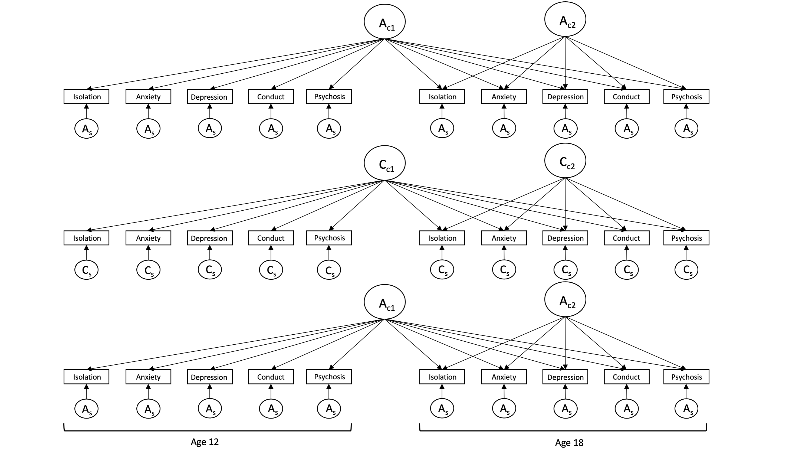

```{r setup, include=FALSE}
knitr::opts_chunk$set(echo = TRUE,
                      comment = NA,
                      prompt = FALSE,
                      cache = FALSE,
                      message = FALSE,
                      warning = FALSE,
                      results = 'markup')

options(bitmapType = 'quartz') # to render fonts better
```

```{r Clear global environment, include=FALSE}
remove(list = ls())
```

```{r Load packages, include=FALSE}
library(knitr)
library(haven)
library(psych) 
library(bestNormalize)
library(questionr)
library(OpenMx)
library(tidyr)
library(lavaan)
library(tidyverse)
library(dplyr) #conflicts with tidyverse for e.g. rename and row_number
```

# Source functions

```{r source functions, include=FALSE}
source("isolation_mhealth_functions.R")
```

# Read in data

```{r source the data file path, include=FALSE}
# source raw data directory
source("../isolation_mentalhealth_data_path.R")
```

```{r read in dta data file, include=FALSE}
dat.raw <- read_dta(paste0(data_path_raw, "Katie_23Sep22.dta"))
colnames(dat.raw)
```

### Column names

```{r select variables needed}
dat <- dat.raw %>%
  dplyr::select(
         atwinid,
         btwinid,
         familyid,
         rorderp5,
         torder,
         zygosity,
         sampsex,
         sisoe12,
         sisoy12,
         masce12,     # anxiety
         mascy12,   
         cdie12,      # depression
         cdiy12,
         conec12,     # antisocial behaviour / conduct disorder
         conyc12,
         psysympe12,  # psychosis - why is this not the tot scale variable - to give more variation?
         psysympy12,
         socisoe18,
         socisoy18,
         gadsxe18,    # anxiety
         gadsxy18,
         mdesxe18,    # depression
         mdesxy18,
         cdsxe18,     # antisocial behaviour / conduct disorder
         cdsxy18,
         psyexpe18,   # psychotic experiences
         psyexpy18
  )

colnames(dat)
```

### Recode variables into factors {.tabset .tabset-fade}

#### Sex

```{r recode sex}
dat <- dat %>%
  mutate(
    sex = 
      recode_factor(as_factor(sampsex),
        "1" = "Male",
        "2" = "Female"))

table(dat$sex)
```

#### Zygosity

```{r recode zygosity}
dat <- dat %>%
  mutate(
    zygosity = 
      recode_factor(as_factor(zygosity),
        "1" = "MZ",
        "2" = "DZ"))
table(dat$zygosity)
```

### Convert variables to numeric

```{r create numeric isolation variables}
dat <- dat %>%
  mutate(
    sisoe12 = as.numeric(sisoe12),
    sisoy12 = as.numeric(sisoy12),
    masce12 = as.numeric(masce12),       # anxiety
    mascy12 = as.numeric(mascy12),   
    cdie12 = as.numeric(cdie12),         # depression
    cdiy12 = as.numeric(cdiy12),
    conec12 = as.numeric(conec12),       # antisocial behaviour / conduct disorder
    conyc12 = as.numeric(conyc12),
    psysympe12 = as.numeric(psysympe12), # psychosis - why is this not the tot scale variable - to give more variation?
    psysympy12 = as.numeric(psysympy12),
    socisoe18 = as.numeric(socisoe18),
    socisoy18 = as.numeric(socisoy18),
    gadsxe18 = as.numeric(gadsxe18),     # anxiety
    gadsxy18 = as.numeric(gadsxy18),
    mdesxe18 = as.numeric(mdesxe18),     # depression
    mdesxy18 = as.numeric(mdesxy18),
    cdsxe18 = as.numeric(cdsxe18),       # antisocial behaviour / conduct disorder
    cdsxy18 = as.numeric(cdsxy18),
    psyexpe18 = as.numeric(psyexpe18),   # psychotic experiences
    psyexpy18 = as.numeric(psyexpy18)
  ) %>%
  select(                                # remove variables not needed
    -c(sampsex)
  )
```

# Variables lists

```{r select variables - raw}
# anxiety
selvars_anxe <- c("sisoe12", "masce12", "socisoe18", "gadsxe18")
selvars_anx <- c("sisoe12", "masce12", "socisoe18", "gadsxe18", 
                 "sisoy12", "mascy12", "socisoy18", "gadsxy18")

# depression
selvars_depe <- c("sisoe12", "cdie12", "socisoe18", "mdesxe18")
selvars_dep <- c("sisoe12", "cdie12", "socisoe18", "mdesxe18", 
                 "sisoy12", "cdiy12", "socisoy18", "mdesxy18")

# conduct
selvars_cone <- c("sisoe12", "conec12", "socisoe18", "cdsxe18")
selvars_con <- c("sisoe12", "conec12", "socisoe18", "cdsxe18", 
                 "sisoy12", "conyc12", "socisoy18", "cdsxy18")

# psychosis
selvars_psye <- c("sisoe12", "psysympe12", "socisoe18", "psyexpe18")
selvars_psy <- c("sisoe12", "psysympe12", "socisoe18", "psyexpe18",
                 "sisoy12", "psysympy12", "socisoy18", "psyexpy18")

# all 
selvars_anx_dep <- c("sisoe12", "masce12", "cdie12", "socisoe18", "gadsxe18", "mdesxe18",
                     "sisoy12", "mascy12", "cdiy12", "socisoy18", "gadsxy18", "mdesxy18")

selvars_dep_con <- c("sisoe12", "cdie12", "conec12", "socisoe18", "mdesxe18", "cdsxe18",
                     "sisoy12", "cdiy12", "conyc12", "socisoy18", "mdesxy18", "cdsxy18")

selvars <- c("sisoe12", "masce12", "cdie12", "conec12", "psysympe12", 
             "socisoe18", "gadsxe18", "mdesxe18", "cdsxe18", "psyexpe18",
             "sisoy12", "mascy12", "cdiy12", "conyc12", "psysympy12", 
             "socisoy18", "gadsxy18", "mdesxy18", "cdsxy18", "psyexpy18")

selvars_noanx <- c("sisoe12",  "cdie12",   "conec12", "psysympe12", 
                  "socisoe18", "mdesxe18", "cdsxe18", "psyexpe18",
                  "sisoy12",   "cdiy12",   "conyc12", "psysympy12", 
                  "socisoy18", "mdesxy18", "cdsxy18", "psyexpy18")

selvars_elder <- c("sisoe12", "masce12", "cdie12", "conec12", "psysympe12", 
                   "socisoe18", "gadsxe18", "mdesxe18", "cdsxe18", "psyexpe18")
```

```{r select variables - normalised}
# anxiety
selvars_anxe_norm <- c("sisoe12norm", "masce12norm", "socisoe18norm", "gadsxe18norm")
selvars_anx_norm <- c("sisoe12norm", "masce12norm", "socisoe18norm", "gadsxe18norm", 
                      "sisoy12norm", "mascy12norm", "socisoy18norm", "gadsxy18norm")

# depression
selvars_depe_norm <- c("sisoe12norm", "cdie12norm", "socisoe18norm", "mdesxe18norm")
selvars_dep_norm <- c("sisoe12norm", "cdie12norm", "socisoe18norm", "mdesxe18norm", 
                      "sisoy12norm", "cdiy12norm", "socisoy18norm", "mdesxy18norm")

# conduct
selvars_cone_norm <- c("sisoe12norm", "conec12norm", "socisoe18norm", "cdsxe18norm")
selvars_con_norm <- c("sisoe12norm", "conec12norm", "socisoe18norm", "cdsxe18norm", 
                      "sisoy12norm", "conyc12norm", "socisoy18norm", "cdsxy18norm")

# psychosis
selvars_psye_norm <- c("sisoe12norm", "psysympe12norm", "socisoe18norm", "psyexpe18norm")
selvars_psy_norm <- c("sisoe12norm", "psysympe12norm", "socisoe18norm", "psyexpe18norm",
                      "sisoy12norm", "psysympy12norm", "socisoy18norm", "psyexpy18norm")

# all 
selvars_norm <- c("sisoe12norm", "masce12norm", "cdie12norm", "conec12norm", "psysympe12norm", "socisoe18norm", "gadsxe18norm", "mdesxe18norm", "cdsxe18norm", "psyexpe18norm",
             "sisoy12norm", "mascy12norm", "cdiy12norm", "conyc12norm", "psysympy12norm", "socisoy18norm", "gadsxy18norm", "mdesxy18norm", "cdsxy18norm", "psyexpy18norm")

# all with non-normalised - not in the twin modelling specific order here only used to standardise all variables at once
selvars_norm_all <- c("sisoe12", "sisoy12", "masce12", "mascy12", "cdie12", "cdiy12", "conec12", "conyc12", "psysympe12", "psysympy12", 
                      "socisoe18", "socisoy18", "gadsxe18", "gadsxy18", "mdesxe18", "mdesxy18", "cdsxe18", "cdsxy18", "psyexpe18", "psyexpy18",
                      "sisoe12norm", "sisoy12norm", "masce12norm", "mascy12norm", "cdie12norm", "cdiy12norm", "conec12norm", "conyc12norm", "psysympe12norm", "psysympy12norm", 
                      "socisoe18norm", "socisoy18norm", "gadsxe18norm", "gadsxy18norm", "mdesxe18norm", "mdesxy18norm", "cdsxe18norm", "cdsxy18norm", "psyexpe18norm", "psyexpy18norm")
```

```{r select variables - normalised and sex regressed}
# anxiety
selvars_anxe_norm_reg <- c("sisoe12norm_reg", "masce12norm_reg", "socisoe18norm_reg", "gadsxe18norm_reg")
selvars_anx_norm_reg <- c("sisoe12norm_reg", "masce12norm_reg", "socisoe18norm_reg", "gadsxe18norm_reg", 
                 "sisoy12norm_reg", "mascy12norm_reg", "socisoy18norm_reg", "gadsxy18norm_reg")

# depression
selvars_depe_norm_reg <- c("sisoe12norm_reg", "cdie12norm_reg", "socisoe18norm_reg", "mdesxe18norm_reg")
selvars_dep_norm_reg <- c("sisoe12norm_reg", "cdie12norm_reg", "socisoe18norm_reg", "mdesxe18norm_reg", 
                 "sisoy12norm_reg", "cdiy12norm_reg", "socisoy18norm_reg", "mdesxy18norm_reg")

# conduct
selvars_cone_norm_reg <- c("sisoe12norm_reg", "conec12norm_reg", "socisoe18norm_reg", "cdsxe18norm_reg")
selvars_con_norm_reg <- c("sisoe12norm_reg", "conec12norm_reg", "socisoe18norm_reg", "cdsxe18norm_reg", 
                 "sisoy12norm_reg", "conyc12norm_reg", "socisoy18norm_reg", "cdsxy18norm_reg")

# psychosis
selvars_psye_norm_reg <- c("sisoe12norm_reg", "psysympe12norm_reg", "socisoe18norm_reg", "psyexpe18norm_reg")
selvars_psy_norm_reg <- c("sisoe12norm_reg", "psysympe12norm_reg", "socisoe18norm_reg", "psyexpe18norm_reg",
                 "sisoy12norm_reg", "psysympy12norm_reg", "socisoy18norm_reg", "psyexpy18norm_reg")

# all 
selvars_noanx_norm_reg <- c("sisoe12norm_reg", "cdie12norm_reg", "conec12norm_reg", "psysympe12norm_reg", 
                      "socisoe18norm_reg",  "mdesxe18norm_reg", "cdsxe18norm_reg", "psyexpe18norm_reg",
                      "sisoy12norm_reg",  "cdiy12norm_reg", "conyc12norm_reg", "psysympy12norm_reg",
                      "socisoy18norm_reg", "mdesxy18norm_reg", "cdsxy18norm_reg", "psyexpy18norm_reg")

selvars_noanx_reg <- c("sisoe12_reg", "cdie12_reg", "conec12_reg", "psysympe12_reg", 
                      "socisoe18_reg",  "mdesxe18_reg", "cdsxe18_reg", "psyexpe18_reg",
                      "sisoy12_reg",  "cdiy12_reg", "conyc12_reg", "psysympy12_reg",
                      "socisoy18_reg", "mdesxy18_reg", "cdsxy18_reg", "psyexpy18_reg")

selvars_norm_reg <- c("sisoe12norm_reg", "masce12norm_reg", "cdie12norm_reg", "conec12norm_reg", "psysympe12norm_reg", 
                      "socisoe18norm_reg", "gadsxe18norm_reg", "mdesxe18norm_reg", "cdsxe18norm_reg", "psyexpe18norm_reg",
                      "sisoy12norm_reg", "mascy12norm_reg", "cdiy12norm_reg", "conyc12norm_reg", "psysympy12norm_reg",
                      "socisoy18norm_reg", "gadsxy18norm_reg", "mdesxy18norm_reg", "cdsxy18norm_reg", "psyexpy18norm_reg")

selvars_noanx_nosoc_norm_reg <- c("cdie12norm_reg", "conec12norm_reg", "psysympe12norm_reg", 
                                  "mdesxe18norm_reg", "cdsxe18norm_reg", "psyexpe18norm_reg",
                                  "cdiy12norm_reg", "conyc12norm_reg", "psysympy12norm_reg",
                                  "mdesxy18norm_reg", "cdsxy18norm_reg", "psyexpy18norm_reg")


# all with non-norm_regalised - not in the twin modelling specific order here only used to standardise all variables at once
selvars_norm_reg_all <- c("sisoe12", "sisoy12", "masce12", "mascy12", "cdie12", "cdiy12", "conec12", "conyc12", "psysympe12", "psysympy12", 
                      "socisoe18", "socisoy18", "gadsxe18", "gadsxy18", "mdesxe18", "mdesxy18", "cdsxe18", "cdsxy18", "psyexpe18", "psyexpy18",
                      "sisoe12norm_reg", "sisoy12norm_reg", "masce12norm_reg", "mascy12norm_reg", "cdie12norm_reg", "cdiy12norm_reg", "conec12norm_reg", "conyc12norm_reg", "psysympe12norm_reg", "psysympy12norm_reg", 
                      "socisoe18norm_reg", "socisoy18norm_reg", "gadsxe18norm_reg", "gadsxy18norm_reg", "mdesxe18norm_reg", "mdesxy18norm_reg", "cdsxe18norm_reg", "cdsxy18norm_reg", "psyexpe18norm_reg", "psyexpy18norm_reg")

selvars_norm_reg_elder <- c("sisoe12norm_reg", "masce12norm_reg", "cdie12norm_reg", "conec12norm_reg", "psysympe12norm_reg", 
                            "socisoe18norm_reg", "gadsxe18norm_reg", "mdesxe18norm_reg", "cdsxe18norm_reg", "psyexpe18norm_reg")
```

# Data prep

## Missingness

```{r missingness for each variable}
# isolation12
dat <- dat %>%
  mutate(missing_isolation12 =
           if_else(
               !is.na(sisoe12), 
               true = "Not missing",
               false = "Missing"
           ))
table(dat$missing_isolation12)

# isolation18
dat <- dat %>%
  mutate(missing_isolation18 =
           if_else(
               !is.na(socisoe18), 
               true = "Not missing",
               false = "Missing"
           ))
table(dat$missing_isolation18)

# depression12
dat <- dat %>%
  mutate(missing_depression12 =
           if_else(
               !is.na(cdie12), 
               true = "Not missing",
               false = "Missing"
           ))
table(dat$missing_depression12)

# depression18
dat <- dat %>%
  mutate(missing_depression18 =
           if_else(
               !is.na(mdesxe18), 
               true = "Not missing",
               false = "Missing"
           ))
table(dat$missing_depression18)

# conduct12
dat <- dat %>%
  mutate(missing_conduct12 =
           if_else(
               !is.na(conec12), 
               true = "Not missing",
               false = "Missing"
           ))
table(dat$missing_conduct12)

# conduct18
dat <- dat %>%
  mutate(missing_conduct18 =
           if_else(
               !is.na(cdsxe18), 
               true = "Not missing",
               false = "Missing"
           ))
table(dat$missing_conduct18)

# psychosis12
dat <- dat %>%
  mutate(missing_psychosis12 =
           if_else(
               !is.na(psysympe12), 
               true = "Not missing",
               false = "Missing"
           ))
table(dat$missing_psychosis12)

# psychosis18
dat <- dat %>%
  mutate(missing_psychosis18 =
           if_else(
               !is.na(psyexpe18), 
               true = "Not missing",
               false = "Missing"
           ))
table(dat$missing_psychosis18)
```


## Skewness

```{r histograms}
# isolation
hist(dat$sisoe12)    # not normal
hist(dat$socisoe18)  # not normal
# anxiety
hist(dat$masce12)    # normal
hist(dat$gadsxe18)   # not normal
# depression
hist(dat$cdie12)     # not normal
hist(dat$mdesxe18)   # not normal
# conduct
hist(dat$conec12)    # not normal
hist(dat$cdsxe18)    # not normal
# psychosis
hist(dat$psysympe12) # not normal
hist(dat$psyexpe18)  # not normal
```

## Rank transformation

Almost all variables are non-normal. We will use the van der Waerden's rank-based transformation as used in [Rimfeld et al 2021](https://acamh.onlinelibrary.wiley.com/doi/full/10.1002/jcv2.12053). For analyses using transformed data, they conducted the van der Waerden transformation prior to residualizing for age and sex as recommended by [Pain et al. 2018](https://www.nature.com/articles/s41431-018-0159-6).  

I will transform all variables to get the normalised estimate.

```{r rank transform variables elder variables}
# isolation age 12
sisoe12_n <- bestNormalize(dat$sisoe12)    # select the type of transformation needed
dat$sisoe12norm <- predict(sisoe12_n)      # create normalised variable
hist(dat$sisoe12norm)                  
summary(dat$sisoe12norm)

# isolation age 18
socisoe18_n <- bestNormalize(dat$socisoe18)    
dat$socisoe18norm <- predict(socisoe18_n)  
hist(dat$socisoe18norm)                  
summary(dat$socisoe18norm)

# anxiety age 12 - wont actually use this as it's already normally distributed
masce12_n <- bestNormalize(dat$masce12)    
dat$masce12norm <- predict(masce12_n)  
hist(dat$masce12norm)                  
summary(dat$masce12norm)

# anxiety age 18
gadsxe18_n <- bestNormalize(dat$gadsxe18)    
dat$gadsxe18norm <- predict(gadsxe18_n)  
hist(dat$gadsxe18norm)                  
summary(dat$gadsxe18norm)

# depression age 12
cdie12_n <- bestNormalize(dat$cdie12)    
dat$cdie12norm <- predict(cdie12_n)  
hist(dat$cdie12norm)                  
summary(dat$cdie12norm)

# depression age 18
mdesxe18_n <- bestNormalize(dat$mdesxe18)    
dat$mdesxe18norm <- predict(mdesxe18_n)  
hist(dat$mdesxe18norm)                  
summary(dat$mdesxe18norm)

# conduct age 12
conec12_n <- bestNormalize(dat$conec12)    
dat$conec12norm <- predict(conec12_n)  
hist(dat$conec12norm)                  
summary(dat$conec12norm)

# conduct age 18
cdsxe18_n <- bestNormalize(dat$cdsxe18)    
dat$cdsxe18norm <- predict(cdsxe18_n)  
hist(dat$cdsxe18norm)                  
summary(dat$cdsxe18norm)

# psychosis age 12
psysympe12_n <- bestNormalize(dat$psysympe12)    
dat$psysympe12norm <- predict(psysympe12_n)  
hist(dat$psysympe12norm)                  
summary(dat$psysympe12norm)

# psychosis age 18
psyexpe18_n <- bestNormalize(dat$psyexpe18)    
dat$psyexpe18norm <- predict(psyexpe18_n)  
hist(dat$psyexpe18norm)                  
summary(dat$psyexpe18norm)
```

```{r rank transform variables younger variables}
# isolation age 12
sisoy12_n <- bestNormalize(dat$sisoy12)    # select the type of transformation needed
dat$sisoy12norm <- predict(sisoy12_n)  # create normalised variable
hist(dat$sisoy12norm)                  
summary(dat$sisoy12norm)

# isolation age 18
socisoy18_n <- bestNormalize(dat$socisoy18)    
dat$socisoy18norm <- predict(socisoy18_n)  
hist(dat$socisoy18norm)                  
summary(dat$socisoy18norm)

# anxiety age 12 - wont actually use this as it's already normally distributed
mascy12_n <- bestNormalize(dat$mascy12)    
dat$mascy12norm <- predict(mascy12_n)  
hist(dat$mascy12norm)                  
summary(dat$mascy12norm)

# anxiety age 18
gadsxy18_n <- bestNormalize(dat$gadsxy18)    
dat$gadsxy18norm <- predict(gadsxy18_n)  
hist(dat$gadsxy18norm)                  
summary(dat$gadsxy18norm)

# depression age 12
cdiy12_n <- bestNormalize(dat$cdiy12)    
dat$cdiy12norm <- predict(cdiy12_n)  
hist(dat$cdiy12norm)                  
summary(dat$cdiy12norm)

# depression age 18
mdesxy18_n <- bestNormalize(dat$mdesxy18)    
dat$mdesxy18norm <- predict(mdesxy18_n)  
hist(dat$mdesxy18norm)                  
summary(dat$mdesxy18norm)

# conduct age 12
conyc12_n <- bestNormalize(dat$conyc12)    
dat$conyc12norm <- predict(conyc12_n)  
hist(dat$conyc12norm)                  
summary(dat$conyc12norm)

# conduct age 18
cdsxy18_n <- bestNormalize(dat$cdsxy18)    
dat$cdsxy18norm <- predict(cdsxy18_n)  
hist(dat$cdsxy18norm)                  
summary(dat$cdsxy18norm)

# psychosis age 12
psysympy12_n <- bestNormalize(dat$psysympy12)    
dat$psysympy12norm <- predict(psysympy12_n)  
hist(dat$psysympy12norm)                  
summary(dat$psysympy12norm)

# psychosis age 18
psyexpy18_n <- bestNormalize(dat$psyexpy18)    
dat$psyexpy18norm <- predict(psyexpy18_n)  
hist(dat$psyexpy18norm)                  
summary(dat$psyexpy18norm)
```

## Regress out sex

We first normalize the twin variables, then regress out sex. We don't regress out age here as all twins were measured as close to their birthday as possible. 

We also add 1 to the residuals. This makes the means 1 as sometimes the model model can struggle to converge if the means are 0 or if any of the starting values are 0. 

```{r regress out sex to normalised variables}
# twin 1 - elder
## isolation
dat$sisoe12norm_reg <- (resid(lm(data = dat, sisoe12norm ~ sex, na.action = na.exclude))) + 1
dat$socisoe18norm_reg <- (resid(lm(data = dat, socisoe18norm ~ sex, na.action = na.exclude))) + 1
## anxiety
dat$masce12norm_reg <- (resid(lm(data = dat, masce12norm ~ sex, na.action = na.exclude))) + 1
dat$gadsxe18norm_reg <- (resid(lm(data = dat, gadsxe18norm ~ sex, na.action = na.exclude))) + 1
## depression
dat$cdie12norm_reg <- (resid(lm(data = dat, cdie12norm ~ sex, na.action = na.exclude))) + 1
dat$mdesxe18norm_reg <- (resid(lm(data = dat, mdesxe18norm ~ sex, na.action = na.exclude))) + 1
## conduct
dat$conec12norm_reg <- (resid(lm(data = dat, conec12norm ~ sex, na.action = na.exclude))) + 1
dat$cdsxe18norm_reg <- (resid(lm(data = dat, cdsxe18norm ~ sex, na.action = na.exclude))) + 1
## psychosis
dat$psysympe12norm_reg <- (resid(lm(data = dat, psysympe12norm ~ sex, na.action = na.exclude))) + 1
dat$psyexpe18norm_reg <- (resid(lm(data = dat, psyexpe18norm ~ sex, na.action = na.exclude))) + 1

# twin 2 - younger
## isolation
dat$sisoy12norm_reg <- (resid(lm(data = dat, sisoy12norm ~ sex, na.action = na.exclude)))  + 1
dat$socisoy18norm_reg <- (resid(lm(data = dat, socisoy18norm ~ sex, na.action = na.exclude))) + 1
## anxiety
dat$mascy12norm_reg <- (resid(lm(data = dat, mascy12norm ~ sex, na.action = na.exclude))) + 1
dat$gadsxy18norm_reg <- (resid(lm(data = dat, gadsxy18norm ~ sex, na.action = na.exclude))) + 1
## depression
dat$cdiy12norm_reg <- (resid(lm(data = dat, cdiy12norm ~ sex, na.action = na.exclude))) + 1
dat$mdesxy18norm_reg <- (resid(lm(data = dat, mdesxy18norm ~ sex, na.action = na.exclude))) + 1
## conduct
dat$conyc12norm_reg <- (resid(lm(data = dat, conyc12norm ~ sex, na.action = na.exclude))) + 1
dat$cdsxy18norm_reg <- (resid(lm(data = dat, cdsxy18norm ~ sex, na.action = na.exclude))) + 1
## psychosis
dat$psysympy12norm_reg <- (resid(lm(data = dat, psysympy12norm ~ sex, na.action = na.exclude))) + 1
dat$psyexpy18norm_reg <- (resid(lm(data = dat, psyexpy18norm ~ sex, na.action = na.exclude))) + 1
```

```{r regress out sex}
# twin 1 - elder
## isolation
dat$sisoe12_reg <- (resid(lm(data = dat, sisoe12 ~ sex, na.action = na.exclude)))  + 1
dat$socisoe18_reg <- (resid(lm(data = dat, socisoe18 ~ sex, na.action = na.exclude))) + 1
## anxiety
dat$masce12_reg <- (resid(lm(data = dat, masce12 ~ sex, na.action = na.exclude))) + 1
dat$gadsxe18_reg <- (resid(lm(data = dat, gadsxe18 ~ sex, na.action = na.exclude))) + 1
## depression
dat$cdie12_reg <- (resid(lm(data = dat, cdie12 ~ sex, na.action = na.exclude))) + 1
dat$mdesxe18_reg <- (resid(lm(data = dat, mdesxe18 ~ sex, na.action = na.exclude))) + 1
## conduct
dat$conec12_reg <- (resid(lm(data = dat, conec12 ~ sex, na.action = na.exclude))) + 1
dat$cdsxe18_reg <- (resid(lm(data = dat, cdsxe18 ~ sex, na.action = na.exclude))) + 1
## psychosis
dat$psysympe12_reg <- (resid(lm(data = dat, psysympe12 ~ sex, na.action = na.exclude))) + 1
dat$psyexpe18_reg <- (resid(lm(data = dat, psyexpe18 ~ sex, na.action = na.exclude))) + 1

# twin 2 - younger
## isolation
dat$sisoy12_reg <- (resid(lm(data = dat, sisoy12 ~ sex, na.action = na.exclude))) + 1 
dat$socisoy18_reg <- (resid(lm(data = dat, socisoy18 ~ sex, na.action = na.exclude))) + 1
## anxiety
dat$mascy12_reg <- (resid(lm(data = dat, mascy12 ~ sex, na.action = na.exclude))) + 1
dat$gadsxy18_reg <- (resid(lm(data = dat, gadsxy18 ~ sex, na.action = na.exclude))) + 1
## depression
dat$cdiy12_reg <- (resid(lm(data = dat, cdiy12 ~ sex, na.action = na.exclude))) + 1
dat$mdesxy18_reg <- (resid(lm(data = dat, mdesxy18 ~ sex, na.action = na.exclude))) + 1
## conduct
dat$conyc12_reg <- (resid(lm(data = dat, conyc12 ~ sex, na.action = na.exclude))) + 1
dat$cdsxy18_reg <- (resid(lm(data = dat, cdsxy18 ~ sex, na.action = na.exclude))) + 1
## psychosis
dat$psysympy12_reg <- (resid(lm(data = dat, psysympy12 ~ sex, na.action = na.exclude))) + 1
dat$psyexpy18_reg <- (resid(lm(data = dat, psyexpy18 ~ sex, na.action = na.exclude))) + 1
```

## Create twin dataset

To remove the double entry in the data, we will remove everyone who has a "random twin order" variable of 0. This will then remove any birth order effects. 

```{r remove one twin pair row}
dat.twin <- dat %>% filter(rorderp5 == "1")
```

```{r datasets for MZ and DZ}
dat.twin.MZ <- dat.twin %>% filter(zygosity == "MZ")
dat.twin.DZ <- dat.twin %>% filter(zygosity == "DZ")

# male only
dat.twin.MZm <- dat.twin.MZ %>% filter(sex == "Male")
dat.twin.DZm <- dat.twin.DZ %>% filter(sex == "Male")
# female only
dat.twin.MZf <- dat.twin.MZ %>% filter(sex == "Female")
dat.twin.DZf <- dat.twin.DZ %>% filter(sex == "Female")
```

## Summary of MZ and DZ data

### Overall

```{r describe MZ and DZ data}
MZ_summary <- psych::describe(dat.twin.MZ, 
                       skew = FALSE, 
                       range = FALSE)

DZ_summary <- psych::describe(dat.twin.DZ, 
                       skew = FALSE, 
                       range = FALSE)
# freq(dat$sisoe12)
# freq(dat$psysympe12)
# freq(dat$gadsxe18)
```

### Correlation matrices

```{r check the phenotypic correlations}
# overall
cor(dat.twin[, selvars], use = "complete")

# MZ
cor(dat.twin.MZ[, selvars], use = "complete")

# DZ
cor(dat.twin.DZ[, selvars], use = "complete")
```

```{r check the phenotypic correlations for norm and sex regressed variables}
# overall
cor(dat.twin[, selvars_norm_reg], use = "complete")

# MZ
cor.mz <- cor(dat.twin.MZ[, selvars_norm_reg], use = "complete")

# DZ
cor.dz <- cor(dat.twin.DZ[, selvars_norm_reg], use = "complete")
```

```{r order according to cross-twin cross-trait matrices for social isolation with each mental health disorder}
selvars_si12_xtxt <- c("sisoe12", "sisoy12")
selvars_dep12_xtxt <- c("sisoe12", "cdie12", "sisoy12", "cdiy12")
selvars_psy12_xtxt <- c("sisoe12", "psysympe12", "sisoy12", "psysympy12")
selvars_psy12 <- c("psysympe12", "psysympy12")
selvars_psy18 <- c("psyexpe18", "psyexpy18")


var(dat.twin.MZ[, selvars_si12_xtxt], use = "complete")
var(dat.twin.DZ[, selvars_si12_xtxt], use = "complete")

cor(dat.twin.MZ[, selvars_dep12_xtxt], use = "complete")
cor(dat.twin.DZ[, selvars_dep12_xtxt], use = "complete")

cor(dat.twin.MZ[, selvars_psy12_xtxt], use = "complete")
cor(dat.twin.DZ[, selvars_psy12_xtxt], use = "complete")

cor(dat.twin.MZ[, selvars_psy12], use = "complete")
cor(dat.twin.DZ[, selvars_psy12], use = "complete")

cor(dat.twin.MZ[, selvars_psy18], use = "complete")
cor(dat.twin.DZ[, selvars_psy18], use = "complete")


```

### Check for dominance

rMZ >2*rDZ

```{r see where the MZ correlations are more than 2 times the DZ correlations}
# Find indices where cor.mz > 2 * cor.dz
indices <- which(cor.mz > 2 * cor.dz, arr.ind = TRUE)

# Initialize a list to store selected variable pairs
selected_pairs <- list()

# Iterate through the indices and select variables
for (i in 1:nrow(indices)) {
  row_idx <- indices[i, 1]
  col_idx <- indices[i, 2]
  mz_var <- selvars[row_idx]
  dz_var <- selvars[col_idx]
  
  # Check if the first three letters and last two digits match
  if (substr(mz_var, 1, 3) == substr(dz_var, 1, 3) && substr(mz_var, nchar(mz_var) - 1, nchar(mz_var)) == substr(dz_var, nchar(dz_var) - 1, nchar(dz_var))) {
    mz_value <- cor.mz[row_idx, col_idx]
    dz_value <- cor.dz[row_idx, col_idx]
    selected_pairs[[paste(mz_var, dz_var)]] <- list(Variable1 = mz_var, Variable2 = dz_var, cor.mz = mz_value, cor.dz = dz_value)
  }
}

# Print selected variable pairs and corresponding values
for (pair_name in names(selected_pairs)) {
  pair_info <- selected_pairs[[pair_name]]
  cat("Variable 1:", pair_info$Variable1, "Variable 2:", pair_info$Variable2, "cor.mz:", pair_info$cor.mz, "cor.dz:", pair_info$cor.dz, "\n")
}
```
The ADE model may be more appropriate for social isolation age 12 and 18, anxiety age 18, depression age 18. But this is not appropriate across all variables. 

#### Heat map

```{r list of variables for heatmap}
name.list <- c(
  "Isolation12",
  "Anxiety12",
  "Depression12",
  "Conduct12",
  "Psychosis12",
  "Isolation18",
  "Anxiety18",
  "Depression18",
  "Conduct18",
  "Psychosis18"
)
```

The functions for ordering the heat map below can be found in isolation_mhealth_functions.R

Below we have used the sex regressed and normalised variables to look at the correlations - if you want to look at the raw variables, use selvars_elder

```{r heat map of all correlations}
# create data frame with just numeric antecedent variables
variable_data_frame <- as.data.frame(dat[,selvars_norm_reg_elder])
colnames(variable_data_frame) <- name.list

# get correlation matrix
isolation_cor_matrix <- cor(variable_data_frame, method = "pearson", use = "complete.obs")

# reorder the correlation matrix
cor_matrix_full <- reorder_cor_matrix(isolation_cor_matrix)
  
# melt the values
metled_cor_matrix <- reshape::melt(cor_matrix_full, na.rm = TRUE)

# correlation heat map
correlation_heat_map <- ggplot(metled_cor_matrix, aes(X2, X1, fill = value)) +
 geom_tile(color = "white") +
 scale_fill_gradient2(low = "#343d99", high = "#a50026", mid = "white",
   midpoint = 0, limit = c(-1,1), space = "Lab",
    name="Pearson\nCorrelation") +
  theme_minimal() +
  labs(y = "",
       x = "",
      # title = "Correlation heat map"
       ) +
 theme(axis.text.x = element_text(angle = 45, vjust = 1, size = 12, hjust = 1),
       axis.text.y = element_text(size = 12),
       plot.margin=grid::unit(c(0,0,0,0), "mm"),
       plot.title = element_text(size = 20),
       )+
 coord_fixed() +
  geom_text(aes(X2, X1, label = round(value, digits = 2)), color = "black", size = 4)

correlation_heat_map

ggsave(correlation_heat_map, file = "../../plots/correlation_heatmap.jpeg", height = 8, width = 8)
```

```{r test significance of correlations}
# isolation12
cor.test(dat$sisoe12, dat$cdie12, use = "complete")
cor.test(dat$sisoe12, dat$conec12, use = "complete")
cor.test(dat$sisoe12, dat$psysympe12, use = "complete")
cor.test(dat$sisoe12, dat$socisoe18, use = "complete")
cor.test(dat$sisoe12, dat$mdesxe18, use = "complete")
cor.test(dat$sisoe12, dat$cdsxe18, use = "complete")
cor.test(dat$sisoe12, dat$psyexpe18, use = "complete")

# depression12
cor.test(dat$cdie12, dat$conec12, use = "complete")
cor.test(dat$cdie12, dat$psysympe12, use = "complete")
cor.test(dat$cdie12, dat$socisoe18, use = "complete")
cor.test(dat$cdie12, dat$mdesxe18, use = "complete")
cor.test(dat$cdie12, dat$cdsxe18, use = "complete")
cor.test(dat$cdie12, dat$psyexpe18, use = "complete")

# conduct12
cor.test(dat$conec12, dat$psysympe12, use = "complete")
cor.test(dat$conec12, dat$socisoe18, use = "complete")
cor.test(dat$conec12, dat$mdesxe18, use = "complete")
cor.test(dat$conec12, dat$cdsxe18, use = "complete")
cor.test(dat$conec12, dat$psyexpe18, use = "complete")

# psychosis12
cor.test(dat$psysympe12, dat$socisoe18, use = "complete")
cor.test(dat$psysympe12, dat$mdesxe18, use = "complete")
cor.test(dat$psysympe12, dat$cdsxe18, use = "complete")
cor.test(dat$psysympe12, dat$psyexpe18, use = "complete")

# isolation18
cor.test(dat$socisoe18, dat$mdesxe18, use = "complete")
cor.test(dat$socisoe18, dat$cdsxe18, use = "complete")
cor.test(dat$socisoe18, dat$psyexpe18, use = "complete")

# depression18
cor.test(dat$mdesxe18, dat$cdsxe18, use = "complete")
cor.test(dat$mdesxe18, dat$psyexpe18, use = "complete")

# conduct18
cor.test(dat$cdsxe18, dat$psyexpe18, use = "complete")
```

Here, all the correlations with anxiety are relatively low. We may have to consider removing it, and going for a 4 vairable model (at 2 time points).

#### MZ

```{r MZ matrices}
# covariance matrix
covar.mz <- cov(dat.twin.MZ[, selvars], use = "complete")
# correlation matrix (standardized covariance)
cor.mz <- cor(dat.twin.MZ[, selvars], use = "complete")
round(cor.mz, 3)
```

#### DZ

```{r DZ matrices}
# covariance matrix
covar.dz <- cov(dat.twin.DZ[, selvars], use = "complete")
# correlation matrix (standardized covariance)
cor.dz <- cor(dat.twin.DZ[, selvars], use = "complete")
round(cor.dz, 3)
```

# Phenotypic factor model

The phenotypic model was coded by **Olakunle Oginni**. 

We want to make sure that the factor structure works for the variables we have chosen. From the correlations, the correlation between anxiety and isolation was very small - 0.04 - so anxiety may not be a good candidate to include in the factor model. To confirm this, we will specify a phenotypic factor model

```{r variables for phenotypic correlation model}
nv 	  	<- 10    		               	 # number of variables - 2 for each construct (2*5)
ntv 		<- nv*2 		              	 # number of twin variables
nlower 	<- nv*(nv+1)/2 		           # number of free elements in an nv*nv lower matrix 
ncor		<- (nv*(nv+1)/2)-nv	         # number of free elements in a correlation matrix nv*nv
nfact 	<- 2                         # change dimension of A factor matrix Ac to have *2* common factors
nfact2	<- 2*nfact	            		 # number of Latent Factors for Mediation Model per twin
nfcor		<- (nfact*(nfact+1)/2)-nfact # number of free elements in a correlation matrix nfact*nfcat

Groups	<- c("mz", "dz")
Vars		<- c("siso12norm_reg",
           "masc12norm_reg",
           "cdi12norm_reg",
           "conc12norm_reg",
           "psysymp12norm_reg",
           "sociso18norm_reg",
           "gadsx18norm_reg",
           "mdesx18norm_reg",
           "cdsx18norm_reg",
           "psyexp18norm_reg")

selVars	<- c("sisoe12norm_reg","masce12norm_reg","cdie12norm_reg","conec12norm_reg","psysympe12norm_reg",
             "socisoe18norm_reg","gadsxe18norm_reg","mdesxe18norm_reg","cdsxe18norm_reg","psyexpe18norm_reg",
		         "sisoy12norm_reg","mascy12norm_reg","cdiy12norm_reg","conyc12norm_reg","psysympy12norm_reg",
		         "socisoy18norm_reg","gadsxy18norm_reg","mdesxy18norm_reg","cdsxy18norm_reg","psyexpy18norm_reg")

mzData	<- subset(dat.twin, zygosity%in%c("MZ"), selVars)
dzData	<- subset(dat.twin, zygosity%in%c("DZ"), selVars)
```

```{r MZ and DZ correlations}
psych::describe(mzData)
psych::describe(dzData)
```

```{r create labels and start values as objects to ease specification in the body of the model}
(Stmean	<- colMeans(mzData[,1:nv],na.rm=TRUE))
StM 		<- c(Stmean,Stmean)

(LabM	  <- paste("m",1:nv,sep=""))
MLabs		<- c(LabM,LabM) 

#(LabEr	<- paste("e",1:nv,sep=""))
(LabEr	<- c("e1","e2","e3","e4","e5","e6","e7","e8","e9","e10"))
(PatE  	<- c( T,T,T,T,T,T,T,T,T,T))
(stE  	<- c( .5,.5,.5,.5,.5,.5,.5,.5,.5,.5))

# Create Labels for the Factor parameters
(sdLabs	  <- paste("sd",1:nfact,sep=""))	# SD
(rphLabs	<- paste("r",1:nfcor,sep=""))		# Correlation Matrix Factors within person 
(MZbLabs 	<- paste("rmz", do.call(c, sapply(seq(1, nfact), function(x){ paste(x:nfact, x,sep="") })), sep=""))	# Lower Triangular Matrices
(DZbLabs 	<- paste("rdz", do.call(c, sapply(seq(1, nfact), function(x){ paste(x:nfact, x,sep="") })), sep=""))

# Create Labels for the Factor Loadings (1st loadings fixed to 1)
PatFl	<- c(F,T,T,T,T,T,T,T,T,T,			
	         F,F,F,F,F,F,T,T,T,T)

StFl	<- c(1,.5,.5,.5,.5,.5,.5,.5,.5,.5,
	         0,0,0,0,0,1,.5,.5,.5,.5)

LabFl	<- c('l1','l2','l3','l4','l5','l6','l7','l8','l9','l10',
	          NA,NA,NA,NA,NA,'l11','l12','l13','l14','l15')

# Free parameters
(Pat  	<- c( rep(TRUE, nv)))
```

## Specify

Use Algebra to generate expected var/cov matrices and Means.

```{r Define matrices to hold the Means, SD, correlations}
Mean	<-mxMatrix( type="Full", nrow=1, ncol=ntv, free=c(Pat, Pat), values=c(StM), labels=c(MLabs), name="expm" ) # first variable is not free to be estimated

# Define matrices to specify the loadings of the dependent variables on the latent factors
Load		<-mxMatrix(type="Full",	nrow=nv, ncol=nfact, free=PatFl, values=StFl, labels=LabFl, name="FactL" )
Ze102		<-mxMatrix("Zero", nv, nfact, free=F, name="Z102")
LoadTw	<-mxAlgebra(rbind(cbind(FactL,Z102), cbind(Z102, FactL)), name="FactLTw")

ErPath	<-mxMatrix(type="Diag",	nrow=nv, ncol=nv, free=PatE, values=stE, labels=LabEr, name="Erp" )
Er		<-mxAlgebra(Erp %*% t(Erp), name="Error")
Error		<-mxAlgebra(Erp %*% t(Erp), name="Error")
Ze1010	<-mxMatrix("Zero", nv, nv, free=F, name="Z1010")
ErTw		<-mxAlgebra(rbind(cbind(Error,Z1010), cbind(Z1010, Error)), name="ErrorTw")

# elements for the SD of Factors
Id2		<-mxMatrix("Iden", 2, 2, free=F, name="I2")
sdF		<-mxMatrix("Diag", nfact, nfact, free=T, values=1, labels=sdLabs, name="SDf") 
sdFTw		<-mxAlgebra(I2 %x% SDf, name="SDftwin")

# elements for the correlations of Factors
#Rph		<-mxMatrix("Stand", nfact, nfact, free=TRUE, values=.2, labels=rphLabs, lbound=-.999, ubound=.999, name="Rwithin") 
#MZb		<-mxMatrix("Symm", nfact, nfact, free=TRUE, values=.2, labels=MZbLabs, lbound=-.999, ubound=.999, name="RbetweenMZ") 
#DZb		<-mxMatrix("Symm", nfact, nfact, free=TRUE, values=.1, labels=DZbLabs, lbound=-.999, ubound=.999, name="RbetweenDZ") 
Rph		<-mxMatrix("Stand", nfact, nfact, free=F, values=0, labels=rphLabs, lbound=-.999, ubound=.999, name="Rwithin") 
MZb		<-mxMatrix("Diag", nfact, nfact, free=TRUE, values=.2, labels=c('rmz11','rmz22'), lbound=-.999, ubound=.999, name="RbetweenMZ") 
DZb		<-mxMatrix("Diag", nfact, nfact, free=TRUE, values=.1, labels=c('rdz11','rdz22'), lbound=-.999, ubound=.999, name="RbetweenDZ") 
FactCorMZ	<-mxAlgebra(rbind(cbind(Rwithin,RbetweenMZ), cbind(RbetweenMZ, Rwithin)), name="RMZ")
FactCorDZ	<-mxAlgebra(rbind(cbind(Rwithin,RbetweenDZ), cbind(RbetweenDZ, Rwithin)), name="RDZ")

# Generate expected Covariance matrices of Factors
FactCovMZ	<-mxAlgebra(SDftwin %&% RMZ , name="expFactCovMZ")
FactCovDZ	<-mxAlgebra(SDftwin %&% RDZ , name="expFactCovDZ")

## This second step then derives the var/cov matrix of the observed/measured variables in terms of the variance/covariances of the latent factors and the Factor Loadings
covMZ		<-mxAlgebra( expression= FactLTw  %&% expFactCovMZ , name="ExpCovMZ" )
covDZ		<-mxAlgebra( expression= FactLTw  %&% expFactCovDZ , name="ExpCovDZ" )

## Finally, we derive the total expected variance/covariances for the measured variables which go in the models
TOTcovMZ	<-mxAlgebra( expression= ExpCovMZ + ErrorTw , name="TOTexpCovMZ" )
TOTcovDZ	<-mxAlgebra( expression= ExpCovDZ + ErrorTw , name="TOTexpCovDZ" )
```

```{r Standardizing parameters}
# Standardized Factor Loadings
StFL		<-mxAlgebra( expression= sqrt(diag2vec( FactL %&% expFactCovMZ[1:2,1:2] / TOTexpCovMZ[1:10,1:10])) , name="StandFact" )#Standardised factor loadings for factor 1 on first 5 vars and factor 2 on second 5 vars
StFL1on6	<-mxAlgebra( expression= (FactL [6,1]* sqrt(expFactCovMZ[1,1]))/sqrt(TOTexpCovMZ[6,6]) , name="StandFact61" )#Factor 1 on the second 5 vars
StFL1on7	<-mxAlgebra( expression= (FactL [7,1]* sqrt(expFactCovMZ[1,1]))/sqrt(TOTexpCovMZ[7,7]) , name="StandFact71" )
StFL1on8	<-mxAlgebra( expression= (FactL [8,1]* sqrt(expFactCovMZ[1,1]))/sqrt(TOTexpCovMZ[8,8]) , name="StandFact81" )
StFL1on9	<-mxAlgebra( expression= (FactL [9,1]* sqrt(expFactCovMZ[1,1]))/sqrt(TOTexpCovMZ[9,9]) , name="StandFact91" )
StFL1on10	<-mxAlgebra( expression= (FactL [10,1]* sqrt(expFactCovMZ[1,1]))/sqrt(TOTexpCovMZ[10,10]) , name="StandFact101" )

# Standardise error terms of the measured variables - this is the standardised variable paths then remove sqrt to get standardised variance
StEr		<-mxAlgebra( expression= sqrt(diag2vec( Error/TOTexpCovMZ[1:10,1:10])), name="StandEr" )
```

```{r define data objects and fit model}
# Data objects for Multiple Groups
dataMZ	<- mxData( observed=mzData, type="raw" )
dataDZ	<- mxData( observed=dzData, type="raw" )

# Objective objects for Multiple Groups
objMZ		<- mxExpectationNormal( covariance="TOTexpCovMZ", means="expm", dimnames=selVars)
objDZ		<- mxExpectationNormal( covariance="TOTexpCovDZ", means="expm", dimnames=selVars)

fitFunction <- mxFitFunctionML()

# Combine Groups

pars1		<-list(Mean, Load, Ze102, LoadTw, ErPath, Er, Ze1010, ErTw, Id2, sdF, sdFTw, Rph)
modelMZ	<-mxModel(pars1, MZb, FactCorMZ, FactCovMZ, covMZ, TOTcovMZ, dataMZ, objMZ, fitFunction, StFL, StFL1on6, StFL1on7, StFL1on8, StFL1on9, StFL1on10, StEr, name="MZ" )
modelDZ	<-mxModel(pars1, DZb, FactCorDZ, FactCovDZ, covDZ, TOTcovDZ, dataDZ, objDZ, fitFunction, name="DZ" )
minus2ll	<-mxAlgebra( expression=MZ.objective + DZ.objective, name="m2LL" )
obj		<-mxFitFunctionAlgebra( "m2LL" )
cist1		<-mxCI (c ('MZ.Rwithin[2,1]'))
cist2		<-mxCI (c ('MZ.StandFact'))
cist3		<-mxCI (c ('MZ.StandEr'))
cist4		<-mxCI (c ('MZ.RbetweenMZ'))
cist5		<-mxCI (c ('DZ.RbetweenDZ'))
PhCSrphModel	<-mxModel("PhCSrph", modelMZ, modelDZ, minus2ll, obj, cist1, cist2, cist3, cist4, cist5) 
```

## Run 

```{r run phenotypic model}
# 2b RUN Phenotypic Fact Covariance Model by Zygosity
PhCSrphFit	<-mxTryHard(PhCSrphModel, intervals=F)
(PhCSrphSumm	<-summary(PhCSrphFit))
```

## Output

```{r output of phenotypic model}
mxEval(MZ.Rwithin, PhCSrphFit)  # correlation between latent factors - should be 0
mxEval(MZ.RbetweenMZ, PhCSrphFit) # Xtwin correlations between factors - MZ
mxEval(DZ.RbetweenDZ, PhCSrphFit) # Xtwin correlations between factors - DZ

mxEval(MZ.expFactCovMZ, PhCSrphFit) # variance covariance matrix - MZ - small for factor 2 (time point 2 - change when removing anxiety?)
mxEval(DZ.expFactCovDZ, PhCSrphFit) # variance covariance matrix - MZ

mxEval(MZ.ExpCovMZ, PhCSrphFit)  # variance of each variable as determined by the latent factors - MZ
mxEval(DZ.ExpCovDZ, PhCSrphFit)  # variance of each variable as determined by the latent factors - DZ

mxEval(MZ.TOTexpCovMZ, PhCSrphFit) # total variance - you can see most vairance goes into the residuals
mxEval(DZ.TOTexpCovDZ, PhCSrphFit)

mxEval(MZ.FactL, PhCSrphFit)       # unstandardised factor loadings - fix the factor loadings for the first variable - isolation 
mxEval(MZ.StandFact, PhCSrphFit)   # first 5 loadings are from factor 1, and the second five are the last five from factor 2 (loadings for each age for that factor at that age)

# Standardised loadings on factor 1 for variables at age 18 (6-10) 
mxEval(MZ.StandFact61, PhCSrphFit)  # isolation18 loading on factor 1
mxEval(MZ.StandFact71, PhCSrphFit)  # anxiety18 loading on factor 1 - small 
mxEval(MZ.StandFact81, PhCSrphFit)  # depression18 loading on factor 1
mxEval(MZ.StandFact91, PhCSrphFit)  # conduct18 loading on factor 1
mxEval(MZ.StandFact101, PhCSrphFit) # psychosis18 loading on factor 1

mxEval(MZ.Error, PhCSrphFit)
mxEval(MZ.StandEr, PhCSrphFit) # to get the variance component remove the square root above or square these values
```

```{r table of phenotypic factor loadings}
# Standardised loadings on factor 1 for variables at age 18 (6-10) 
isolation18_loading <- as.numeric(mxEval(MZ.StandFact61, PhCSrphFit))  # isolation18 loading on factor 1
anxiety18_loading <- as.numeric(mxEval(MZ.StandFact71, PhCSrphFit))  # anxiety18 loading on factor 1 - small 
depression18_loading <- as.numeric(mxEval(MZ.StandFact81, PhCSrphFit))  # depression18 loading on factor 1
conduct18_loading <- as.numeric(mxEval(MZ.StandFact91, PhCSrphFit))  # conduct18 loading on factor 1
psychosis18_loading <- as.numeric(mxEval(MZ.StandFact101, PhCSrphFit)) # psychosis18 loading on factor 1

loadings18 <- broom::tidy(rbind(isolation18_loading, anxiety18_loading, depression18_loading, conduct18_loading, psychosis18_loading)) # loadings for variables at age 18 on factor 1 (common12&18)

phno_factor_loadings <- broom::tidy(mxEval(MZ.StandFact, PhCSrphFit)) %>%
  rbind(loadings18) %>%
  mutate(Factor = c(rep("Common all", 5), rep("Common age 18", 5), rep("Common all", 5))) %>%
  mutate(Variable = c("Isolation12", "Anxiety12", "Depression12", "Conduct12", "Psychosis12", "Isolation18", "Anxiety18", "Depression18", "Conduct18", "Psychosis18", "Isolation18", "Anxiety18", "Depression18", "Conduct18", "Psychosis18")) %>%
  mutate(`Standardised factor loading` = round(x, 3)) %>%
  select(Factor, 
         Variable, 
         `Standardised factor loading`) %>%
  arrange(desc(Factor))

phno_factor_loadings
```


* The factor loadings look okay, so not the problem though loadings of factor 1 (phenotypic equivalent of ACE at time 1) has smaller loadings on the time 2 variables which could be slightly more difficult to parse into ACE components in the genetic models. This was most so for variable 7 - anxiety at 18 and may be linked to the relatively smaller correlations with anxiety across time (r=0.04 with isolation). 
* Factor loading for anxiety 18 on factor 1 (time point 1) is small - this justifies dropping anxiety. Supports that the phenotypic correlations were also small with the anxiety variable. If we drop anxiety, (potentially) the factors will be better defined and larger amount of variance will go into the factors. 
* Large proportion of the variance goes into the residuals (specific factor equivalent). 

Overall, it is likely a good idea to **remove anxiety** going forward with the genetic models. 


****

# IPM

This code is adapted from [Waszczuk et al 2021](https://link.springer.com/article/10.1007/s00787-020-01515-6) using a 2A, 2C, and 2E factor independent pathway model.

This model has two common ACE factors that span two time points, as well as specific factors that are specific for each variable no matter the time point.



# All variables 

We will first run the full model with all variables included: social isolation, anxiety, depression, conduct disorder, psychosis at age 12 and 18. 

```{r number of variables (phenotypes) for IPM_allvar}
# number of variables
nv <- 10    					    # number of variables - 2 for each construct (2*5)
ntv <- nv*2 				      # number of twin variables
nlower <- nv*(nv+1)/2 		# number of free elements in an nv*nv lower matrix 

# number of common factors 
nfAc <- 2 # change dimension of A factor matrix Ac to have *2* common factors

# Set if the parameters are estimated (TRUE) or not (FALSE) 
Ac2Free   <- c(rep(TRUE, nv), rep(FALSE, nv/2), rep(TRUE, nv/2))  

# Create start values for 2 common ACE Factors - set the start values for common 
Ac2Values <- c(rep(.1, nv),  rep(0, nv/2), rep(.1, nv/2))  
Cc2Values <- c(rep(.1, nv),  rep(0, nv/2), rep(.1, nv/2))
Ec2Values <- c(rep(.1, nv),  rep(0, nv/2), rep(.1, nv/2))

# default optimiser 
mxOption(NULL, "Default optimizer", "CSOLNP") # change to NPSOL and see?

set.seed(2468)
```

* For `Ac2Free`, we want to indicate `TRUE` for the first 4 variables (all variables), then for the **second** A factor, we want this to be only for the second set of 2 variables (at age 18), so for this we want the first two variables (age 12) set to `FALSE`. 
* Similarly, we then want to set the second common start values to be 0 using `Ac2Values`. 

```{r labels for IPM_allvar}
# labels for common paths
aclab <- c("ac1", "ac2", "ac3", "ac4", "ac5", "ac6", "ac7", "ac8", "ac9", "ac10", 
           "ac11", "ac12", "ac13", "ac14", "ac15", "ac16", "ac17", "ac18", "ac19", "ac20")
cclab <- c("cc1", "cc2", "cc3", "cc4", "cc5", "cc6", "cc7", "cc8", "cc9", "cc10", 
           "cc11", "cc12", "cc13", "cc14", "cc15", "cc16", "cc17", "cc18", "cc19", "cc20")
eclab <- c("ec1", "ec2", "ec3", "ec4", "ec5", "ec6", "ec7", "ec8", "ec9", "ec10", 
           "ec11", "ec12", "ec13", "ec14", "ec15", "ec16", "ec17", "ec18", "ec19", "ec20")

# labels for specific paths
aslab <- c("as1", "as2", "as3", "as4", "as5", "as6", "as7", "as8", "as9", "as10")
cslab <- c("cs1", "cs2", "cs3", "cs4", "cs5", "cs6", "cs7", "cs8", "cs9", "cs10")
eslab <- c("es1", "es2", "es3", "es4", "es5", "es6", "es7", "es8", "es9", "es10")
```

## No sex differences

### ACE

#### Specify

```{r ACE model for IPM_allvar}
IPM_allvar <- mxModel("IPM_allvar",
	mxModel("ACE",
    # Common ace paths
    mxMatrix("Full", nrow = nv, ncol = nfAc, free = Ac2Free, labels = aclab, values = Ac2Values, name = "ac"),
    mxMatrix("Full", nrow = nv, ncol = nfAc, free = Ac2Free, labels = cclab, values = Cc2Values, name = "cc"),
    mxMatrix("Full", nrow = nv, ncol = nfAc, free = Ac2Free, labels = eclab, values = Ec2Values, name = "ec"),
    		
    # Specific ace paths
    mxMatrix("Diag", nrow = nv, ncol = nv, free = TRUE, labels = aslab, values = 0.6,  name = "as"),
    mxMatrix("Diag", nrow = nv, ncol = nv, free = TRUE, labels = cslab, values = 0.01, name = "cs"),
    mxMatrix("Diag", nrow = nv, ncol = nv, free = TRUE, labels = eslab, values = 0.6,  name = "es"),
		
		# ACE variance components
    mxAlgebra(ac %*% t(ac) + as %*% t(as), name = "A"), 
    mxAlgebra(cc %*% t(cc) + cs %*% t(cs), name = "C"),
    mxAlgebra(ec %*% t(ec) + es %*% t(es), name = "E"),
    mxAlgebra(A + C + E, name = "V"),
		
		# Calculate standard deviation for standardization
    mxMatrix("Iden", nrow = nv, ncol = nv, name = "I"),
    mxAlgebra(solve(sqrt(I*V)), name = "iSD"), # extracting the variances from the diagonal of the covariance matrix V 
		
		# Expected means vector
    mxMatrix("Full", nrow = 1, ncol = ntv, free = TRUE, values = 0.01, name = "expMean"), 

    # Genetic and environmental correlations (correlated factor solution)
    mxAlgebra(solve(sqrt(I*V)) %&% V, name = "Rph"),
    mxAlgebra(solve(sqrt(I*A)) %&% A, name = "Ra"),
    mxAlgebra(solve(sqrt(I*C)) %&% C, name = "Rc"),
    mxAlgebra(solve(sqrt(I*E)) %&% E, name = "Re"),

    # Standardised components of variance
    mxAlgebra(A/V, name = "h2"),
    mxAlgebra(C/V, name = "c2"),
    mxAlgebra(E/V, name = "e2"),
    
    # Standardise common parameters (unsquared)
    mxAlgebra(iSD %*% ac, name = "stac"),
    mxAlgebra(iSD %*% cc, name = "stcc"),
    mxAlgebra(iSD %*% ec, name = "stec"),
    
    # Standardise common parameters (Squared)
    mxAlgebra(stac*stac, name = "stac2"),
    mxAlgebra(stcc*stcc, name = "stcc2"),
    mxAlgebra(stec*stec, name = "stec2"),
    
    # Standardise specific parameters (unsquared)
    mxAlgebra(iSD %*% as, name = "stas"),
    mxAlgebra(iSD %*% cs, name = "stcs"),
    mxAlgebra(iSD %*% es, name = "stes"),
    
    # Standardise specific parameters (Squared)
    mxAlgebra(stas*stas, name = "stas2"),
    mxAlgebra(stcs*stcs, name = "stcs2"),
    mxAlgebra(stes*stes, name = "stes2"),	
	
		# MZ expected covariance matrix
		mxAlgebra(rbind(cbind(A+C+E, A+C), cbind(A+C, A+C+E)), name = "expCovMZ"),
		
		# DZ expected covariance matrix
		mxAlgebra(rbind(cbind(A+C+E, (0.5%x%A)+C), cbind((0.5%x%A)+C, A+C+E)), name = "expCovDZ")
		
	),
	
	mxModel("MZ",
		mxData(observed = dat.twin.MZ, type = "raw"),
		mxExpectationNormal(covariance = "ACE.expCovMZ", means = "ACE.expMean", dimnames = selvars_norm_reg),
		mxFitFunctionML()
	),
	mxModel("DZ",
		mxData(observed = dat.twin.DZ, type = "raw"),
		mxExpectationNormal(covariance = "ACE.expCovDZ", means = "ACE.expMean", dimnames = selvars_norm_reg),
		mxFitFunctionML()
	),

	mxAlgebra(MZ.objective + DZ.objective, name = "m2LL"),
	mxFitFunctionAlgebra("m2LL"),
	mxCI(c("ACE.stac2", "ACE.stcc2", "ACE.stec2", "ACE.stas2", "ACE.stcs2", "ACE.stes2", "ACE.Rph"))
)
```

```{r run ACE mdoel for IPM_allvar}
IPM_allvar_fit <- mxTryHard(IPM_allvar, intervals = FALSE)
summary(IPM_allvar_fit)
```

#### Output 

```{r output for IPM_allvar_fit}
IPM_esitmates_ACE_10var_noCI(data = IPM_allvar_fit,
                  variable1 = "Isolation12",
                  variable2 = "Anxiety12",
                  variable3 = "Depression12",
                  variable4 = "Conduct12",
                  variable5 = "Psychosis12",
                  variable6 = "Isolation18",
                  variable7 = "Anxiety18",
                  variable8 = "Depression18",
                  variable9 = "Conduct18",
                  variable10 = "Psychosis18",
                  model = "ACE",
                  uniACEestimates = TRUE,
                  pathestimates = TRUE,
                  A_percent = TRUE,
                  C_percent = TRUE,
                  E_percent = TRUE,
                  common_factor_contribution = TRUE)
```

*Univariate ACE estimates*
                   a2      c2       e2
Isolation 12     0.419   0.000    0.581
Anxiety 12       0.285   0.097    0.618
Depression 12    0.211   0.146    0.643
Conduct 12       0.197   0.249    0.554
Psychosis 12     0.103   0.187    0.710

Isolation 18     0.450   0.000    0.550
Anxiety 18       0.235   0.000    0.765
Depression 18    0.315   0.000    0.685
Conduct 18       0.195   0.270    0.535
Psychosis 18     0.237   0.042    0.721

# All variables - w/o anxiety

This section will run a model with all variables apart from anxiety. 

```{r number of variables (phenotypes) for IPM_allvar_noanx}
# number of variables
nv <- 8    					      # number of variables - 2 for each construct (2*4)
ntv <- nv*2 				      # number of twin variables
nlower <- nv*(nv+1)/2 		# number of free elements in an nv*nv lower matrix 

# number of common factors 
nfAc <- 2 # change dimension of A factor matrix Ac to have *2* common factors

# Set if the parameters are estimated (TRUE) or not (FALSE) 
Ac2Free   <- c(rep(TRUE, nv), rep(FALSE, nv/2), rep(TRUE, nv/2))  

# Create start values for 2 common ACE Factors - set the start values for common 
Ac2Values <- c(rep(.1, nv),  rep(0, nv/2), rep(.1, nv/2))  
Cc2Values <- c(rep(.1, nv),  rep(0, nv/2), rep(.1, nv/2))
Ec2Values <- c(rep(.1, nv),  rep(0, nv/2), rep(.1, nv/2))

# default optimiser 
mxOption(NULL, "Default optimizer", "CSOLNP") # change to NPSOL and see?
```

```{r labels for IPM_allvar_noanx}
# labels for common paths
aclab_noanx <- c("ac1", "ac2", "ac3", "ac4", "ac5", "ac6", "ac7", "ac8", 
           "ac11", "ac12", "ac13", "ac14", "ac15", "ac16", "ac17", "ac18")
cclab_noanx <- c("cc1", "cc2", "cc3", "cc4", "cc5", "cc6", "cc7", "cc8", 
           "cc11", "cc12", "cc13", "cc14", "cc15", "cc16", "cc17", "cc18")
eclab_noanx <- c("ec1", "ec2", "ec3", "ec4", "ec5", "ec6", "ec7", "ec8",  
           "ec11", "ec12", "ec13", "ec14", "ec15", "ec16", "ec17", "ec18")

# labels for specific paths
aslab_noanx <- c("as1", "as2", "as3", "as4", "as5", "as6", "as7", "as8")
cslab_noanx <- c("cs1", "cs2", "cs3", "cs4", "cs5", "cs6", "cs7", "cs8")
eslab_noanx <- c("es1", "es2", "es3", "es4", "es5", "es6", "es7", "es8")
```

## No sex differences

### ACE

#### Specify

```{r ACE model for IPM_allvar_noanx}
IPM_allvar_noanx <- mxModel("IPM_allvar_noanx",
	mxModel("ACE",
    # Common ace paths
    mxMatrix("Full", nrow = nv, ncol = nfAc, free = Ac2Free, labels = aclab_noanx, values = Ac2Values, name = "ac"),
    mxMatrix("Full", nrow = nv, ncol = nfAc, free = Ac2Free, labels = cclab_noanx, values = Cc2Values, name = "cc"),
    mxMatrix("Full", nrow = nv, ncol = nfAc, free = Ac2Free, labels = eclab_noanx, values = Ec2Values, name = "ec"),
    		
    # Specific ace paths
    mxMatrix("Diag", nrow = nv, ncol = nv, free = TRUE, labels = aslab_noanx, values = 0.6,  name = "as"),
    mxMatrix("Diag", nrow = nv, ncol = nv, free = TRUE, labels = cslab_noanx, values = 0.01, name = "cs"),
    mxMatrix("Diag", nrow = nv, ncol = nv, free = TRUE, labels = eslab_noanx, values = 0.6,  name = "es"),
		
		# ACE variance components
    mxAlgebra(ac %*% t(ac) + as %*% t(as), name = "A"), 
    mxAlgebra(cc %*% t(cc) + cs %*% t(cs), name = "C"),
    mxAlgebra(ec %*% t(ec) + es %*% t(es), name = "E"),
    mxAlgebra(A + C + E, name = "V"),
		
		# Calculate standard deviation for standardization
    mxMatrix("Iden", nrow = nv, ncol = nv, name = "I"),
    mxAlgebra(solve(sqrt(I*V)), name = "iSD"), # extracting the variances from the diagonal of the covariance matrix V 
		
		# Expected means vector
    mxMatrix("Full", nrow = 1, ncol = ntv, free = TRUE, values = 0.01, name = "expMean"), 

    # Genetic and environmental correlations (correlated factor solution)
    mxAlgebra(solve(sqrt(I*V)) %&% V, name = "Rph"),
    mxAlgebra(solve(sqrt(I*A)) %&% A, name = "Ra"),
    mxAlgebra(solve(sqrt(I*C)) %&% C, name = "Rc"),
    mxAlgebra(solve(sqrt(I*E)) %&% E, name = "Re"),

    # Standardised components of variance
    mxAlgebra(A/V, name = "h2"),
    mxAlgebra(C/V, name = "c2"),
    mxAlgebra(E/V, name = "e2"),
    
    # Standardise common parameters (unsquared)
    mxAlgebra(iSD %*% ac, name = "stac"),
    mxAlgebra(iSD %*% cc, name = "stcc"),
    mxAlgebra(iSD %*% ec, name = "stec"),
    
    # Standardise common parameters (Squared)
    mxAlgebra(stac*stac, name = "stac2"),
    mxAlgebra(stcc*stcc, name = "stcc2"),
    mxAlgebra(stec*stec, name = "stec2"),
    
    # Standardise specific parameters (unsquared)
    mxAlgebra(iSD %*% as, name = "stas"),
    mxAlgebra(iSD %*% cs, name = "stcs"),
    mxAlgebra(iSD %*% es, name = "stes"),
    
    # Standardise specific parameters (Squared)
    mxAlgebra(stas*stas, name = "stas2"),
    mxAlgebra(stcs*stcs, name = "stcs2"),
    mxAlgebra(stes*stes, name = "stes2"),	
	
		# MZ expected covariance matrix
		mxAlgebra(rbind(cbind(A+C+E, A+C), cbind(A+C, A+C+E)), name = "expCovMZ"),
		
		# DZ expected covariance matrix
		mxAlgebra(rbind(cbind(A+C+E, (0.5%x%A)+C), cbind((0.5%x%A)+C, A+C+E)), name = "expCovDZ")
		
	),
	
	mxModel("MZ",
		mxData(observed = dat.twin.MZ, type = "raw"),
		mxExpectationNormal(covariance = "ACE.expCovMZ", means = "ACE.expMean", dimnames = selvars_noanx_norm_reg),
		mxFitFunctionML()
	),
	mxModel("DZ",
		mxData(observed = dat.twin.DZ, type = "raw"),
		mxExpectationNormal(covariance = "ACE.expCovDZ", means = "ACE.expMean", dimnames = selvars_noanx_norm_reg),
		mxFitFunctionML()
	),

	mxAlgebra(MZ.objective + DZ.objective, name = "m2LL"),
	mxFitFunctionAlgebra("m2LL"),
	mxCI(c("ACE.stac2", "ACE.stcc2", "ACE.stec2", "ACE.stas2", "ACE.stcs2", "ACE.stes2", "ACE.Rph", 
	       "ACE.h2[1,1]", "ACE.h2[2,2]","ACE.h2[3,3]", "ACE.h2[4,4]", "ACE.h2[5,5]", "ACE.h2[6,6]", "ACE.h2[7,7]", "ACE.h2[8,8]",
	       "ACE.c2[1,1]", "ACE.c2[2,2]","ACE.c2[3,3]", "ACE.c2[4,4]", "ACE.c2[5,5]", "ACE.c2[6,6]", "ACE.c2[7,7]", "ACE.c2[8,8]",
	       "ACE.e2[1,1]", "ACE.e2[2,2]","ACE.e2[3,3]", "ACE.e2[4,4]", "ACE.e2[5,5]", "ACE.e2[6,6]", "ACE.e2[7,7]", "ACE.e2[8,8]"))
)
```

```{r run IPM_allvar_noanx}
IPM_allvar_noanx_fit <- mxTryHard(IPM_allvar_noanx, intervals = FALSE)
```

#### Output 

```{r output for IPM_allvar_noanx_fit}
IPM_esitmates_ACE_8var_noCI(data = IPM_allvar_noanx_fit,
                  variable1 = "Isolation12",
                  variable2 = "Depression12",
                  variable3 = "Conduct12",
                  variable4 = "Psychosis12",
                  variable5 = "Isolation18",
                  variable6 = "Depression18",
                  variable7 = "Conduct18",
                  variable8 = "Psychosis18",
                  model = "ACE",
                  uniACEestimates = TRUE,
                  pathestimates = TRUE,
                  A_percent = TRUE,
                  C_percent = TRUE,
                  E_percent = TRUE,
                  common_factor_contribution = TRUE)
```

*Univariate ACE estimates*
                    a2        c2       e2
Isolation 12       0.419   0.000    0.581
Depression 12      0.211   0.146    0.643
Conduct 12         0.197   0.249    0.554
Psychosis 12       0.103   0.187    0.710

Isolation 18       0.450   0.000    0.550
Depression 18      0.315   0.000    0.685
Conduct 18         0.195   0.270    0.535
Psychosis 18       0.237   0.042    0.721


## Sex differences 

In the script "isolation_mhealth_overlap_ACE_sexdiffs.Rmd", we tested three univariate models to each variable: the homogeneity ACE model (typical ACE model), the heterogeneity model (separate ACE paths for males and females), and the scalar model (scalars applied to the variance components for females to correct differences in total variance).

Based on the AIC of the univariate analysis, the following variables best fit the model with scalars applied:

* Social isolation age 12
* Social isolation age 18
* Depression age 18
* Conduct disorder age 12
* Conduct disorder age 18
* Psychosis age 12
* Psychosis age 18

The vairables with scalar sex differences do not represent "true" sex differences as the heterogenity model does, but there are differences in the amount of variance between males and females. We will apply a scalar for these variables to account for the differences in variance. 

The following variables best fit the model with the same paths (homogeneity) applied:
 
* Depression age 12

The following variables best fit the model with seperate paths (heterogeneity) applied:

* Conduct disorder age 12


### ACE: scalars

Below we have applied scalars to all variables apart from depression at age 12, as the heterogeneity and scalar models for conduct at age 12 were so close in fit (AIC of 5721 vs 5723). Anxiety is removed from all future models. 

* The `Scalar` correction is `TRUE` only for the variables that need the scalar sex correction. 
* `mxBounds()` creates bounds for the objects, so that the model does not estimate negative values.
* order of the variables: 
selvars_noanx_norm_reg <- c("sisoe12norm_reg",  "cdie12norm_reg",  "conec12norm_reg", "psysympe12norm_reg", 
                            "socisoe18norm_reg","mdesxe18norm_reg","cdsxe18norm_reg", "psyexpe18norm_reg",
                            "sisoy12norm_reg",  "cdiy12norm_reg",  "conyc12norm_reg", "psysympy12norm_reg",
                            "socisoy18norm_reg","mdesxy18norm_reg","cdsxy18norm_reg", "psyexpy18norm_reg")
                      
#### Specify

```{r ACE model for IPM_allvar_noanx_scalar}
IPM_allvar_noanx_scalar <- mxModel("IPM_allvar_noanx_scalar",
	mxModel("ACE",
    # Common ace paths
    mxMatrix("Full", nrow = nv, ncol = nfAc, free = Ac2Free, labels = aclab_noanx, values = Ac2Values, name = "ac"),
    mxMatrix("Full", nrow = nv, ncol = nfAc, free = Ac2Free, labels = cclab_noanx, values = Cc2Values, name = "cc"),
    mxMatrix("Full", nrow = nv, ncol = nfAc, free = Ac2Free, labels = eclab_noanx, values = Ec2Values, name = "ec"),

    # Specific ace paths
    mxMatrix("Diag", nrow = nv, ncol = nv, free = TRUE, labels = aslab_noanx, values = 0.6,  name = "as"),
    mxMatrix("Diag", nrow = nv, ncol = nv, free = TRUE, labels = cslab_noanx, values = 0.01, name = "cs"),
    mxMatrix("Diag", nrow = nv, ncol = nv, free = TRUE, labels = eslab_noanx, values = 0.6,  name = "es"),

		# ACE variance components
    mxAlgebra(ac %*% t(ac) + as %*% t(as), name = "A"),
    mxAlgebra(cc %*% t(cc) + cs %*% t(cs), name = "C"),
    mxAlgebra(ec %*% t(ec) + es %*% t(es), name = "E"),
    mxAlgebra(A + C + E, name = "V"),

		# Calculate standard deviation for standardization
    mxMatrix("Iden", nrow = nv, ncol = nv, name = "I"),
    mxAlgebra(solve(sqrt(I*V)), name = "iSD"), # extracting the variances from the diagonal of the covariance matrix V

		# Expected means vector
    mxMatrix("Full", nrow = 1, ncol = nv, free = TRUE, values = 0.01, name = "MeanM"), # mean for males
    mxAlgebra(cbind(MeanM, MeanM), name = "expMeanM"),

    mxMatrix("Full", nrow = 1, ncol = nv, free = TRUE, values = 0.01, name = "MeanF"), # mean for females
    mxAlgebra(cbind(MeanF,MeanF), name = "expMeanF"),

    # Genetic and environmental correlations (correlated factor solution)
    mxAlgebra(solve(sqrt(I*V)) %&% V, name = "Rph"),

    # Standardised components of variance
    mxAlgebra(A/V, name = "h2"),
    mxAlgebra(C/V, name = "c2"),
    mxAlgebra(E/V, name = "e2"),

    # Standardise common parameters (unsquared)
    mxAlgebra(iSD %*% ac, name = "stac"),
    mxAlgebra(iSD %*% cc, name = "stcc"),
    mxAlgebra(iSD %*% ec, name = "stec"),

    # Standardise common parameters (Squared)
    mxAlgebra(stac*stac, name = "stac2"),
    mxAlgebra(stcc*stcc, name = "stcc2"),
    mxAlgebra(stec*stec, name = "stec2"),

    # Standardise specific parameters (unsquared)
    mxAlgebra(iSD %*% as, name = "stas"),
    mxAlgebra(iSD %*% cs, name = "stcs"),
    mxAlgebra(iSD %*% es, name = "stes"),

    # Standardise specific parameters (Squared)
    mxAlgebra(stas*stas, name = "stas2"),
    mxAlgebra(stcs*stcs, name = "stcs2"),
    mxAlgebra(stes*stes, name = "stes2"),

    # Scalar multiplier 
    mxMatrix("Diag", nrow = ntv, ncol = ntv, free = c( T, F, T, T, T, T, T, T,   # True for all but depression12 
                                                       T, F, T, T, T, T, T, T),
             values = 1,
             label  = c("sc1", "sc2", "sc3", "sc4", "sc5", "sc6", "sc7","sc8", 
                        "sc1", "sc2", "sc3", "sc4", "sc5", "sc6", "sc7","sc8"),
             name   = "Scalar"),

    mxBounds(c("sc1", "sc3", "sc4", "sc5", "sc6", "sc7", "sc8"), 0, NA), # creates bounds for these objects when = TRUE

		# MZ expected covariance matrix
		mxAlgebra(rbind(cbind(A+C+E, A+C), cbind(A+C, A+C+E)), name = "expCovMZm"), 
		mxAlgebra(Scalar %&% rbind(cbind(A+C+E, A+C), cbind(A+C, A+C+E)), name = "expCovMZf"),

		# DZ expected covariance matrix
		mxAlgebra(rbind(cbind(A+C+E, (0.5%x%A)+C), cbind((0.5%x%A)+C, A+C+E)), name = "expCovDZm"), 
		mxAlgebra(Scalar %&% rbind(cbind(A+C+E, (0.5%x%A)+C), cbind((0.5%x%A)+C, A+C+E)), name = "expCovDZf")

	),

	mxModel("MZM",
		mxData(observed = dat.twin.MZm, type = "raw"),
		mxExpectationNormal(covariance = "ACE.expCovMZm", means = "ACE.expMeanM", dimnames = selvars_noanx_norm_reg),
		mxFitFunctionML()
	),
	mxModel("MZF",
		mxData(observed = dat.twin.MZf, type = "raw"),
		mxExpectationNormal(covariance = "ACE.expCovMZf", means = "ACE.expMeanF", dimnames = selvars_noanx_norm_reg),
		mxFitFunctionML()
	),
	mxModel("DZM",
		mxData(observed = dat.twin.DZm, type = "raw"),
		mxExpectationNormal(covariance = "ACE.expCovDZm", means = "ACE.expMeanM", dimnames = selvars_noanx_norm_reg),
		mxFitFunctionML()
	),
	mxModel("DZF",
		mxData(observed = dat.twin.DZf, type = "raw"),
		mxExpectationNormal(covariance = "ACE.expCovDZf", means = "ACE.expMeanF", dimnames = selvars_noanx_norm_reg),
		mxFitFunctionML()
	),

	mxAlgebra(MZM.objective + DZM.objective + MZF.objective + DZF.objective, name = "m2LL"),
	mxFitFunctionAlgebra("m2LL"),
	mxCI(c(
	       "ACE.h2[1,1]", "ACE.h2[2,2]","ACE.h2[3,3]", "ACE.h2[4,4]", "ACE.h2[5,5]", "ACE.h2[6,6]", "ACE.h2[7,7]", "ACE.h2[8,8]",
	       "ACE.c2[1,1]", "ACE.c2[2,2]","ACE.c2[3,3]", "ACE.c2[4,4]", "ACE.c2[5,5]", "ACE.c2[6,6]", "ACE.c2[7,7]", "ACE.c2[8,8]",
         "ACE.e2[1,1]", "ACE.e2[2,2]","ACE.e2[3,3]", "ACE.e2[4,4]", "ACE.e2[5,5]", "ACE.e2[6,6]", "ACE.e2[7,7]", "ACE.e2[8,8]"))
)
```

```{r run ACE mdoel for psychosis}
IPM_allvar_noanx_scalar_fit <- mxTryHard(IPM_allvar_noanx_scalar, intervals = FALSE)
IPM_allvar_noanx_scalar_sum <- summary(IPM_allvar_noanx_scalar_fit 
                                      #, verbose = TRUE
                                       )
```

#### Output

```{r output for IPM_allvar_noanx_scalar_fit}
IPM_esitmates_ACE_8var_noCI(data = IPM_allvar_noanx_scalar_fit,
                  variable1 = "Isolation12",
                  variable2 = "Depression12",
                  variable3 = "Conduct12",
                  variable4 = "Psychosis12",
                  variable5 = "Isolation18",
                  variable6 = "Depression18",
                  variable7 = "Conduct18",
                  variable8 = "Psychosis18",
                  model = "ACE",
                  uniACEestimates = TRUE,
                  pathestimates = TRUE,
                  A_percent = TRUE,
                  C_percent = TRUE,
                  E_percent = TRUE,
                  common_factor_contribution = TRUE)
```

**Important note here**: We are getting %s that do not add up to 100%, this is likly becuase of negative loadings, and these will be constrained in the final model. Negative loadings are shown below.

```{r check for negative loadings}
# common unsquared parameters
mxEval(ACE.stac, IPM_allvar_noanx_scalar_fit)
mxEval(ACE.stcc, IPM_allvar_noanx_scalar_fit)
mxEval(ACE.stec, IPM_allvar_noanx_scalar_fit)

# specific unsquared parameters
mxEval(ACE.stas, IPM_allvar_noanx_scalar_fit)
mxEval(ACE.stcs, IPM_allvar_noanx_scalar_fit)
mxEval(ACE.stes, IPM_allvar_noanx_scalar_fit)
```

### ACE: scalars and het 

We now will apply scalars to all variables apart from depression12 and conduct12. Depression12 (variable2) will have no scalars applied, and conduct12 will have separate paths for ACE (heterogeneity). 

#### Labels

We allow heterogeneity paths for variable 3, so we specify separate ACEc (common) and ACEs (specific) matrices in males and females but only allow the labels for variable 3 to vary by sex. All the other labels are the same in males and females - thus constraining these to be equal. 

Scalar for variables 1, 4, 5, 6, 7, 8
No scalar: 2, 3,
Heterogeneity: 3

```{r labels for IPM_allvar_noanx_sexmean}
# labels for common paths for males - note that it is only variable 3 (conduct12) that we allow to vary by sex - being the only variable with 'true' heterogeneity by sex 
aclab_noanxm <- c("ac1",  "ac2",  "ac3m",  "ac4",  "ac5",  "ac6",  "ac7",  "ac8", 
           	    	"ac11", "ac12", "ac13m", "ac14", "ac15", "ac16", "ac17", "ac18")
cclab_noanxm <- c("cc1",  "cc2",  "cc3m",  "cc4",  "cc5",  "cc6",  "cc7",  "cc8", 
           		    "cc11", "cc12", "cc13m", "cc14", "cc15", "cc16", "cc17", "cc18")
eclab_noanxm <- c("ec1",  "ec2",  "ec3m",  "ec4",  "ec5",  "ec6",  "ec7",  "ec8",  
          		    "ec11", "ec12", "ec13m", "ec14", "ec15", "ec16", "ec17", "ec18")

# labels for common paths for females
aclab_noanxf <- c("ac1",  "ac2",  "ac3f",  "ac4",  "ac5",  "ac6",  "ac7",  "ac8", 
          		    "ac11", "ac12", "ac13f", "ac14", "ac15", "ac16", "ac17", "ac18")
cclab_noanxf <- c("cc1",  "cc2",  "cc3f",  "cc4",  "cc5",  "cc6",  "cc7",  "cc8", 
          		    "cc11", "cc12", "cc13f", "cc14", "cc15", "cc16", "cc17", "cc18")
eclab_noanxf <- c("ec1",  "ec2",  "ec3f",  "ec4",  "ec5",  "ec6",  "ec7",  "ec8",  
           		    "ec11", "ec12", "ec13f", "ec14", "ec15", "ec16", "ec17", "ec18")

# labels for specific paths
aslab_noanxm <- c("as1", "as2", "as3m", "as4", "as5", "as6", "as7", "as8")
cslab_noanxm <- c("cs1", "cs2", "cs3m", "cs4", "cs5", "cs6", "cs7", "cs8")
eslab_noanxm <- c("es1", "es2", "es3m", "es4", "es5", "es6", "es7", "es8")

aslab_noanxf <- c("as1", "as2", "as3f", "as4", "as5", "as6", "as7", "as8")
cslab_noanxf <- c("cs1", "cs2", "cs3f", "cs4", "cs5", "cs6", "cs7", "cs8")
eslab_noanxf <- c("es1", "es2", "es3f", "es4", "es5", "es6", "es7", "es8")
```

#### Specify

```{r ACE model for IPM_allvar_noanx_scalarhet}
IPM_allvar_noanx_scalarhet <- mxModel("IPM_allvar_noanx_scalarhet",
	mxModel("ACE",
    # Common ace paths
    mxMatrix("Full", nrow = nv, ncol = nfAc, free = Ac2Free, labels = aclab_noanxm, values = Ac2Values, name = "acm"),
    mxMatrix("Full", nrow = nv, ncol = nfAc, free = Ac2Free, labels = cclab_noanxm, values = Cc2Values, name = "ccm"),
    mxMatrix("Full", nrow = nv, ncol = nfAc, free = Ac2Free, labels = eclab_noanxm, values = Ec2Values, name = "ecm"),

    mxMatrix("Full", nrow = nv, ncol = nfAc, free = Ac2Free, labels = aclab_noanxf, values = Ac2Values, name = "acf"),
    mxMatrix("Full", nrow = nv, ncol = nfAc, free = Ac2Free, labels = cclab_noanxf, values = Cc2Values, name = "ccf"),
    mxMatrix("Full", nrow = nv, ncol = nfAc, free = Ac2Free, labels = eclab_noanxf, values = Ec2Values, name = "ecf"),

    # Specific ace paths
    mxMatrix("Diag", nrow = nv, ncol = nv, free = TRUE, labels = aslab_noanxm, values = 0.6,  name = "asm"),
    mxMatrix("Diag", nrow = nv, ncol = nv, free = TRUE, labels = cslab_noanxm, values = 0.01, name = "csm"),
    mxMatrix("Diag", nrow = nv, ncol = nv, free = TRUE, labels = eslab_noanxm, values = 0.6,  name = "esm"),

    mxMatrix("Diag", nrow = nv, ncol = nv, free = TRUE, labels = aslab_noanxf, values = 0.6,  name = "asf"),
    mxMatrix("Diag", nrow = nv, ncol = nv, free = TRUE, labels = cslab_noanxf, values = 0.01, name = "csf"),
    mxMatrix("Diag", nrow = nv, ncol = nv, free = TRUE, labels = eslab_noanxf, values = 0.6,  name = "esf"),

		# ACE variance components
    mxAlgebra(acm %*% t(acm) + asm %*% t(asm), name = "Am"),
    mxAlgebra(ccm %*% t(ccm) + csm %*% t(csm), name = "Cm"),
    mxAlgebra(ecm %*% t(ecm) + esm %*% t(esm), name = "Em"),
    mxAlgebra(Am + Cm + Em, name = "Vm"),

    mxAlgebra(acf %*% t(acf) + asf %*% t(asf), name = "Af"),
    mxAlgebra(ccf %*% t(ccf) + csf %*% t(csf), name = "Cf"),
    mxAlgebra(ecf %*% t(ecf) + esf %*% t(esf), name = "Ef"),
    mxAlgebra(Af + Cf + Ef, name = "Vf"),

			# Calculate standard deviation for standardization
    mxMatrix("Iden", nrow = nv, ncol = nv, name = "I"),
    mxAlgebra(solve(sqrt(I*Vm)), name = "iSDm"), # extracting the variances from the diagonal of the covariance matrix V
    mxAlgebra(solve(sqrt(I*Vf)), name = "iSDf"), # extracting the variances from the diagonal of the covariance matrix V

		# Expected means vector
    mxMatrix("Full", nrow = 1, ncol = nv, free = TRUE, values = 0.01, name = "MeanM"), # mean for males
    mxAlgebra(cbind(MeanM, MeanM), name = "expMeanM"),

    mxMatrix("Full", nrow = 1, ncol = nv, free = TRUE, values = 0.01, name = "MeanF"), # mean for females
    mxAlgebra(cbind(MeanF,MeanF), name = "expMeanF"),

    # Genetic and environmental correlations (correlated factor solution)
    mxAlgebra(solve(sqrt(I*Vm)) %&% Vm, name = "Rphm"),
    mxAlgebra(solve(sqrt(I*Vf)) %&% Vf, name = "Rphf"),
		mxAlgebra(solve(sqrt(I*Af)) %&% Af, name = "Raf"),
    mxAlgebra(solve(sqrt(I*Cf)) %&% Cf, name = "Rcf"),
    mxAlgebra(solve(sqrt(I*Ef)) %&% Ef, name = "Ref"),
		mxAlgebra(solve(sqrt(I*Am)) %&% Am, name = "Ram"),
    mxAlgebra(solve(sqrt(I*Cm)) %&% Cm, name = "Rcm"),
    mxAlgebra(solve(sqrt(I*Em)) %&% Em, name = "Rem"),

    # Standardised components of variance
    mxAlgebra(Am/Vm, name = "h2m"),
    mxAlgebra(Cm/Vm, name = "c2m"),
    mxAlgebra(Em/Vm, name = "e2m"),

    mxAlgebra(Af/Vf, name = "h2f"),
    mxAlgebra(Cf/Vf, name = "c2f"),
    mxAlgebra(Ef/Vf, name = "e2f"),

    # Standardise common parameters (unsquared)
    mxAlgebra(iSDm %*% acm, name = "stacm"),
    mxAlgebra(iSDm %*% ccm, name = "stccm"),
    mxAlgebra(iSDm %*% ecm, name = "stecm"),

    mxAlgebra(iSDf %*% acf, name = "stacf"),
    mxAlgebra(iSDf %*% ccf, name = "stccf"),
    mxAlgebra(iSDf %*% ecf, name = "stecf"),

    # Standardise common parameters (Squared)
    mxAlgebra(stacm*stacm, name = "stac2m"),
    mxAlgebra(stccm*stccm, name = "stcc2m"),
    mxAlgebra(stecm*stecm, name = "stec2m"),

    mxAlgebra(stacf*stacf, name = "stac2f"),
    mxAlgebra(stccf*stccf, name = "stcc2f"),
    mxAlgebra(stecf*stecf, name = "stec2f"),

    # Standardise specific parameters (unsquared)
    mxAlgebra(iSDm %*% asm, name = "stasm"),
    mxAlgebra(iSDm %*% csm, name = "stcsm"),
    mxAlgebra(iSDm %*% esm, name = "stesm"),

    mxAlgebra(iSDf %*% asf, name = "stasf"),
    mxAlgebra(iSDf %*% csf, name = "stcsf"),
    mxAlgebra(iSDf %*% esf, name = "stesf"),

    # Standardise specific parameters (Squared)
    mxAlgebra(stasm*stasm, name = "stas2m"),
    mxAlgebra(stcsm*stcsm, name = "stcs2m"),
    mxAlgebra(stesm*stesm, name = "stes2m"),

    mxAlgebra(stasf*stasf, name = "stas2f"),
    mxAlgebra(stcsf*stcsf, name = "stcs2f"),
    mxAlgebra(stesf*stesf, name = "stes2f"),

    # Scalar multiplier 
    mxMatrix("Diag", nrow = ntv, ncol = ntv, free = c( T, F, F, T, T, T, T, T, # True for all but depression12 and conduct12 
                                                       T, F, F, T, T, T, T, T),
             values = 1,
             label  = c("sc1", "sc2", "sc3", "sc4", "sc5", "sc6", "sc7","sc8", 
                        "sc1", "sc2", "sc3", "sc4", "sc5", "sc6", "sc7","sc8"),
             name   = "Scalar"),

    mxBounds(c("sc1", "sc4", "sc5", "sc6", "sc7", "sc8"), 0, NA), # creates bounds for these objects when = TRUE

		# MZ expected covariance matrix
		mxAlgebra(rbind(cbind(Am+Cm+Em, Am+Cm), cbind(Am+Cm, Am+Cm+Em)), name = "expCovMZm"), 
		mxAlgebra(Scalar %&% rbind(cbind(Af+Cf+Ef, Af+Cf), cbind(Af+Cf, Af+Cf+Ef)), name = "expCovMZf"),

		# DZ expected covariance matrix
		mxAlgebra(rbind(cbind(Am+Cm+Em, (0.5%x%Am)+Cm), cbind((0.5%x%Am)+Cm, Am+Cm+Em)), name = "expCovDZm"), 
		mxAlgebra(Scalar %&% rbind(cbind(Af+Cf+Ef, (0.5%x%Af)+Cf), cbind((0.5%x%Af)+Cf, Af+Cf+Ef)), name = "expCovDZf")


	),
	mxModel("MZM",
		mxData(observed = dat.twin.MZm, type = "raw"),
		mxExpectationNormal(covariance = "ACE.expCovMZm", means = "ACE.expMeanM", dimnames = selvars_noanx_norm_reg),
		mxFitFunctionML()
	),
	mxModel("MZF",
		mxData(observed = dat.twin.MZf, type = "raw"),
		mxExpectationNormal(covariance = "ACE.expCovMZf", means = "ACE.expMeanF", dimnames = selvars_noanx_norm_reg),
		mxFitFunctionML()
	),
	mxModel("DZM",
		mxData(observed = dat.twin.DZm, type = "raw"),
		mxExpectationNormal(covariance = "ACE.expCovDZm", means = "ACE.expMeanM", dimnames = selvars_noanx_norm_reg),
		mxFitFunctionML()
	),
	mxModel("DZF",
		mxData(observed = dat.twin.DZf, type = "raw"),
		mxExpectationNormal(covariance = "ACE.expCovDZf", means = "ACE.expMeanF", dimnames = selvars_noanx_norm_reg),
		mxFitFunctionML()
	),

	mxAlgebra(MZM.objective + DZM.objective + MZF.objective + DZF.objective, name = "m2LL"),
	mxFitFunctionAlgebra("m2LL"),
	mxCI(c("ACE.h2m[1,1]", "ACE.h2m[2,2]","ACE.h2m[3,3]", "ACE.h2m[4,4]", "ACE.h2m[5,5]", "ACE.h2m[6,6]", "ACE.h2m[7,7]", "ACE.h2m[8,8]",
		     "ACE.h2f[1,1]", "ACE.h2f[2,2]","ACE.h2f[3,3]", "ACE.h2f[4,4]", "ACE.h2f[5,5]", "ACE.h2f[6,6]", "ACE.h2f[7,7]", "ACE.h2f[8,8]",
		     "ACE.c2m[1,1]", "ACE.c2m[2,2]","ACE.c2m[3,3]", "ACE.c2m[4,4]", "ACE.c2m[5,5]", "ACE.c2m[6,6]", "ACE.c2m[7,7]", "ACE.c2m[8,8]",
		     "ACE.c2f[1,1]", "ACE.c2f[2,2]","ACE.c2f[3,3]", "ACE.c2f[4,4]", "ACE.c2f[5,5]", "ACE.c2f[6,6]", "ACE.c2f[7,7]", "ACE.c2f[8,8]",
		     "ACE.e2m[1,1]", "ACE.e2m[2,2]","ACE.e2m[3,3]", "ACE.e2m[4,4]", "ACE.e2m[5,5]", "ACE.e2m[6,6]", "ACE.e2m[7,7]", "ACE.e2m[8,8]",
		     "ACE.e2f[1,1]", "ACE.e2f[2,2]","ACE.e2f[3,3]", "ACE.e2f[4,4]", "ACE.e2f[5,5]", "ACE.e2f[6,6]", "ACE.e2f[7,7]", "ACE.e2f[8,8]",
		     "ACE.stac2m",
	       "ACE.stcc2m",
	       "ACE.stec2m",
	       "ACE.stas2m",
	       "ACE.stcs2m",
	       "ACE.stes2m",
		     "ACE.stac2f",
	       "ACE.stcc2f",
	       "ACE.stec2f",
	       "ACE.stas2f",
	       "ACE.stcs2f",
	       "ACE.stes2f"
		     ))
)
```

```{r run ACE model for IPM_allvar_noanx_scalarhet_fit}
# IPM_allvar_noanx_scalarhet_fit <- mxTryHard(IPM_allvar_noanx_scalarhet, intervals = TRUE)
# saveRDS(IPM_allvar_noanx_scalarhet_fit, "IPM_allvar_noanx_scalarhet_fit.rds")
IPM_allvar_noanx_scalarhet_fit <- readRDS("IPM_allvar_noanx_scalarhet_fit.rds")
```

#### Output

```{r summary for IPM_allvar_noanx_scalarhet_fit}
IPM_allvar_noanx_scalarhet_sum <- summary(IPM_allvar_noanx_scalarhet_fit, verbose = TRUE)
```

```{r output for IPM_allvar_noanx_scalarhet_fit}
IPM_esitmates_ACE_8var_het(data = IPM_allvar_noanx_scalarhet_fit,
                  variable1 = "Isolation12",
                  variable2 = "Depression12",
                  variable3 = "Conduct12",
                  variable4 = "Psychosis12",
                  variable5 = "Isolation18",
                  variable6 = "Depression18",
                  variable7 = "Conduct18",
                  variable8 = "Psychosis18",
                  model = "ACE",
                  uniACEestimates = TRUE,
                  pathestimates = TRUE,
                  A_percent = TRUE,
                  C_percent = TRUE,
                  E_percent = TRUE,
                  common_factor_contribution = TRUE)
# AIC
IPM_allvar_noanx_scalarhet_sum$AIC.Mx
```

```{r}
mxEval(ACE.h2f, IPM_allvar_noanx_scalarhet_fit)     # A variance explained
mxEval(ACE.c2f, IPM_allvar_noanx_scalarhet_fit)     # C variance explained
mxEval(ACE.e2f, IPM_allvar_noanx_scalarhet_fit)     # E variance explained
mxEval(ACE.h2m, IPM_allvar_noanx_scalarhet_fit)     # A variance explained
mxEval(ACE.c2m, IPM_allvar_noanx_scalarhet_fit)     # C variance explained
mxEval(ACE.e2m, IPM_allvar_noanx_scalarhet_fit)     # E variance explained

mxEval(ACE.Rphf, IPM_allvar_noanx_scalarhet_fit)    # phenotypic correlation
mxEval(ACE.Raf, IPM_allvar_noanx_scalarhet_fit)     # genetic correlation 
mxEval(ACE.Rcf, IPM_allvar_noanx_scalarhet_fit)     # shared environmental correlation
mxEval(ACE.Ref, IPM_allvar_noanx_scalarhet_fit)   

mxEval(ACE.Rphm, IPM_allvar_noanx_scalarhet_fit)    # phenotypic correlation
mxEval(ACE.Ram, IPM_allvar_noanx_scalarhet_fit)     # genetic correlation 
mxEval(ACE.Rcm, IPM_allvar_noanx_scalarhet_fit)     # shared environmental correlation
mxEval(ACE.Rem, IPM_allvar_noanx_scalarhet_fit)   

# common parameters
mxEval(ACE.stac2m, IPM_allvar_noanx_scalarhet_fit)
mxEval(ACE.stac2f, IPM_allvar_noanx_scalarhet_fit)

mxEval(ACE.stcc2m, IPM_allvar_noanx_scalarhet_fit)
mxEval(ACE.stcc2f, IPM_allvar_noanx_scalarhet_fit)

mxEval(ACE.stec2m, IPM_allvar_noanx_scalarhet_fit)
mxEval(ACE.stec2f, IPM_allvar_noanx_scalarhet_fit)

# specific parameters 
mxEval(ACE.stas2m, IPM_allvar_noanx_scalarhet_fit) 
mxEval(ACE.stas2f, IPM_allvar_noanx_scalarhet_fit)

mxEval(ACE.stcs2m, IPM_allvar_noanx_scalarhet_fit)
mxEval(ACE.stcs2f, IPM_allvar_noanx_scalarhet_fit)

mxEval(ACE.stes2m, IPM_allvar_noanx_scalarhet_fit)
mxEval(ACE.stes2f, IPM_allvar_noanx_scalarhet_fit)
```

Based on small effects (<0.01)
ac3 (male)
ac7
ac16
ac18

cc4
cc8
cc15

ec5
ec6

as2
as3 (male)
as4 (0.003)
as7
as8

cs1
cs3 (female)
cs5
cs6
cs7
cs8


```{r check for negative loadings for IPM_allvar_noanx_scalarhet_fit}
# common parameters - unsquared
mxEval(ACE.stacm, IPM_allvar_noanx_scalarhet_fit)
mxEval(ACE.stacf, IPM_allvar_noanx_scalarhet_fit)

mxEval(ACE.stccm, IPM_allvar_noanx_scalarhet_fit)
mxEval(ACE.stccf, IPM_allvar_noanx_scalarhet_fit)

mxEval(ACE.stecm, IPM_allvar_noanx_scalarhet_fit)
mxEval(ACE.stecf, IPM_allvar_noanx_scalarhet_fit)

# specific parameters - unsquared
mxEval(ACE.stasm, IPM_allvar_noanx_scalarhet_fit) 
mxEval(ACE.stasf, IPM_allvar_noanx_scalarhet_fit)

mxEval(ACE.stcsm, IPM_allvar_noanx_scalarhet_fit)
mxEval(ACE.stcsf, IPM_allvar_noanx_scalarhet_fit)

mxEval(ACE.stesm, IPM_allvar_noanx_scalarhet_fit)
mxEval(ACE.stesf, IPM_allvar_noanx_scalarhet_fit)
```
Negative (or very small) loadings are:

* Conduct18   A1 
* Psychosis18 A2
* Psychosis12 C1 
* Isolation18 C2

* Depression12 A
* Conduct12    A - males only
* Conduct18    A
* Psychosis18  A
* Isolation12  C
* Conduct12    C - females only
* Psychosis12  C - this is -0.31 - not small but is minus so constrain this last
* Isolation18  C 
* Depression18 C
* Conduct18    C
* Psychosis18  C

Previous model listed these paths as small effects:
* A1 factors for *conduct18(ac7)* - non-sig
* A2 for *isolation18(ac15)* - non-sig
* C1 factors for *isolation18(cc4)* - sig?

***

As a check, we looked at the fit for different combinations of models to make sure that we had the scalar and het adaptations for the right variables. 

Comparison of different IPM models:

Heterogeneity applied to all conduct and psychosis, scaled everything else: 
AIC: 9551.49
*M* 0.384339831 0.265024087 0.007271354 0.242665861 0.420691622 0.135185463 0.075269480 0.096696350
*F* 0.384339831 0.265024087 0.145414662 0.075102622 0.420691622 0.135185463 0.009955525 0.101934014 

Heterogeneity applied to all conduct and psychosis, scaled everything else apart from depression12:
AIC: 9550.116
*M* 0.384598205 0.266990799 0.007116698 0.242434866 0.420883414 0.134700530 0.075022171 0.095915921
*F* 0.384598205 0.266990799 0.145182475 0.075759383 0.420883414 0.134700530 0.009691726 0.102030703 

Heterogeneity applied to conduct and psychosis age 12, scaled everything else apart from depression12: 
AIC: 9547.639
*M* 0.383280640 0.262695478 0.006044808 0.244095439 0.389863238 0.262110928 0.037579003 0.236761619
*F* 0.38328064  0.26269548  0.14786600  0.08402127  0.38986324  0.26211093  0.03757900  0.23676162 

Heterogeneity applied to conduct 12 only, scaled everything else apart from depression12 and conduct18:
AIC: 9543.819
*M* 0.383804936 0.253541344 0.006459027 0.086325010 0.415455963 0.170639572 0.091039491 0.077612891
*F* 0.38380494  0.25354134  0.12299234  0.08632501  0.41545596  0.17063957  0.09103949  0.07761289

Heterogeneity applied to conduct 12 only, scaled everything else: 
AIC: 9541.091
*M* 0.384579973 0.253232957 0.006091746 0.086215742 0.414466606 0.167926385 0.087025433 0.080144524
*F* 0.38457997  0.25323296  0.13129744  0.08621574  0.41446661  0.16792639  0.08702543  0.08014452

Heterogeneity applied to conduct 12 only, scaled everything else apart from depression12: 
AIC: 9539.937
*M* 0.384684488 0.254367695 0.005856338 0.085878156 0.414449637 0.167676226 0.087045309 0.079503230
*F* 0.38468449  0.25436769  0.13106532  0.08587816  0.41444964  0.16767623  0.08704531  0.07950323

Heterogeneity applied to conduct 12 and 18, scaled everything else apart from depression12: 
AIC: 9552.216
*M* 0.385313147 0.270107395 0.009000184 0.091516025 0.391265973 0.262700366 0.017195527 0.185174586
*F* 0.38531315  0.27010739  0.17757969  0.09151603  0.39126597  0.26270037  0.06822847  0.18517459

Heterogeneity applied to conduct 12 and 18 and psychosis12, scaled everything else apart from depression12: 
AIC: 9547.639
*F* 0.385928862 0.271700684 0.009458288 0.246047961 0.391703771 0.262876566 0.017907854 0.184803937
*M* 0.38592886  0.27170068  0.17734540  0.08248383  0.39170377  0.26287657  0.06814208  0.18480394

***

#### Submodels 

##### Common factors

For the common factors that have small stac/stcc/stec estimates (<0.05) are:

* Conduct18   A1 (ac7)  - non-sig
* Psychosis18 A2 (ac18) - non-sig
* Psychosis12 C1 (cc4)  - non-sig
* Isolation18 C2 (cc15) - non-sig

We will constrain these one at a time. 

```{r common factor constrained submodel IPM_allvar_noanx_scalarhet_sub1modelc}
# create a "copy" of the model
IPM_allvar_noanx_scalarhet_sub1modelc <- mxModel(IPM_allvar_noanx_scalarhet_fit, name = "IPM_allvar_noanx_scalarhet_sub1c") 

# set parameters identified above to be zero
IPM_allvar_noanx_scalarhet_sub1modelc <- omxSetParameters(IPM_allvar_noanx_scalarhet_sub1modelc,
                                         labels = c("ac7"
                                                    ),
                                         free = FALSE, 
                                         values = 0)

IPM_allvar_noanx_scalarhet_sub1modelc <- omxAssignFirstParameters(IPM_allvar_noanx_scalarhet_sub1modelc)

# Run sunmodels
IPM_allvar_noanx_scalarhet_sub1modelc_fit <- mxTryHard(IPM_allvar_noanx_scalarhet_sub1modelc, intervals = FALSE)

# create summary
IPM_allvar_noanx_scalarhet_sub1modelc_sum <- summary(IPM_allvar_noanx_scalarhet_sub1modelc_fit)

# compare to original model   
mxCompare(IPM_allvar_noanx_scalarhet_fit, IPM_allvar_noanx_scalarhet_sub1modelc_fit)
```

```{r results from IPM_allvar_noanx_scalarhet_sub1modelc_fit}
# common unsquared parameters
mxEval(ACE.stacm, IPM_allvar_noanx_scalarhet_sub1modelc_fit)
mxEval(ACE.stacf, IPM_allvar_noanx_scalarhet_sub1modelc_fit)
```

We now need to constrain *ac18*.

```{r common factor constrained submodel IPM_allvar_noanx_scalarhet_sub2modelc}
# create a "copy" of the model
IPM_allvar_noanx_scalarhet_sub2modelc <- mxModel(IPM_allvar_noanx_scalarhet_fit, name = "IPM_allvar_noanx_scalarhet_sub2c") 

# set parameters identified above to be zero
IPM_allvar_noanx_scalarhet_sub2modelc <- omxSetParameters(IPM_allvar_noanx_scalarhet_sub2modelc,
                                         labels = c("ac7", "ac18"
                                                    ),
                                         free = FALSE, 
                                         values = 0)

IPM_allvar_noanx_scalarhet_sub2modelc <- omxAssignFirstParameters(IPM_allvar_noanx_scalarhet_sub2modelc)

# Run sunmodels
IPM_allvar_noanx_scalarhet_sub2modelc_fit <- mxTryHard(IPM_allvar_noanx_scalarhet_sub2modelc, intervals = FALSE)

# create summary
IPM_allvar_noanx_scalarhet_sub2modelc_sum <- summary(IPM_allvar_noanx_scalarhet_sub2modelc_fit)

# compare to original model   
mxCompare(IPM_allvar_noanx_scalarhet_fit, IPM_allvar_noanx_scalarhet_sub2modelc_fit)
```

```{r results from IPM_allvar_noanx_scalarhet_sub2modelc_fit}
# common unsquared parameters
mxEval(ACE.stacm, IPM_allvar_noanx_scalarhet_sub2modelc_fit)
mxEval(ACE.stacf, IPM_allvar_noanx_scalarhet_sub2modelc_fit)

mxEval(ACE.stccm, IPM_allvar_noanx_scalarhet_sub2modelc_fit)
mxEval(ACE.stccf, IPM_allvar_noanx_scalarhet_sub2modelc_fit)
```

We now need to constrain *cc4*.

```{r common factor constrained submodel IPM_allvar_noanx_scalarhet_sub3modelc_fit}
# create a "copy" of the model
IPM_allvar_noanx_scalarhet_sub3modelc <- mxModel(IPM_allvar_noanx_scalarhet_fit, name = "IPM_allvar_noanx_scalarhet_sub3c") 

# set parameters identified above to be zero
IPM_allvar_noanx_scalarhet_sub3modelc <- omxSetParameters(IPM_allvar_noanx_scalarhet_sub3modelc,
                                         labels = c("ac7", "ac18", 
                                                    "cc4"
                                                    ),
                                         free = FALSE, 
                                         values = 0)

IPM_allvar_noanx_scalarhet_sub3modelc <- omxAssignFirstParameters(IPM_allvar_noanx_scalarhet_sub3modelc)

# Run sunmodels
IPM_allvar_noanx_scalarhet_sub3modelc_fit <- mxTryHard(IPM_allvar_noanx_scalarhet_sub3modelc, intervals = FALSE)

# create summary
IPM_allvar_noanx_scalarhet_sub3modelc_sum <- summary(IPM_allvar_noanx_scalarhet_sub3modelc_fit)

# compare to original model   
mxCompare(IPM_allvar_noanx_scalarhet_fit, IPM_allvar_noanx_scalarhet_sub3modelc_fit)
```

```{r results from IPM_allvar_noanx_scalarhet_sub3modelc_fit}
# common unsquared parameters
mxEval(ACE.stccm, IPM_allvar_noanx_scalarhet_sub3modelc_fit)
mxEval(ACE.stccf, IPM_allvar_noanx_scalarhet_sub3modelc_fit)
```

We now need to constrain *cc15*.

```{r common factor constrained submodel IPM_allvar_noanx_scalarhet_sub4modelc_fit}
# create a "copy" of the model
IPM_allvar_noanx_scalarhet_sub4modelc <- mxModel(IPM_allvar_noanx_scalarhet_fit, name = "IPM_allvar_noanx_scalarhet_sub4c") 

# set parameters identified above to be zero
IPM_allvar_noanx_scalarhet_sub4modelc <- omxSetParameters(IPM_allvar_noanx_scalarhet_sub4modelc,
                                         labels = c("ac7", "ac18", 
                                                    "cc4", "cc15"
                                                    ),
                                         free = FALSE, 
                                         values = 0)

IPM_allvar_noanx_scalarhet_sub4modelc <- omxAssignFirstParameters(IPM_allvar_noanx_scalarhet_sub4modelc)

# Run sunmodels
IPM_allvar_noanx_scalarhet_sub4modelc_fit <- mxTryHard(IPM_allvar_noanx_scalarhet_sub4modelc, intervals = FALSE)

# create summary
IPM_allvar_noanx_scalarhet_sub4modelc_sum <- summary(IPM_allvar_noanx_scalarhet_sub4modelc_fit)

# compare to original model   
mxCompare(IPM_allvar_noanx_scalarhet_fit, IPM_allvar_noanx_scalarhet_sub4modelc_fit)
```

```{r results from IPM_allvar_noanx_scalarhet_sub4modelc_fit}
# common unsquared parameters
mxEval(ACE.stccm, IPM_allvar_noanx_scalarhet_sub4modelc_fit)
mxEval(ACE.stccf, IPM_allvar_noanx_scalarhet_sub4modelc_fit)
```

##### Common and specific factors

We now need to check if the same specific factors are still small and non-sig. 

* Depression12 A
* Conduct12    A - males only
* Conduct18    A

* Isolation12  C
* Conduct12    C - females only
* Isolation18  C 
* Depression18 C
* Conduct18    C
* Psychosis18  C

```{r check specific parameters IPM_allvar_noanx_scalarhet_sub4modelc_fit}
# specific unsquared parameters
mxEval(ACE.stasm, IPM_allvar_noanx_scalarhet_sub4modelc_fit)
mxEval(ACE.stasf, IPM_allvar_noanx_scalarhet_sub4modelc_fit)

mxEval(ACE.stcsm, IPM_allvar_noanx_scalarhet_sub4modelc_fit)
mxEval(ACE.stcsf, IPM_allvar_noanx_scalarhet_sub4modelc_fit)

mxEval(ACE.stesm, IPM_allvar_noanx_scalarhet_sub4modelc_fit)
mxEval(ACE.stesf, IPM_allvar_noanx_scalarhet_sub4modelc_fit)
```

First constrain specific genetic factors of as2, as3m, and as7. 

```{r common and specific constrained submodel IPM_allvar_noanx_scalarhet_sub1models}
# create a "copy" of the model
IPM_allvar_noanx_scalarhet_sub1models <- mxModel(IPM_allvar_noanx_scalarhet_fit, name = "IPM_allvar_noanx_scalarhet_sub1s") 

# set parameters identified above to be zero
IPM_allvar_noanx_scalarhet_sub1models <- omxSetParameters(IPM_allvar_noanx_scalarhet_sub1models,
                                         labels = c("ac7", "ac18", 
                                                    "cc4", "cc15",               
                                                    "as2", "as3m", "as7" # male only for conduct12 
                                                    ),
                                         free = FALSE, 
                                         values = 0)

IPM_allvar_noanx_scalarhet_sub1models <- omxAssignFirstParameters(IPM_allvar_noanx_scalarhet_sub1models)

# Run sunmodels
IPM_allvar_noanx_scalarhet_sub1models_fit <- mxTryHard(IPM_allvar_noanx_scalarhet_sub1models, intervals = FALSE)

# create summary
IPM_allvar_noanx_scalarhet_sub1models_sum <- summary(IPM_allvar_noanx_scalarhet_sub1models_fit)

# compare to original model   
mxCompare(IPM_allvar_noanx_scalarhet_fit, IPM_allvar_noanx_scalarhet_sub1models_fit)
```

```{r check specific parameters IPM_allvar_noanx_scalarhet_sub1models_fit}
# specific unsquared parameters
mxEval(ACE.stasm, IPM_allvar_noanx_scalarhet_sub1models_fit)
mxEval(ACE.stasf, IPM_allvar_noanx_scalarhet_sub1models_fit)

mxEval(ACE.stcsm, IPM_allvar_noanx_scalarhet_sub1models_fit)
mxEval(ACE.stcsf, IPM_allvar_noanx_scalarhet_sub1models_fit)
```

Now constrain the specific c factors of cs1, cs3f, cs5, cs6, cs7, cs8. 

```{r common and specific constrained submodel IPM_allvar_noanx_scalarhet_sub2models}
# create a "copy" of the model
IPM_allvar_noanx_scalarhet_sub2models <- mxModel(IPM_allvar_noanx_scalarhet_fit, name = "IPM_allvar_noanx_scalarhet_sub2s") 

# set parameters identified above to be zero
IPM_allvar_noanx_scalarhet_sub2models <- omxSetParameters(IPM_allvar_noanx_scalarhet_sub2models, 
                                         labels = c("ac7", "ac18", 
                                                    "cc4", "cc15",               
                                                    "as2", "as3m", "as7", # male only for conduct12 
                                                    "cs1", "cs3f", "cs5", "cs6", "cs7", "cs8"  # female only for conduct12
                                                    ),
                                         free = FALSE, 
                                         values = 0)

IPM_allvar_noanx_scalarhet_sub2models <- omxAssignFirstParameters(IPM_allvar_noanx_scalarhet_sub2models)

# Run sunmodels
IPM_allvar_noanx_scalarhet_sub2models_fit <- mxTryHard(IPM_allvar_noanx_scalarhet_sub2models, intervals = TRUE)

# create summary
IPM_allvar_noanx_scalarhet_sub2models_sum <- summary(IPM_allvar_noanx_scalarhet_sub2models_fit)

# compare to original model   
mxCompare(IPM_allvar_noanx_scalarhet_fit, IPM_allvar_noanx_scalarhet_sub2models_fit)
```

```{r check specific parameters IPM_allvar_noanx_scalarhet_sub2models_fit}
# specific unsquared parameters
mxEval(ACE.stasm, IPM_allvar_noanx_scalarhet_sub2models_fit)
mxEval(ACE.stasf, IPM_allvar_noanx_scalarhet_sub2models_fit)

mxEval(ACE.stcsm, IPM_allvar_noanx_scalarhet_sub2models_fit)
mxEval(ACE.stcsf, IPM_allvar_noanx_scalarhet_sub2models_fit)

mxEval(ACE.stesm, IPM_allvar_noanx_scalarhet_sub2models_fit)
mxEval(ACE.stesf, IPM_allvar_noanx_scalarhet_sub2models_fit)
```
###### Output for chosen model 

```{r output for IPM_allvar_noanx_scalarhet_sub2models_fit}
IPM_esitmates_ACE_8var_het(data = IPM_allvar_noanx_scalarhet_sub2models_fit,
                  variable1 = "Isolation12",
                  variable2 = "Depression12",
                  variable3 = "Conduct12",
                  variable4 = "Psychosis12",
                  variable5 = "Isolation18",
                  variable6 = "Depression18",
                  variable7 = "Conduct18",
                  variable8 = "Psychosis18",
                  model = "ACE",
                  uniACEestimates = TRUE,
                  pathestimates = TRUE,
                  A_percent = TRUE,
                  C_percent = TRUE,
                  E_percent = TRUE,
                  common_factor_contribution = TRUE)
# AIC
IPM_allvar_noanx_scalarhet_sub2models_sum$AIC.Mx

# heritabilities without confidence intervals 
diag(mxEval(ACE.h2m, IPM_allvar_noanx_scalarhet_sub2models_fit))
diag(mxEval(ACE.h2f, IPM_allvar_noanx_scalarhet_sub2models_fit))
```

***

#### Start value check 

As Kendler et al 2003 did in their paper, I will adapt the start values to reflect the estimates found so far and re-run the model and select the model with the best fit.  

These set to 0 in previous model: "ac7", "ac18", "cc4", "cc15", "as2", "as3m", "as7", "cs1", "cs3f", "cs5", "cs6", "cs7", "cs8" 

##### Rerun 1

```{r adapt start values from IPM_allvar_noanx_sexmean_fit}
# get the common estimates the previous model has used - will just use the male estimates
mxEval(ACE.acm, IPM_allvar_noanx_scalarhet_sub2models_fit)
mxEval(ACE.ccm, IPM_allvar_noanx_scalarhet_sub2models_fit)
mxEval(ACE.ecm, IPM_allvar_noanx_scalarhet_sub2models_fit)

# Create start values for 2 common ACE Factors - set the start values for common 
Ac2Values2 <- c(0.441, 0.482, 0.141, 0.364, 0.390, 0.213, 0, 0.314,    
                rep(0, nv/2), 
                0.205, 0.102, 0.314, 0) 
Ac2Free2   <- c(TRUE, TRUE, TRUE, TRUE, TRUE, TRUE, FALSE, TRUE,
                rep(FALSE, nv/2))

Cc2Values2 <- c(0.203, 0.97, 0.531, 0, 0.140, 0.058, 0.550, 0.069,
                rep(0, nv/2), 
                0, 0.204, 0.230, 0.420)
Ac2Free2   <- c(TRUE, TRUE, TRUE, TRUE, TRUE, TRUE, FALSE, TRUE,
                rep(FALSE, nv/2))

Ec2Values2 <- c(0.116, 0.200, 0.586, 0.192, 0.068, 0.047, 0.219, 0.166, 
                rep(0, nv/2), 
                0.214, 0.296, 0.216, 0.434)


```

```{r change start values in IPM_allvar_noanx_sexmean_difstart}
# create a "copy" of the model
IPM_allvar_noanx_scalarhet_sub2models_difstart <- mxModel(IPM_allvar_noanx_scalarhet_fit, name = "IPM_allvar_noanx_scalarhet_sub2models_difstart") 

# set parameters identified above to be zero
IPM_allvar_noanx_scalarhet_sub2models_difstart <- omxSetParameters(IPM_allvar_noanx_scalarhet_sub2models_difstart, #ac
                                         labels = aclab_noanxm, # males 
                                         values = Ac2Values2,
                                         free = Ac2Free)

IPM_allvar_noanx_scalarhet_sub2models_difstart <- omxSetParameters(IPM_allvar_noanx_scalarhet_sub2models_difstart,
                                         labels = aclab_noanxf, # females
                                         values = Ac2Values2,
                                         free = Ac2Free)

IPM_allvar_noanx_scalarhet_sub2models_difstart <- omxSetParameters(IPM_allvar_noanx_scalarhet_sub2models_difstart, #cc
                                         labels = cclab_noanxm, # males 
                                         values = Cc2Values2,
                                         free = Ac2Free)

IPM_allvar_noanx_scalarhet_sub2models_difstart <- omxSetParameters(IPM_allvar_noanx_scalarhet_sub2models_difstart,
                                         labels = cclab_noanxf, # females 
                                         values = Cc2Values2,
                                         free = Ac2Free)

IPM_allvar_noanx_scalarhet_sub2models_difstart <- omxSetParameters(IPM_allvar_noanx_scalarhet_sub2models_difstart, #ec
                                         labels = eclab_noanxm, # males 
                                         values = Ec2Values2,
                                         free = Ac2Free)

IPM_allvar_noanx_scalarhet_sub2models_difstart <- omxSetParameters(IPM_allvar_noanx_scalarhet_sub2models_difstart,
                                         labels = eclab_noanxf, # females
                                         values = Ec2Values2,
                                         free = Ac2Free)

IPM_allvar_noanx_scalarhet_sub2models_difstart <- omxSetParameters(IPM_allvar_noanx_scalarhet_sub2models_difstart, 
                                         labels = c("ac7", "ac18", 
                                                    "cc4", "cc15",               
                                                    "as2", "as3m", "as7", # male only for conduct12 
                                                    "cs1", "cs3f", "cs5", "cs6", "cs7", "cs8"  # female only for conduct12
                                                    ),
                                         free = FALSE, 
                                         values = 0)

IPM_allvar_noanx_scalarhet_sub2models_difstart <- omxAssignFirstParameters(IPM_allvar_noanx_scalarhet_sub2models_difstart)

# Run sunmodels
IPM_allvar_noanx_scalarhet_sub2models_difstart_fit <- mxTryHard(IPM_allvar_noanx_scalarhet_sub2models_difstart, intervals = FALSE)

# create summary
IPM_allvar_noanx_scalarhet_sub2models_difstart_sum <- summary(IPM_allvar_noanx_scalarhet_sub2models_difstart_fit)

# compare to original model   
mxCompare(IPM_allvar_noanx_scalarhet_sub2models_fit, IPM_allvar_noanx_scalarhet_sub2models_difstart_fit)
```

AIC: 43156.07

```{r check the path estimats for IPM_allvar_noanx_scalarhet_sub2models_difstart}
mxEval(ACE.acm, IPM_allvar_noanx_scalarhet_sub2models_difstart)
mxEval(ACE.ccm, IPM_allvar_noanx_scalarhet_sub2models_difstart)
mxEval(ACE.ecm, IPM_allvar_noanx_scalarhet_sub2models_difstart)
```

These values and the AIC are identical to the ones from the original model - so our chosen model is the **IPM_allvar_noanx_scalarhet_sub2models_fit**. 

# Chosen model 

```{r save and load chosen model}
# save the chosen model
# saveRDS(IPM_allvar_noanx_scalarhet_sub2models_fit, file = "../../data_full/chosen_IPM_IPM_allvar_noanx_scalarhet_sub2models_fit.RDS") 

# load the chosen model (to stop re-running each time)
IPM_allvar_noanx_scalarhet_sub2models_fit_loaded <- readRDS("../../data_full/chosen_IPM_IPM_allvar_noanx_scalarhet_sub2models_fit.RDS")
```

```{r output for IPM_allvar_noanx_sexmean_difstart_fit}
IPM_esitmates_ACE_8var_het(data = IPM_allvar_noanx_scalarhet_sub2models_fit_loaded,
                  variable1 = "Isolation12",
                  variable2 = "Depression12",
                  variable3 = "Conduct12",
                  variable4 = "Psychosis12",
                  variable5 = "Isolation18",
                  variable6 = "Depression18",
                  variable7 = "Conduct18",
                  variable8 = "Psychosis18",
                  model = "ACE",
                  uniACEestimates = TRUE,
                  pathestimates = TRUE,
                  A_percent = TRUE,
                  C_percent = TRUE,
                  E_percent = TRUE,
                  common_factor_contribution = TRUE)

IPM_allvar_noanx_scalarhet_sub2models_fit_loaded

mxEval(ACE.h2, IPM_allvar_noanx_scalarhet_sub2models_fit_loaded)     # A variance explained (diagonal)
mxEval(ACE.c2, IPM_allvar_noanx_scalarhet_sub2models_fit_loaded)     # C variance explained (diagonal)
mxEval(ACE.e2, IPM_allvar_noanx_scalarhet_sub2models_fit_loaded)     # E variance explained (diagonal)
mxEval(ACE.Rph, IPM_allvar_noanx_scalarhet_sub2models_fit_loaded)    # phenotypic correlation
mxEval(ACE.Ra, IPM_allvar_noanx_scalarhet_sub2models_fit_loaded)     # genetic correlation 
mxEval(ACE.Rc, IPM_allvar_noanx_scalarhet_sub2models_fit_loaded)     # shared environmental correlation
mxEval(ACE.Re, IPM_allvar_noanx_scalarhet_sub2models_fit_loaded)     # unique environmental correlation 
mxEval(ACE.RphACE, IPM_allvar_noanx_scalarhet_sub2models_fit_loaded) 
```

Univariate heritabilities: 


|                 |    h2       |    c2      |    e2    |
| --------------- | ----------- | ---------- | -------- |  
|  Isolation12    |  0.419      |  0.000     |  0.581   |  
|  Depression12   |  0.211      |  0.146     |  0.643   |
|  Conduct12      |  0.197      |  0.249     |  0.554   |
|  Psychosis12    |  0.103      |  0.187     |  0.710   | 
|  Isolation18    |  0.450      |  0.000     |  0.550   | 
|  Depression18   |  0.315      |  0.000     |  0.685   | 
|  Conduct18      |  0.195      |  0.270     |  0.535   |  
|  Psychosis18    |  0.237      |  0.042     |  0.721   |

The heritabilities differ slightly in the IPM compared to those in the univariate analyses. The age 18 variables for conduct disorder and psychosis are around half the size in the IPM. That said, the estimate of C increses in the IPM - using a multivariate approach may give more power to detect small C. It is also likely that these heritabilities are generally underpowered - using 2232 twins.

**For conduct disorder**: In Monika's paper, the conduct  A1 path in Monika's paper is 0.47 at age 11, and 0.4 at age 16 for comparison. In review on the genetics of conduct disorder by [Salvatore and Dick 2018](https://doi.org/10.1016/j.neubiorev.2016.06.034) they state that according to Gelhorn et al (2005), criterion-level heritability analyses indicated that specific DSM-IV conduct disorder criteria showed little to no heritability but rather high levels of shared environmental influence. In the multivariate studies, conduct disorder showed little unique genetic influence, and that this is actually shared with other externalising disorders. Kendler et al (2013) also found that there were multiple genetic influences on conduct disorder in males. They conclude the review by saying that conduct disorder has a complex genetic architecture, meaning that there are multiple sources of genetic influence on the various behaviors that are encompassed in conduct disorder diagnoses. That the genetic influences on conduct disorder broadly predispose individuals to a range of disinhibitory behaviors, rather than conduct disorder in particular.

Results output fully provided in this doc: https://docs.google.com/document/d/1sFezCLJEG34U_9hq01NnfwXVk7ifv6mtK9P8iUFO51g/edit?usp=sharing 

```{r contributeion % only}
contribution_output <- IPM_esitmates_ACE_8var_het(data = IPM_allvar_noanx_scalarhet_sub2models_fit_loaded,
                  variable1 = "Isolation12",
                  variable2 = "Depression12",
                  variable3 = "Conduct12",
                  variable4 = "Psychosis12",
                  variable5 = "Isolation18",
                  variable6 = "Depression18",
                  variable7 = "Conduct18",
                  variable8 = "Psychosis18",
                  model = "ACE",
                  uniACEestimates = FALSE,
                  pathestimates = FALSE,
                  A_percent = FALSE,
                  C_percent = FALSE,
                  E_percent = FALSE,
                  common_factor_contribution = TRUE)
```

```{r check for negative loadings for IPM_allvar_noanx_scalarhet_fit}
# common parameters - unsquared
mxEval(ACE.stacm, IPM_allvar_noanx_scalarhet_sub2models_fit_loaded)
mxEval(ACE.stacf, IPM_allvar_noanx_scalarhet_sub2models_fit_loaded)

mxEval(ACE.stccm, IPM_allvar_noanx_scalarhet_sub2models_fit_loaded)
mxEval(ACE.stccf, IPM_allvar_noanx_scalarhet_sub2models_fit_loaded)

mxEval(ACE.stecm, IPM_allvar_noanx_scalarhet_sub2models_fit_loaded)
mxEval(ACE.stecf, IPM_allvar_noanx_scalarhet_sub2models_fit_loaded)

# specific parameters - unsquared
mxEval(ACE.stasm, IPM_allvar_noanx_scalarhet_sub2models_fit_loaded) 
mxEval(ACE.stasf, IPM_allvar_noanx_scalarhet_sub2models_fit_loaded)

mxEval(ACE.stcsm, IPM_allvar_noanx_scalarhet_sub2models_fit_loaded)
mxEval(ACE.stcsf, IPM_allvar_noanx_scalarhet_sub2models_fit_loaded)

mxEval(ACE.stesm, IPM_allvar_noanx_scalarhet_sub2models_fit_loaded)
mxEval(ACE.stesf, IPM_allvar_noanx_scalarhet_sub2models_fit_loaded)
```


# Figures 

## Colours

```{r colour palettes}
colour_pallete <- c("#4E598C", "#FFFFFF", "#F9C784", "#FCAF58", "#FF8C42")

colour_green <- c("#A4A19A", "#B5B2AA", "#C6C3BA", "#DAD7CD", "#BFC4AC", "#B1BB9B", "#A3B18A", "#91A57E", "#75936B", "#7E9971", "#588157", "#496E4C", "#3A5A40", "#344E41")

colour_purple <- c("#CBF3D2", "#C6E7D9", "#C1DAE0", "#B7C0EE", "#9494DF", "#827ED7", "#7067CF", "#7260C5", "#7358BB", "#7648A6", "#793892", "#7B287D")

colour_pink <- c("#9AC4F8", "#9AD9E2", "#9AE3D7", "#99EDCC", "#A6D7BD", "#B2C1AD", "#BFAB9E", "#CB958E", "#D1898D", "#D77D8B", "#B95273", "#E36588", "#D1567D", "#BF4671", "#9A275A")
```

```{r create 1s in correlation matrix}
Isolation12 <- data.frame(X1 = "Isolation12", X2 = "Isolation12", value = 100.000)
Depression12 <- data.frame(X1 = "Depression12", X2 = "Depression12", value = 100.000)
Conduct12 <- data.frame(X1 = "Conduct12", X2 = "Conduct12", value = 100.000)
Psychosis12 <- data.frame(X1 = "Psychosis12", X2 = "Psychosis12", value = 100.000)
Isolation18 <- data.frame(X1 = "Isolation18", X2 = "Isolation18", value = 100.000)
Depression18 <- data.frame(X1 = "Depression18", X2 = "Depression18", value = 100.000)
Conduct18 <- data.frame(X1 = "Conduct18", X2 = "Conduct18", value = 100.000)
Psychosis18 <- data.frame(X1 = "Psychosis18", X2 = "Psychosis18", value = 100.000)

extra <- rbind(Isolation12, Depression12, Conduct12, Psychosis12, Isolation18, Depression18, Conduct18, Psychosis18)
```

## Heat map

### Male

```{r Ac heat map}
# reformat % matrix
contribution_output_Ac_arrange1_male <- contribution_output %>%
  filter(sex == "Male") %>%
  separate(`phenotypic correlation`, c("X1", "X2")) %>%
  select(X1, X2, value = `Ac % contribution`) %>%
  arrange(variable1)

contribution_output_Ac_arrange2_male <- contribution_output_Ac_arrange1 %>%
  mutate(X1_new = X2) %>%
  mutate(X2_new = X1) %>%
  select(X1 = X1_new,
         X2 = X2_new,
         value)

contribution_output_Ac_male <- rbind(contribution_output_Ac_arrange1_male, contribution_output_Ac_arrange2_male, extra) %>%
  arrange(X1)

# heat map for Ac
heat_map_Ac_male <- ggplot(contribution_output_Ac_male, aes(X1, X2, fill = value)) +
 geom_tile(color = "white") +
 scale_fill_gradientn(colours = colour_purple,
   #midpoint = 50, 
   limit = c(0,100), space = "Lab",
    name="Ac % contribution") +
  theme_minimal() +
  labs(y = "",
       x = ""
       #,title = "Percentage of the association due to shared genetic effects"
       ) +
 theme(axis.text.x = element_text(angle = 45, vjust = 1, size = 8, hjust = 1),
       axis.text.y = element_text(size = 8),
       plot.margin=grid::unit(c(0,0,0,0), "mm"),
       plot.title = element_text(size = 20),
       )+
 coord_fixed() +
  geom_text(aes(X2, X1, label = round(value, digits = 2)), color = "black", size = 2.5)

heat_map_Ac_male
```

```{r Cc heat map}
# reformat % matrix
contribution_output_Cc_arrange1_male <- contribution_output %>%
  filter(sex == "Male") %>%
  separate(`phenotypic correlation`, c("X1", "X2")) %>%
  select(X1, X2, value = `Cc % contribution`) %>%
  arrange(variable1)

contribution_output_Cc_arrange2_male <- contribution_output_Cc_arrange1 %>%
  mutate(X1_new = X2) %>%
  mutate(X2_new = X1) %>%
  select(X1 = X1_new,
         X2 = X2_new,
         value)
  
contribution_output_Cc_male <- rbind(contribution_output_Cc_arrange1_male, contribution_output_Cc_arrange2_male, extra) %>%
  arrange(X1)

# heat map for Cc
heat_map_Cc_male <- ggplot(contribution_output_Cc_male, aes(X1, X2, fill = value)) +
 geom_tile(color = "white") +
 scale_fill_gradientn(colours = colour_purple,
   limit = c(0,100), space = "Lab",
    name="Cc % contribution") +
  theme_minimal() +
  labs(y = "",
       x = ""
       #,title = "Percentage of the association due to shared common environment"
       ) +
 theme(axis.text.x = element_text(angle = 45, vjust = 1, size = 8, hjust = 1),
       axis.text.y = element_text(size = 8),
       plot.margin=grid::unit(c(0,0,0,0), "mm"),
       plot.title = element_text(size = 20),
       )+
 coord_fixed() +
  geom_text(aes(X2, X1, label = round(value, digits = 2)), color = "black", size = 2.5)

heat_map_Cc_male
```

```{r Ec heat map}
# reformat % matrix
contribution_output_Ec_arrange1_male <- contribution_output %>%
  filter(sex == "Male") %>%
  separate(`phenotypic correlation`, c("X1", "X2")) %>%
  select(X1, X2, value = `Ec % contribution`) %>%
  arrange(variable1)

contribution_output_Ec_arrange2_male <- contribution_output_Ec_arrange1 %>%
  mutate(X1_new = X2) %>%
  mutate(X2_new = X1) %>%
  select(X1 = X1_new,
         X2 = X2_new,
         value)
  
contribution_output_Ec_male <- rbind(contribution_output_Ec_arrange1_male, contribution_output_Ec_arrange2_male, extra) %>%
  arrange(X1)

# heat map for Ec
heat_map_Ec_male <- ggplot(contribution_output_Ec_male, aes(X1, X2, fill = value)) +
 geom_tile(color = "white") +
 scale_fill_gradientn(colours = colour_purple,
   limit = c(0,100), space = "Lab",
    name="Ec % contribution") +
  theme_minimal() +
  labs(y = "",
       x = ""
       #,title = "Percentage of the association due to shared unique environmental experiences"
       ) +
 theme(axis.text.x = element_text(angle = 45, vjust = 1, size = 8, hjust = 1),
       axis.text.y = element_text(size = 8),
       plot.margin=grid::unit(c(0,0,0,0), "mm"),
       plot.title = element_text(size = 20),
       )+
 coord_fixed() +
  geom_text(aes(X2, X1, label = round(value, digits = 2)), color = "black", size = 2.5)

heat_map_Ec_male
```

```{r combine and save heatmap}
contribution_male <- ggpubr::ggarrange(heat_map_Ac_male, heat_map_Cc_male, heat_map_Ec_male, nrow = 3, labels = c('a', 'b', 'c'))

ggsave(contribution_male, file = "../../../preliminary_results/contribution_heatmap_male.jpeg", height = 10, width = 6)
```

### Female

```{r Ac heat map}
# reformat % matrix
contribution_output_Ac_arrange1_female <- contribution_output %>%
  filter(sex == "Female") %>%
  separate(`phenotypic correlation`, c("X1", "X2")) %>%
  select(X1, X2, value = `Ac % contribution`) %>%
  arrange(variable1)

contribution_output_Ac_arrange2_female <- contribution_output_Ac_arrange1 %>%
  mutate(X1_new = X2) %>%
  mutate(X2_new = X1) %>%
  select(X1 = X1_new,
         X2 = X2_new,
         value)

contribution_output_Ac_female <- rbind(contribution_output_Ac_arrange1_female, contribution_output_Ac_arrange2_female, extra) %>%
  arrange(X1)

# heat map for Ac
heat_map_Ac_female <- ggplot(contribution_output_Ac_female, aes(X1, X2, fill = value)) +
 geom_tile(color = "white") +
 scale_fill_gradientn(colours = colour_purple,
   #midpoint = 50, 
   limit = c(0,100), space = "Lab",
    name="Ac % contribution") +
  theme_minimal() +
  labs(y = "",
       x = ""
       #,title = "Percentage of the association due to shared genetic effects"
       ) +
 theme(axis.text.x = element_text(angle = 45, vjust = 1, size = 8, hjust = 1),
       axis.text.y = element_text(size = 8),
       plot.margin=grid::unit(c(0,0,0,0), "mm"),
       plot.title = element_text(size = 20),
       )+
 coord_fixed() +
  geom_text(aes(X2, X1, label = round(value, digits = 2)), color = "black", size = 2.5)

heat_map_Ac_female
```

```{r Cc heat map}
# reformat % matrix
contribution_output_Cc_arrange1_female <- contribution_output %>%
  filter(sex == "Female") %>%
  separate(`phenotypic correlation`, c("X1", "X2")) %>%
  select(X1, X2, value = `Cc % contribution`) %>%
  arrange(variable1)

contribution_output_Cc_arrange2_female <- contribution_output_Cc_arrange1 %>%
  mutate(X1_new = X2) %>%
  mutate(X2_new = X1) %>%
  select(X1 = X1_new,
         X2 = X2_new,
         value)
  
contribution_output_Cc_female <- rbind(contribution_output_Cc_arrange1_female, contribution_output_Cc_arrange2_female, extra) %>%
  arrange(X1)

# heat map for Cc
heat_map_Cc_female <- ggplot(contribution_output_Cc_female, aes(X1, X2, fill = value)) +
 geom_tile(color = "white") +
 scale_fill_gradientn(colours = colour_purple,
   limit = c(0,100), space = "Lab",
    name="Cc % contribution") +
  theme_minimal() +
  labs(y = "",
       x = ""
       #,title = "Percentage of the association due to shared common environment"
       ) +
 theme(axis.text.x = element_text(angle = 45, vjust = 1, size = 8, hjust = 1),
       axis.text.y = element_text(size = 8),
       plot.margin=grid::unit(c(0,0,0,0), "mm"),
       plot.title = element_text(size = 20),
       )+
 coord_fixed() +
  geom_text(aes(X2, X1, label = round(value, digits = 2)), color = "black", size = 2.5)

heat_map_Cc_female
```

```{r Ec heat map}
# reformat % matrix
contribution_output_Ec_arrange1_female <- contribution_output %>%
  filter(sex == "Female") %>%
  separate(`phenotypic correlation`, c("X1", "X2")) %>%
  select(X1, X2, value = `Ec % contribution`) %>%
  arrange(variable1)

contribution_output_Ec_arrange2_female <- contribution_output_Ec_arrange1 %>%
  mutate(X1_new = X2) %>%
  mutate(X2_new = X1) %>%
  select(X1 = X1_new,
         X2 = X2_new,
         value)
  
contribution_output_Ec_female <- rbind(contribution_output_Ec_arrange1_female, contribution_output_Ec_arrange2_female, extra) %>%
  arrange(X1)

# heat map for Ec
heat_map_Ec_female <- ggplot(contribution_output_Ec_female, aes(X1, X2, fill = value)) +
 geom_tile(color = "white") +
 scale_fill_gradientn(colours = colour_purple,
   limit = c(0,100), space = "Lab",
    name="Ec % contribution") +
  theme_minimal() +
  labs(y = "",
       x = ""
       #,title = "Percentage of the association due to shared unique environmental experiences"
       ) +
 theme(axis.text.x = element_text(angle = 45, vjust = 1, size = 8, hjust = 1),
       axis.text.y = element_text(size = 8),
       plot.margin=grid::unit(c(0,0,0,0), "mm"),
       plot.title = element_text(size = 20),
       )+
 coord_fixed() +
  geom_text(aes(X2, X1, label = round(value, digits = 2)), color = "black", size = 2.5)

heat_map_Ec_female
```

```{r combine and save heatmap}
contribution_female <- ggpubr::ggarrange(heat_map_Ac_female, heat_map_Cc_female, heat_map_Ec_female, nrow = 3, labels = c('a', 'b', 'c'))

ggsave(contribution_female, file = "../../../preliminary_results/contribution_heatmap_female.jpeg", height = 10, width = 6)
```

## Stacked bar

We want to only show the correlations that include social isolation. 

```{r split the contribution output by sex}
contribution_output.male <- contribution_output %>%
  filter(sex == "Male")

contribution_output.female <- contribution_output %>%
  filter(sex == "Female")
```

```{r phenotypic correlaitons from the model}
# Call phenotypic correlations from the model
Rphm <- mxEval(ACE.Rphm, IPM_allvar_noanx_scalarhet_sub2models_fit_loaded)
Rphf <- mxEval(ACE.Rphm, IPM_allvar_noanx_scalarhet_sub2models_fit_loaded)
```

```{r long format pheno correlations males}
Rphm.formatted <- contribution_output %>%
  filter(sex == "Male") %>%
  select(`phenotypic correlation`) %>%
  mutate(
    r = round(c(
           Rphm[2,1],
           Rphm[3,1],
           Rphm[4,1],
           Rphm[5,1],
           Rphm[6,1],
           Rphm[7,1],
           Rphm[8,1],
           Rphm[3,2],
           Rphm[4,2],
           Rphm[5,2],
           Rphm[6,2],
           Rphm[7,2],
           Rphm[8,2],
           Rphm[4,3],
           Rphm[5,3],
           Rphm[6,3],
           Rphm[7,3],
           Rphm[8,3],
           Rphm[5,4],
           Rphm[6,4],
           Rphm[7,4],
           Rphm[8,4],
           Rphm[6,5],
           Rphm[7,5],
           Rphm[8,5],
           Rphm[7,6],
           Rphm[8,6],
           Rphm[8,7]),3)
)

# join the correlations to the main output
contribution_output.male.Rph <- plyr::join_all(list(contribution_output.male, Rphm.formatted), by = "phenotypic correlation")

contribution_output.male.Rph
```

```{r long format pheno correlations females}
Rphf.formatted <- contribution_output %>%
  filter(sex == "Female") %>%
  select(`phenotypic correlation`) %>%
  mutate(
    r = round(c(
           Rphf[2,1],
           Rphf[3,1],
           Rphf[4,1],
           Rphf[5,1],
           Rphf[6,1],
           Rphf[7,1],
           Rphf[8,1],
           Rphf[3,2],
           Rphf[4,2],
           Rphf[5,2],
           Rphf[6,2],
           Rphf[7,2],
           Rphf[8,2],
           Rphf[4,3],
           Rphf[5,3],
           Rphf[6,3],
           Rphf[7,3],
           Rphf[8,3],
           Rphf[5,4],
           Rphf[6,4],
           Rphf[7,4],
           Rphf[8,4],
           Rphf[6,5],
           Rphf[7,5],
           Rphf[8,5],
           Rphf[7,6],
           Rphf[8,6],
           Rphf[8,7]),3)
)

# join the correlations to the main output
contribution_output.female.Rph <- plyr::join_all(list(contribution_output.female, Rphf.formatted), by = "phenotypic correlation")

contribution_output.female.Rph
```
```{r order of variables in bar chat}
cor.levels = c( # this is in the reversed order that you want it to appear in the bar chart
  "Conduct12 - Isolation18",
  "Isolation12 - Conduct18",
  "Psychosis12 - Isolation18",
  "Isolation12 - Psychosis18", 
  "Depression12 - Isolation18",
  "Isolation12 - Depression18",
 # "Isolation12 - Isolation18", #Isolartion to isolation correlation has ben hashed out 
  "Isolation18 - Conduct18",  
  "Isolation18 - Psychosis18", 
  "Isolation18 - Depression18",
  "Isolation12 - Conduct12",  
  "Isolation12 - Psychosis12", 
  "Isolation12 - Depression12") 
```

```{r select only social isolation associations}
# males
contribution_output.male.formatted <- contribution_output.male.Rph %>%
  filter(
         `phenotypic correlation` == "Isolation12_Depression12"|
         `phenotypic correlation` == "Isolation12_Psychosis12"|
         `phenotypic correlation` == "Isolation12_Conduct12"|
         `phenotypic correlation` == "Isolation18_Depression18"|
         `phenotypic correlation` == "Isolation18_Psychosis18" |
         `phenotypic correlation` == "Isolation18_Conduct18"|
     #    `phenotypic correlation` == "Isolation12_Isolation18"|
         `phenotypic correlation` == "Isolation12_Depression18"|
         `phenotypic correlation` == "Isolation12_Psychosis18"|
         `phenotypic correlation` == "Isolation12_Conduct18"|
         `phenotypic correlation` == "Depression12_Isolation18"|
         `phenotypic correlation` == "Psychosis12_Isolation18" |
         `phenotypic correlation` == "Conduct12_Isolation18"
  ) %>%
  mutate(across(`phenotypic correlation`, ~ str_replace(., "_", " - "))) %>%
  mutate(`phenotypic correlation` = factor(`phenotypic correlation`, levels = cor.levels))
contribution_output.male.formatted # check

# females
contribution_output.female.formatted <- contribution_output.female.Rph %>%
  filter(
         `phenotypic correlation` == "Isolation12_Depression12"|
         `phenotypic correlation` == "Isolation12_Psychosis12"|
         `phenotypic correlation` == "Isolation12_Conduct12"|
         `phenotypic correlation` == "Isolation18_Depression18"|
         `phenotypic correlation` == "Isolation18_Psychosis18" |
         `phenotypic correlation` == "Isolation18_Conduct18"|
     #    `phenotypic correlation` == "Isolation12_Isolation18"|
         `phenotypic correlation` == "Isolation12_Depression18"|
         `phenotypic correlation` == "Isolation12_Psychosis18"|
         `phenotypic correlation` == "Isolation12_Conduct18"|
         `phenotypic correlation` == "Depression12_Isolation18"|
         `phenotypic correlation` == "Psychosis12_Isolation18" |
         `phenotypic correlation` == "Conduct12_Isolation18"
  ) %>%
  mutate(across(`phenotypic correlation`, ~ str_replace(., "_", " - "))) %>%
  mutate(`phenotypic correlation` = factor(`phenotypic correlation`, levels = cor.levels))
contribution_output.female.formatted # check
```

```{r relevel the factor and change formatting}
# male
contribution_output.male.formatted <- contribution_output.male.formatted %>% 
  mutate(`phenotypic correlation` = 
           fct_relevel(`phenotypic correlation`,
            "Conduct12 - Isolation18",
            "Isolation12 - Conduct18",
            "Psychosis12 - Isolation18",
            "Isolation12 - Psychosis18", 
            "Depression12 - Isolation18",
            "Isolation12 - Depression18",
            "Isolation18 - Conduct18",    
            "Isolation18 - Psychosis18", 
            "Isolation18 - Depression18",
            "Isolation12 - Conduct12",    
            "Isolation12 - Psychosis12", 
            "Isolation12 - Depression12")) %>%
  mutate(direction = c(rep("Age 12", 3),   
                       rep(c("Depression symptoms", 
                             "Conduct problems", 
                             "Psychotic experiences"
                             ), 2), 
                       rep("Age 18", 3))) %>%
  mutate(construct = c("Depression", 
                       "Conduct", 
                       "Psychosis", 
                       "Depression", 
                       "Conduct", 
                       "Psychosis", 
                       "Depression", 
                       "Conduct", 
                       "Psychosis",
                       "Depression", 
                       "Conduct", 
                       "Psychosis"))
contribution_output.male.formatted

# female
contribution_output.female.formatted <- contribution_output.female.formatted %>% 
  mutate(`phenotypic correlation` = 
           fct_relevel(`phenotypic correlation`,
            "Conduct12 - Isolation18",
            "Isolation12 - Conduct18",
            "Psychosis12 - Isolation18",
            "Isolation12 - Psychosis18", 
            "Depression12 - Isolation18",
            "Isolation12 - Depression18",
            "Isolation18 - Conduct18",    
            "Isolation18 - Psychosis18", 
            "Isolation18 - Depression18",
            "Isolation12 - Conduct12",    
            "Isolation12 - Psychosis12", 
            "Isolation12 - Depression12")) %>%
  mutate(direction = c(rep("Age 12", 3),   
                       rep(c("Depression symptoms", 
                             "Conduct problems", 
                             "Psychotic experiences"
                             ), 2), 
                       rep("Age 18", 3))) %>%
  mutate(construct = c("Depression", 
                       "Conduct", 
                       "Psychosis", 
                       "Depression", 
                       "Conduct", 
                       "Psychosis", 
                       "Depression", 
                       "Conduct", 
                       "Psychosis",
                       "Depression", 
                       "Conduct", 
                       "Psychosis"))

contribution_output.female.formatted
```

```{r extract the correlations into a separate vetor for transformation to long format}
# male
R_male <- as.vector(contribution_output.male.formatted$r) # export the ordered correlations as a vector
labels_male <- unlist(lapply(as.character(R_male), function(x) c(x, rep("", 2)))) # create a vector of correlations with two spaces in between

# female
R_female <- as.vector(contribution_output.female.formatted$r) # export the ordered correlations as a vector
labels_female <- unlist(lapply(as.character(R_female), function(x) c(x, rep("", 2)))) # create a vector of correlations with two spaces in between
```

```{r reordered long dataframe}
# male 
contribution_output.male.reorder <- contribution_output.male.formatted %>%
  select(-total, -sex, -r) %>%
  pivot_longer(!`phenotypic correlation` & !direction & !construct, 
               names_to = "Percentage contribution", 
               values_to = "Percent (%)") %>%
  mutate(r = labels_male) %>%
  mutate(position = 100) %>%
  mutate_if(is.numeric, ~na_if(., 0)) 

# female 
contribution_output.female.reorder <- contribution_output.female.formatted %>%
  select(-total, -sex, -r) %>%
  pivot_longer(!`phenotypic correlation` & !direction & !construct, 
               names_to = "Percentage contribution", 
               values_to = "Percent (%)") %>%
  mutate(r = labels_male) %>%
  mutate(position = 100) %>%
  mutate_if(is.numeric, ~na_if(., 0))
```

```{r bar chart colours}
# sgdp.colours <- c("#FBDE4E", 
#                   "#8CD7E7", 
#                   "#FC7ECF")

sgdp.colours <- c("#CDF7F6", 
                  "#8FB8DE", 
                  "#E0B0FF") 
#9A5D9E


paper.colours <- c("#CBF3D2",  # remember to change bar font back to white
                   "#7B287D",
                   "#7067CF")
```

### Males

```{r stacked bar for males}
stacked_bar_male <- ggplot(
  contribution_output.male.reorder,
  aes(fill = `Percentage contribution`,
      y = `Percent (%)`,
      x = `phenotypic correlation`)) + 
  geom_bar(position = "stack", 
           stat = "identity", ) +
  geom_text(aes(x = `phenotypic correlation`, 
                y = 35.5, 
                label = r), 
            size = 4, 
            color = "black", 
            position = "stack") +
  geom_text(aes(label = round(`Percent (%)`)), 
            position = position_stack(vjust = 0.5), 
            size = 3, 
            color = "black") +
  labs(title = "r") + 
  labs(subtitle = "Concurrent associations") + 
  labs(caption = "Longitudinal associations") + 
  scale_fill_manual(values = sgdp.colours,
                    breaks = c("Ec % contribution",
                               "Cc % contribution",
                               "Ac % contribution"),
                    labels = c("Non-shared environment",
                               "Shared environment",
                               "Additive genetic"),
                    name = "Contribution to phenotypic correlation") + 
  scale_y_continuous(breaks=c(0, 25, 50, 75, 100), 
                     labels = c(0, 25, 50, 75, 100)) +
  coord_flip() +
  theme(
    panel.grid.major.x = element_line(size = 0.5,
                                          linetype = 'dashed',
                                          colour = "gray"),
        axis.title.x = element_text(size = 10, face = "bold"),
        axis.title.y = element_blank(),
        axis.text.x = element_text(colour = "black", size = 10),
        axis.text.y = element_text(colour = "black", size = 10),
        axis.ticks.x = element_blank(),
        axis.ticks.y = element_blank(),
        panel.background = element_blank(),
        plot.title = element_text(face = "italic", size = 10, hjust = 0.95, vjust = -15),
        plot.subtitle = element_text(face = "bold", size = 11, hjust = -0.3, vjust = -7),
        plot.caption = element_text(face = "bold", size = 11, hjust = -0.32, vjust = 102),
        legend.position = "bottom",
        strip.background = element_rect(fill = "white"),
        strip.text = element_text(size = 11),
    
    
  ) +
  ggforce::facet_col(vars(factor(direction, levels = c("Age 12", "Age 18", "Depression symptoms", "Psychotic experiences", "Conduct problems"))), scales = "free_y", space = "free") # creates facet_grid but with headings at the top 

stacked_bar_male
```

```{r save male stacked}
ggsave(stacked_bar_male, file = "../../../preliminary_results/stackedbar_male2.png", height = 6, width = 9)
```

```{r reformatting to reflect size of r}
contribution_output.male.reorder_new <- contribution_output.male.formatted %>%
  select(-total, -sex) %>%
  pivot_longer(!`phenotypic correlation` & !direction & !construct & !r, 
               names_to = "Percentage contribution", 
               values_to = "Percent (%)") %>%
  rename(r_new = r) %>%
  mutate(r_labels = labels_male) %>%
  mutate(position = 100) %>%
  mutate_if(is.numeric, ~na_if(., 0)) %>%
  mutate(r = `Percent (%)`*0.01*r_new)
```

```{r stacked bar for males}
stacked_bar_male_resized <- ggplot(
  contribution_output.male.reorder_new,
  aes(fill = `Percentage contribution`,
      y = `r`,
      x = `phenotypic correlation`)) + 
  geom_bar(position = "stack", 
           stat = "identity", ) +
  geom_text(aes(x = `phenotypic correlation`, 
                y = 0.1, 
                label = r_labels), 
            size = 4, 
            color = "black", 
            position = "stack") +
  geom_text(aes(label = round(`Percent (%)`)), 
            position = position_stack(vjust = 0.5), 
            size = 3, 
            color = "black") +
  labs(title = "r") + 
  labs(subtitle = "Concurrent associations") + 
  labs(caption = "Longitudinal associations") + 
  scale_fill_manual(values = sgdp.colours,
                    breaks = c("Ec % contribution",
                               "Cc % contribution",
                               "Ac % contribution"),
                    labels = c("Non-shared environment",
                               "Shared environment",
                               "Additive genetic"),
                    name = "Contribution to phenotypic correlation") + 
 # scale_y_continuous(labels = c(0, 0.05, 0.1, 0.15, 0.2, 0.25)) +
  scale_y_continuous(breaks = c(0, 0.05, 0.1, 0.15, 0.2, 0.25),
                   labels = c(0, 0.05, 0.1, 0.15, 0.2, 0.25)) +
  coord_flip() +
  theme(
    panel.grid.major.x = element_line(size = 0.5,
                                          linetype = 'dashed',
                                          colour = "gray"),
        axis.title.x = element_text(size = 10, face = "bold"),
        axis.title.y = element_blank(),
        axis.text.x = element_text(colour = "black", size = 10),
        axis.text.y = element_text(colour = "black", size = 10),
        axis.ticks.x = element_blank(),
        axis.ticks.y = element_blank(),
        panel.background = element_blank(),
        plot.title = element_text(face = "italic", size = 10, hjust = 0.95, vjust = -15),
        plot.subtitle = element_text(face = "bold", size = 11, hjust = -0.3, vjust = -7),
        plot.caption = element_text(face = "bold", size = 11, hjust = -0.32, vjust = 102),
        legend.position = "bottom",
        strip.background = element_rect(fill = "white"),
        strip.text = element_text(size = 11),
    
    
  ) +
  ggforce::facet_col(vars(factor(direction, levels = c("Age 12", "Age 18", "Depression symptoms", "Psychotic experiences", "Conduct problems"))), scales = "free_y", space = "free") # creates facet_grid but with headings at the top 

stacked_bar_male_resized
```

```{r save male stacked}
ggsave(stacked_bar_male_resized, file = "/Users/katiethompson/Documents/PhD/LISS-DTP_Louise_and_Tim/Thesis/figures/corrections/stackedbar_male_resized.png", height = 6, width = 9)
```

### Females

```{r stacked bar for females}
stacked_bar_female <- ggplot(
  contribution_output.female.reorder,
  aes(fill = `Percentage contribution`,
      y = `Percent (%)`,
      x = `phenotypic correlation`)) + 
  geom_bar(position = "stack", 
           stat = "identity") +
  geom_text(aes(x = `phenotypic correlation`, 
                y = 35.5, 
                label = r), 
            size = 4, 
            color = "black", 
            position = "stack") +
  geom_text(aes(label = round(`Percent (%)`)), 
            position = position_stack(vjust = 0.5), 
            size = 3, 
            color = "black") +
  labs(title = "r") + 
  labs(subtitle = "Concurrent associations") + 
  labs(caption = "Longitudinal associations") + 
  scale_fill_manual(values = sgdp.colours,
                    breaks = c("Ec % contribution",
                               "Cc % contribution",
                               "Ac % contribution"),
                    labels = c("Non-shared environment",
                               "Shared environment",
                               "Additive genetic"),
                    name = "Contribution to phenotypic correlation") + 
  scale_y_continuous(breaks=c(0, 25, 50, 75, 100), 
                     labels = c(0, 25, 50, 75, 100)) +
  coord_flip() +
  theme(
    panel.grid.major.x = element_line(size = 0.5,
                                          linetype = 'dashed',
                                          colour = "gray"),
        axis.title.x = element_text(size = 10, face = "bold"),
        axis.title.y = element_blank(),
        axis.text.x = element_text(colour = "black", size = 10),
        axis.text.y = element_text(colour = "black", size = 10),
        axis.ticks.x = element_blank(),
        axis.ticks.y = element_blank(),
        panel.background = element_blank(),
        plot.title = element_text(face = "italic", size = 10, hjust = 0.95, vjust = -15),
        plot.subtitle = element_text(face = "bold", size = 11, hjust = -0.3, vjust = -7),
        plot.caption = element_text(face = "bold", size = 11, hjust = -0.32, vjust = 102),
        legend.position = "bottom",
        strip.background = element_rect(fill = "white"),
        strip.text = element_text(size = 11),
    
    
  ) +
  ggforce::facet_col(vars(factor(direction, levels = c("Age 12", "Age 18", "Depression symptoms", "Psychotic experiences", "Conduct problems"))), scales = "free_y", space = "free") # creates facet_grid but with headings at the top 

stacked_bar_female
```

```{r save female stacked}
ggsave(stacked_bar_female, file = "../../plots/stackedbar_female.png", height = 6, width = 9)
```

***

Last thing to do:
* Once all models have been decided on, convert the specifying IPM into the functions created in ipm_functions.R
