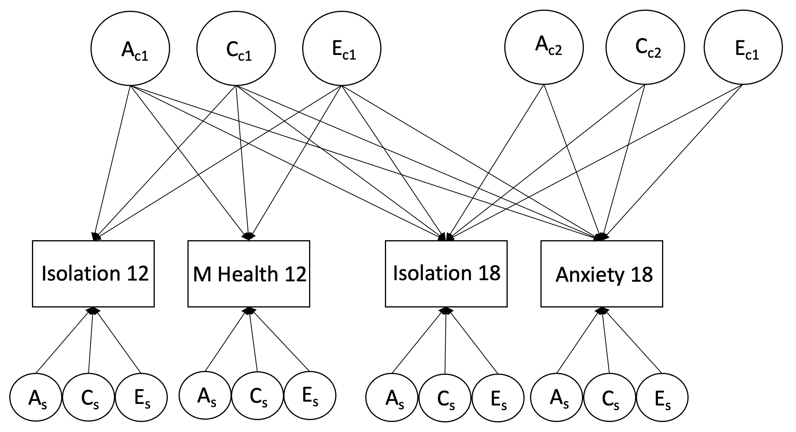

```{r setup, include=FALSE}
knitr::opts_chunk$set(echo = TRUE,
                      comment = NA,
                      prompt = FALSE,
                      cache = FALSE,
                      message = FALSE,
                      warning = FALSE,
                      results = 'markup')

options(bitmapType = 'quartz') # to render fonts better
```

```{r Clear global environment, include=FALSE}
remove(list = ls())
```

```{r Load packages, include=FALSE}
library(knitr)
library(haven)
library(psych) 
library(bestNormalize)
library(OpenMx)
library(tidyr)
library(tidyverse)
library(dplyr) #conflicts with tidyverse for e.g. rename and row_number
```

# Source functions

```{r source functions, include=FALSE}
source("isolation_mhealth_functions.R")
```

# Read in data

```{r source the data file path, include=FALSE}
# source raw data directory
source("../isolation_mentalhealth_data_path.R")
```

```{r read in dta data file, include=FALSE}
dat.raw <- read_dta(paste0(data_path_raw, "Katie_23Sep22.dta"))
colnames(dat.raw)
```


### Column names

```{r select variables needed}
dat <- dat.raw %>%
  dplyr::select(
         atwinid,
         btwinid,
         familyid,
         rorderp5,
         torder,
         zygosity,
         sampsex,
         sisoe12,
         sisoy12,
         masce12,     # anxiety
         mascy12,   
         cdie12,      # depression
         cdiy12,
         conec12,     # antisocial behaviour / conduct disorder
         conyc12,
         psysympe12,  # psychosis - why is this not the tot scale variable - to give more variation?
         psysympy12,
         socisoe18,
         socisoy18,
         gadsxe18,    # anxiety
         gadsxy18,
         mdesxe18,    # depression
         mdesxy18,
         cdsxe18,     # antisocial behaviour / conduct disorder
         cdsxy18,
         psyexpe18,   # psychotic experiences
         psyexpy18
  )

colnames(dat)
```

### Recode variables into factors {.tabset .tabset-fade}

#### Sex

```{r recode sex}
dat <- dat %>%
  mutate(
    sex = 
      recode_factor(as_factor(sampsex),
        "1" = "Male",
        "2" = "Female"))

table(dat$sex)
```

#### Zygosity

```{r recode zygosity}
dat <- dat %>%
  mutate(
    zygosity = 
      recode_factor(as_factor(zygosity),
        "1" = "MZ",
        "2" = "DZ"))
table(dat$zygosity)
```

### Convert variables to numeric

```{r create numeric isolation variables}
dat <- dat %>%
  mutate(
    sisoe12 = as.numeric(sisoe12),
    sisoy12 = as.numeric(sisoy12),
    masce12 = as.numeric(masce12),       # anxiety
    mascy12 = as.numeric(mascy12),   
    cdie12 = as.numeric(cdie12),         # depression
    cdiy12 = as.numeric(cdiy12),
    conec12 = as.numeric(conec12),       # antisocial behaviour / conduct disorder
    conyc12 = as.numeric(conyc12),
    psysympe12 = as.numeric(psysympe12), # psychosis - why is this not the tot scale variable - to give more variation?
    psysympy12 = as.numeric(psysympy12),
    socisoe18 = as.numeric(socisoe18),
    socisoy18 = as.numeric(socisoy18),
    gadsxe18 = as.numeric(gadsxe18),     # anxiety
    gadsxy18 = as.numeric(gadsxy18),
    mdesxe18 = as.numeric(mdesxe18),     # depression
    mdesxy18 = as.numeric(mdesxy18),
    cdsxe18 = as.numeric(cdsxe18),       # antisocial behaviour / conduct disorder
    cdsxy18 = as.numeric(cdsxy18),
    psyexpe18 = as.numeric(psyexpe18),   # psychotic experiences
    psyexpy18 = as.numeric(psyexpy18)
  ) %>%
  select(                                # remove variables not needed
    -c(sampsex)
  )
```

# Variables lists

```{r select variables - raw}
# anxiety
selvars_anxe <- c("sisoe12", "masce12", "socisoe18", "gadsxe18")
selvars_anx <- c("sisoe12", "masce12", "socisoe18", "gadsxe18", 
                 "sisoy12", "mascy12", "socisoy18", "gadsxy18")

# depression
selvars_depe <- c("sisoe12", "cdie12", "socisoe18", "mdesxe18")
selvars_dep <- c("sisoe12", "cdie12", "socisoe18", "mdesxe18", 
                 "sisoy12", "cdiy12", "socisoy18", "mdesxy18")

# conduct
selvars_cone <- c("sisoe12", "conec12", "socisoe18", "cdsxe18")
selvars_con <- c("sisoe12", "conec12", "socisoe18", "cdsxe18", 
                 "sisoy12", "conyc12", "socisoy18", "cdsxy18")

# psychosis
selvars_psye <- c("sisoe12", "psysympe12", "socisoe18", "psyexpe18")
selvars_psy <- c("sisoe12", "psysympe12", "socisoe18", "psyexpe18",
                 "sisoy12", "psysympy12", "socisoy18", "psyexpy18")

# all 
selvars_anx_dep <- c("sisoe12", "masce12", "cdie12", "socisoe18", "gadsxe18", "mdesxe18",
                     "sisoy12", "mascy12", "cdiy12", "socisoy18", "gadsxy18", "mdesxy18")

selvars_dep_con <- c("sisoe12", "cdie12", "conec12", "socisoe18", "mdesxe18", "cdsxe18",
                     "sisoy12", "cdiy12", "conyc12", "socisoy18", "mdesxy18", "cdsxy18")

selvars <- c("sisoe12", "masce12", "cdie12", "conec12", "psysympe12", "socisoe18", "gadsxe18", "mdesxe18", "cdsxe18", "psyexpe18",
             "sisoy12", "mascy12", "cdiy12", "conyc12", "psysympy12", "socisoy18", "gadsxy18", "mdesxy18", "cdsxy18", "psyexpy18")
```

```{r select variables - normalised}
# anxiety
selvars_anxe_norm <- c("sisoe12norm", "masce12norm", "socisoe18norm", "gadsxe18norm")
selvars_anx_norm <- c("sisoe12norm", "masce12norm", "socisoe18norm", "gadsxe18norm", 
                 "sisoy12norm", "mascy12norm", "socisoy18norm", "gadsxy18norm")
selvars_anx_norm_switch <- c("masce12norm", "sisoe12norm", "gadsxe18norm", "socisoe18norm", 
                 "mascy12norm", "sisoy12norm", "gadsxy18norm", "socisoy18norm")

# depression
selvars_depe_norm <- c("sisoe12norm", "cdie12norm", "socisoe18norm", "mdesxe18norm")
selvars_dep_norm <- c("sisoe12norm", "cdie12norm", "socisoe18norm", "mdesxe18norm", 
                 "sisoy12norm", "cdiy12norm", "socisoy18norm", "mdesxy18norm")

# conduct
selvars_cone_norm <- c("sisoe12norm", "conec12norm", "socisoe18norm", "cdsxe18norm")
selvars_con_norm <- c("sisoe12norm", "conec12norm", "socisoe18norm", "cdsxe18norm", 
                 "sisoy12norm", "conyc12norm", "socisoy18norm", "cdsxy18norm")

# psychosis
selvars_psye_norm <- c("sisoe12norm", "psysympe12norm", "socisoe18norm", "psyexpe18norm")
selvars_psy_norm <- c("sisoe12norm", "psysympe12norm", "socisoe18norm", "psyexpe18norm",
                 "sisoy12norm", "psysympy12norm", "socisoy18norm", "psyexpy18norm")

# all 
selvars_anx_dep_norm <- c("sisoe12norm", "masce12norm", "cdie12norm", "socisoe18norm", "gadsxe18norm", "mdesxe18norm",
                          "sisoy12norm", "mascy12norm", "cdiy12norm", "socisoy18norm", "gadsxy18norm", "mdesxy18norm")

selvars_dep_con_norm <- c("sisoe12norm", "cdie12norm", "conec12norm", "socisoe18norm", "mdesxe18norm", "cdsxe18norm",
                          "sisoy12norm", "cdiy12norm", "conyc12norm", "socisoy18norm", "mdesxy18norm", "cdsxy18norm")

selvars_norm <- c("sisoe12norm", "masce12norm", "cdie12norm", "conec12norm", "psysympe12norm", "socisoe18norm", "gadsxe18norm", "mdesxe18norm", "cdsxe18norm", "psyexpe18norm",
             "sisoy12norm", "mascy12norm", "cdiy12norm", "conyc12norm", "psysympy12norm", "socisoy18norm", "gadsxy18norm", "mdesxy18norm", "cdsxy18norm", "psyexpy18norm")

# all with non-normalised - not in the twin modelling specific order here only used to standardise all variables at once
selvars_norm_all <- c("sisoe12", "sisoy12", "masce12", "mascy12", "cdie12", "cdiy12", "conec12", "conyc12", "psysympe12", "psysympy12", 
                      "socisoe18", "socisoy18", "gadsxe18", "gadsxy18", "mdesxe18", "mdesxy18", "cdsxe18", "cdsxy18", "psyexpe18", "psyexpy18",
                      "sisoe12norm", "sisoy12norm", "masce12norm", "mascy12norm", "cdie12norm", "cdiy12norm", "conec12norm", "conyc12norm", "psysympe12norm", "psysympy12norm", 
                      "socisoe18norm", "socisoy18norm", "gadsxe18norm", "gadsxy18norm", "mdesxe18norm", "mdesxy18norm", "cdsxe18norm", "cdsxy18norm", "psyexpe18norm", "psyexpy18norm")
```

```{r select variables - standardised}
# anxiety
selvars_anxe_z_score <- c("z_score_sisoe12", "z_score_masce12", "z_score_socisoe18", "z_score_gadsxe18")
selvars_anx_z_score <- c("z_score_sisoe12", "z_score_masce12", "z_score_socisoe18", "z_score_gadsxe18", 
                 "z_score_sisoy12", "z_score_mascy12", "z_score_socisoy18", "z_score_gadsxy18")

# depression
selvars_depe_z_score <- c("z_score_sisoe12", "z_score_cdie12", "z_score_socisoe18", "z_score_mdesxe18")
selvars_dep_z_score <- c("z_score_sisoe12", "z_score_cdie12", "z_score_socisoe18", "z_score_mdesxe18", 
                 "z_score_sisoy12", "z_score_cdiy12", "z_score_socisoy18", "z_score_mdesxy18")

# conduct
selvars_cone_z_score <- c("z_score_sisoe12", "z_score_conec12", "z_score_socisoe18", "z_score_cdsxe18")
selvars_con_z_score <- c("z_score_sisoe12", "z_score_conec12", "z_score_socisoe18", "z_score_cdsxe18", 
                 "z_score_sisoy12", "z_score_conyc12", "z_score_socisoy18", "z_score_cdsxy18")

# psychosis
selvars_psye_z_score <- c("z_score_sisoe12", "z_score_psysympe12", "z_score_socisoe18", "z_score_psyexpe18")
selvars_psy_z_score <- c("z_score_sisoe12", "z_score_psysympe12", "z_score_socisoe18", "z_score_psyexpe18",
                 "z_score_sisoy12", "z_score_psysympy12", "z_score_socisoy18", "z_score_psyexpy18")

# all 
selvars_z_score <- c("z_score_sisoe12", "z_score_masce12", "z_score_cdie12", "z_score_conec12", "z_score_psysympe12", "z_score_socisoe18", "z_score_gadsxe18", "z_score_mdesxe18", "z_score_cdsxe18", "z_score_psyexpe18",
             "z_score_sisoy12", "z_score_mascy12", "z_score_cdiy12", "z_score_conyc12", "z_score_psysympy12", "z_score_socisoy18", "z_score_gadsxy18", "z_score_mdesxy18", "z_score_cdsxy18", "z_score_psyexpy18")
```

```{r select variables - normalised then standardised}
# anxiety
selvars_anxe_norm_z_score <- c("z_score_sisoe12_norm", "z_score_masce12_norm", "z_score_socisoe18_norm", "z_score_gadsxe18_norm")
selvars_anx_norm_z_score <- c("z_score_sisoe12_norm", "z_score_masce12_norm", "z_score_socisoe18_norm", "z_score_gadsxe18_norm", 
                 "z_score_sisoy12_norm", "z_score_mascy12_norm", "z_score_socisoy18_norm", "z_score_gadsxy18_norm")

# depression
selvars_depe_norm_z_score <- c("z_score_sisoe12_norm", "z_score_cdie12_norm", "z_score_socisoe18_norm", "z_score_mdesxe18_norm")
selvars_dep_norm_z_score <- c("z_score_sisoe12_norm", "z_score_cdie12_norm", "z_score_socisoe18_norm", "z_score_mdesxe18_norm", 
                 "z_score_sisoy12_norm", "z_score_cdiy12_norm", "z_score_socisoy18_norm", "z_score_mdesxy18_norm")

# conduct
selvars_cone_norm_z_score <- c("z_score_sisoe12_norm", "z_score_conec12_norm", "z_score_socisoe18_norm", "z_score_cdsxe18_norm")
selvars_con_norm_z_score <- c("z_score_sisoe12_norm", "z_score_conec12_norm", "z_score_socisoe18_norm", "z_score_cdsxe18_norm", 
                 "z_score_sisoy12_norm", "z_score_conyc12_norm", "z_score_socisoy18_norm", "z_score_cdsxy18_norm")

# psychosis
selvars_psye_norm_z_score <- c("z_score_sisoe12_norm", "z_score_psysympe12_norm", "z_score_socisoe18_norm", "z_score_psyexpe18_norm")
selvars_psy_norm_z_score <- c("z_score_sisoe12_norm", "z_score_psysympe12_norm", "z_score_socisoe18_norm", "z_score_psyexpe18_norm",
                 "z_score_sisoy12_norm", "z_score_psysympy12_norm", "z_score_socisoy18_norm", "z_score_psyexpy18_norm")

# all 
selvars_norm_z_score <- c("z_score_sisoe12_norm", "z_score_masce12_norm", "z_score_cdie12_norm", "z_score_conec12_norm", "z_score_psysympe12_norm", "z_score_socisoe18_norm", "z_score_gadsxe18_norm", "z_score_mdesxe18_norm", "z_score_cdsxe18_norm", "z_score_psyexpe18_norm",
             "z_score_sisoy12_norm", "z_score_mascy12_norm", "z_score_cdiy12_norm", "z_score_conyc12_norm", "z_score_psysympy12_norm", "z_score_socisoy18_norm", "z_score_gadsxy18_norm", "z_score_mdesxy18_norm", "z_score_cdsxy18_norm", "z_score_psyexpy18_norm")
```

```{r select variables - normalised and sex regressed}
# anxiety
selvars_anxe_norm_reg <- c("sisoe12norm_reg", "masce12norm_reg", "socisoe18norm_reg", "gadsxe18norm_reg")
selvars_anx_norm_reg <- c("sisoe12norm_reg", "masce12norm_reg", "socisoe18norm_reg", "gadsxe18norm_reg", 
                 "sisoy12norm_reg", "mascy12norm_reg", "socisoy18norm_reg", "gadsxy18norm_reg")
selvars_anx_norm_reg_switch <- c("masce12norm_reg", "sisoe12norm_reg", "gadsxe18norm_reg", "socisoe18norm_reg", 
                 "mascy12norm_reg", "sisoy12norm_reg", "gadsxy18norm_reg", "socisoy18norm_reg")

# depression
selvars_depe_norm_reg <- c("sisoe12norm_reg", "cdie12norm_reg", "socisoe18norm_reg", "mdesxe18norm_reg")
selvars_dep_norm_reg <- c("sisoe12norm_reg", "cdie12norm_reg", "socisoe18norm_reg", "mdesxe18norm_reg", 
                 "sisoy12norm_reg", "cdiy12norm_reg", "socisoy18norm_reg", "mdesxy18norm_reg")

# conduct
selvars_cone_norm_reg <- c("sisoe12norm_reg", "conec12norm_reg", "socisoe18norm_reg", "cdsxe18norm_reg")
selvars_con_norm_reg <- c("sisoe12norm_reg", "conec12norm_reg", "socisoe18norm_reg", "cdsxe18norm_reg", 
                 "sisoy12norm_reg", "conyc12norm_reg", "socisoy18norm_reg", "cdsxy18norm_reg")

# psychosis
selvars_psye_norm_reg <- c("sisoe12norm_reg", "psysympe12norm_reg", "socisoe18norm_reg", "psyexpe18norm_reg")
selvars_psy_norm_reg <- c("sisoe12norm_reg", "psysympe12norm_reg", "socisoe18norm_reg", "psyexpe18norm_reg",
                 "sisoy12norm_reg", "psysympy12norm_reg", "socisoy18norm_reg", "psyexpy18norm_reg")

# all 
selvars_anx_dep_norm_reg <- c("sisoe12norm_reg", "masce12norm_reg", "cdie12norm_reg", 
                              "socisoe18norm_reg", "gadsxe18norm_reg", "mdesxe18norm_reg",
                              "sisoy12norm_reg", "mascy12norm_reg", "cdiy12norm_reg", 
                              "socisoy18norm_reg", "gadsxy18norm_reg", "mdesxy18norm_reg")

selvars_dep_con_norm_reg <- c("sisoe12norm_reg", "cdie12norm_reg", "conec12norm_reg", "socisoe18norm_reg", "mdesxe18norm_reg", "cdsxe18norm_reg",
                          "sisoy12norm_reg", "cdiy12norm_reg", "conyc12norm_reg", "socisoy18norm_reg", "mdesxy18norm_reg", "cdsxy18norm_reg")

selvars_nopsy_norm_reg <- c("sisoe12norm_reg", "masce12norm_reg", "cdie12norm_reg", "conec12norm_reg",
                            "socisoe18norm_reg", "gadsxe18norm_reg", "mdesxe18norm_reg", "cdsxe18norm_reg",
                            "sisoy12norm_reg", "mascy12norm_reg", "cdiy12norm_reg", "conyc12norm_reg",
                            "socisoy18norm_reg", "gadsxy18norm_reg", "mdesxy18norm_reg", "cdsxy18norm_reg")

selvars_noanx_norm_reg <- c("sisoe12norm_reg", "cdie12norm_reg", "conec12norm_reg", "psysympe12norm_reg", 
                      "socisoe18norm_reg",  "mdesxe18norm_reg", "cdsxe18norm_reg", "psyexpe18norm_reg",
                      "sisoy12norm_reg",  "cdiy12norm_reg", "conyc12norm_reg", "psysympy12norm_reg",
                      "socisoy18norm_reg", "mdesxy18norm_reg", "cdsxy18norm_reg", "psyexpy18norm_reg")

selvars_norm_reg <- c("sisoe12norm_reg", "masce12norm_reg", "cdie12norm_reg", "conec12norm_reg", "psysympe12norm_reg", 
                      "socisoe18norm_reg", "gadsxe18norm_reg", "mdesxe18norm_reg", "cdsxe18norm_reg", "psyexpe18norm_reg",
                      "sisoy12norm_reg", "mascy12norm_reg", "cdiy12norm_reg", "conyc12norm_reg", "psysympy12norm_reg",
                      "socisoy18norm_reg", "gadsxy18norm_reg", "mdesxy18norm_reg", "cdsxy18norm_reg", "psyexpy18norm_reg")

# all with non-norm_regalised - not in the twin modelling specific order here only used to standardise all variables at once
selvars_norm_reg_all <- c("sisoe12", "sisoy12", "masce12", "mascy12", "cdie12", "cdiy12", "conec12", "conyc12", "psysympe12", "psysympy12", 
                      "socisoe18", "socisoy18", "gadsxe18", "gadsxy18", "mdesxe18", "mdesxy18", "cdsxe18", "cdsxy18", "psyexpe18", "psyexpy18",
                      "sisoe12norm_reg", "sisoy12norm_reg", "masce12norm_reg", "mascy12norm_reg", "cdie12norm_reg", "cdiy12norm_reg", "conec12norm_reg", "conyc12norm_reg", "psysympe12norm_reg", "psysympy12norm_reg", 
                      "socisoe18norm_reg", "socisoy18norm_reg", "gadsxe18norm_reg", "gadsxy18norm_reg", "mdesxe18norm_reg", "mdesxy18norm_reg", "cdsxe18norm_reg", "cdsxy18norm_reg", "psyexpe18norm_reg", "psyexpy18norm_reg")
```

# Data prep

## Skewness

```{r histograms}
# isolation
hist(dat$sisoe12)    # not normal
hist(dat$socisoe18)  # not normal
# anxiety
hist(dat$masce12)    # normal
hist(dat$gadsxe18)   # not normal
# depression
hist(dat$cdie12)     # not normal
hist(dat$mdesxe18)   # not normal
# conduct
hist(dat$conec12)    # not normal
hist(dat$cdsxe18)    # not normal
# psychosis
hist(dat$psysympe12) # not normal
hist(dat$psyexpe18)  # not normal
```

## Rank transformation

Almost all variables are non-normal. We will use the van der Waerden's rank-based transformation as used in [Rimfeld et al 2021](https://acamh.onlinelibrary.wiley.com/doi/full/10.1002/jcv2.12053). For analyses using transformed data, they conducted the van der Waerden transformation prior to residualizing for age and sex as recommended by [Pain et al. 2018](https://www.nature.com/articles/s41431-018-0159-6).  

I will transform all variables to get the normalised estimate.

```{r rank transform variables elder variables}
# isolation age 12
sisoe12_n <- bestNormalize(dat$sisoe12)    # select the type of transformation needed
dat$sisoe12norm <- predict(sisoe12_n)      # create normalised variable
hist(dat$sisoe12norm)                  
summary(dat$sisoe12norm)

# isolation age 18
socisoe18_n <- bestNormalize(dat$socisoe18)    
dat$socisoe18norm <- predict(socisoe18_n)  
hist(dat$socisoe18norm)                  
summary(dat$socisoe18norm)

# anxiety age 12 - wont actually use this as it's already normally distributed
masce12_n <- bestNormalize(dat$masce12)    
dat$masce12norm <- predict(masce12_n)  
hist(dat$masce12norm)                  
summary(dat$masce12norm)

# anxiety age 18
gadsxe18_n <- bestNormalize(dat$gadsxe18)    
dat$gadsxe18norm <- predict(gadsxe18_n)  
hist(dat$gadsxe18norm)                  
summary(dat$gadsxe18norm)

# depression age 12
cdie12_n <- bestNormalize(dat$cdie12)    
dat$cdie12norm <- predict(cdie12_n)  
hist(dat$cdie12norm)                  
summary(dat$cdie12norm)

# depression age 18
mdesxe18_n <- bestNormalize(dat$mdesxe18)    
dat$mdesxe18norm <- predict(mdesxe18_n)  
hist(dat$mdesxe18norm)                  
summary(dat$mdesxe18norm)

# conduct age 12
conec12_n <- bestNormalize(dat$conec12)    
dat$conec12norm <- predict(conec12_n)  
hist(dat$conec12norm)                  
summary(dat$conec12norm)

# conduct age 18
cdsxe18_n <- bestNormalize(dat$cdsxe18)    
dat$cdsxe18norm <- predict(cdsxe18_n)  
hist(dat$cdsxe18norm)                  
summary(dat$cdsxe18norm)

# psychosis age 12
psysympe12_n <- bestNormalize(dat$psysympe12)    
dat$psysympe12norm <- predict(psysympe12_n)  
hist(dat$psysympe12norm)                  
summary(dat$psysympe12norm)

# psychosis age 18
psyexpe18_n <- bestNormalize(dat$psyexpe18)    
dat$psyexpe18norm <- predict(psyexpe18_n)  
hist(dat$psyexpe18norm)                  
summary(dat$psyexpe18norm)
```

```{r rank transform variables younger variables}
# isolation age 12
sisoy12_n <- bestNormalize(dat$sisoy12)    # select the type of transformation needed
dat$sisoy12norm <- predict(sisoy12_n)  # create normalised variable
hist(dat$sisoy12norm)                  
summary(dat$sisoy12norm)

# isolation age 18
socisoy18_n <- bestNormalize(dat$socisoy18)    
dat$socisoy18norm <- predict(socisoy18_n)  
hist(dat$socisoy18norm)                  
summary(dat$socisoy18norm)

# anxiety age 12 - wont actually use this as it's already normally distributed
mascy12_n <- bestNormalize(dat$mascy12)    
dat$mascy12norm <- predict(mascy12_n)  
hist(dat$mascy12norm)                  
summary(dat$mascy12norm)

# anxiety age 18
gadsxy18_n <- bestNormalize(dat$gadsxy18)    
dat$gadsxy18norm <- predict(gadsxy18_n)  
hist(dat$gadsxy18norm)                  
summary(dat$gadsxy18norm)

# depression age 12
cdiy12_n <- bestNormalize(dat$cdiy12)    
dat$cdiy12norm <- predict(cdiy12_n)  
hist(dat$cdiy12norm)                  
summary(dat$cdiy12norm)

# depression age 18
mdesxy18_n <- bestNormalize(dat$mdesxy18)    
dat$mdesxy18norm <- predict(mdesxy18_n)  
hist(dat$mdesxy18norm)                  
summary(dat$mdesxy18norm)

# conduct age 12
conyc12_n <- bestNormalize(dat$conyc12)    
dat$conyc12norm <- predict(conyc12_n)  
hist(dat$conyc12norm)                  
summary(dat$conyc12norm)

# conduct age 18
cdsxy18_n <- bestNormalize(dat$cdsxy18)    
dat$cdsxy18norm <- predict(cdsxy18_n)  
hist(dat$cdsxy18norm)                  
summary(dat$cdsxy18norm)

# psychosis age 12
psysympy12_n <- bestNormalize(dat$psysympy12)    
dat$psysympy12norm <- predict(psysympy12_n)  
hist(dat$psysympy12norm)                  
summary(dat$psysympy12norm)

# psychosis age 18
psyexpy18_n <- bestNormalize(dat$psyexpy18)    
dat$psyexpy18norm <- predict(psyexpy18_n)  
hist(dat$psyexpy18norm)                  
summary(dat$psyexpy18norm)
```

## Regress out sex

We first normalised the twin variables, then regress out sex. We don't regress out age here as all twins were measured as close to thir birthday as possible. 

```{r Regress out age and sex}
# twin 1 - elder
## isolation
dat$sisoe12norm_reg <- (resid(lm(data = dat, sisoe12norm ~ sex, na.action = na.exclude))) 
dat$socisoe18norm_reg <- (resid(lm(data = dat, socisoe18norm ~ sex, na.action = na.exclude)))
## anxiety
dat$masce12norm_reg <- (resid(lm(data = dat, masce12norm ~ sex, na.action = na.exclude)))
dat$gadsxe18norm_reg <- (resid(lm(data = dat, gadsxe18norm ~ sex, na.action = na.exclude)))
## depression
dat$cdie12norm_reg <- (resid(lm(data = dat, cdie12norm ~ sex, na.action = na.exclude)))
dat$mdesxe18norm_reg <- (resid(lm(data = dat, mdesxe18norm ~ sex, na.action = na.exclude)))
## conduct
dat$conec12norm_reg <- (resid(lm(data = dat, conec12norm ~ sex, na.action = na.exclude)))
dat$cdsxe18norm_reg <- (resid(lm(data = dat, cdsxe18norm ~ sex, na.action = na.exclude)))
## psychosis
dat$psysympe12norm_reg <- (resid(lm(data = dat, psysympe12norm ~ sex, na.action = na.exclude)))
dat$psyexpe18norm_reg <- (resid(lm(data = dat, psyexpe18norm ~ sex, na.action = na.exclude)))

# twin 2 - younger
## isolation
dat$sisoy12norm_reg <- (resid(lm(data = dat, sisoy12norm ~ sex, na.action = na.exclude))) 
dat$socisoy18norm_reg <- (resid(lm(data = dat, socisoy18norm ~ sex, na.action = na.exclude)))
## anxiety
dat$mascy12norm_reg <- (resid(lm(data = dat, mascy12norm ~ sex, na.action = na.exclude)))
dat$gadsxy18norm_reg <- (resid(lm(data = dat, gadsxy18norm ~ sex, na.action = na.exclude)))
## depression
dat$cdiy12norm_reg <- (resid(lm(data = dat, cdiy12norm ~ sex, na.action = na.exclude)))
dat$mdesxy18norm_reg <- (resid(lm(data = dat, mdesxy18norm ~ sex, na.action = na.exclude)))
## conduct
dat$conyc12norm_reg <- (resid(lm(data = dat, conyc12norm ~ sex, na.action = na.exclude)))
dat$cdsxy18norm_reg <- (resid(lm(data = dat, cdsxy18norm ~ sex, na.action = na.exclude)))
## psychosis
dat$psysympy12norm_reg <- (resid(lm(data = dat, psysympy12norm ~ sex, na.action = na.exclude)))
dat$psyexpy18norm_reg <- (resid(lm(data = dat, psyexpy18norm ~ sex, na.action = na.exclude)))
```

## Standardising

Standardised variables have been computed in case there are problems with different measures. The standardised estimates should be identical to the non-standardised. 

Create *z scores* for all variables. 

```{r scale variables and combine to MZ dataset}
# create a scaled version of the continuous variables - z scores for all variables
scaled_continuous_data <- as.data.frame(scale(dat[selvars_norm_all], center = TRUE, scale = TRUE))

# rename variables to show that they are z scores 
colnames(scaled_continuous_data) <- paste0("z_score_", colnames(scaled_continuous_data))

# combine the scaled data to the main dataset for  and DZ twins
dat <- cbind(dat, scaled_continuous_data)

colnames(dat)
```

## Create twin dataset

To remove the double entry in the data, we will remove everyone who has a "random twin order" variable of 0. This will then remove any birth order effects. 

```{r remove one twin pair row}
dat.twin <- dat %>% filter(rorderp5 == "1")
```

```{r datasets for MZ and DZ}
dat.twin.MZ <- dat.twin %>% filter(zygosity == "MZ")
dat.twin.DZ <- dat.twin %>% filter(zygosity == "DZ")

# male only
dat.twin.MZm <- dat.twin.MZ %>% filter(sex == "Male")
dat.twin.DZm <- dat.twin.DZ %>% filter(sex == "Male")
# female only
dat.twin.MZf <- dat.twin.MZ %>% filter(sex == "Female")
dat.twin.DZf <- dat.twin.DZ %>% filter(sex == "Female")
```

## Summary of MZ and DZ data

### Overall

```{r describe MZ and DZ data}
MZ_summary <- describe(dat.twin.MZ, 
                       skew = FALSE, 
                       range = FALSE)

DZ_summary <- describe(dat.twin.DZ, 
                       skew = FALSE, 
                       range = FALSE)
```

### Correlation matrices

```{r pheno correlations}
cor(dat[, selvars_anxe], use = "complete")
cor(dat[, selvars_depe], use = "complete")
cor(dat[, selvars_cone], use = "complete")
cor(dat[, selvars_psye], use = "complete")

round(cor(dat[, selvars_anxe_norm], use = "complete"),3)
round(cor(dat[, selvars_depe_norm], use = "complete"),3)
round(cor(dat[, selvars_cone_norm], use = "complete"),3)
round(cor(dat[, selvars_psye_norm], use = "complete"),3)
```

#### MZ

```{r MZ matrices}
# covariance matrix
covar.mz <- cov(dat.twin.MZ[, selvars], use = "complete")
# correlation matrix (standardized covariance)
cor.mz <- cor(dat.twin.MZ[, selvars], use = "complete")
# round(cor.mz, 3)
```

#### DZ

```{r DZ matrices}
# covariance matrix
covar.dz <- cov(dat.twin.DZ[, selvars], use = "complete")
# correlation matrix (standardized covariance)
cor.dz <- cor(dat.twin.DZ[, selvars], use = "complete")
# round(cor.dz, 3)
```


****

# Independent pathway model (IPM)

This code is adapted from [Waszczuk et al 2021](https://link.springer.com/article/10.1007/s00787-020-01515-6) using a 2A, 2C, and 2E factor independent pathway model.

This model has two common ACE factors that span two time points, as well as specific factors that are spcific for each variable no matter the time point.



Decisions to make for our analyses:

* Waszczuk (2021) stated there were scalar (variance) sex differences in all variables except self-report time 1 depression, and time 2 self-report hyperactivity and parent-report conduct - scalar models were fitted to account for these differences. **We need to decide if this is something we need to do.** Does this mean she looked at sex hertogenity models in the univariate twin models? **I need to run sex twin models to ses if this is something that we need to do**
* At the moment, for each IPM there is one model with no sex differences, and another with deparate means for males and females. **We need to decide if this is the right approach and if we need to do anything else to account for sex differences.**
* Waszczuk (2021) conducted separate IPMs for each reporter (in her case self/parent). **Do we need to run separate models for childhood isoaltion as our reporters differ too?**

Notes on commands used in Waszczuk (2021):

* The `Scalar` correction is `TRUE` only for the variables that need sex correction. In our case this would be all variables apart from social isolation at age 12. **This is only based on linear regressions, rather than estimating sex differences in OpenMx**. 
* mxBounds() creates bounds for the objects, but I'm not entirely sure what these are??

TO DO NEXT:

  + Interpret the output of this model - are there negative variances?? Do the h2, c2, e2 line up with the univariate ACE models? Do the overlap estimates look weird? 
  + Look at how to test for sex differences officially through univariate twin models
  + Can we run an "all-encompassing" model with he 4 constructs at 12 then 18? 
  + Run one IPM for age 12 and one for age 18
  + Think about running this separately based on social isolation 12 reporter - the other constructs are self report?? 

## Number of variables and start values 

```{r number of variables (phenotypes)}
# number of variables
nv <- 4    					      # number of variables - 2 at age 12 and 2 at age 18
ntv <- nv*2 				      # number of twin variables
nlower <- nv*(nv+1)/2 		# number of free elements in an nv*nv lower matrix 

# number of factors A (common)
nfAc <- 2 # change dimension of A factor matrix Ac to have *2* common factors

# default optimiser 
mxOption(NULL, "Default optimizer", "CSOLNP") # change to NPSOL and see?
```

* For `Ac2Free`, we want to indicate `TRUE` for the first 4 variables (all variables), then for the **second** A factor, we want this to be only for the second set of 2 variables (at age 18), so for this we want the first two variables (age 12) set to `FALSE`. 
* Similarly, we then want to set the second common start values to be 0 using `Ac2Values`. 

```{r start values - think about renaming these to be consistent with start values for Cholesky}
# Set if the parameters are estimated (TRUE) or not (FALSE) 
Ac2Free   <- c(rep(TRUE, nv), rep(FALSE, nv/2), rep(TRUE, nv/2))  

# Create start values for 2 common ACE Factors - set the start values for common 
Ac2Values <- c(rep(.1, nv),  rep(0, nv/2), rep(.1, nv/2))  
Cc2Values <- c(rep(.1, nv),  rep(0, nv/2), rep(.1, nv/2))
Ec2Values <- c(rep(.1, nv),  rep(0, nv/2), rep(.1, nv/2))

set.seed(2468)
```

# Anxiety

**Select which variable list to use: raw, standardised, normalised, standardised and normalised, normalised and sex regressed**

```{r select which variables to use}
# selvars_anx_chosen <- selvars_anx                 # raw
# selvars_anx_chosen <- selvars_anx_z_score         # standardised
# selvars_anx_chosen <- selvars_anx_norm            # normalised
# selvars_anx_chosen <- selvars_anx_z_score_norm    # standardised and normalised
 selvars_anx_chosen <- selvars_anx_norm_reg         # normalised
```

## No sex differences

### ACE

#### Specify

```{r ACE model for anxiety}
IPM_anxiety <- mxModel("IPM_anxiety",
	mxModel("ACE",
    # Common ace paths
    mxMatrix("Full", nrow = nv, ncol = nfAc, free = Ac2Free, values = Ac2Values, name = "ac"),
    mxMatrix("Full", nrow = nv, ncol = nfAc, free = Ac2Free, values = Cc2Values, name = "cc"),
    mxMatrix("Full", nrow = nv, ncol = nfAc, free = Ac2Free, values = Ec2Values, name = "ec"),
    		
    # Specific ace paths
    mxMatrix("Diag", nrow = nv, ncol = nv, free = TRUE, values = 0.6,  name = "as"),
    mxMatrix("Diag", nrow = nv, ncol = nv, free = TRUE, values = 0.01, name = "cs"),
    mxMatrix("Diag", nrow = nv, ncol = nv, free = TRUE, values = 0.6,  name = "es"),
		
		# ACE variance components
    mxAlgebra(ac %*% t(ac) + as %*% t(as), name = "A"), 
    mxAlgebra(cc %*% t(cc) + cs %*% t(cs), name = "C"),
    mxAlgebra(ec %*% t(ec) + es %*% t(es), name = "E"),
    mxAlgebra(A + C + E, name = "V"),
		
		# Calculate standard deviation for standardization
    mxMatrix("Iden", nrow = nv, ncol = nv, name = "I"),
    mxAlgebra(solve(sqrt(I*V)), name = "iSD"), # extracting the variances from the diagonal of the covariance matrix V 
		
		# Expected means vector - one grand mean
    mxMatrix("Full", nrow = 1, ncol = ntv, free = TRUE, values = 0.01, name = "expMean"), 

    # Genetic and environmental correlations (correlated factor solution)
    mxAlgebra(solve(sqrt(I*V)) %&% V, name = "Rph"),
    mxAlgebra(solve(sqrt(I*A)) %&% A, name = "Ra"),
    mxAlgebra(solve(sqrt(I*C)) %&% C, name = "Rc"),
    mxAlgebra(solve(sqrt(I*E)) %&% E, name = "Re"),

    # Standardised components of variance
    mxAlgebra(A/V, name = "h2"),
    mxAlgebra(C/V, name = "c2"),
    mxAlgebra(E/V, name = "e2"),
    
    # Standardise common parameters (unsquared)
    mxAlgebra(iSD %*% ac, name = "stac"),
    mxAlgebra(iSD %*% cc, name = "stcc"),
    mxAlgebra(iSD %*% ec, name = "stec"),
    
    # Standardise common parameters (Squared)
    mxAlgebra(stac*stac, name = "stac2"),
    mxAlgebra(stcc*stcc, name = "stcc2"),
    mxAlgebra(stec*stec, name = "stec2"),
    
    # Standardise specific parameters (unsquared)
    mxAlgebra(iSD %*% as, name = "stas"),
    mxAlgebra(iSD %*% cs, name = "stcs"),
    mxAlgebra(iSD %*% es, name = "stes"),
    
    # Standardise specific parameters (Squared)
    mxAlgebra(stas*stas, name = "stas2"),
    mxAlgebra(stcs*stcs, name = "stcs2"),
    mxAlgebra(stes*stes, name = "stes2"),	
	
		# MZ expected covariance matrix
		mxAlgebra(rbind(cbind(A+C+E, A+C), cbind(A+C, A+C+E)), name = "expCovMZ"),
		
		# DZ expected covariance matrix
		mxAlgebra(rbind(cbind(A+C+E, (0.5%x%A)+C), cbind((0.5%x%A)+C, A+C+E)), name = "expCovDZ")
		
	),
	
	mxModel("MZ",
		mxData(observed = dat.twin.MZ, type = "raw"),
		mxExpectationNormal(covariance = "ACE.expCovMZ", means = "ACE.expMean", dimnames = selvars_anx_chosen),
		mxFitFunctionML()
	),
	mxModel("DZ",
		mxData(observed = dat.twin.DZ, type = "raw"),
		mxExpectationNormal(covariance = "ACE.expCovDZ", means = "ACE.expMean", dimnames = selvars_anx_chosen),
		mxFitFunctionML()
	),

	mxAlgebra(MZ.objective + DZ.objective, name = "m2LL"),
	mxFitFunctionAlgebra("m2LL"),
	mxCI(c("ACE.stac2", "ACE.stcc2", "ACE.stec2", "ACE.stas2", "ACE.stcs2", "ACE.stes2", "ACE.Rph", "ACE.h2"))
)
```

```{r run ACE model for anxiety}
IPM_anxiety_fit <- mxTryHard(IPM_anxiety,intervals = TRUE)
IPM_anxiety_fit_sum <- summary(IPM_anxiety_fit, verbose = TRUE)

IPM_anxiety_fit_sum$CI

mxEval(ACE.h2, IPM_anxiety_fit)


```

#### Output

```{r IPM anxiety output ACE}
IPM_esitmates_ACE(data = IPM_anxiety_fit,
                  variable1 = "Isolation12",
                  variable2 = "Anxiety12",
                  variable3 = "Isolation18",
                  variable4 = "Anxiety18",
                  model = "ACE",
                  uniACEestimates = TRUE,
                  pathestimates = TRUE,
                  A_percent = TRUE,
                  C_percent = TRUE,
                  E_percent = TRUE,
                  common_factor_contribution = TRUE)
```


For set.seed(2468) - it produces estimated paths where isolation loads quite evenly on common A1 and gives output of Isolation12_Anxiety12 0.100	0.250	0.650	1 and all add up to 1. 

For set.seed(1234) - it produces estimated paths where isolation 12 loads highly on common A1, and no others do, and gives output of Isolation12_Anxiety12	0.230	0.201	0.569	1 and *not* all add up to 1. 

***

### AE 

#### Specify

```{r fit AE model}
# specify AE IPM
IPM_anxiety_AE <- mxModel(IPM_anxiety, name = "IPM_anxiety_AE",
     mxModel(IPM_anxiety_fit$ACE,
     mxMatrix("Full", nrow = nv, ncol = nfAc, free = FALSE, values = 0, name = "cc"),
     mxMatrix("Diag", nrow = nv, ncol = nv, free = FALSE, values = 0, name = "cs")   # drop C at 0
    )
)

# run AE IPM
IPM_anxiety_AE_fit <- mxTryHard(IPM_anxiety_AE, intervals = TRUE)

# compare ACE and AE
mxCompare(IPM_anxiety_fit, IPM_anxiety_AE_fit)
```

#### Output 

```{r IPM anxiety output AE}
IPM_esitmates_AE(data = IPM_anxiety_AE_fit,
                  variable1 = "Isolation12",
                  variable2 = "Anxiety12",
                  variable3 = "Isolation18",
                  variable4 = "Anxiety18",
                  model = "AE",
                  uniACEestimates = TRUE,
                  pathestimates = TRUE,
                  A_percent = TRUE,
                  E_percent = TRUE,
                  common_factor_contribution = TRUE)
```


**BOTH ACE AND AE MODELS ARE GIVING UNRELIABLE RESULTS HERE - NOT CONSISTENT IN THE SOLUTION FOUND FOR THIS ESTIMATION AND ALSO THE TOTAL % CONTRIBUTION EXCEEDS 1 FOR BOTH.**

## Sex differences

### ACE - separate means

```{r ACE model for anxiety sex}
IPM_anxiety_sexmean <- mxModel("IPM_anxiety_sexmean",
	mxModel("ACE",
    # Common ace paths
    mxMatrix("Full", nrow = nv, ncol = nfAc, free = Ac2Free, values = Ac2Values, name = "ac"),
    mxMatrix("Full", nrow = nv, ncol = nfAc, free = Ac2Free, values = Cc2Values, name = "cc"),
    mxMatrix("Full", nrow = nv, ncol = nfAc, free = Ac2Free, values = Ec2Values, name = "ec"),

    # Specific ace paths
    mxMatrix("Diag", nrow = nv, ncol = nv, free = TRUE, values = 0.6,  name = "as"),
    mxMatrix("Diag", nrow = nv, ncol = nv, free = TRUE, values = 0.01, name = "cs"),
    mxMatrix("Diag", nrow = nv, ncol = nv, free = TRUE, values = 0.6,  name = "es"),

		# ACE variance components
    mxAlgebra(ac %*% t(ac) + as %*% t(as), name = "A"),
    mxAlgebra(cc %*% t(cc) + cs %*% t(cs), name = "C"),
    mxAlgebra(ec %*% t(ec) + es %*% t(es), name = "E"),
    mxAlgebra(A + C + E, name = "V"),

		# Calculate standard deviation for standardization
    mxMatrix("Iden", nrow = nv, ncol = nv, name = "I"),
    mxAlgebra(solve(sqrt(I*V)), name = "iSD"), # extracting the variances from the diagonal of the covariance matrix V

		# Expected means vector
    mxMatrix("Full", nrow = 1, ncol = nv, free = TRUE, values = 0.01, name = "MeanM"), # mean for males
    mxAlgebra(cbind(MeanM, MeanM), name = "expMeanM"),

    mxMatrix("Full", nrow = 1, ncol = nv, free = TRUE, values = 0.01, name = "MeanF"), # mean for females
    mxAlgebra(cbind(MeanF,MeanF), name = "expMeanF"),

    # Genetic and environmental correlations (correlated factor solution)
    mxAlgebra(solve(sqrt(I*V)) %&% V, name = "Rph"),
    mxAlgebra(solve(sqrt(I*A)) %&% A, name = "Ra"),
    mxAlgebra(solve(sqrt(I*C)) %&% C, name = "Rc"),
    mxAlgebra(solve(sqrt(I*E)) %&% E, name = "Re"),

    # Standardised components of variance
    mxAlgebra(A/V, name = "h2"),
    mxAlgebra(C/V, name = "c2"),
    mxAlgebra(E/V, name = "e2"),

    # Standardise common parameters (unsquared)
    mxAlgebra(iSD %*% ac, name = "stac"),
    mxAlgebra(iSD %*% cc, name = "stcc"),
    mxAlgebra(iSD %*% ec, name = "stec"),

    # Standardise common parameters (Squared)
    mxAlgebra(stac*stac, name = "stac2"),
    mxAlgebra(stcc*stcc, name = "stcc2"),
    mxAlgebra(stec*stec, name = "stec2"),

    # Standardise specific parameters (unsquared)
    mxAlgebra(iSD %*% as, name = "stas"),
    mxAlgebra(iSD %*% cs, name = "stcs"),
    mxAlgebra(iSD %*% es, name = "stes"),

    # Standardise specific parameters (Squared)
    mxAlgebra(stas*stas, name = "stas2"),
    mxAlgebra(stcs*stcs, name = "stcs2"),
    mxAlgebra(stes*stes, name = "stes2"),

    # Scalar multiplier 
    mxMatrix("Diag", nrow = ntv, ncol = ntv, free = c( T, F, F, T, 
                                                       T, F, F, T), # TRUE for isolation12 and anxiety 18
             values = 1,
             label  = c("sc1", "sc2", "sc3", "sc4", "sc1", "sc2", "sc3", "sc4"),
             name   = "Scalar"),

    mxBounds(c("sc1", "sc4"), 0, NA), # creates bounds for these objects - not too sure what these are

		# MZ expected covariance matrix
		mxAlgebra(Scalar %&% rbind(cbind(A+C+E, A+C), cbind(A+C, A+C+E)), name = "expCovMZm"), # why is the scalar applied to just males? 
		mxAlgebra(rbind(cbind(A+C+E, A+C), cbind(A+C, A+C+E)), name = "expCovMZf"),

		# DZ expected covariance matrix
		mxAlgebra(Scalar %&% rbind(cbind(A+C+E, (0.5%x%A)+C), cbind((0.5%x%A)+C, A+C+E)), name = "expCovDZm"), # why is the scalar applied to just males? 
		mxAlgebra(rbind(cbind(A+C+E, (0.5%x%A)+C), cbind((0.5%x%A)+C, A+C+E)), name = "expCovDZf")

	),

	mxModel("MZM",
		mxData(observed = dat.twin.MZm, type = "raw"),
		mxExpectationNormal(covariance = "ACE.expCovMZm", means = "ACE.expMeanM", dimnames = selvars_anx_chosen),
		mxFitFunctionML()
	),
	mxModel("MZF",
		mxData(observed = dat.twin.MZf, type = "raw"),
		mxExpectationNormal(covariance = "ACE.expCovMZf", means = "ACE.expMeanF", dimnames = selvars_anx_chosen),
		mxFitFunctionML()
	),
	mxModel("DZM",
		mxData(observed = dat.twin.DZm, type = "raw"),
		mxExpectationNormal(covariance = "ACE.expCovDZm", means = "ACE.expMeanM", dimnames = selvars_anx_chosen),
		mxFitFunctionML()
	),
	mxModel("DZF",
		mxData(observed = dat.twin.DZf, type = "raw"),
		mxExpectationNormal(covariance = "ACE.expCovDZf", means = "ACE.expMeanF", dimnames = selvars_anx_chosen),
		mxFitFunctionML()
	),

	mxAlgebra(MZM.objective + DZM.objective + MZF.objective + DZF.objective, name = "m2LL"),
	mxFitFunctionAlgebra("m2LL"),
	mxCI(c("ACE.stac2",
	       "ACE.stcc2",
	       "ACE.stec2",
	       "ACE.stas2",
	       "ACE.stcs2",
	       "ACE.stes2",
	       "ACE.Rph",
	       "ACE.h2",
	       "ACE.c2",
	       "ACE.e2"))
)
```

```{r run ACE mdoel for anxiety}
IPM_anxiety_sexmean_fit <- mxTryHard(IPM_anxiety_sexmean, intervals = TRUE)
summary(IPM_anxiety_sexmean_fit, verbose = TRUE)
```

```{r IPM anxiety output ACE}
IPM_esitmates_ACE(data = IPM_anxiety_sexmean_fit,
                  variable1 = "Isolation12",
                  variable2 = "Anxiety12",
                  variable3 = "Isolation18",
                  variable4 = "Anxiety18",
                  model = "ACE",
                  uniACEestimates = TRUE,
                  pathestimates = TRUE,
                  A_percent = TRUE,
                  C_percent = TRUE,
                  E_percent = TRUE,
                  common_factor_contribution = TRUE)
```

### ACE - separate path estimates

```{r ACE model for anxiety sex}
IPM_anxiety_sexdif <- mxModel("IPM_anxiety_sexdif",
	mxModel("ACE",
    # Common ace paths
    mxMatrix("Full", nrow = nv, ncol = nfAc, free = Ac2Free, values = Ac2Values, name = "acm"), # male
    mxMatrix("Full", nrow = nv, ncol = nfAc, free = Ac2Free, values = Cc2Values, name = "ccm"),
    mxMatrix("Full", nrow = nv, ncol = nfAc, free = Ac2Free, values = Ec2Values, name = "ecm"),
    mxMatrix("Full", nrow = nv, ncol = nfAc, free = Ac2Free, values = Ac2Values, name = "acf"), # female
    mxMatrix("Full", nrow = nv, ncol = nfAc, free = Ac2Free, values = Cc2Values, name = "ccf"),
    mxMatrix("Full", nrow = nv, ncol = nfAc, free = Ac2Free, values = Ec2Values, name = "ecf"),

    # Specific ace paths
    mxMatrix("Diag", nrow = nv, ncol = nv, free = TRUE, values = 0.6,  name = "asm"),  # male
    mxMatrix("Diag", nrow = nv, ncol = nv, free = TRUE, values = 0.01, name = "csm"),
    mxMatrix("Diag", nrow = nv, ncol = nv, free = TRUE, values = 0.6,  name = "esm"),
    mxMatrix("Diag", nrow = nv, ncol = nv, free = TRUE, values = 0.6,  name = "asf"),  # female
    mxMatrix("Diag", nrow = nv, ncol = nv, free = TRUE, values = 0.01, name = "csf"),
    mxMatrix("Diag", nrow = nv, ncol = nv, free = TRUE, values = 0.6,  name = "esf"),

		# ACE variance components
    mxAlgebra(acm %*% t(acm) + asm %*% t(asm), name = "Am"), # males
    mxAlgebra(ccm %*% t(ccm) + csm %*% t(csm), name = "Cm"),
    mxAlgebra(ecm %*% t(ecm) + esm %*% t(esm), name = "Em"),
    mxAlgebra(Am + Cm + Em, name = "Vm"),
		mxAlgebra(acf %*% t(acf) + asf %*% t(asf), name = "Af"), # females
    mxAlgebra(ccf %*% t(ccf) + csf %*% t(csf), name = "Cf"),
    mxAlgebra(ecf %*% t(ecf) + esf %*% t(esf), name = "Ef"),
    mxAlgebra(Af + Cf + Ef, name = "Vf"),

		# Calculate standard deviation for standardization
    mxMatrix("Iden", nrow = nv, ncol = nv, name = "I"),
    mxAlgebra(solve(sqrt(I*Vm)), name = "iSDm"), # extracting the variances from the diagonal of the covariance matrix V
		mxAlgebra(solve(sqrt(I*Vf)), name = "iSDf"),
		
		# Expected means vector
    mxMatrix("Full", nrow = 1, ncol = nv, free = TRUE, values = 0.01, name = "MeanM"), # males
    mxAlgebra(cbind(MeanM, MeanM), name = "expMeanM"),

    mxMatrix("Full", nrow = 1, ncol = nv, free = TRUE, values = 0.01, name = "MeanF"), # females
    mxAlgebra(cbind(MeanF,MeanF), name = "expMeanF"),

    # Phenotypic correlations
    mxAlgebra(solve(sqrt(I*Vm)) %&% Vm, name = "Rphm"),  # males
		mxAlgebra(solve(sqrt(I*Vf)) %&% Vf, name = "Rphf"),  # females

    # Standardised components of variance
    mxAlgebra(Am/Vm, name = "h2m"),    # males
    mxAlgebra(Cm/Vm, name = "c2m"),
    mxAlgebra(Em/Vm, name = "e2m"),

    mxAlgebra(Af/Vf, name = "h2f"),   # females
    mxAlgebra(Cf/Vf, name = "c2f"),
    mxAlgebra(Ef/Vf, name = "e2f"),

    # Standardise common parameters (unsquared)
    mxAlgebra(iSDm %*% acm, name = "stacm"),  # males
    mxAlgebra(iSDm %*% ccm, name = "stccm"),
    mxAlgebra(iSDm %*% ecm, name = "stecm"),
		
		mxAlgebra(iSDf %*% acf, name = "stacf"),  # females
    mxAlgebra(iSDf %*% ccf, name = "stccf"),
    mxAlgebra(iSDf %*% ecf, name = "stecf"),

    # Standardise common parameters (Squared)
    mxAlgebra(stacm*stacm, name = "stac2m"),  # males
    mxAlgebra(stccm*stccm, name = "stcc2m"),
    mxAlgebra(stecm*stecm, name = "stec2m"),
		
		mxAlgebra(stacf*stacf, name = "stac2f"),  # females
    mxAlgebra(stccf*stccf, name = "stcc2f"),
    mxAlgebra(stecf*stecf, name = "stec2f"),

    # Standardise specific parameters (unsquared)
    mxAlgebra(iSDm %*% asm, name = "stasm"),  # males
    mxAlgebra(iSDm %*% csm, name = "stcsm"),
    mxAlgebra(iSDm %*% esm, name = "stesm"),
		
		mxAlgebra(iSDf %*% asf, name = "stasf"),  # females
    mxAlgebra(iSDf %*% csf, name = "stcsf"),
    mxAlgebra(iSDf %*% esf, name = "stesf"),

    # Standardise specific parameters (Squared)
    mxAlgebra(stasm*stasm, name = "stas2m"),  # males
    mxAlgebra(stcsm*stcsm, name = "stcs2m"),
    mxAlgebra(stesm*stesm, name = "stes2m"),
		
		mxAlgebra(stasf*stasf, name = "stas2f"),  # females
    mxAlgebra(stcsf*stcsf, name = "stcs2f"),
    mxAlgebra(stesf*stesf, name = "stes2f"),

		# MZ expected covariance matrix
		mxAlgebra(rbind(cbind(Am+Cm+Em, Am+Cm), cbind(Am+Cm, Am+Cm+Em)), name = "expCovMZm"), 
		mxAlgebra(rbind(cbind(Af+Cf+Ef, Af+Cf), cbind(Af+Cf, Af+Cf+Ef)), name = "expCovMZf"),

		# DZ expected covariance matrix
		mxAlgebra(rbind(cbind(Am+Cm+Em, (0.5%x%Am)+Cm), cbind((0.5%x%Am)+Cm, Am+Cm+Em)), name = "expCovDZm"), 
		mxAlgebra(rbind(cbind(Af+Cf+Ef, (0.5%x%Af)+Cf), cbind((0.5%x%Af)+Cf, Af+Cf+Ef)), name = "expCovDZf")

	),

	mxModel("MZM",
		mxData(observed = dat.twin.MZm, type = "raw"),
		mxExpectationNormal(covariance = "ACE.expCovMZm", means = "ACE.expMeanM", dimnames = selvars_anx_chosen),
		mxFitFunctionML()
	),
	mxModel("MZF",
		mxData(observed = dat.twin.MZf, type = "raw"),
		mxExpectationNormal(covariance = "ACE.expCovMZf", means = "ACE.expMeanF", dimnames = selvars_anx_chosen),
		mxFitFunctionML()
	),
	mxModel("DZM",
		mxData(observed = dat.twin.DZm, type = "raw"),
		mxExpectationNormal(covariance = "ACE.expCovDZm", means = "ACE.expMeanM", dimnames = selvars_anx_chosen),
		mxFitFunctionML()
	),
	mxModel("DZF",
		mxData(observed = dat.twin.DZf, type = "raw"),
		mxExpectationNormal(covariance = "ACE.expCovDZf", means = "ACE.expMeanF", dimnames = selvars_anx_chosen),
		mxFitFunctionML()
	),

	mxAlgebra(MZM.objective + DZM.objective + MZF.objective + DZF.objective, name = "m2LL"),
	mxFitFunctionAlgebra("m2LL")
)
```

```{r run ACE mdoel for anxiety}
IPM_anxiety_sexdif_fit <- mxTryHard(IPM_anxiety_sexdif, intervals = TRUE)
summary(IPM_anxiety_sexdif_fit, verbose = TRUE)
```

```{r IPM anxiety output ACE}
# Rph
mxEval(ACE.Rphm, IPM_anxiety_sexdif_fit)
mxEval(ACE.Rphf, IPM_anxiety_sexdif_fit)

# ACE estimates
mxEval(ACE.h2m, IPM_anxiety_sexdif_fit)
mxEval(ACE.h2f, IPM_anxiety_sexdif_fit)

mxEval(ACE.c2m, IPM_anxiety_sexdif_fit)
mxEval(ACE.c2f, IPM_anxiety_sexdif_fit)

mxEval(ACE.e2m, IPM_anxiety_sexdif_fit)
mxEval(ACE.e2f, IPM_anxiety_sexdif_fit)

# common factor parameters
mxEval(ACE.stac2m, IPM_anxiety_sexdif_fit)
mxEval(ACE.stac2f, IPM_anxiety_sexdif_fit)

mxEval(ACE.stcc2m, IPM_anxiety_sexdif_fit)
mxEval(ACE.stcc2f, IPM_anxiety_sexdif_fit)

mxEval(ACE.stec2m, IPM_anxiety_sexdif_fit)
mxEval(ACE.stec2f, IPM_anxiety_sexdif_fit)

# specific factor parameters
mxEval(ACE.stas2m, IPM_anxiety_sexdif_fit)
mxEval(ACE.stas2f, IPM_anxiety_sexdif_fit)

mxEval(ACE.stcs2m, IPM_anxiety_sexdif_fit)
mxEval(ACE.stcs2f, IPM_anxiety_sexdif_fit)

mxEval(ACE.stes2m, IPM_anxiety_sexdif_fit)
mxEval(ACE.stes2f, IPM_anxiety_sexdif_fit)
```

```{r compare fit of different paths to paths set to be equal}
# compare the sexdiff model with separate paths to a more constrained model that uses only separate means
mxCompare(IPM_anxiety_sexdif_fit, IPM_anxiety_sexmean_fit)
```

This suggests that the `IPM_anxiety_sexmean` model is the best fit - as it is the model constrained model and does not significantly reduce model fit. 

# Depression

**Select which variable list to use: raw, standardised, normalised, standardised and normalised, normalised and sex regressed**

```{r select which variables to use depression}
# selvars_dep_chosen <- selvars_dep                 # raw
# selvars_dep_chosen <- selvars_dep_z_score         # standardised
# selvars_dep_chosen <- selvars_dep_norm            # normalised
# selvars_dep_chosen <- selvars_dep_z_score_norm    # standardised and normalised
 selvars_dep_chosen <- selvars_dep_norm_reg         # normalised
```

## No sex differences

### ACE

#### Specify

```{r ACE model for depression}
IPM_depression <- mxModel("IPM_depression",
	mxModel("ACE",
    # Common ace paths
    mxMatrix("Full", nrow = nv, ncol = nfAc, free = Ac2Free, values = Ac2Values, name = "ac"),
    mxMatrix("Full", nrow = nv, ncol = nfAc, free = Ac2Free, values = Cc2Values, name = "cc"),
    mxMatrix("Full", nrow = nv, ncol = nfAc, free = Ac2Free, values = Ec2Values, name = "ec"),
    		
    # Specific ace paths
    mxMatrix("Diag", nrow = nv, ncol = nv, free = TRUE, values = 0.6,  name = "as"),
    mxMatrix("Diag", nrow = nv, ncol = nv, free = TRUE, values = 0.01, name = "cs"),
    mxMatrix("Diag", nrow = nv, ncol = nv, free = TRUE, values = 0.6,  name = "es"),
		
		# ACE variance components
    mxAlgebra(ac %*% t(ac) + as %*% t(as), name = "A"), 
    mxAlgebra(cc %*% t(cc) + cs %*% t(cs), name = "C"),
    mxAlgebra(ec %*% t(ec) + es %*% t(es), name = "E"),
    mxAlgebra(A + C + E, name = "V"),
		
		# Calculate standard deviation for standardization
    mxMatrix("Iden", nrow = nv, ncol = nv, name = "I"),
    mxAlgebra(solve(sqrt(I*V)), name = "iSD"), # extracting the variances from the diagonal of the covariance matrix V 
		
		# Expected means vector
    mxMatrix("Full", nrow = 1, ncol = ntv, free = TRUE, values = 0.01, name = "expMean"), # is this for males?

    # Genetic and environmental correlations (correlated factor solution)
    mxAlgebra(solve(sqrt(I*V)) %&% V, name = "Rph"),
    mxAlgebra(solve(sqrt(I*A)) %&% A, name = "Ra"),
    mxAlgebra(solve(sqrt(I*C)) %&% C, name = "Rc"),
    mxAlgebra(solve(sqrt(I*E)) %&% E, name = "Re"),

    # Standardised components of variance
    mxAlgebra(A/V, name = "h2"),
    mxAlgebra(C/V, name = "c2"),
    mxAlgebra(E/V, name = "e2"),
    
    # Standardise common parameters (unsquared)
    mxAlgebra(iSD %*% ac, name = "stac"),
    mxAlgebra(iSD %*% cc, name = "stcc"),
    mxAlgebra(iSD %*% ec, name = "stec"),
    
    # Standardise common parameters (Squared)
    mxAlgebra(stac*stac, name = "stac2"),
    mxAlgebra(stcc*stcc, name = "stcc2"),
    mxAlgebra(stec*stec, name = "stec2"),
    
    # Standardise specific parameters (unsquared)
    mxAlgebra(iSD %*% as, name = "stas"),
    mxAlgebra(iSD %*% cs, name = "stcs"),
    mxAlgebra(iSD %*% es, name = "stes"),
    
    # Standardise specific parameters (Squared)
    mxAlgebra(stas*stas, name = "stas2"),
    mxAlgebra(stcs*stcs, name = "stcs2"),
    mxAlgebra(stes*stes, name = "stes2"),	
	
		# MZ expected covariance matrix
		mxAlgebra(rbind(cbind(A+C+E, A+C), cbind(A+C, A+C+E)), name = "expCovMZ"),
		
		# DZ expected covariance matrix
		mxAlgebra(rbind(cbind(A+C+E, (0.5%x%A)+C), cbind((0.5%x%A)+C, A+C+E)), name = "expCovDZ")
		
	),
	
	mxModel("MZ",
		mxData(observed = dat.twin.MZ, type = "raw"),
		mxExpectationNormal(covariance = "ACE.expCovMZ", means = "ACE.expMean", dimnames = selvars_dep_chosen),
		mxFitFunctionML()
	),
	mxModel("DZ",
		mxData(observed = dat.twin.DZ, type = "raw"),
		mxExpectationNormal(covariance = "ACE.expCovDZ", means = "ACE.expMean", dimnames = selvars_dep_chosen),
		mxFitFunctionML()
	),

	mxAlgebra(expression = MZ.objective + DZ.objective, name = "m2LL"),
	mxFitFunctionAlgebra("m2LL"),
	mxCI(c("ACE.stac2", "ACE.stcc2", "ACE.stec2", "ACE.stas2", "ACE.stcs2", "ACE.stes2", "ACE.Rph"))
)
```

```{r run ACE mdoel for depression}
IPM_depression_fit <- mxTryHard(IPM_depression, extraTries = 100, intervals = TRUE)
summary(IPM_depression_fit, verbose = TRUE)
```

#### Output

```{r IPM depression output ACE}
IPM_esitmates_ACE(data = IPM_depression_fit,
                  variable1 = "Isolation12",
                  variable2 = "Depression12",
                  variable3 = "Isolation18",
                  variable4 = "Depression18",
                  model = "ACE",
                  uniACEestimates = TRUE,
                  pathestimates = TRUE,
                  A_percent = TRUE,
                  C_percent = TRUE,
                  E_percent = TRUE,
                  common_factor_contribution = TRUE)
```

The % of phenotypic correlations look weird here - over 1. 

The square root of the common genetic paths from Isolation12 to Depression18 is larger than the phenotypic correlation. The same thing is the case for depression12 to depression18. I'm not too sure how to interpret this? Is it something to do with needing an ADE model?

### AE 

```{r fit AE model depression}
# specify AE IPM
IPM_depression_AE <- mxModel(IPM_depression, name = "IPM_depression_AE",
     mxModel(IPM_depression_fit$ACE,
     mxMatrix("Full", nrow = nv, ncol = nfAc, free = FALSE, values = 0, name = "cc"),
     mxMatrix("Diag", nrow = nv, ncol = nv, free = FALSE, values = 0, name = "cs")   # drop C at 0
    )
)

# run AE IPM
IPM_depression_AE_fit <- mxTryHard(IPM_depression_AE, extraTries = 100, intervals = TRUE)

# Compare ACE and AE
mxCompare(IPM_depression_fit, IPM_depression_AE_fit)
```

```{r IPM depression output AE}
IPM_esitmates_AE(data = IPM_depression_AE_fit,
                  variable1 = "Isolation12",
                  variable2 = "Depression12",
                  variable3 = "Isolation18",
                  variable4 = "Depression18",
                  model = "AE",
                  uniACEestimates = TRUE,
                  pathestimates = TRUE,
                  A_percent = TRUE,
                  E_percent = TRUE,
                  common_factor_contribution = TRUE)
```

Still has contributions of above 1 - why is this??

## Sex differences

### ACE - separate means

```{r ACE model for depression sex}
IPM_depression_sexmean <- mxModel("IPM_depression_sexmean",
	mxModel("ACE",
    # Common ace paths
    mxMatrix("Full", nrow = nv, ncol = nfAc, free = Ac2Free, values = Ac2Values, name = "ac"),
    mxMatrix("Full", nrow = nv, ncol = nfAc, free = Ac2Free, values = Cc2Values, name = "cc"),
    mxMatrix("Full", nrow = nv, ncol = nfAc, free = Ac2Free, values = Ec2Values, name = "ec"),

    # Specific ace paths
    mxMatrix("Diag", nrow = nv, ncol = nv, free = TRUE, values = 0.6,  name = "as"),
    mxMatrix("Diag", nrow = nv, ncol = nv, free = TRUE, values = 0.01, name = "cs"),
    mxMatrix("Diag", nrow = nv, ncol = nv, free = TRUE, values = 0.6,  name = "es"),

		# ACE variance components
    mxAlgebra(ac %*% t(ac) + as %*% t(as), name = "A"),
    mxAlgebra(cc %*% t(cc) + cs %*% t(cs), name = "C"),
    mxAlgebra(ec %*% t(ec) + es %*% t(es), name = "E"),
    mxAlgebra(A + C + E, name = "V"),

		# Calculate standard deviation for standardization
    mxMatrix("Iden", nrow = nv, ncol = nv, name = "I"),
    mxAlgebra(solve(sqrt(I*V)), name = "iSD"), # extracting the variances from the diagonal of the covariance matrix V

		# Expected means vector
    mxMatrix("Full", nrow = 1, ncol = nv, free = TRUE, values = 0.01, name = "MeanM"), # mean for males
    mxAlgebra(cbind(MeanM, MeanM), name = "expMeanM"),

    mxMatrix("Full", nrow = 1, ncol = nv, free = TRUE, values = 0.01, name = "MeanF"), # mean for females
    mxAlgebra(cbind(MeanF,MeanF), name = "expMeanF"),

    # Genetic and environmental correlations (correlated factor solution)
    mxAlgebra(solve(sqrt(I*V)) %&% V, name = "Rph"),
    mxAlgebra(solve(sqrt(I*A)) %&% A, name = "Ra"),
    mxAlgebra(solve(sqrt(I*C)) %&% C, name = "Rc"),
    mxAlgebra(solve(sqrt(I*E)) %&% E, name = "Re"),

    # Standardised components of variance
    mxAlgebra(A/V, name = "h2"),
    mxAlgebra(C/V, name = "c2"),
    mxAlgebra(E/V, name = "e2"),

    # Standardise common parameters (unsquared)
    mxAlgebra(iSD %*% ac, name = "stac"),
    mxAlgebra(iSD %*% cc, name = "stcc"),
    mxAlgebra(iSD %*% ec, name = "stec"),

    # Standardise common parameters (Squared)
    mxAlgebra(stac*stac, name = "stac2"),
    mxAlgebra(stcc*stcc, name = "stcc2"),
    mxAlgebra(stec*stec, name = "stec2"),

    # Standardise specific parameters (unsquared)
    mxAlgebra(iSD %*% as, name = "stas"),
    mxAlgebra(iSD %*% cs, name = "stcs"),
    mxAlgebra(iSD %*% es, name = "stes"),

    # Standardise specific parameters (Squared)
    mxAlgebra(stas*stas, name = "stas2"),
    mxAlgebra(stcs*stcs, name = "stcs2"),
    mxAlgebra(stes*stes, name = "stes2"),

    # Scalar multiplier 
    mxMatrix("Diag", nrow = ntv, ncol = ntv, free = c( T, F, F, T,  # TRUE for isolation12 and depression 18 - elder
                                                       T, F, F, T), # younger
             values = 1,
             label  = c("sc1", "sc2", "sc3", "sc4", "sc1", "sc2", "sc3", "sc4"),
             name   = "Scalar"),

    mxBounds(c("sc1", "sc4"), 0, NA), # creates bounds for these objects - not too sure what these are

		# MZ expected covariance matrix
		mxAlgebra(Scalar %&% rbind(cbind(A+C+E, A+C), cbind(A+C, A+C+E)), name = "expCovMZm"), # why is the scalar applied to just males? 
		mxAlgebra(rbind(cbind(A+C+E, A+C), cbind(A+C, A+C+E)), name = "expCovMZf"),

		# DZ expected covariance matrix
		mxAlgebra(Scalar %&% rbind(cbind(A+C+E, (0.5%x%A)+C), cbind((0.5%x%A)+C, A+C+E)), name = "expCovDZm"), # why is the scalar applied to just males? 
		mxAlgebra(rbind(cbind(A+C+E, (0.5%x%A)+C), cbind((0.5%x%A)+C, A+C+E)), name = "expCovDZf")

	),

	mxModel("MZM",
		mxData(observed = dat.twin.MZm, type = "raw"),
		mxExpectationNormal(covariance = "ACE.expCovMZm", means = "ACE.expMeanM", dimnames = selvars_dep_chosen),
		mxFitFunctionML()
	),
	mxModel("MZF",
		mxData(observed = dat.twin.MZf, type = "raw"),
		mxExpectationNormal(covariance = "ACE.expCovMZf", means = "ACE.expMeanF", dimnames = selvars_dep_chosen),
		mxFitFunctionML()
	),
	mxModel("DZM",
		mxData(observed = dat.twin.DZm, type = "raw"),
		mxExpectationNormal(covariance = "ACE.expCovDZm", means = "ACE.expMeanM", dimnames = selvars_dep_chosen),
		mxFitFunctionML()
	),
	mxModel("DZF",
		mxData(observed = dat.twin.DZf, type = "raw"),
		mxExpectationNormal(covariance = "ACE.expCovDZf", means = "ACE.expMeanF", dimnames = selvars_dep_chosen),
		mxFitFunctionML()
	),

	mxAlgebra(MZM.objective + DZM.objective + MZF.objective + DZF.objective, name = "m2LL"),
	mxFitFunctionAlgebra("m2LL"),
	mxCI(c("ACE.stac2",
	       "ACE.stcc2",
	       "ACE.stec2",
	       "ACE.stas2",
	       "ACE.stcs2",
	       "ACE.stes2",
	       "ACE.Rph",
	       "ACE.h2",
	       "ACE.c2",
	       "ACE.e2"))
)
```

```{r run ACE mdoel for depression}
IPM_depression_sexmean_fit <- mxTryHard(IPM_depression_sexmean, extraTries = 100, intervals = TRUE)
summary(IPM_depression_sexmean_fit, verbose = TRUE)
```

```{r IPM depression output ACE}
IPM_esitmates_ACE(data = IPM_depression_sexmean_fit,
                  variable1 = "Isolation12",
                  variable2 = "Depression12",
                  variable3 = "Isolation18",
                  variable4 = "Depression18",
                  model = "ACE",
                  uniACEestimates = TRUE,
                  pathestimates = TRUE,
                  A_percent = TRUE,
                  C_percent = TRUE,
                  E_percent = TRUE,
                  common_factor_contribution = TRUE)
```

* why are the Ac above 1?????

### ACE - separate path estimates

```{r ACE model for depression sex}
IPM_depression_sexdif <- mxModel("IPM_depression_sexdif",
	mxModel("ACE",
    # Common ace paths
    mxMatrix("Full", nrow = nv, ncol = nfAc, free = Ac2Free, values = Ac2Values, name = "acm"), # male
    mxMatrix("Full", nrow = nv, ncol = nfAc, free = Ac2Free, values = Cc2Values, name = "ccm"),
    mxMatrix("Full", nrow = nv, ncol = nfAc, free = Ac2Free, values = Ec2Values, name = "ecm"),
    mxMatrix("Full", nrow = nv, ncol = nfAc, free = Ac2Free, values = Ac2Values, name = "acf"), # female
    mxMatrix("Full", nrow = nv, ncol = nfAc, free = Ac2Free, values = Cc2Values, name = "ccf"),
    mxMatrix("Full", nrow = nv, ncol = nfAc, free = Ac2Free, values = Ec2Values, name = "ecf"),

    # Specific ace paths
    mxMatrix("Diag", nrow = nv, ncol = nv, free = TRUE, values = 0.6,  name = "asm"),  # male
    mxMatrix("Diag", nrow = nv, ncol = nv, free = TRUE, values = 0.01, name = "csm"),
    mxMatrix("Diag", nrow = nv, ncol = nv, free = TRUE, values = 0.6,  name = "esm"),
    mxMatrix("Diag", nrow = nv, ncol = nv, free = TRUE, values = 0.6,  name = "asf"),  # female
    mxMatrix("Diag", nrow = nv, ncol = nv, free = TRUE, values = 0.01, name = "csf"),
    mxMatrix("Diag", nrow = nv, ncol = nv, free = TRUE, values = 0.6,  name = "esf"),

		# ACE variance components
    mxAlgebra(acm %*% t(acm) + asm %*% t(asm), name = "Am"), # males
    mxAlgebra(ccm %*% t(ccm) + csm %*% t(csm), name = "Cm"),
    mxAlgebra(ecm %*% t(ecm) + esm %*% t(esm), name = "Em"),
    mxAlgebra(Am + Cm + Em, name = "Vm"),
		mxAlgebra(acf %*% t(acf) + asf %*% t(asf), name = "Af"), # females
    mxAlgebra(ccf %*% t(ccf) + csf %*% t(csf), name = "Cf"),
    mxAlgebra(ecf %*% t(ecf) + esf %*% t(esf), name = "Ef"),
    mxAlgebra(Af + Cf + Ef, name = "Vf"),

		# Calculate standard deviation for standardization
    mxMatrix("Iden", nrow = nv, ncol = nv, name = "I"),
    mxAlgebra(solve(sqrt(I*Vm)), name = "iSDm"), # extracting the variances from the diagonal of the covariance matrix V
		mxAlgebra(solve(sqrt(I*Vf)), name = "iSDf"),
		
		# Expected means vector
    mxMatrix("Full", nrow = 1, ncol = nv, free = TRUE, values = 0.01, name = "MeanM"), # males
    mxAlgebra(cbind(MeanM, MeanM), name = "expMeanM"),

    mxMatrix("Full", nrow = 1, ncol = nv, free = TRUE, values = 0.01, name = "MeanF"), # females
    mxAlgebra(cbind(MeanF,MeanF), name = "expMeanF"),

    # Phenotypic correlations
    mxAlgebra(solve(sqrt(I*Vm)) %&% Vm, name = "Rphm"),  # males
		mxAlgebra(solve(sqrt(I*Vf)) %&% Vf, name = "Rphf"),  # females

    # Standardised components of variance
    mxAlgebra(Am/Vm, name = "h2m"),    # males
    mxAlgebra(Cm/Vm, name = "c2m"),
    mxAlgebra(Em/Vm, name = "e2m"),

    mxAlgebra(Af/Vf, name = "h2f"),   # females
    mxAlgebra(Cf/Vf, name = "c2f"),
    mxAlgebra(Ef/Vf, name = "e2f"),

    # Standardise common parameters (unsquared)
    mxAlgebra(iSDm %*% acm, name = "stacm"),  # males
    mxAlgebra(iSDm %*% ccm, name = "stccm"),
    mxAlgebra(iSDm %*% ecm, name = "stecm"),
		
		mxAlgebra(iSDf %*% acf, name = "stacf"),  # females
    mxAlgebra(iSDf %*% ccf, name = "stccf"),
    mxAlgebra(iSDf %*% ecf, name = "stecf"),

    # Standardise common parameters (Squared)
    mxAlgebra(stacm*stacm, name = "stac2m"),  # males
    mxAlgebra(stccm*stccm, name = "stcc2m"),
    mxAlgebra(stecm*stecm, name = "stec2m"),
		
		mxAlgebra(stacf*stacf, name = "stac2f"),  # females
    mxAlgebra(stccf*stccf, name = "stcc2f"),
    mxAlgebra(stecf*stecf, name = "stec2f"),

    # Standardise specific parameters (unsquared)
    mxAlgebra(iSDm %*% asm, name = "stasm"),  # males
    mxAlgebra(iSDm %*% csm, name = "stcsm"),
    mxAlgebra(iSDm %*% esm, name = "stesm"),
		
		mxAlgebra(iSDf %*% asf, name = "stasf"),  # females
    mxAlgebra(iSDf %*% csf, name = "stcsf"),
    mxAlgebra(iSDf %*% esf, name = "stesf"),

    # Standardise specific parameters (Squared)
    mxAlgebra(stasm*stasm, name = "stas2m"),  # males
    mxAlgebra(stcsm*stcsm, name = "stcs2m"),
    mxAlgebra(stesm*stesm, name = "stes2m"),
		
		mxAlgebra(stasf*stasf, name = "stas2f"),  # females
    mxAlgebra(stcsf*stcsf, name = "stcs2f"),
    mxAlgebra(stesf*stesf, name = "stes2f"),

		# MZ expected covariance matrix
		mxAlgebra(rbind(cbind(Am+Cm+Em, Am+Cm), cbind(Am+Cm, Am+Cm+Em)), name = "expCovMZm"), 
		mxAlgebra(rbind(cbind(Af+Cf+Ef, Af+Cf), cbind(Af+Cf, Af+Cf+Ef)), name = "expCovMZf"),

		# DZ expected covariance matrix
		mxAlgebra(rbind(cbind(Am+Cm+Em, (0.5%x%Am)+Cm), cbind((0.5%x%Am)+Cm, Am+Cm+Em)), name = "expCovDZm"), 
		mxAlgebra(rbind(cbind(Af+Cf+Ef, (0.5%x%Af)+Cf), cbind((0.5%x%Af)+Cf, Af+Cf+Ef)), name = "expCovDZf")

	),

	mxModel("MZM",
		mxData(observed = dat.twin.MZm, type = "raw"),
		mxExpectationNormal(covariance = "ACE.expCovMZm", means = "ACE.expMeanM", dimnames = selvars_dep_chosen),
		mxFitFunctionML()
	),
	mxModel("MZF",
		mxData(observed = dat.twin.MZf, type = "raw"),
		mxExpectationNormal(covariance = "ACE.expCovMZf", means = "ACE.expMeanF", dimnames = selvars_dep_chosen),
		mxFitFunctionML()
	),
	mxModel("DZM",
		mxData(observed = dat.twin.DZm, type = "raw"),
		mxExpectationNormal(covariance = "ACE.expCovDZm", means = "ACE.expMeanM", dimnames = selvars_dep_chosen),
		mxFitFunctionML()
	),
	mxModel("DZF",
		mxData(observed = dat.twin.DZf, type = "raw"),
		mxExpectationNormal(covariance = "ACE.expCovDZf", means = "ACE.expMeanF", dimnames = selvars_dep_chosen),
		mxFitFunctionML()
	),

	mxAlgebra(MZM.objective + DZM.objective + MZF.objective + DZF.objective, name = "m2LL"),
	mxFitFunctionAlgebra("m2LL")
)
```

```{r run ACE mdoel for depression}
IPM_depression_sexdif_fit <- mxTryHard(IPM_depression_sexdif, extraTries = 100, intervals = TRUE)
summary(IPM_depression_sexdif_fit, verbose = TRUE)
```

```{r IPM depression output ACE}
# Rph
mxEval(ACE.Rphm, IPM_depression_sexdif_fit)
mxEval(ACE.Rphf, IPM_depression_sexdif_fit)

# ACE estimates
mxEval(ACE.h2m, IPM_depression_sexdif_fit)
mxEval(ACE.h2f, IPM_depression_sexdif_fit)

mxEval(ACE.c2m, IPM_depression_sexdif_fit)
mxEval(ACE.c2f, IPM_depression_sexdif_fit)

mxEval(ACE.e2m, IPM_depression_sexdif_fit)
mxEval(ACE.e2f, IPM_depression_sexdif_fit)

# common factor parameters
mxEval(ACE.stac2m, IPM_depression_sexdif_fit)
mxEval(ACE.stac2f, IPM_depression_sexdif_fit)

mxEval(ACE.stcc2m, IPM_depression_sexdif_fit)
mxEval(ACE.stcc2f, IPM_depression_sexdif_fit)

mxEval(ACE.stec2m, IPM_depression_sexdif_fit)
mxEval(ACE.stec2f, IPM_depression_sexdif_fit)

# specific factor parameters
mxEval(ACE.stas2m, IPM_depression_sexdif_fit)
mxEval(ACE.stas2f, IPM_depression_sexdif_fit)

mxEval(ACE.stcs2m, IPM_depression_sexdif_fit)
mxEval(ACE.stcs2f, IPM_depression_sexdif_fit)

mxEval(ACE.stes2m, IPM_depression_sexdif_fit)
mxEval(ACE.stes2f, IPM_depression_sexdif_fit)
```

```{r compare fit of different paths to paths set to be equl depressionl}
# compare the sexdiff model with separate paths to a more constrained model that uses only separate means
mxCompare(IPM_depression_sexdif_fit, IPM_depression_sexmean_fit)
```

This suggests that there is not a significant loss in fit by modeling separate means rather than paths. 

# Conduct disorder

**Select which variable list to use: raw, standardised, normalised, standardised and normalised, normalised and sex regressed**

```{r select which variables to use}
# selvars_con_chosen <- selvars_con                 # raw
# selvars_con_chosen <- selvars_con_z_score         # standardised
# selvars_con_chosen <- selvars_con_norm            # normalised
# selvars_con_chosen <- selvars_con_z_score_norm    # standardised and normalised
 selvars_con_chosen <- selvars_con_norm_reg         # normalised
```

## No sex differences

### ACE

#### Specify

```{r ACE model for condict}
IPM_conduct <- mxModel("IPM_conduct",
	mxModel("ACE",
    # Common ace paths
    mxMatrix("Full", nrow = nv, ncol = nfAc, free = Ac2Free, values = Ac2Values, name = "ac"),
    mxMatrix("Full", nrow = nv, ncol = nfAc, free = Ac2Free, values = Cc2Values, name = "cc"),
    mxMatrix("Full", nrow = nv, ncol = nfAc, free = Ac2Free, values = Ec2Values, name = "ec"),
    		
    # Specific ace paths
    mxMatrix("Diag", nrow = nv, ncol = nv, free = TRUE, values = 0.6,  name = "as"),
    mxMatrix("Diag", nrow = nv, ncol = nv, free = TRUE, values = 0.01, name = "cs"),
    mxMatrix("Diag", nrow = nv, ncol = nv, free = TRUE, values = 0.6,  name = "es"),
		
		# ACE variance components
    mxAlgebra(ac %*% t(ac) + as %*% t(as), name = "A"), 
    mxAlgebra(cc %*% t(cc) + cs %*% t(cs), name = "C"),
    mxAlgebra(ec %*% t(ec) + es %*% t(es), name = "E"),
    mxAlgebra(A + C + E, name = "V"),
		
		# Calculate standard deviation for standardization
    mxMatrix("Iden", nrow = nv, ncol = nv, name = "I"),
    mxAlgebra(solve(sqrt(I*V)), name = "iSD"), # extracting the variances from the diagonal of the covariance matrix V 
		
		# Expected means vector - one grand mean
    mxMatrix("Full", nrow = 1, ncol = ntv, free = TRUE, values = 0.01, name = "expMean"), 

    # Genetic and environmental correlations (correlated factor solution)
    mxAlgebra(solve(sqrt(I*V)) %&% V, name = "Rph"),
    mxAlgebra(solve(sqrt(I*A)) %&% A, name = "Ra"),
    mxAlgebra(solve(sqrt(I*C)) %&% C, name = "Rc"),
    mxAlgebra(solve(sqrt(I*E)) %&% E, name = "Re"),

    # Standardised components of variance
    mxAlgebra(A/V, name = "h2"),
    mxAlgebra(C/V, name = "c2"),
    mxAlgebra(E/V, name = "e2"),
    
    # Standardise common parameters (unsquared)
    mxAlgebra(iSD %*% ac, name = "stac"),
    mxAlgebra(iSD %*% cc, name = "stcc"),
    mxAlgebra(iSD %*% ec, name = "stec"),
    
    # Standardise common parameters (Squared)
    mxAlgebra(stac*stac, name = "stac2"),
    mxAlgebra(stcc*stcc, name = "stcc2"),
    mxAlgebra(stec*stec, name = "stec2"),
    
    # Standardise specific parameters (unsquared)
    mxAlgebra(iSD %*% as, name = "stas"),
    mxAlgebra(iSD %*% cs, name = "stcs"),
    mxAlgebra(iSD %*% es, name = "stes"),
    
    # Standardise specific parameters (Squared)
    mxAlgebra(stas*stas, name = "stas2"),
    mxAlgebra(stcs*stcs, name = "stcs2"),
    mxAlgebra(stes*stes, name = "stes2"),	
	
		# MZ expected covariance matrix
		mxAlgebra(rbind(cbind(A+C+E, A+C), cbind(A+C, A+C+E)), name = "expCovMZ"),
		
		# DZ expected covariance matrix
		mxAlgebra(rbind(cbind(A+C+E, (0.5%x%A)+C), cbind((0.5%x%A)+C, A+C+E)), name = "expCovDZ")
		
	),
	
	mxModel("MZ",
		mxData(observed = dat.twin.MZ, type = "raw"),
		mxExpectationNormal(covariance = "ACE.expCovMZ", means = "ACE.expMean", dimnames = selvars_con_chosen),
		mxFitFunctionML()
	),
	mxModel("DZ",
		mxData(observed = dat.twin.DZ, type = "raw"),
		mxExpectationNormal(covariance = "ACE.expCovDZ", means = "ACE.expMean", dimnames = selvars_con_chosen),
		mxFitFunctionML()
	),

	mxAlgebra(MZ.objective + DZ.objective, name = "m2LL"),
	mxFitFunctionAlgebra("m2LL"),
	mxCI(c("ACE.stac2", "ACE.stcc2", "ACE.stec2", "ACE.stas2", "ACE.stcs2", "ACE.stes2", "ACE.Rph"))
)
```

```{r run ACE model for conduct}
IPM_conduct_fit <- mxTryHard(IPM_conduct, extraTries = 100, intervals = TRUE)
```

#### Output

```{r IPM anxiety output ACE}
IPM_esitmates_ACE(data = IPM_conduct_fit,
                  variable1 = "Isolation12",
                  variable2 = "Conduct12",
                  variable3 = "Isolation18",
                  variable4 = "Conduct18",
                  model = "ACE",
                  uniACEestimates = TRUE,
                  pathestimates = TRUE,
                  A_percent = TRUE,
                  C_percent = TRUE,
                  E_percent = TRUE,
                  common_factor_contribution = TRUE)
```
 
Why is the total for the age 18 not 1? 

***

### AE 

#### Specify

```{r fit AE model}
# specify AE IPM
IPM_conduct_AE <- mxModel(IPM_conduct, name = "IPM_conduct_AE",
     mxModel(IPM_conduct_fit$ACE,
     mxMatrix("Full", nrow = nv, ncol = nfAc, free = FALSE, values = 0, name = "cc"),
     mxMatrix("Diag", nrow = nv, ncol = nv, free = FALSE, values = 0, name = "cs")   # drop C at 0
    )
)

# run AE IPM
IPM_conduct_AE_fit <- mxTryHard(IPM_conduct_AE, extraTries = 100, intervals = TRUE)

# compare ACE and AE
mxCompare(IPM_conduct_fit, IPM_conduct_AE_fit)
```

#### Output 

```{r IPM conduct output AE}
IPM_esitmates_AE(data = IPM_conduct_AE_fit,
                  variable1 = "Isolation12",
                  variable2 = "Conduct12",
                  variable3 = "Isolation18",
                  variable4 = "Conduct18",
                  model = "AE",
                  uniACEestimates = TRUE,
                  pathestimates = TRUE,
                  A_percent = TRUE,
                  E_percent = TRUE,
                  common_factor_contribution = TRUE)
```

## Sex differences

### ACE - separate means

```{r ACE model for conduct sex}
IPM_conduct_sexmean <- mxModel("IPM_conduct_sexmean",
	mxModel("ACE",
    # Common ace paths
    mxMatrix("Full", nrow = nv, ncol = nfAc, free = Ac2Free, values = Ac2Values, name = "ac"),
    mxMatrix("Full", nrow = nv, ncol = nfAc, free = Ac2Free, values = Cc2Values, name = "cc"),
    mxMatrix("Full", nrow = nv, ncol = nfAc, free = Ac2Free, values = Ec2Values, name = "ec"),

    # Specific ace paths
    mxMatrix("Diag", nrow = nv, ncol = nv, free = TRUE, values = 0.6,  name = "as"),
    mxMatrix("Diag", nrow = nv, ncol = nv, free = TRUE, values = 0.01, name = "cs"),
    mxMatrix("Diag", nrow = nv, ncol = nv, free = TRUE, values = 0.6,  name = "es"),

		# ACE variance components
    mxAlgebra(ac %*% t(ac) + as %*% t(as), name = "A"),
    mxAlgebra(cc %*% t(cc) + cs %*% t(cs), name = "C"),
    mxAlgebra(ec %*% t(ec) + es %*% t(es), name = "E"),
    mxAlgebra(A + C + E, name = "V"),

		# Calculate standard deviation for standardization
    mxMatrix("Iden", nrow = nv, ncol = nv, name = "I"),
    mxAlgebra(solve(sqrt(I*V)), name = "iSD"), # extracting the variances from the diagonal of the covariance matrix V

		# Expected means vector
    mxMatrix("Full", nrow = 1, ncol = nv, free = TRUE, values = 0.01, name = "MeanM"), # mean for males
    mxAlgebra(cbind(MeanM, MeanM), name = "expMeanM"),

    mxMatrix("Full", nrow = 1, ncol = nv, free = TRUE, values = 0.01, name = "MeanF"), # mean for females
    mxAlgebra(cbind(MeanF,MeanF), name = "expMeanF"),

    # Genetic and environmental correlations (correlated factor solution)
    mxAlgebra(solve(sqrt(I*V)) %&% V, name = "Rph"),
    mxAlgebra(solve(sqrt(I*A)) %&% A, name = "Ra"),
    mxAlgebra(solve(sqrt(I*C)) %&% C, name = "Rc"),
    mxAlgebra(solve(sqrt(I*E)) %&% E, name = "Re"),

    # Standardised components of variance
    mxAlgebra(A/V, name = "h2"),
    mxAlgebra(C/V, name = "c2"),
    mxAlgebra(E/V, name = "e2"),

    # Standardise common parameters (unsquared)
    mxAlgebra(iSD %*% ac, name = "stac"),
    mxAlgebra(iSD %*% cc, name = "stcc"),
    mxAlgebra(iSD %*% ec, name = "stec"),

    # Standardise common parameters (Squared)
    mxAlgebra(stac*stac, name = "stac2"),
    mxAlgebra(stcc*stcc, name = "stcc2"),
    mxAlgebra(stec*stec, name = "stec2"),

    # Standardise specific parameters (unsquared)
    mxAlgebra(iSD %*% as, name = "stas"),
    mxAlgebra(iSD %*% cs, name = "stcs"),
    mxAlgebra(iSD %*% es, name = "stes"),

    # Standardise specific parameters (Squared)
    mxAlgebra(stas*stas, name = "stas2"),
    mxAlgebra(stcs*stcs, name = "stcs2"),
    mxAlgebra(stes*stes, name = "stes2"),

    # Scalar multiplier 
    mxMatrix("Diag", nrow = ntv, ncol = ntv, free = c( T, T, F, F,  # TRUE for isolation12 and conduct 12 - elder
                                                       T, T, F, F), # younger
             values = 1,
             label  = c("sc1", "sc2", "sc3", "sc4", "sc1", "sc2", "sc3", "sc4"),
             name   = "Scalar"),

    mxBounds(c("sc1", "sc2"), 0, NA), # creates bounds for these objects

		# MZ expected covariance matrix
		mxAlgebra(Scalar %&% rbind(cbind(A+C+E, A+C), cbind(A+C, A+C+E)), name = "expCovMZm"), # why is the scalar applied to just males? 
		mxAlgebra(rbind(cbind(A+C+E, A+C), cbind(A+C, A+C+E)), name = "expCovMZf"),

		# DZ expected covariance matrix
		mxAlgebra(Scalar %&% rbind(cbind(A+C+E, (0.5%x%A)+C), cbind((0.5%x%A)+C, A+C+E)), name = "expCovDZm"), # why is the scalar applied to just males? 
		mxAlgebra(rbind(cbind(A+C+E, (0.5%x%A)+C), cbind((0.5%x%A)+C, A+C+E)), name = "expCovDZf")

	),

	mxModel("MZM",
		mxData(observed = dat.twin.MZm, type = "raw"),
		mxExpectationNormal(covariance = "ACE.expCovMZm", means = "ACE.expMeanM", dimnames = selvars_con_chosen),
		mxFitFunctionML()
	),
	mxModel("MZF",
		mxData(observed = dat.twin.MZf, type = "raw"),
		mxExpectationNormal(covariance = "ACE.expCovMZf", means = "ACE.expMeanF", dimnames = selvars_con_chosen),
		mxFitFunctionML()
	),
	mxModel("DZM",
		mxData(observed = dat.twin.DZm, type = "raw"),
		mxExpectationNormal(covariance = "ACE.expCovDZm", means = "ACE.expMeanM", dimnames = selvars_con_chosen),
		mxFitFunctionML()
	),
	mxModel("DZF",
		mxData(observed = dat.twin.DZf, type = "raw"),
		mxExpectationNormal(covariance = "ACE.expCovDZf", means = "ACE.expMeanF", dimnames = selvars_con_chosen),
		mxFitFunctionML()
	),

	mxAlgebra(MZM.objective + DZM.objective + MZF.objective + DZF.objective, name = "m2LL"),
	mxFitFunctionAlgebra("m2LL"),
	mxCI(c("ACE.stac2",
	       "ACE.stcc2",
	       "ACE.stec2",
	       "ACE.stas2",
	       "ACE.stcs2",
	       "ACE.stes2",
	       "ACE.Rph",
	       "ACE.h2",
	       "ACE.c2",
	       "ACE.e2"))
)
```

```{r run ACE mdoel for conduct}
IPM_conduct_sexmean_fit <- mxTryHard(IPM_conduct_sexmean, extraTries = 100, intervals = TRUE)
summary(IPM_conduct_sexmean_fit, verbose = TRUE)
```

```{r IPM conduct output ACE}
IPM_esitmates_ACE(data = IPM_conduct_sexmean_fit,
                  variable1 = "Isolation12",
                  variable2 = "Conduct12",
                  variable3 = "Isolation18",
                  variable4 = "Conduct18",
                  model = "ACE",
                  uniACEestimates = TRUE,
                  pathestimates = TRUE,
                  A_percent = TRUE,
                  C_percent = TRUE,
                  E_percent = TRUE,
                  common_factor_contribution = TRUE)
```

### ACE - separate path estimates

```{r ACE model for conduct sex}
IPM_conduct_sexdif <- mxModel("IPM_conduct_sexdif",
	mxModel("ACE",
    # Common ace paths
    mxMatrix("Full", nrow = nv, ncol = nfAc, free = Ac2Free, values = Ac2Values, name = "acm"), # male
    mxMatrix("Full", nrow = nv, ncol = nfAc, free = Ac2Free, values = Cc2Values, name = "ccm"),
    mxMatrix("Full", nrow = nv, ncol = nfAc, free = Ac2Free, values = Ec2Values, name = "ecm"),
    mxMatrix("Full", nrow = nv, ncol = nfAc, free = Ac2Free, values = Ac2Values, name = "acf"), # female
    mxMatrix("Full", nrow = nv, ncol = nfAc, free = Ac2Free, values = Cc2Values, name = "ccf"),
    mxMatrix("Full", nrow = nv, ncol = nfAc, free = Ac2Free, values = Ec2Values, name = "ecf"),

    # Specific ace paths
    mxMatrix("Diag", nrow = nv, ncol = nv, free = TRUE, values = 0.6,  name = "asm"),  # male
    mxMatrix("Diag", nrow = nv, ncol = nv, free = TRUE, values = 0.01, name = "csm"),
    mxMatrix("Diag", nrow = nv, ncol = nv, free = TRUE, values = 0.6,  name = "esm"),
    mxMatrix("Diag", nrow = nv, ncol = nv, free = TRUE, values = 0.6,  name = "asf"),  # female
    mxMatrix("Diag", nrow = nv, ncol = nv, free = TRUE, values = 0.01, name = "csf"),
    mxMatrix("Diag", nrow = nv, ncol = nv, free = TRUE, values = 0.6,  name = "esf"),

		# ACE variance components
    mxAlgebra(acm %*% t(acm) + asm %*% t(asm), name = "Am"), # males
    mxAlgebra(ccm %*% t(ccm) + csm %*% t(csm), name = "Cm"),
    mxAlgebra(ecm %*% t(ecm) + esm %*% t(esm), name = "Em"),
    mxAlgebra(Am + Cm + Em, name = "Vm"),
		mxAlgebra(acf %*% t(acf) + asf %*% t(asf), name = "Af"), # females
    mxAlgebra(ccf %*% t(ccf) + csf %*% t(csf), name = "Cf"),
    mxAlgebra(ecf %*% t(ecf) + esf %*% t(esf), name = "Ef"),
    mxAlgebra(Af + Cf + Ef, name = "Vf"),

		# Calculate standard deviation for standardization
    mxMatrix("Iden", nrow = nv, ncol = nv, name = "I"),
    mxAlgebra(solve(sqrt(I*Vm)), name = "iSDm"), # extracting the variances from the diagonal of the covariance matrix V
		mxAlgebra(solve(sqrt(I*Vf)), name = "iSDf"),
		
		# Expected means vector
    mxMatrix("Full", nrow = 1, ncol = nv, free = TRUE, values = 0.01, name = "MeanM"), # males
    mxAlgebra(cbind(MeanM, MeanM), name = "expMeanM"),

    mxMatrix("Full", nrow = 1, ncol = nv, free = TRUE, values = 0.01, name = "MeanF"), # females
    mxAlgebra(cbind(MeanF,MeanF), name = "expMeanF"),

    # Phenotypic correlations
    mxAlgebra(solve(sqrt(I*Vm)) %&% Vm, name = "Rphm"),  # males
		mxAlgebra(solve(sqrt(I*Vf)) %&% Vf, name = "Rphf"),  # females

    # Standardised components of variance
    mxAlgebra(Am/Vm, name = "h2m"),    # males
    mxAlgebra(Cm/Vm, name = "c2m"),
    mxAlgebra(Em/Vm, name = "e2m"),

    mxAlgebra(Af/Vf, name = "h2f"),   # females
    mxAlgebra(Cf/Vf, name = "c2f"),
    mxAlgebra(Ef/Vf, name = "e2f"),

    # Standardise common parameters (unsquared)
    mxAlgebra(iSDm %*% acm, name = "stacm"),  # males
    mxAlgebra(iSDm %*% ccm, name = "stccm"),
    mxAlgebra(iSDm %*% ecm, name = "stecm"),
		
		mxAlgebra(iSDf %*% acf, name = "stacf"),  # females
    mxAlgebra(iSDf %*% ccf, name = "stccf"),
    mxAlgebra(iSDf %*% ecf, name = "stecf"),

    # Standardise common parameters (Squared)
    mxAlgebra(stacm*stacm, name = "stac2m"),  # males
    mxAlgebra(stccm*stccm, name = "stcc2m"),
    mxAlgebra(stecm*stecm, name = "stec2m"),
		
		mxAlgebra(stacf*stacf, name = "stac2f"),  # females
    mxAlgebra(stccf*stccf, name = "stcc2f"),
    mxAlgebra(stecf*stecf, name = "stec2f"),

    # Standardise specific parameters (unsquared)
    mxAlgebra(iSDm %*% asm, name = "stasm"),  # males
    mxAlgebra(iSDm %*% csm, name = "stcsm"),
    mxAlgebra(iSDm %*% esm, name = "stesm"),
		
		mxAlgebra(iSDf %*% asf, name = "stasf"),  # females
    mxAlgebra(iSDf %*% csf, name = "stcsf"),
    mxAlgebra(iSDf %*% esf, name = "stesf"),

    # Standardise specific parameters (Squared)
    mxAlgebra(stasm*stasm, name = "stas2m"),  # males
    mxAlgebra(stcsm*stcsm, name = "stcs2m"),
    mxAlgebra(stesm*stesm, name = "stes2m"),
		
		mxAlgebra(stasf*stasf, name = "stas2f"),  # females
    mxAlgebra(stcsf*stcsf, name = "stcs2f"),
    mxAlgebra(stesf*stesf, name = "stes2f"),

		# MZ expected covariance matrix
		mxAlgebra(rbind(cbind(Am+Cm+Em, Am+Cm), cbind(Am+Cm, Am+Cm+Em)), name = "expCovMZm"), 
		mxAlgebra(rbind(cbind(Af+Cf+Ef, Af+Cf), cbind(Af+Cf, Af+Cf+Ef)), name = "expCovMZf"),

		# DZ expected covariance matrix
		mxAlgebra(rbind(cbind(Am+Cm+Em, (0.5%x%Am)+Cm), cbind((0.5%x%Am)+Cm, Am+Cm+Em)), name = "expCovDZm"), 
		mxAlgebra(rbind(cbind(Af+Cf+Ef, (0.5%x%Af)+Cf), cbind((0.5%x%Af)+Cf, Af+Cf+Ef)), name = "expCovDZf")

	),

	mxModel("MZM",
		mxData(observed = dat.twin.MZm, type = "raw"),
		mxExpectationNormal(covariance = "ACE.expCovMZm", means = "ACE.expMeanM", dimnames = selvars_con_chosen),
		mxFitFunctionML()
	),
	mxModel("MZF",
		mxData(observed = dat.twin.MZf, type = "raw"),
		mxExpectationNormal(covariance = "ACE.expCovMZf", means = "ACE.expMeanF", dimnames = selvars_con_chosen),
		mxFitFunctionML()
	),
	mxModel("DZM",
		mxData(observed = dat.twin.DZm, type = "raw"),
		mxExpectationNormal(covariance = "ACE.expCovDZm", means = "ACE.expMeanM", dimnames = selvars_con_chosen),
		mxFitFunctionML()
	),
	mxModel("DZF",
		mxData(observed = dat.twin.DZf, type = "raw"),
		mxExpectationNormal(covariance = "ACE.expCovDZf", means = "ACE.expMeanF", dimnames = selvars_con_chosen),
		mxFitFunctionML()
	),

	mxAlgebra(MZM.objective + DZM.objective + MZF.objective + DZF.objective, name = "m2LL"),
	mxFitFunctionAlgebra("m2LL")
)
```

```{r run ACE mdoel for conduct}
IPM_conduct_sexdif_fit <- mxTryHard(IPM_conduct_sexdif, extraTries = 100, intervals = TRUE)
summary(IPM_conduct_sexdif_fit, verbose = TRUE)
```

```{r IPM conduct output ACE}
# Rph
mxEval(ACE.Rphm, IPM_conduct_sexdif_fit)
mxEval(ACE.Rphf, IPM_conduct_sexdif_fit)

# ACE estimates
mxEval(ACE.h2m, IPM_conduct_sexdif_fit)
mxEval(ACE.h2f, IPM_conduct_sexdif_fit)

mxEval(ACE.c2m, IPM_conduct_sexdif_fit)
mxEval(ACE.c2f, IPM_conduct_sexdif_fit)

mxEval(ACE.e2m, IPM_conduct_sexdif_fit)
mxEval(ACE.e2f, IPM_conduct_sexdif_fit)

# common factor parameters
mxEval(ACE.stac2m, IPM_conduct_sexdif_fit)
mxEval(ACE.stac2f, IPM_conduct_sexdif_fit)

mxEval(ACE.stcc2m, IPM_conduct_sexdif_fit)
mxEval(ACE.stcc2f, IPM_conduct_sexdif_fit)

mxEval(ACE.stec2m, IPM_conduct_sexdif_fit)
mxEval(ACE.stec2f, IPM_conduct_sexdif_fit)

# specific factor parameters
mxEval(ACE.stas2m, IPM_conduct_sexdif_fit)
mxEval(ACE.stas2f, IPM_conduct_sexdif_fit)

mxEval(ACE.stcs2m, IPM_conduct_sexdif_fit)
mxEval(ACE.stcs2f, IPM_conduct_sexdif_fit)

mxEval(ACE.stes2m, IPM_conduct_sexdif_fit)
mxEval(ACE.stes2f, IPM_conduct_sexdif_fit)
```

```{r compare fit of different paths to paths set to be equal conduct}
# compare the sexdiff model with separate paths to a more constrained model that uses only separate means
mxCompare(IPM_conduct_sexdif_fit, IPM_conduct_sexmean_fit)
```

This suggests that the `IPM_conduct_sexdif` model is the best fit - as constraining the sex differences to scaled means is a significantly worse fit. So this implies there are different ACE paths for males and females. 

# Psychosis

**Select which variable list to use: raw, standardised, normalised, standardised and normalised, normalised and sex regressed**

```{r select which variables to use}
# selvars_psy_chosen <- selvars_psy                 # raw
# selvars_psy_chosen <- selvars_psy_z_score         # standardised
# selvars_psy_chosen <- selvars_psy_norm            # normalised
# selvars_psy_chosen <- selvars_psy_z_score_norm    # standardised and normalised
 selvars_psy_chosen <- selvars_psy_norm_reg         # normalised
```

## No sex differences

### ACE

#### Specify

```{r ACE model for condict}
IPM_psychosis <- mxModel("IPM_psychosis",
	mxModel("ACE",
    # Common ace paths
    mxMatrix("Full", nrow = nv, ncol = nfAc, free = Ac2Free, values = Ac2Values, name = "ac"),
    mxMatrix("Full", nrow = nv, ncol = nfAc, free = Ac2Free, values = Cc2Values, name = "cc"),
    mxMatrix("Full", nrow = nv, ncol = nfAc, free = Ac2Free, values = Ec2Values, name = "ec"),
    		
    # Specific ace paths
    mxMatrix("Diag", nrow = nv, ncol = nv, free = TRUE, values = 0.6,  name = "as"),
    mxMatrix("Diag", nrow = nv, ncol = nv, free = TRUE, values = 0.01, name = "cs"),
    mxMatrix("Diag", nrow = nv, ncol = nv, free = TRUE, values = 0.6,  name = "es"),
		
		# ACE variance components
    mxAlgebra(ac %*% t(ac) + as %*% t(as), name = "A"), 
    mxAlgebra(cc %*% t(cc) + cs %*% t(cs), name = "C"),
    mxAlgebra(ec %*% t(ec) + es %*% t(es), name = "E"),
    mxAlgebra(A + C + E, name = "V"),
		
		# Calculate standard deviation for standardization
    mxMatrix("Iden", nrow = nv, ncol = nv, name = "I"),
    mxAlgebra(solve(sqrt(I*V)), name = "iSD"), # extracting the variances from the diagonal of the covariance matrix V 
		
		# Expected means vector - one grand mean
    mxMatrix("Full", nrow = 1, ncol = ntv, free = TRUE, values = 0.01, name = "expMean"), 

    # Genetic and environmental correlations (correlated factor solution)
    mxAlgebra(solve(sqrt(I*V)) %&% V, name = "Rph"),
    mxAlgebra(solve(sqrt(I*A)) %&% A, name = "Ra"),
    mxAlgebra(solve(sqrt(I*C)) %&% C, name = "Rc"),
    mxAlgebra(solve(sqrt(I*E)) %&% E, name = "Re"),

    # Standardised components of variance
    mxAlgebra(A/V, name = "h2"),
    mxAlgebra(C/V, name = "c2"),
    mxAlgebra(E/V, name = "e2"),
    
    # Standardise common parameters (unsquared)
    mxAlgebra(iSD %*% ac, name = "stac"),
    mxAlgebra(iSD %*% cc, name = "stcc"),
    mxAlgebra(iSD %*% ec, name = "stec"),
    
    # Standardise common parameters (Squared)
    mxAlgebra(stac*stac, name = "stac2"),
    mxAlgebra(stcc*stcc, name = "stcc2"),
    mxAlgebra(stec*stec, name = "stec2"),
    
    # Standardise specific parameters (unsquared)
    mxAlgebra(iSD %*% as, name = "stas"),
    mxAlgebra(iSD %*% cs, name = "stcs"),
    mxAlgebra(iSD %*% es, name = "stes"),
    
    # Standardise specific parameters (Squared)
    mxAlgebra(stas*stas, name = "stas2"),
    mxAlgebra(stcs*stcs, name = "stcs2"),
    mxAlgebra(stes*stes, name = "stes2"),	
	
		# MZ expected covariance matrix
		mxAlgebra(rbind(cbind(A+C+E, A+C), cbind(A+C, A+C+E)), name = "expCovMZ"),
		
		# DZ expected covariance matrix
		mxAlgebra(rbind(cbind(A+C+E, (0.5%x%A)+C), cbind((0.5%x%A)+C, A+C+E)), name = "expCovDZ")
		
	),
	
	mxModel("MZ",
		mxData(observed = dat.twin.MZ, type = "raw"),
		mxExpectationNormal(covariance = "ACE.expCovMZ", means = "ACE.expMean", dimnames = selvars_psy_chosen),
		mxFitFunctionML()
	),
	mxModel("DZ",
		mxData(observed = dat.twin.DZ, type = "raw"),
		mxExpectationNormal(covariance = "ACE.expCovDZ", means = "ACE.expMean", dimnames = selvars_psy_chosen),
		mxFitFunctionML()
	),

	mxAlgebra(MZ.objective + DZ.objective, name = "m2LL"),
	mxFitFunctionAlgebra("m2LL"),
	mxCI(c("ACE.stac2", "ACE.stcc2", "ACE.stec2", "ACE.stas2", "ACE.stcs2", "ACE.stes2", "ACE.Rph"))
)
```

```{r run ACE model for psychosis}
IPM_psychosis_fit <- mxTryHard(IPM_psychosis, extraTries = 100, intervals = TRUE)
summary(IPM_psychosis_fit, verbose = TRUE)
```

#### Output

```{r IPM psychosis output ACE}
IPM_esitmates_ACE(data = IPM_psychosis_fit,
                  variable1 = "Isolation12",
                  variable2 = "Psychosis12",
                  variable3 = "Isolation18",
                  variable4 = "Psychosis18",
                  model = "ACE",
                  uniACEestimates = TRUE,
                  pathestimates = TRUE,
                  A_percent = TRUE,
                  C_percent = TRUE,
                  E_percent = TRUE,
                  common_factor_contribution = TRUE)
```
 
Why do some of these not add up to 1? 

***

### AE 

#### Specify

```{r fit psychosis AE model}
# specify AE IPM
IPM_psychosis_AE <- mxModel(IPM_psychosis, name = "IPM_psychosis_AE",
     mxModel(IPM_psychosis_fit$ACE,
     mxMatrix("Full", nrow = nv, ncol = nfAc, free = FALSE, values = 0, name = "cc"),
     mxMatrix("Diag", nrow = nv, ncol = nv, free = FALSE, values = 0, name = "cs")   # drop C at 0
    )
)

# run AE IPM
IPM_psychosis_AE_fit <- mxTryHard(IPM_psychosis_AE, extraTries = 100, intervals = TRUE)

# compare ACE and AE
mxCompare(IPM_psychosis_fit, IPM_psychosis_AE_fit)
summary(IPM_psychosis_AE_fit, verbose = TRUE)
```

#### Output 

```{r IPM psychosis output AE}
IPM_esitmates_AE(data = IPM_psychosis_AE_fit,
                  variable1 = "Isolation12",
                  variable2 = "Psychosis12",
                  variable3 = "Isolation18",
                  variable4 = "Psychosis18",
                  model = "AE",
                  uniACEestimates = TRUE,
                  pathestimates = TRUE,
                  A_percent = TRUE,
                  E_percent = TRUE,
                  common_factor_contribution = TRUE)
```

## Sex differences

### ACE - separate means

```{r ACE model for psychosis sex}
IPM_psychosis_sexmean <- mxModel("IPM_psychosis_sexmean",
	mxModel("ACE",
    # Common ace paths
    mxMatrix("Full", nrow = nv, ncol = nfAc, free = Ac2Free, values = Ac2Values, name = "ac"),
    mxMatrix("Full", nrow = nv, ncol = nfAc, free = Ac2Free, values = Cc2Values, name = "cc"),
    mxMatrix("Full", nrow = nv, ncol = nfAc, free = Ac2Free, values = Ec2Values, name = "ec"),

    # Specific ace paths
    mxMatrix("Diag", nrow = nv, ncol = nv, free = TRUE, values = 0.6,  name = "as"),
    mxMatrix("Diag", nrow = nv, ncol = nv, free = TRUE, values = 0.01, name = "cs"),
    mxMatrix("Diag", nrow = nv, ncol = nv, free = TRUE, values = 0.6,  name = "es"),

		# ACE variance components
    mxAlgebra(ac %*% t(ac) + as %*% t(as), name = "A"),
    mxAlgebra(cc %*% t(cc) + cs %*% t(cs), name = "C"),
    mxAlgebra(ec %*% t(ec) + es %*% t(es), name = "E"),
    mxAlgebra(A + C + E, name = "V"),

		# Calculate standard deviation for standardization
    mxMatrix("Iden", nrow = nv, ncol = nv, name = "I"),
    mxAlgebra(solve(sqrt(I*V)), name = "iSD"), # extracting the variances from the diagonal of the covariance matrix V

		# Expected means vector
    mxMatrix("Full", nrow = 1, ncol = nv, free = TRUE, values = 0.01, name = "MeanM"), # mean for males
    mxAlgebra(cbind(MeanM, MeanM), name = "expMeanM"),

    mxMatrix("Full", nrow = 1, ncol = nv, free = TRUE, values = 0.01, name = "MeanF"), # mean for females
    mxAlgebra(cbind(MeanF,MeanF), name = "expMeanF"),

    # Genetic and environmental correlations (correlated factor solution)
    mxAlgebra(solve(sqrt(I*V)) %&% V, name = "Rph"),
    mxAlgebra(solve(sqrt(I*A)) %&% A, name = "Ra"),
    mxAlgebra(solve(sqrt(I*C)) %&% C, name = "Rc"),
    mxAlgebra(solve(sqrt(I*E)) %&% E, name = "Re"),

    # Standardised components of variance
    mxAlgebra(A/V, name = "h2"),
    mxAlgebra(C/V, name = "c2"),
    mxAlgebra(E/V, name = "e2"),

    # Standardise common parameters (unsquared)
    mxAlgebra(iSD %*% ac, name = "stac"),
    mxAlgebra(iSD %*% cc, name = "stcc"),
    mxAlgebra(iSD %*% ec, name = "stec"),

    # Standardise common parameters (Squared)
    mxAlgebra(stac*stac, name = "stac2"),
    mxAlgebra(stcc*stcc, name = "stcc2"),
    mxAlgebra(stec*stec, name = "stec2"),

    # Standardise specific parameters (unsquared)
    mxAlgebra(iSD %*% as, name = "stas"),
    mxAlgebra(iSD %*% cs, name = "stcs"),
    mxAlgebra(iSD %*% es, name = "stes"),

    # Standardise specific parameters (Squared)
    mxAlgebra(stas*stas, name = "stas2"),
    mxAlgebra(stcs*stcs, name = "stcs2"),
    mxAlgebra(stes*stes, name = "stes2"),

    # Scalar multiplier 
    mxMatrix("Diag", nrow = ntv, ncol = ntv, free = c( T, T, F, T, 
                                                       T, T, F, T), # TRUE for isolation12 and psychosis 12 & 18
             values = 1,
             label  = c("sc1", "sc2", "sc3", "sc4", "sc1", "sc2", "sc3", "sc4"),
             name   = "Scalar"),

    mxBounds(c("sc1", "sc2", "sc4"), 0, NA), # creates bounds for these objects - not too sure what these are

		# MZ expected covariance matrix
		mxAlgebra(Scalar %&% rbind(cbind(A+C+E, A+C), cbind(A+C, A+C+E)), name = "expCovMZm"), # why is the scalar applied to just males? 
		mxAlgebra(rbind(cbind(A+C+E, A+C), cbind(A+C, A+C+E)), name = "expCovMZf"),

		# DZ expected covariance matrix
		mxAlgebra(Scalar %&% rbind(cbind(A+C+E, (0.5%x%A)+C), cbind((0.5%x%A)+C, A+C+E)), name = "expCovDZm"), # why is the scalar applied to just males? 
		mxAlgebra(rbind(cbind(A+C+E, (0.5%x%A)+C), cbind((0.5%x%A)+C, A+C+E)), name = "expCovDZf")

	),

	mxModel("MZM",
		mxData(observed = dat.twin.MZm, type = "raw"),
		mxExpectationNormal(covariance = "ACE.expCovMZm", means = "ACE.expMeanM", dimnames = selvars_psy_chosen),
		mxFitFunctionML()
	),
	mxModel("MZF",
		mxData(observed = dat.twin.MZf, type = "raw"),
		mxExpectationNormal(covariance = "ACE.expCovMZf", means = "ACE.expMeanF", dimnames = selvars_psy_chosen),
		mxFitFunctionML()
	),
	mxModel("DZM",
		mxData(observed = dat.twin.DZm, type = "raw"),
		mxExpectationNormal(covariance = "ACE.expCovDZm", means = "ACE.expMeanM", dimnames = selvars_psy_chosen),
		mxFitFunctionML()
	),
	mxModel("DZF",
		mxData(observed = dat.twin.DZf, type = "raw"),
		mxExpectationNormal(covariance = "ACE.expCovDZf", means = "ACE.expMeanF", dimnames = selvars_psy_chosen),
		mxFitFunctionML()
	),

	mxAlgebra(MZM.objective + DZM.objective + MZF.objective + DZF.objective, name = "m2LL"),
	mxFitFunctionAlgebra("m2LL"),
	mxCI(c("ACE.stac2",
	       "ACE.stcc2",
	       "ACE.stec2",
	       "ACE.stas2",
	       "ACE.stcs2",
	       "ACE.stes2",
	       "ACE.Rph",
	       "ACE.h2",
	       "ACE.c2",
	       "ACE.e2"))
)
```

```{r run ACE mdoel for psychosis}
IPM_psychosis_sexmean_fit <- mxTryHard(IPM_psychosis_sexmean, extraTries = 100, intervals = TRUE)
summary(IPM_psychosis_sexmean_fit, verbose = TRUE)
```

```{r IPM psychosis output ACE}
IPM_esitmates_ACE(data = IPM_psychosis_sexmean_fit,
                  variable1 = "Isolation12",
                  variable2 = "psychosis12",
                  variable3 = "Isolation18",
                  variable4 = "psychosis18",
                  model = "ACE",
                  uniACEestimates = TRUE,
                  pathestimates = TRUE,
                  A_percent = TRUE,
                  C_percent = TRUE,
                  E_percent = TRUE,
                  common_factor_contribution = TRUE)
```

### ACE - separate path estimates

```{r ACE model for psychosis sex}
IPM_psychosis_sexdif <- mxModel("IPM_psychosis_sexdif",
	mxModel("ACE",
    # Common ace paths
    mxMatrix("Full", nrow = nv, ncol = nfAc, free = Ac2Free, values = Ac2Values, name = "acm"), # male
    mxMatrix("Full", nrow = nv, ncol = nfAc, free = Ac2Free, values = Cc2Values, name = "ccm"),
    mxMatrix("Full", nrow = nv, ncol = nfAc, free = Ac2Free, values = Ec2Values, name = "ecm"),
    mxMatrix("Full", nrow = nv, ncol = nfAc, free = Ac2Free, values = Ac2Values, name = "acf"), # female
    mxMatrix("Full", nrow = nv, ncol = nfAc, free = Ac2Free, values = Cc2Values, name = "ccf"),
    mxMatrix("Full", nrow = nv, ncol = nfAc, free = Ac2Free, values = Ec2Values, name = "ecf"),

    # Specific ace paths
    mxMatrix("Diag", nrow = nv, ncol = nv, free = TRUE, values = 0.6,  name = "asm"),  # male
    mxMatrix("Diag", nrow = nv, ncol = nv, free = TRUE, values = 0.01, name = "csm"),
    mxMatrix("Diag", nrow = nv, ncol = nv, free = TRUE, values = 0.6,  name = "esm"),
    mxMatrix("Diag", nrow = nv, ncol = nv, free = TRUE, values = 0.6,  name = "asf"),  # female
    mxMatrix("Diag", nrow = nv, ncol = nv, free = TRUE, values = 0.01, name = "csf"),
    mxMatrix("Diag", nrow = nv, ncol = nv, free = TRUE, values = 0.6,  name = "esf"),

		# ACE variance components
    mxAlgebra(acm %*% t(acm) + asm %*% t(asm), name = "Am"), # males
    mxAlgebra(ccm %*% t(ccm) + csm %*% t(csm), name = "Cm"),
    mxAlgebra(ecm %*% t(ecm) + esm %*% t(esm), name = "Em"),
    mxAlgebra(Am + Cm + Em, name = "Vm"),
		mxAlgebra(acf %*% t(acf) + asf %*% t(asf), name = "Af"), # females
    mxAlgebra(ccf %*% t(ccf) + csf %*% t(csf), name = "Cf"),
    mxAlgebra(ecf %*% t(ecf) + esf %*% t(esf), name = "Ef"),
    mxAlgebra(Af + Cf + Ef, name = "Vf"),

		# Calculate standard deviation for standardization
    mxMatrix("Iden", nrow = nv, ncol = nv, name = "I"),
    mxAlgebra(solve(sqrt(I*Vm)), name = "iSDm"), # extracting the variances from the diagonal of the covariance matrix V
		mxAlgebra(solve(sqrt(I*Vf)), name = "iSDf"),
		
		# Expected means vector
    mxMatrix("Full", nrow = 1, ncol = nv, free = TRUE, values = 0.01, name = "MeanM"), # males
    mxAlgebra(cbind(MeanM, MeanM), name = "expMeanM"),

    mxMatrix("Full", nrow = 1, ncol = nv, free = TRUE, values = 0.01, name = "MeanF"), # females
    mxAlgebra(cbind(MeanF,MeanF), name = "expMeanF"),

    # Phenotypic correlations
    mxAlgebra(solve(sqrt(I*Vm)) %&% Vm, name = "Rphm"),  # males
		mxAlgebra(solve(sqrt(I*Vf)) %&% Vf, name = "Rphf"),  # females

    # Standardised components of variance
    mxAlgebra(Am/Vm, name = "h2m"),    # males
    mxAlgebra(Cm/Vm, name = "c2m"),
    mxAlgebra(Em/Vm, name = "e2m"),

    mxAlgebra(Af/Vf, name = "h2f"),   # females
    mxAlgebra(Cf/Vf, name = "c2f"),
    mxAlgebra(Ef/Vf, name = "e2f"),

    # Standardise common parameters (unsquared)
    mxAlgebra(iSDm %*% acm, name = "stacm"),  # males
    mxAlgebra(iSDm %*% ccm, name = "stccm"),
    mxAlgebra(iSDm %*% ecm, name = "stecm"),
		
		mxAlgebra(iSDf %*% acf, name = "stacf"),  # females
    mxAlgebra(iSDf %*% ccf, name = "stccf"),
    mxAlgebra(iSDf %*% ecf, name = "stecf"),

    # Standardise common parameters (Squared)
    mxAlgebra(stacm*stacm, name = "stac2m"),  # males
    mxAlgebra(stccm*stccm, name = "stcc2m"),
    mxAlgebra(stecm*stecm, name = "stec2m"),
		
		mxAlgebra(stacf*stacf, name = "stac2f"),  # females
    mxAlgebra(stccf*stccf, name = "stcc2f"),
    mxAlgebra(stecf*stecf, name = "stec2f"),

    # Standardise specific parameters (unsquared)
    mxAlgebra(iSDm %*% asm, name = "stasm"),  # males
    mxAlgebra(iSDm %*% csm, name = "stcsm"),
    mxAlgebra(iSDm %*% esm, name = "stesm"),
		
		mxAlgebra(iSDf %*% asf, name = "stasf"),  # females
    mxAlgebra(iSDf %*% csf, name = "stcsf"),
    mxAlgebra(iSDf %*% esf, name = "stesf"),

    # Standardise specific parameters (Squared)
    mxAlgebra(stasm*stasm, name = "stas2m"),  # males
    mxAlgebra(stcsm*stcsm, name = "stcs2m"),
    mxAlgebra(stesm*stesm, name = "stes2m"),
		
		mxAlgebra(stasf*stasf, name = "stas2f"),  # females
    mxAlgebra(stcsf*stcsf, name = "stcs2f"),
    mxAlgebra(stesf*stesf, name = "stes2f"),

		# MZ expected covariance matrix
		mxAlgebra(rbind(cbind(Am+Cm+Em, Am+Cm), cbind(Am+Cm, Am+Cm+Em)), name = "expCovMZm"), 
		mxAlgebra(rbind(cbind(Af+Cf+Ef, Af+Cf), cbind(Af+Cf, Af+Cf+Ef)), name = "expCovMZf"),

		# DZ expected covariance matrix
		mxAlgebra(rbind(cbind(Am+Cm+Em, (0.5%x%Am)+Cm), cbind((0.5%x%Am)+Cm, Am+Cm+Em)), name = "expCovDZm"), 
		mxAlgebra(rbind(cbind(Af+Cf+Ef, (0.5%x%Af)+Cf), cbind((0.5%x%Af)+Cf, Af+Cf+Ef)), name = "expCovDZf")

	),

	mxModel("MZM",
		mxData(observed = dat.twin.MZm, type = "raw"),
		mxExpectationNormal(covariance = "ACE.expCovMZm", means = "ACE.expMeanM", dimnames = selvars_psy_chosen),
		mxFitFunctionML()
	),
	mxModel("MZF",
		mxData(observed = dat.twin.MZf, type = "raw"),
		mxExpectationNormal(covariance = "ACE.expCovMZf", means = "ACE.expMeanF", dimnames = selvars_psy_chosen),
		mxFitFunctionML()
	),
	mxModel("DZM",
		mxData(observed = dat.twin.DZm, type = "raw"),
		mxExpectationNormal(covariance = "ACE.expCovDZm", means = "ACE.expMeanM", dimnames = selvars_psy_chosen),
		mxFitFunctionML()
	),
	mxModel("DZF",
		mxData(observed = dat.twin.DZf, type = "raw"),
		mxExpectationNormal(covariance = "ACE.expCovDZf", means = "ACE.expMeanF", dimnames = selvars_psy_chosen),
		mxFitFunctionML()
	),

	mxAlgebra(MZM.objective + DZM.objective + MZF.objective + DZF.objective, name = "m2LL"),
	mxFitFunctionAlgebra("m2LL")
)
```

```{r run ACE mdoel for psychosis}
IPM_psychosis_sexdif_fit <- mxTryHard(IPM_psychosis_sexdif, extraTries = 100, intervals = TRUE)
summary(IPM_psychosis_sexdif_fit, verbose = TRUE)
```

```{r IPM psychosis output ACE}
# Rph
mxEval(ACE.Rphm, IPM_psychosis_sexdif_fit)
mxEval(ACE.Rphf, IPM_psychosis_sexdif_fit)

# ACE estimates
mxEval(ACE.h2m, IPM_psychosis_sexdif_fit)
mxEval(ACE.h2f, IPM_psychosis_sexdif_fit)

mxEval(ACE.c2m, IPM_psychosis_sexdif_fit)
mxEval(ACE.c2f, IPM_psychosis_sexdif_fit)

mxEval(ACE.e2m, IPM_psychosis_sexdif_fit)
mxEval(ACE.e2f, IPM_psychosis_sexdif_fit)

# common factor parameters
mxEval(ACE.stac2m, IPM_psychosis_sexdif_fit)
mxEval(ACE.stac2f, IPM_psychosis_sexdif_fit)

mxEval(ACE.stcc2m, IPM_psychosis_sexdif_fit)
mxEval(ACE.stcc2f, IPM_psychosis_sexdif_fit)

mxEval(ACE.stec2m, IPM_psychosis_sexdif_fit)
mxEval(ACE.stec2f, IPM_psychosis_sexdif_fit)

# specific factor parameters
mxEval(ACE.stas2m, IPM_psychosis_sexdif_fit)
mxEval(ACE.stas2f, IPM_psychosis_sexdif_fit)

mxEval(ACE.stcs2m, IPM_psychosis_sexdif_fit)
mxEval(ACE.stcs2f, IPM_psychosis_sexdif_fit)

mxEval(ACE.stes2m, IPM_psychosis_sexdif_fit)
mxEval(ACE.stes2f, IPM_psychosis_sexdif_fit)
```

```{r compare fit of different paths to paths set to be equl psychosis}
# compare the sexdiff model with separate paths to a more constrained model that uses only separate means
mxCompare(IPM_psychosis_sexdif_fit, IPM_psychosis_sexmean_fit)
```

This suggests that the `IPM_psychosis_sexdif` model is the best fit - as constraining the sex differences to scaled means is a significantly worse fit. So this implies there are different ACE paths for males and females. 

***

# All variables - without psychosis

This section will run a model with all variables apart from psychosis, and then again with all 5 avriables. 

```{r number of variables (phenotypes)}
# number of variables
nv <- 8    					      # number of variables - 2 for each construct (2*4)
ntv <- nv*2 				      # number of twin variables
nlower <- nv*(nv+1)/2 		# number of free elements in an nv*nv lower matrix 

# number of common factors 
nfAc <- 2 # change dimension of A factor matrix Ac to have *2* common factors

# Set if the parameters are estimated (TRUE) or not (FALSE) 
Ac2Free   <- c(rep(TRUE, nv), rep(FALSE, nv/2), rep(TRUE, nv/2))  

# Create start values for 2 common ACE Factors - set the start values for common 
Ac2Values <- c(rep(.1, nv),  rep(0, nv/2), rep(.1, nv/2))  
Cc2Values <- c(rep(.1, nv),  rep(0, nv/2), rep(.1, nv/2))
Ec2Values <- c(rep(.1, nv),  rep(0, nv/2), rep(.1, nv/2))
```

## No sex differences

### ACE

```{r ACE model for IPM_allvar_nopsy}
IPM_allvar_nopsy <- mxModel("IPM_allvar_nopsy",
	mxModel("ACE",
    # Common ace paths
    mxMatrix("Full", nrow = nv, ncol = nfAc, free = Ac2Free, values = Ac2Values, name = "ac"),
    mxMatrix("Full", nrow = nv, ncol = nfAc, free = Ac2Free, values = Cc2Values, name = "cc"),
    mxMatrix("Full", nrow = nv, ncol = nfAc, free = Ac2Free, values = Ec2Values, name = "ec"),
    		
    # Specific ace paths
    mxMatrix("Diag", nrow = nv, ncol = nv, free = TRUE, values = 0.6,  name = "as"),
    mxMatrix("Diag", nrow = nv, ncol = nv, free = TRUE, values = 0.01, name = "cs"),
    mxMatrix("Diag", nrow = nv, ncol = nv, free = TRUE, values = 0.6,  name = "es"),
		
		# ACE variance components
    mxAlgebra(ac %*% t(ac) + as %*% t(as), name = "A"), 
    mxAlgebra(cc %*% t(cc) + cs %*% t(cs), name = "C"),
    mxAlgebra(ec %*% t(ec) + es %*% t(es), name = "E"),
    mxAlgebra(A + C + E, name = "V"),
		
		# Calculate standard deviation for standardization
    mxMatrix("Iden", nrow = nv, ncol = nv, name = "I"),
    mxAlgebra(solve(sqrt(I*V)), name = "iSD"), # extracting the variances from the diagonal of the covariance matrix V 
		
		# Expected means vector
    mxMatrix("Full", nrow = 1, ncol = ntv, free = TRUE, values = 0.01, name = "expMean"), 

    # Genetic and environmental correlations (correlated factor solution)
    mxAlgebra(solve(sqrt(I*V)) %&% V, name = "Rph"),
    mxAlgebra(solve(sqrt(I*A)) %&% A, name = "Ra"),
    mxAlgebra(solve(sqrt(I*C)) %&% C, name = "Rc"),
    mxAlgebra(solve(sqrt(I*E)) %&% E, name = "Re"),

    # Standardised components of variance
    mxAlgebra(A/V, name = "h2"),
    mxAlgebra(C/V, name = "c2"),
    mxAlgebra(E/V, name = "e2"),
    
    # Standardise common parameters (unsquared)
    mxAlgebra(iSD %*% ac, name = "stac"),
    mxAlgebra(iSD %*% cc, name = "stcc"),
    mxAlgebra(iSD %*% ec, name = "stec"),
    
    # Standardise common parameters (Squared)
    mxAlgebra(stac*stac, name = "stac2"),
    mxAlgebra(stcc*stcc, name = "stcc2"),
    mxAlgebra(stec*stec, name = "stec2"),
    
    # Standardise specific parameters (unsquared)
    mxAlgebra(iSD %*% as, name = "stas"),
    mxAlgebra(iSD %*% cs, name = "stcs"),
    mxAlgebra(iSD %*% es, name = "stes"),
    
    # Standardise specific parameters (Squared)
    mxAlgebra(stas*stas, name = "stas2"),
    mxAlgebra(stcs*stcs, name = "stcs2"),
    mxAlgebra(stes*stes, name = "stes2"),	
	
		# MZ expected covariance matrix
		mxAlgebra(rbind(cbind(A+C+E, A+C), cbind(A+C, A+C+E)), name = "expCovMZ"),
		
		# DZ expected covariance matrix
		mxAlgebra(rbind(cbind(A+C+E, (0.5%x%A)+C), cbind((0.5%x%A)+C, A+C+E)), name = "expCovDZ")
		
	),
	
	mxModel("MZ",
		mxData(observed = dat.twin.MZ, type = "raw"),
		mxExpectationNormal(covariance = "ACE.expCovMZ", means = "ACE.expMean", dimnames = selvars_nopsy_norm_reg),
		mxFitFunctionML()
	),
	mxModel("DZ",
		mxData(observed = dat.twin.DZ, type = "raw"),
		mxExpectationNormal(covariance = "ACE.expCovDZ", means = "ACE.expMean", dimnames = selvars_nopsy_norm_reg),
		mxFitFunctionML()
	),

	mxAlgebra(MZ.objective + DZ.objective, name = "m2LL"),
	mxFitFunctionAlgebra("m2LL"),
	mxCI(c("ACE.stac2", "ACE.stcc2", "ACE.stec2", "ACE.stas2", "ACE.stcs2", "ACE.stes2", "ACE.Rph"))
)
```

```{r run ACE mdoel for anxiety}
IPM_allvar_nopsy_fit <- mxTryHard(IPM_allvar_nopsy, intervals = TRUE)
```

```{r output for IPM_allvar_nopsy_fit}
IPM_esitmates_ACE_8var(data = IPM_allvar_nopsy_fit,
                  variable1 = "Isolation12",
                  variable2 = "Anxiety12",
                  variable3 = "Depression12",
                  variable4 = "Conduct12",
                  variable5 = "Isolation18",
                  variable6 = "Anxiety18",
                  variable7 = "Depression18",
                  variable8 = "Conduct18",
                  model = "ACE",
                  uniACEestimates = TRUE,
                  pathestimates = TRUE,
                  A_percent = TRUE,
                  C_percent = TRUE,
                  E_percent = TRUE,
                  common_factor_contribution = TRUE)
```

Univariate heritabilities:
Isolation 12     0.419
Anxiety 12       0.272
Depression 12    0.211
Conduct 12       0.197
Isolation 18     0.450
Anxiety 18       0.235
Depression 18    0.315
Conduct 18       0.195

## Sex differences

### ACE - separate means

```{r ACE model for psychosis sex}
IPM_allvar_nopsy_sexmean <- mxModel("IPM_allvar_nopsy_sexmean",
	mxModel("ACE",
    # Common ace paths
    mxMatrix("Full", nrow = nv, ncol = nfAc, free = Ac2Free, values = Ac2Values, name = "ac"),
    mxMatrix("Full", nrow = nv, ncol = nfAc, free = Ac2Free, values = Cc2Values, name = "cc"),
    mxMatrix("Full", nrow = nv, ncol = nfAc, free = Ac2Free, values = Ec2Values, name = "ec"),

    # Specific ace paths
    mxMatrix("Diag", nrow = nv, ncol = nv, free = TRUE, values = 0.6,  name = "as"),
    mxMatrix("Diag", nrow = nv, ncol = nv, free = TRUE, values = 0.01, name = "cs"),
    mxMatrix("Diag", nrow = nv, ncol = nv, free = TRUE, values = 0.6,  name = "es"),

		# ACE variance components
    mxAlgebra(ac %*% t(ac) + as %*% t(as), name = "A"),
    mxAlgebra(cc %*% t(cc) + cs %*% t(cs), name = "C"),
    mxAlgebra(ec %*% t(ec) + es %*% t(es), name = "E"),
    mxAlgebra(A + C + E, name = "V"),

		# Calculate standard deviation for standardization
    mxMatrix("Iden", nrow = nv, ncol = nv, name = "I"),
    mxAlgebra(solve(sqrt(I*V)), name = "iSD"), # extracting the variances from the diagonal of the covariance matrix V

		# Expected means vector
    mxMatrix("Full", nrow = 1, ncol = nv, free = TRUE, values = 0.01, name = "MeanM"), # mean for males
    mxAlgebra(cbind(MeanM, MeanM), name = "expMeanM"),

    mxMatrix("Full", nrow = 1, ncol = nv, free = TRUE, values = 0.01, name = "MeanF"), # mean for females
    mxAlgebra(cbind(MeanF,MeanF), name = "expMeanF"),

    # Genetic and environmental correlations (correlated factor solution)
    mxAlgebra(solve(sqrt(I*V)) %&% V, name = "Rph"),
    mxAlgebra(solve(sqrt(I*A)) %&% A, name = "Ra"),
    mxAlgebra(solve(sqrt(I*C)) %&% C, name = "Rc"),
    mxAlgebra(solve(sqrt(I*E)) %&% E, name = "Re"),

    # Standardised components of variance
    mxAlgebra(A/V, name = "h2"),
    mxAlgebra(C/V, name = "c2"),
    mxAlgebra(E/V, name = "e2"),

    # Standardise common parameters (unsquared)
    mxAlgebra(iSD %*% ac, name = "stac"),
    mxAlgebra(iSD %*% cc, name = "stcc"),
    mxAlgebra(iSD %*% ec, name = "stec"),

    # Standardise common parameters (Squared)
    mxAlgebra(stac*stac, name = "stac2"),
    mxAlgebra(stcc*stcc, name = "stcc2"),
    mxAlgebra(stec*stec, name = "stec2"),

    # Standardise specific parameters (unsquared)
    mxAlgebra(iSD %*% as, name = "stas"),
    mxAlgebra(iSD %*% cs, name = "stcs"),
    mxAlgebra(iSD %*% es, name = "stes"),

    # Standardise specific parameters (Squared)
    mxAlgebra(stas*stas, name = "stas2"),
    mxAlgebra(stcs*stcs, name = "stcs2"),
    mxAlgebra(stes*stes, name = "stes2"),

    # Scalar multiplier 
    mxMatrix("Diag", nrow = ntv, ncol = ntv, free = c( T, F, F, T, F, T, T, F,  # True for isolation and conduct age 12, and anxiety and depression at 18
                                                       T, F, F, T, F, T, T, F),
             values = 1,
             label  = c("sc1", "sc2", "sc3", "sc4", "sc5", "sc6", "sc7", "sc8",
                        "sc1", "sc2", "sc3", "sc4", "sc5", "sc6", "sc7", "sc8"),
             name   = "Scalar"),

    mxBounds(c("sc1", "sc4", "sc6", "sc7"), 0, NA), # creates bounds for these objects when = TRUE

		# MZ expected covariance matrix
		mxAlgebra(Scalar %&% rbind(cbind(A+C+E, A+C), cbind(A+C, A+C+E)), name = "expCovMZm"), 
		mxAlgebra(Scalar %&% rbind(cbind(A+C+E, A+C), cbind(A+C, A+C+E)), name = "expCovMZf"),

		# DZ expected covariance matrix
		mxAlgebra(Scalar %&% rbind(cbind(A+C+E, (0.5%x%A)+C), cbind((0.5%x%A)+C, A+C+E)), name = "expCovDZm"), 
		mxAlgebra(Scalar %&% rbind(cbind(A+C+E, (0.5%x%A)+C), cbind((0.5%x%A)+C, A+C+E)), name = "expCovDZf")

	),

	mxModel("MZM",
		mxData(observed = dat.twin.MZm, type = "raw"),
		mxExpectationNormal(covariance = "ACE.expCovMZm", means = "ACE.expMeanM", dimnames = selvars_nopsy_norm_reg),
		mxFitFunctionML()
	),
	mxModel("MZF",
		mxData(observed = dat.twin.MZf, type = "raw"),
		mxExpectationNormal(covariance = "ACE.expCovMZf", means = "ACE.expMeanF", dimnames = selvars_nopsy_norm_reg),
		mxFitFunctionML()
	),
	mxModel("DZM",
		mxData(observed = dat.twin.DZm, type = "raw"),
		mxExpectationNormal(covariance = "ACE.expCovDZm", means = "ACE.expMeanM", dimnames = selvars_nopsy_norm_reg),
		mxFitFunctionML()
	),
	mxModel("DZF",
		mxData(observed = dat.twin.DZf, type = "raw"),
		mxExpectationNormal(covariance = "ACE.expCovDZf", means = "ACE.expMeanF", dimnames = selvars_nopsy_norm_reg),
		mxFitFunctionML()
	),

	mxAlgebra(MZM.objective + DZM.objective + MZF.objective + DZF.objective, name = "m2LL"),
	mxFitFunctionAlgebra("m2LL"),
	mxCI(c("ACE.stac2",
	       "ACE.stcc2",
	       "ACE.stec2",
	       "ACE.stas2",
	       "ACE.stcs2",
	       "ACE.stes2",
	       "ACE.Rph",
	       "ACE.h2",
	       "ACE.c2",
	       "ACE.e2"))
)
```

```{r run ACE mdoel for psychosis}
IPM_allvar_nopsy_sexmean_fit <- mxTryHard(IPM_allvar_nopsy_sexmean, intervals = TRUE)
```

```{r output for IPM_allvar_nopsy_sexmean_fit}
IPM_esitmates_ACE_8var(data = IPM_allvar_nopsy_sexmean_fit,
                  variable1 = "Isolation12",
                  variable2 = "Anxiety12",
                  variable3 = "Depression12",
                  variable4 = "Conduct12",
                  variable5 = "Isolation18",
                  variable6 = "Anxiety18",
                  variable7 = "Depression18",
                  variable8 = "Conduct18",
                  model = "ACE",
                  uniACEestimates = TRUE,
                  pathestimates = TRUE,
                  A_percent = TRUE,
                  C_percent = TRUE,
                  E_percent = TRUE,
                  common_factor_contribution = TRUE)
```


# Isolation, anxiety and depression

This section will run a model with all variables apart from psychosis, and then again with all 5 avriables. 

```{r number of variables (phenotypes)}
# number of variables
nv <- 6    					    # number of variables - 2 for each construct (2*4)
ntv <- nv*2 				      # number of twin variables
nlower <- nv*(nv+1)/2 		# number of free elements in an nv*nv lower matrix 

# number of common factors 
nfAc <- 2 # change dimension of A factor matrix Ac to have *2* common factors

# Set if the parameters are estimated (TRUE) or not (FALSE) 
Ac2Free   <- c(rep(TRUE, nv), rep(FALSE, nv/2), rep(TRUE, nv/2))  

# Create start values for 2 common ACE Factors - set the start values for common 
Ac2Values <- c(rep(.1, nv),  rep(0, nv/2), rep(.1, nv/2))  
Cc2Values <- c(rep(.1, nv),  rep(0, nv/2), rep(.1, nv/2))
Ec2Values <- c(rep(.1, nv),  rep(0, nv/2), rep(.1, nv/2))
```

## No sex differences

### ACE

```{r ACE model for IPM_allvar_nopsy}
IPM_anx_dep <- mxModel("IPM_anx_dep",
	mxModel("ACE",
    # Common ace paths
    mxMatrix("Full", nrow = nv, ncol = nfAc, free = Ac2Free, values = Ac2Values, name = "ac"),
    mxMatrix("Full", nrow = nv, ncol = nfAc, free = Ac2Free, values = Cc2Values, name = "cc"),
    mxMatrix("Full", nrow = nv, ncol = nfAc, free = Ac2Free, values = Ec2Values, name = "ec"),
    		
    # Specific ace paths
    mxMatrix("Diag", nrow = nv, ncol = nv, free = TRUE, values = 0.6,  name = "as"),
    mxMatrix("Diag", nrow = nv, ncol = nv, free = TRUE, values = 0.01, name = "cs"),
    mxMatrix("Diag", nrow = nv, ncol = nv, free = TRUE, values = 0.6,  name = "es"),
		
		# ACE variance components
    mxAlgebra(ac %*% t(ac) + as %*% t(as), name = "A"), 
    mxAlgebra(cc %*% t(cc) + cs %*% t(cs), name = "C"),
    mxAlgebra(ec %*% t(ec) + es %*% t(es), name = "E"),
    mxAlgebra(A + C + E, name = "V"),
		
		# Calculate standard deviation for standardization
    mxMatrix("Iden", nrow = nv, ncol = nv, name = "I"),
    mxAlgebra(solve(sqrt(I*V)), name = "iSD"), # extracting the variances from the diagonal of the covariance matrix V 
		
		# Expected means vector
    mxMatrix("Full", nrow = 1, ncol = ntv, free = TRUE, values = 0.01, name = "expMean"), 

    # Genetic and environmental correlations (correlated factor solution)
    mxAlgebra(solve(sqrt(I*V)) %&% V, name = "Rph"),
    mxAlgebra(solve(sqrt(I*A)) %&% A, name = "Ra"),
    mxAlgebra(solve(sqrt(I*C)) %&% C, name = "Rc"),
    mxAlgebra(solve(sqrt(I*E)) %&% E, name = "Re"),

    # Standardised components of variance
    mxAlgebra(A/V, name = "h2"),
    mxAlgebra(C/V, name = "c2"),
    mxAlgebra(E/V, name = "e2"),
    
    # Standardise common parameters (unsquared)
    mxAlgebra(iSD %*% ac, name = "stac"),
    mxAlgebra(iSD %*% cc, name = "stcc"),
    mxAlgebra(iSD %*% ec, name = "stec"),
    
    # Standardise common parameters (Squared)
    mxAlgebra(stac*stac, name = "stac2"),
    mxAlgebra(stcc*stcc, name = "stcc2"),
    mxAlgebra(stec*stec, name = "stec2"),
    
    # Standardise specific parameters (unsquared)
    mxAlgebra(iSD %*% as, name = "stas"),
    mxAlgebra(iSD %*% cs, name = "stcs"),
    mxAlgebra(iSD %*% es, name = "stes"),
    
    # Standardise specific parameters (Squared)
    mxAlgebra(stas*stas, name = "stas2"),
    mxAlgebra(stcs*stcs, name = "stcs2"),
    mxAlgebra(stes*stes, name = "stes2"),	
	
		# MZ expected covariance matrix
		mxAlgebra(rbind(cbind(A+C+E, A+C), cbind(A+C, A+C+E)), name = "expCovMZ"),
		
		# DZ expected covariance matrix
		mxAlgebra(rbind(cbind(A+C+E, (0.5%x%A)+C), cbind((0.5%x%A)+C, A+C+E)), name = "expCovDZ")
		
	),
	
	mxModel("MZ",
		mxData(observed = dat.twin.MZ, type = "raw"),
		mxExpectationNormal(covariance = "ACE.expCovMZ", means = "ACE.expMean", dimnames = selvars_anx_dep_norm_reg),
		mxFitFunctionML()
	),
	mxModel("DZ",
		mxData(observed = dat.twin.DZ, type = "raw"),
		mxExpectationNormal(covariance = "ACE.expCovDZ", means = "ACE.expMean", dimnames = selvars_anx_dep_norm_reg),
		mxFitFunctionML()
	),

	mxAlgebra(MZ.objective + DZ.objective, name = "m2LL"),
	mxFitFunctionAlgebra("m2LL"),
	mxCI(c("ACE.stac2", "ACE.stcc2", "ACE.stec2", "ACE.stas2", "ACE.stcs2", "ACE.stes2", "ACE.Rph"))
)
```

```{r run ACE mdoel for anxiety}
IPM_anx_dep_fit <- mxTryHard(IPM_anx_dep, intervals = TRUE)
summary(IPM_anx_dep_fit, verbose = TRUE)
```

```{r output for IPM_anx_dep_fit}
IPM_esitmates_ACE_6var(data = IPM_anx_dep_fit,
                  variable1 = "Isolation12",
                  variable2 = "Anxiety12",
                  variable3 = "Depression12",
                  variable4 = "Isolation18",
                  variable5 = "Anxiety18",
                  variable6 = "Depression18",
                  model = "ACE",
                  uniACEestimates = TRUE,
                  pathestimates = TRUE,
                  A_percent = TRUE,
                  C_percent = TRUE,
                  E_percent = TRUE,
                  common_factor_contribution = TRUE)
```

Univariate heritabilities:
Isolation 12     0.419
Anxiety 12       0.272
Depression 12    0.211
Isolation 18     0.450
Anxiety 18       0.235
Depression 18    0.315

## Sex differences

### ACE - separate means

```{r ACE model for anx_dep sex}
IPM_anx_dep_sexmean <- mxModel("IPM_anx_dep_sexmean",
	mxModel("ACE",
    # Common ace paths
    mxMatrix("Full", nrow = nv, ncol = nfAc, free = Ac2Free, values = Ac2Values, name = "ac"),
    mxMatrix("Full", nrow = nv, ncol = nfAc, free = Ac2Free, values = Cc2Values, name = "cc"),
    mxMatrix("Full", nrow = nv, ncol = nfAc, free = Ac2Free, values = Ec2Values, name = "ec"),

    # Specific ace paths
    mxMatrix("Diag", nrow = nv, ncol = nv, free = TRUE, values = 0.6,  name = "as"),
    mxMatrix("Diag", nrow = nv, ncol = nv, free = TRUE, values = 0.01, name = "cs"),
    mxMatrix("Diag", nrow = nv, ncol = nv, free = TRUE, values = 0.6,  name = "es"),

		# ACE variance components
    mxAlgebra(ac %*% t(ac) + as %*% t(as), name = "A"),
    mxAlgebra(cc %*% t(cc) + cs %*% t(cs), name = "C"),
    mxAlgebra(ec %*% t(ec) + es %*% t(es), name = "E"),
    mxAlgebra(A + C + E, name = "V"),

		# Calculate standard deviation for standardization
    mxMatrix("Iden", nrow = nv, ncol = nv, name = "I"),
    mxAlgebra(solve(sqrt(I*V)), name = "iSD"), # extracting the variances from the diagonal of the covariance matrix V

		# Expected means vector
    mxMatrix("Full", nrow = 1, ncol = nv, free = TRUE, values = 0.01, name = "MeanM"), # mean for males
    mxAlgebra(cbind(MeanM, MeanM), name = "expMeanM"),

    mxMatrix("Full", nrow = 1, ncol = nv, free = TRUE, values = 0.01, name = "MeanF"), # mean for females
    mxAlgebra(cbind(MeanF,MeanF), name = "expMeanF"),

    # Genetic and environmental correlations (correlated factor solution)
    mxAlgebra(solve(sqrt(I*V)) %&% V, name = "Rph"),
    mxAlgebra(solve(sqrt(I*A)) %&% A, name = "Ra"),
    mxAlgebra(solve(sqrt(I*C)) %&% C, name = "Rc"),
    mxAlgebra(solve(sqrt(I*E)) %&% E, name = "Re"),

    # Standardised components of variance
    mxAlgebra(A/V, name = "h2"),
    mxAlgebra(C/V, name = "c2"),
    mxAlgebra(E/V, name = "e2"),

    # Standardise common parameters (unsquared)
    mxAlgebra(iSD %*% ac, name = "stac"),
    mxAlgebra(iSD %*% cc, name = "stcc"),
    mxAlgebra(iSD %*% ec, name = "stec"),

    # Standardise common parameters (Squared)
    mxAlgebra(stac*stac, name = "stac2"),
    mxAlgebra(stcc*stcc, name = "stcc2"),
    mxAlgebra(stec*stec, name = "stec2"),

    # Standardise specific parameters (unsquared)
    mxAlgebra(iSD %*% as, name = "stas"),
    mxAlgebra(iSD %*% cs, name = "stcs"),
    mxAlgebra(iSD %*% es, name = "stes"),

    # Standardise specific parameters (Squared)
    mxAlgebra(stas*stas, name = "stas2"),
    mxAlgebra(stcs*stcs, name = "stcs2"),
    mxAlgebra(stes*stes, name = "stes2"),

    # Scalar multiplier 
    mxMatrix("Diag", nrow = ntv, ncol = ntv, free = c( T, F, F, F, T, T,   # True for isolation age 12, and anxiety and depression at 18
                                                       T, F, F, F, T, T),
             values = 1,
             label  = c("sc1", "sc2", "sc3", "sc4", "sc5", "sc6", 
                        "sc1", "sc2", "sc3", "sc4", "sc5", "sc6"),
             name   = "Scalar"),

    mxBounds(c("sc1", "sc5", "sc6"), 0, NA), # creates bounds for these objects when = TRUE

		# MZ expected covariance matrix
		mxAlgebra(Scalar %&% rbind(cbind(A+C+E, A+C), cbind(A+C, A+C+E)), name = "expCovMZm"), 
		mxAlgebra(rbind(cbind(A+C+E, A+C), cbind(A+C, A+C+E)), name = "expCovMZf"),

		# DZ expected covariance matrix
		mxAlgebra(Scalar %&% rbind(cbind(A+C+E, (0.5%x%A)+C), cbind((0.5%x%A)+C, A+C+E)), name = "expCovDZm"), 
		mxAlgebra(rbind(cbind(A+C+E, (0.5%x%A)+C), cbind((0.5%x%A)+C, A+C+E)), name = "expCovDZf")

	),

	mxModel("MZM",
		mxData(observed = dat.twin.MZm, type = "raw"),
		mxExpectationNormal(covariance = "ACE.expCovMZm", means = "ACE.expMeanM", dimnames = selvars_anx_dep_norm_reg),
		mxFitFunctionML()
	),
	mxModel("MZF",
		mxData(observed = dat.twin.MZf, type = "raw"),
		mxExpectationNormal(covariance = "ACE.expCovMZf", means = "ACE.expMeanF", dimnames = selvars_anx_dep_norm_reg),
		mxFitFunctionML()
	),
	mxModel("DZM",
		mxData(observed = dat.twin.DZm, type = "raw"),
		mxExpectationNormal(covariance = "ACE.expCovDZm", means = "ACE.expMeanM", dimnames = selvars_anx_dep_norm_reg),
		mxFitFunctionML()
	),
	mxModel("DZF",
		mxData(observed = dat.twin.DZf, type = "raw"),
		mxExpectationNormal(covariance = "ACE.expCovDZf", means = "ACE.expMeanF", dimnames = selvars_anx_dep_norm_reg),
		mxFitFunctionML()
	),

	mxAlgebra(MZM.objective + DZM.objective + MZF.objective + DZF.objective, name = "m2LL"),
	mxFitFunctionAlgebra("m2LL"),
	mxCI(c("ACE.stac2",
	       "ACE.stcc2",
	       "ACE.stec2",
	       "ACE.stas2",
	       "ACE.stcs2",
	       "ACE.stes2",
	       "ACE.Rph",
	       "ACE.h2",
	       "ACE.c2",
	       "ACE.e2"))
)
```

```{r run ACE mdoel for psychosis}
IPM_anx_dep_sexmean_fit <- mxTryHard(IPM_anx_dep_sexmean, intervals = TRUE)
summary(IPM_anx_dep_sexmean_fit, verbose = TRUE)
```

```{r output for IPM_anx_dep_sexmean_fit}
IPM_esitmates_ACE_6var(data = IPM_anx_dep_sexmean_fit,
                  variable1 = "Isolation12",
                  variable2 = "Anxiety12",
                  variable3 = "Depression12",
                  variable4 = "Isolation18",
                  variable5 = "Anxiety18",
                  variable6 = "Depression18",
                  model = "ACE",
                  uniACEestimates = TRUE,
                  pathestimates = TRUE,
                  A_percent = TRUE,
                  C_percent = TRUE,
                  E_percent = TRUE,
                  common_factor_contribution = TRUE)
```


# Isolation, depression and conduct

This section will run a model with all variables apart from psychosis, and then again with all 5 avriables. 

```{r number of variables (phenotypes)}
# number of variables
nv <- 6    					    # number of variables - 2 for each construct (2*4)
ntv <- nv*2 				      # number of twin variables
nlower <- nv*(nv+1)/2 		# number of free elements in an nv*nv lower matrix 

# number of common factors 
nfAc <- 2 # change dimension of A factor matrix Ac to have *2* common factors

# Set if the parameters are estimated (TRUE) or not (FALSE) 
Ac2Free   <- c(rep(TRUE, nv), rep(FALSE, nv/2), rep(TRUE, nv/2))  

# Create start values for 2 common ACE Factors - set the start values for common 
Ac2Values <- c(rep(.1, nv),  rep(0, nv/2), rep(.1, nv/2))  
Cc2Values <- c(rep(.1, nv),  rep(0, nv/2), rep(.1, nv/2))
Ec2Values <- c(rep(.1, nv),  rep(0, nv/2), rep(.1, nv/2))
```

## No sex differences

### ACE

```{r ACE model for IPM_dep_con}
IPM_dep_con <- mxModel("IPM_dep_con",
	mxModel("ACE",
    # Common ace paths
    mxMatrix("Full", nrow = nv, ncol = nfAc, free = Ac2Free, values = Ac2Values, name = "ac"),
    mxMatrix("Full", nrow = nv, ncol = nfAc, free = Ac2Free, values = Cc2Values, name = "cc"),
    mxMatrix("Full", nrow = nv, ncol = nfAc, free = Ac2Free, values = Ec2Values, name = "ec"),
    		
    # Specific ace paths
    mxMatrix("Diag", nrow = nv, ncol = nv, free = TRUE, values = 0.6,  name = "as"),
    mxMatrix("Diag", nrow = nv, ncol = nv, free = TRUE, values = 0.01, name = "cs"),
    mxMatrix("Diag", nrow = nv, ncol = nv, free = TRUE, values = 0.6,  name = "es"),
		
		# ACE variance components
    mxAlgebra(ac %*% t(ac) + as %*% t(as), name = "A"), 
    mxAlgebra(cc %*% t(cc) + cs %*% t(cs), name = "C"),
    mxAlgebra(ec %*% t(ec) + es %*% t(es), name = "E"),
    mxAlgebra(A + C + E, name = "V"),
		
		# Calculate standard deviation for standardization
    mxMatrix("Iden", nrow = nv, ncol = nv, name = "I"),
    mxAlgebra(solve(sqrt(I*V)), name = "iSD"), # extracting the variances from the diagonal of the covariance matrix V 
		
		# Expected means vector
    mxMatrix("Full", nrow = 1, ncol = ntv, free = TRUE, values = 0.01, name = "expMean"), 

    # Genetic and environmental correlations (correlated factor solution)
    mxAlgebra(solve(sqrt(I*V)) %&% V, name = "Rph"),
    mxAlgebra(solve(sqrt(I*A)) %&% A, name = "Ra"),
    mxAlgebra(solve(sqrt(I*C)) %&% C, name = "Rc"),
    mxAlgebra(solve(sqrt(I*E)) %&% E, name = "Re"),

    # Standardised components of variance
    mxAlgebra(A/V, name = "h2"),
    mxAlgebra(C/V, name = "c2"),
    mxAlgebra(E/V, name = "e2"),
    
    # Standardise common parameters (unsquared)
    mxAlgebra(iSD %*% ac, name = "stac"),
    mxAlgebra(iSD %*% cc, name = "stcc"),
    mxAlgebra(iSD %*% ec, name = "stec"),
    
    # Standardise common parameters (Squared)
    mxAlgebra(stac*stac, name = "stac2"),
    mxAlgebra(stcc*stcc, name = "stcc2"),
    mxAlgebra(stec*stec, name = "stec2"),
    
    # Standardise specific parameters (unsquared)
    mxAlgebra(iSD %*% as, name = "stas"),
    mxAlgebra(iSD %*% cs, name = "stcs"),
    mxAlgebra(iSD %*% es, name = "stes"),
    
    # Standardise specific parameters (Squared)
    mxAlgebra(stas*stas, name = "stas2"),
    mxAlgebra(stcs*stcs, name = "stcs2"),
    mxAlgebra(stes*stes, name = "stes2"),	
	
		# MZ expected covariance matrix
		mxAlgebra(rbind(cbind(A+C+E, A+C), cbind(A+C, A+C+E)), name = "expCovMZ"),
		
		# DZ expected covariance matrix
		mxAlgebra(rbind(cbind(A+C+E, (0.5%x%A)+C), cbind((0.5%x%A)+C, A+C+E)), name = "expCovDZ")
		
	),
	
	mxModel("MZ",
		mxData(observed = dat.twin.MZ, type = "raw"),
		mxExpectationNormal(covariance = "ACE.expCovMZ", means = "ACE.expMean", dimnames = selvars_dep_con_norm_reg),
		mxFitFunctionML()
	),
	mxModel("DZ",
		mxData(observed = dat.twin.DZ, type = "raw"),
		mxExpectationNormal(covariance = "ACE.expCovDZ", means = "ACE.expMean", dimnames = selvars_dep_con_norm_reg),
		mxFitFunctionML()
	),

	mxAlgebra(MZ.objective + DZ.objective, name = "m2LL"),
	mxFitFunctionAlgebra("m2LL"),
	mxCI(c("ACE.stac2", "ACE.stcc2", "ACE.stec2", "ACE.stas2", "ACE.stcs2", "ACE.stes2", "ACE.Rph"))
)
```

```{r run ACE mdoel for anxiety}
IPM_dep_con_fit <- mxTryHard(IPM_dep_con, intervals = TRUE)
summary(IPM_dep_con_fit, verbose = TRUE)
```

```{r output for IPM_anx_dep_fit}
IPM_esitmates_ACE_6var(data = IPM_dep_con_fit,
                  variable1 = "Isolation12",
                  variable2 = "Depression12",
                  variable3 = "Conduct12",
                  variable4 = "Isolation18",
                  variable5 = "Depression18",
                  variable6 = "Conduct18",
                  model = "ACE",
                  uniACEestimates = TRUE,
                  pathestimates = TRUE,
                  A_percent = TRUE,
                  C_percent = TRUE,
                  E_percent = TRUE,
                  common_factor_contribution = TRUE)
```

Univariate heritabilities:
Isolation 12     0.419
Depression 12    0.211
Conduct 12       0.197
Isolation 18     0.450
Depression 18    0.315
Conduct 18       0.195

## Sex differences

### ACE - separate means

```{r ACE model for anx_dep sex}
IPM_dep_con_sexmean <- mxModel("IPM_dep_con_sexmean",
	mxModel("ACE",
    # Common ace paths
    mxMatrix("Full", nrow = nv, ncol = nfAc, free = Ac2Free, values = Ac2Values, name = "ac"),
    mxMatrix("Full", nrow = nv, ncol = nfAc, free = Ac2Free, values = Cc2Values, name = "cc"),
    mxMatrix("Full", nrow = nv, ncol = nfAc, free = Ac2Free, values = Ec2Values, name = "ec"),

    # Specific ace paths
    mxMatrix("Diag", nrow = nv, ncol = nv, free = TRUE, values = 0.6,  name = "as"),
    mxMatrix("Diag", nrow = nv, ncol = nv, free = TRUE, values = 0.01, name = "cs"),
    mxMatrix("Diag", nrow = nv, ncol = nv, free = TRUE, values = 0.6,  name = "es"),

		# ACE variance components
    mxAlgebra(ac %*% t(ac) + as %*% t(as), name = "A"),
    mxAlgebra(cc %*% t(cc) + cs %*% t(cs), name = "C"),
    mxAlgebra(ec %*% t(ec) + es %*% t(es), name = "E"),
    mxAlgebra(A + C + E, name = "V"),

		# Calculate standard deviation for standardization
    mxMatrix("Iden", nrow = nv, ncol = nv, name = "I"),
    mxAlgebra(solve(sqrt(I*V)), name = "iSD"), # extracting the variances from the diagonal of the covariance matrix V

		# Expected means vector
    mxMatrix("Full", nrow = 1, ncol = nv, free = TRUE, values = 0.01, name = "MeanM"), # mean for males
    mxAlgebra(cbind(MeanM, MeanM), name = "expMeanM"),

    mxMatrix("Full", nrow = 1, ncol = nv, free = TRUE, values = 0.01, name = "MeanF"), # mean for females
    mxAlgebra(cbind(MeanF,MeanF), name = "expMeanF"),

    # Genetic and environmental correlations (correlated factor solution)
    mxAlgebra(solve(sqrt(I*V)) %&% V, name = "Rph"),
    mxAlgebra(solve(sqrt(I*A)) %&% A, name = "Ra"),
    mxAlgebra(solve(sqrt(I*C)) %&% C, name = "Rc"),
    mxAlgebra(solve(sqrt(I*E)) %&% E, name = "Re"),

    # Standardised components of variance
    mxAlgebra(A/V, name = "h2"),
    mxAlgebra(C/V, name = "c2"),
    mxAlgebra(E/V, name = "e2"),

    # Standardise common parameters (unsquared)
    mxAlgebra(iSD %*% ac, name = "stac"),
    mxAlgebra(iSD %*% cc, name = "stcc"),
    mxAlgebra(iSD %*% ec, name = "stec"),

    # Standardise common parameters (Squared)
    mxAlgebra(stac*stac, name = "stac2"),
    mxAlgebra(stcc*stcc, name = "stcc2"),
    mxAlgebra(stec*stec, name = "stec2"),

    # Standardise specific parameters (unsquared)
    mxAlgebra(iSD %*% as, name = "stas"),
    mxAlgebra(iSD %*% cs, name = "stcs"),
    mxAlgebra(iSD %*% es, name = "stes"),

    # Standardise specific parameters (Squared)
    mxAlgebra(stas*stas, name = "stas2"),
    mxAlgebra(stcs*stcs, name = "stcs2"),
    mxAlgebra(stes*stes, name = "stes2"),

    # Scalar multiplier 
    mxMatrix("Diag", nrow = ntv, ncol = ntv, free = c( T, F, T, F, T, F,   # True for isolation and conduct age 12, and depression at 18
                                                       T, F, T, F, T, F),
             values = 1,
             label  = c("sc1", "sc2", "sc3", "sc4", "sc5", "sc6", 
                        "sc1", "sc2", "sc3", "sc4", "sc5", "sc6"),
             name   = "Scalar"),

    mxBounds(c("sc1", "sc3", "sc5"), 0, NA), # creates bounds for these objects when = TRUE

		# MZ expected covariance matrix
		mxAlgebra(Scalar %&% rbind(cbind(A+C+E, A+C), cbind(A+C, A+C+E)), name = "expCovMZm"), 
		mxAlgebra(rbind(cbind(A+C+E, A+C), cbind(A+C, A+C+E)), name = "expCovMZf"),

		# DZ expected covariance matrix
		mxAlgebra(Scalar %&% rbind(cbind(A+C+E, (0.5%x%A)+C), cbind((0.5%x%A)+C, A+C+E)), name = "expCovDZm"), 
		mxAlgebra(rbind(cbind(A+C+E, (0.5%x%A)+C), cbind((0.5%x%A)+C, A+C+E)), name = "expCovDZf")

	),

	mxModel("MZM",
		mxData(observed = dat.twin.MZm, type = "raw"),
		mxExpectationNormal(covariance = "ACE.expCovMZm", means = "ACE.expMeanM", dimnames = selvars_dep_con_norm_reg),
		mxFitFunctionML()
	),
	mxModel("MZF",
		mxData(observed = dat.twin.MZf, type = "raw"),
		mxExpectationNormal(covariance = "ACE.expCovMZf", means = "ACE.expMeanF", dimnames = selvars_dep_con_norm_reg),
		mxFitFunctionML()
	),
	mxModel("DZM",
		mxData(observed = dat.twin.DZm, type = "raw"),
		mxExpectationNormal(covariance = "ACE.expCovDZm", means = "ACE.expMeanM", dimnames = selvars_dep_con_norm_reg),
		mxFitFunctionML()
	),
	mxModel("DZF",
		mxData(observed = dat.twin.DZf, type = "raw"),
		mxExpectationNormal(covariance = "ACE.expCovDZf", means = "ACE.expMeanF", dimnames = selvars_dep_con_norm_reg),
		mxFitFunctionML()
	),

	mxAlgebra(MZM.objective + DZM.objective + MZF.objective + DZF.objective, name = "m2LL"),
	mxFitFunctionAlgebra("m2LL"),
	mxCI(c("ACE.stac2",
	       "ACE.stcc2",
	       "ACE.stec2",
	       "ACE.stas2",
	       "ACE.stcs2",
	       "ACE.stes2",
	       "ACE.Rph",
	       "ACE.h2",
	       "ACE.c2",
	       "ACE.e2"))
)
```

```{r run ACE mdoel for psychosis}
IPM_dep_con_sexmean_fit <- mxTryHard(IPM_dep_con_sexmean, intervals = TRUE)
summary(IPM_dep_con_sexmean_fit, verbose = TRUE)
```

```{r output for IPM_anx_dep_sexmean_fit}
IPM_esitmates_ACE_6var(data = IPM_dep_con_sexmean_fit,
                  variable1 = "Isolation12",
                  variable2 = "Depression12",
                  variable3 = "Conduct12",
                  variable4 = "Isolation18",
                  variable5 = "Depression18",
                  variable6 = "Conduct12",
                  model = "ACE",
                  uniACEestimates = TRUE,
                  pathestimates = TRUE,
                  A_percent = TRUE,
                  C_percent = TRUE,
                  E_percent = TRUE,
                  common_factor_contribution = TRUE)
```

# All variables - without anxiety

This section will run a model with all variables apart from psychosis, and then again with all 5 avriables. 

```{r number of variables (phenotypes)}
# number of variables
nv <- 8    					      # number of variables - 2 for each construct (2*4)
ntv <- nv*2 				      # number of twin variables
nlower <- nv*(nv+1)/2 		# number of free elements in an nv*nv lower matrix 

# number of common factors 
nfAc <- 2 # change dimension of A factor matrix Ac to have *2* common factors

# Set if the parameters are estimated (TRUE) or not (FALSE) 
Ac2Free   <- c(rep(TRUE, nv), rep(FALSE, nv/2), rep(TRUE, nv/2))  

# Create start values for 2 common ACE Factors - set the start values for common 
Ac2Values <- c(rep(.1, nv),  rep(0, nv/2), rep(.1, nv/2))  
Cc2Values <- c(rep(.1, nv),  rep(0, nv/2), rep(.1, nv/2))
Ec2Values <- c(rep(.1, nv),  rep(0, nv/2), rep(.1, nv/2))
```

## No sex differences

### ACE

```{r ACE model for IPM_allvar_noanx}
IPM_allvar_noanx <- mxModel("IPM_allvar_noanx",
	mxModel("ACE",
    # Common ace paths
    mxMatrix("Full", nrow = nv, ncol = nfAc, free = Ac2Free, values = Ac2Values, name = "ac"),
    mxMatrix("Full", nrow = nv, ncol = nfAc, free = Ac2Free, values = Cc2Values, name = "cc"),
    mxMatrix("Full", nrow = nv, ncol = nfAc, free = Ac2Free, values = Ec2Values, name = "ec"),
    		
    # Specific ace paths
    mxMatrix("Diag", nrow = nv, ncol = nv, free = TRUE, values = 0.6,  name = "as"),
    mxMatrix("Diag", nrow = nv, ncol = nv, free = TRUE, values = 0.01, name = "cs"),
    mxMatrix("Diag", nrow = nv, ncol = nv, free = TRUE, values = 0.6,  name = "es"),
		
		# ACE variance components
    mxAlgebra(ac %*% t(ac) + as %*% t(as), name = "A"), 
    mxAlgebra(cc %*% t(cc) + cs %*% t(cs), name = "C"),
    mxAlgebra(ec %*% t(ec) + es %*% t(es), name = "E"),
    mxAlgebra(A + C + E, name = "V"),
		
		# Calculate standard deviation for standardization
    mxMatrix("Iden", nrow = nv, ncol = nv, name = "I"),
    mxAlgebra(solve(sqrt(I*V)), name = "iSD"), # extracting the variances from the diagonal of the covariance matrix V 
		
		# Expected means vector
    mxMatrix("Full", nrow = 1, ncol = ntv, free = TRUE, values = 0.01, name = "expMean"), 

    # Genetic and environmental correlations (correlated factor solution)
    mxAlgebra(solve(sqrt(I*V)) %&% V, name = "Rph"),
    mxAlgebra(solve(sqrt(I*A)) %&% A, name = "Ra"),
    mxAlgebra(solve(sqrt(I*C)) %&% C, name = "Rc"),
    mxAlgebra(solve(sqrt(I*E)) %&% E, name = "Re"),

    # Standardised components of variance
    mxAlgebra(A/V, name = "h2"),
    mxAlgebra(C/V, name = "c2"),
    mxAlgebra(E/V, name = "e2"),
    
    # Standardise common parameters (unsquared)
    mxAlgebra(iSD %*% ac, name = "stac"),
    mxAlgebra(iSD %*% cc, name = "stcc"),
    mxAlgebra(iSD %*% ec, name = "stec"),
    
    # Standardise common parameters (Squared)
    mxAlgebra(stac*stac, name = "stac2"),
    mxAlgebra(stcc*stcc, name = "stcc2"),
    mxAlgebra(stec*stec, name = "stec2"),
    
    # Standardise specific parameters (unsquared)
    mxAlgebra(iSD %*% as, name = "stas"),
    mxAlgebra(iSD %*% cs, name = "stcs"),
    mxAlgebra(iSD %*% es, name = "stes"),
    
    # Standardise specific parameters (Squared)
    mxAlgebra(stas*stas, name = "stas2"),
    mxAlgebra(stcs*stcs, name = "stcs2"),
    mxAlgebra(stes*stes, name = "stes2"),	
	
		# MZ expected covariance matrix
		mxAlgebra(rbind(cbind(A+C+E, A+C), cbind(A+C, A+C+E)), name = "expCovMZ"),
		
		# DZ expected covariance matrix
		mxAlgebra(rbind(cbind(A+C+E, (0.5%x%A)+C), cbind((0.5%x%A)+C, A+C+E)), name = "expCovDZ")
		
	),
	
	mxModel("MZ",
		mxData(observed = dat.twin.MZ, type = "raw"),
		mxExpectationNormal(covariance = "ACE.expCovMZ", means = "ACE.expMean", dimnames = selvars_noanx_norm_reg),
		mxFitFunctionML()
	),
	mxModel("DZ",
		mxData(observed = dat.twin.DZ, type = "raw"),
		mxExpectationNormal(covariance = "ACE.expCovDZ", means = "ACE.expMean", dimnames = selvars_noanx_norm_reg),
		mxFitFunctionML()
	),

	mxAlgebra(MZ.objective + DZ.objective, name = "m2LL"),
	mxFitFunctionAlgebra("m2LL"),
	mxCI(c("ACE.stac2", "ACE.stcc2", "ACE.stec2", "ACE.stas2", "ACE.stcs2", "ACE.stes2", "ACE.Rph"))
)
```

```{r run ACE mdoel for anxiety}
IPM_allvar_noanx_fit <- mxTryHard(IPM_allvar_noanx, intervals = TRUE)
summary(IPM_allvar_noanx_fit)
```

```{r output for IPM_allvar_nopsy_fit}
IPM_esitmates_ACE_8var(data = IPM_allvar_noanx_fit,
                  variable1 = "Isolation12",
                  variable2 = "Depression12",
                  variable3 = "Conduct12",
                  variable4 = "Psychosis12",
                  variable5 = "Isolation18",
                  variable6 = "Depression18",
                  variable7 = "Conduct18",
                  variable8 = "Psychosis18",
                  model = "ACE",
                  uniACEestimates = TRUE,
                  pathestimates = TRUE,
                  A_percent = TRUE,
                  C_percent = TRUE,
                  E_percent = TRUE,
                  common_factor_contribution = TRUE)
```

Univariate heritabilities:
Isolation 12     0.419
Anxiety 12       0.272
Depression 12    0.211
Conduct 12       0.197
Isolation 18     0.450
Anxiety 18       0.235
Depression 18    0.315
Conduct 18       0.195

## Sex differences - NOT UPDATED YET

### ACE - separate means

```{r ACE model for psychosis sex}
IPM_allvar_nopsy_sexmean <- mxModel("IPM_allvar_nopsy_sexmean",
	mxModel("ACE",
    # Common ace paths
    mxMatrix("Full", nrow = nv, ncol = nfAc, free = Ac2Free, values = Ac2Values, name = "ac"),
    mxMatrix("Full", nrow = nv, ncol = nfAc, free = Ac2Free, values = Cc2Values, name = "cc"),
    mxMatrix("Full", nrow = nv, ncol = nfAc, free = Ac2Free, values = Ec2Values, name = "ec"),

    # Specific ace paths
    mxMatrix("Diag", nrow = nv, ncol = nv, free = TRUE, values = 0.6,  name = "as"),
    mxMatrix("Diag", nrow = nv, ncol = nv, free = TRUE, values = 0.01, name = "cs"),
    mxMatrix("Diag", nrow = nv, ncol = nv, free = TRUE, values = 0.6,  name = "es"),

		# ACE variance components
    mxAlgebra(ac %*% t(ac) + as %*% t(as), name = "A"),
    mxAlgebra(cc %*% t(cc) + cs %*% t(cs), name = "C"),
    mxAlgebra(ec %*% t(ec) + es %*% t(es), name = "E"),
    mxAlgebra(A + C + E, name = "V"),

		# Calculate standard deviation for standardization
    mxMatrix("Iden", nrow = nv, ncol = nv, name = "I"),
    mxAlgebra(solve(sqrt(I*V)), name = "iSD"), # extracting the variances from the diagonal of the covariance matrix V

		# Expected means vector
    mxMatrix("Full", nrow = 1, ncol = nv, free = TRUE, values = 0.01, name = "MeanM"), # mean for males
    mxAlgebra(cbind(MeanM, MeanM), name = "expMeanM"),

    mxMatrix("Full", nrow = 1, ncol = nv, free = TRUE, values = 0.01, name = "MeanF"), # mean for females
    mxAlgebra(cbind(MeanF,MeanF), name = "expMeanF"),

    # Genetic and environmental correlations (correlated factor solution)
    mxAlgebra(solve(sqrt(I*V)) %&% V, name = "Rph"),
    mxAlgebra(solve(sqrt(I*A)) %&% A, name = "Ra"),
    mxAlgebra(solve(sqrt(I*C)) %&% C, name = "Rc"),
    mxAlgebra(solve(sqrt(I*E)) %&% E, name = "Re"),

    # Standardised components of variance
    mxAlgebra(A/V, name = "h2"),
    mxAlgebra(C/V, name = "c2"),
    mxAlgebra(E/V, name = "e2"),

    # Standardise common parameters (unsquared)
    mxAlgebra(iSD %*% ac, name = "stac"),
    mxAlgebra(iSD %*% cc, name = "stcc"),
    mxAlgebra(iSD %*% ec, name = "stec"),

    # Standardise common parameters (Squared)
    mxAlgebra(stac*stac, name = "stac2"),
    mxAlgebra(stcc*stcc, name = "stcc2"),
    mxAlgebra(stec*stec, name = "stec2"),

    # Standardise specific parameters (unsquared)
    mxAlgebra(iSD %*% as, name = "stas"),
    mxAlgebra(iSD %*% cs, name = "stcs"),
    mxAlgebra(iSD %*% es, name = "stes"),

    # Standardise specific parameters (Squared)
    mxAlgebra(stas*stas, name = "stas2"),
    mxAlgebra(stcs*stcs, name = "stcs2"),
    mxAlgebra(stes*stes, name = "stes2"),

    # Scalar multiplier 
    mxMatrix("Diag", nrow = ntv, ncol = ntv, free = c( T, F, F, T, F, T, T, F,  # True for isolation and conduct age 12, and anxiety and depression at 18
                                                       T, F, F, T, F, T, T, F),
             values = 1,
             label  = c("sc1", "sc2", "sc3", "sc4", "sc5", "sc6", "sc7", "sc8",
                        "sc1", "sc2", "sc3", "sc4", "sc5", "sc6", "sc7", "sc8"),
             name   = "Scalar"),

    mxBounds(c("sc1", "sc4", "sc6", "sc7"), 0, NA), # creates bounds for these objects when = TRUE

		# MZ expected covariance matrix
		mxAlgebra(Scalar %&% rbind(cbind(A+C+E, A+C), cbind(A+C, A+C+E)), name = "expCovMZm"), 
		mxAlgebra(rbind(cbind(A+C+E, A+C), cbind(A+C, A+C+E)), name = "expCovMZf"),

		# DZ expected covariance matrix
		mxAlgebra(Scalar %&% rbind(cbind(A+C+E, (0.5%x%A)+C), cbind((0.5%x%A)+C, A+C+E)), name = "expCovDZm"), 
		mxAlgebra(rbind(cbind(A+C+E, (0.5%x%A)+C), cbind((0.5%x%A)+C, A+C+E)), name = "expCovDZf")

	),

	mxModel("MZM",
		mxData(observed = dat.twin.MZm, type = "raw"),
		mxExpectationNormal(covariance = "ACE.expCovMZm", means = "ACE.expMeanM", dimnames = selvars_nopsy_norm_reg),
		mxFitFunctionML()
	),
	mxModel("MZF",
		mxData(observed = dat.twin.MZf, type = "raw"),
		mxExpectationNormal(covariance = "ACE.expCovMZf", means = "ACE.expMeanF", dimnames = selvars_nopsy_norm_reg),
		mxFitFunctionML()
	),
	mxModel("DZM",
		mxData(observed = dat.twin.DZm, type = "raw"),
		mxExpectationNormal(covariance = "ACE.expCovDZm", means = "ACE.expMeanM", dimnames = selvars_nopsy_norm_reg),
		mxFitFunctionML()
	),
	mxModel("DZF",
		mxData(observed = dat.twin.DZf, type = "raw"),
		mxExpectationNormal(covariance = "ACE.expCovDZf", means = "ACE.expMeanF", dimnames = selvars_nopsy_norm_reg),
		mxFitFunctionML()
	),

	mxAlgebra(MZM.objective + DZM.objective + MZF.objective + DZF.objective, name = "m2LL"),
	mxFitFunctionAlgebra("m2LL"),
	mxCI(c("ACE.stac2",
	       "ACE.stcc2",
	       "ACE.stec2",
	       "ACE.stas2",
	       "ACE.stcs2",
	       "ACE.stes2",
	       "ACE.Rph",
	       "ACE.h2",
	       "ACE.c2",
	       "ACE.e2"))
)
```

```{r run ACE mdoel for psychosis}
IPM_allvar_nopsy_sexmean_fit <- mxTryHard(IPM_allvar_nopsy_sexmean, intervals = TRUE)
summary(IPM_allvar_nopsy_sexmean_fit, verbose = TRUE)
```

```{r output for IPM_allvar_nopsy_sexmean_fit}
IPM_esitmates_ACE_8var(data = IPM_allvar_nopsy_sexmean_fit,
                  variable1 = "Isolation12",
                  variable2 = "Anxiety12",
                  variable3 = "Depression12",
                  variable4 = "Conduct12",
                  variable5 = "Isolation18",
                  variable6 = "Anxiety18",
                  variable7 = "Depression18",
                  variable8 = "Conduct18",
                  model = "ACE",
                  uniACEestimates = TRUE,
                  pathestimates = TRUE,
                  A_percent = TRUE,
                  C_percent = TRUE,
                  E_percent = TRUE,
                  common_factor_contribution = TRUE)
```


# All variables 

This section will run a model with all variables apart from psychosis, and then again with all 5 variables. 

```{r number of variables (phenotypes)}
# number of variables
nv <- 10    					    # number of variables - 2 for each construct (2*5)
ntv <- nv*2 				      # number of twin variables
nlower <- nv*(nv+1)/2 		# number of free elements in an nv*nv lower matrix 

# number of common factors 
nfAc <- 2 # change dimension of A factor matrix Ac to have *2* common factors

# Set if the parameters are estimated (TRUE) or not (FALSE) 
Ac2Free   <- c(rep(TRUE, nv), rep(FALSE, nv/2), rep(TRUE, nv/2))  

# Create start values for 2 common ACE Factors - set the start values for common 
Ac2Values <- c(rep(.1, nv),  rep(0, nv/2), rep(.1, nv/2))  
Cc2Values <- c(rep(.1, nv),  rep(0, nv/2), rep(.1, nv/2))
Ec2Values <- c(rep(.1, nv),  rep(0, nv/2), rep(.1, nv/2))
```

## No sex differences

### ACE

```{r ACE model for IPM_allvar_noanx}
IPM_allvar <- mxModel("IPM_allvar",
	mxModel("ACE",
    # Common ace paths
    mxMatrix("Full", nrow = nv, ncol = nfAc, free = Ac2Free, values = Ac2Values, name = "ac"),
    mxMatrix("Full", nrow = nv, ncol = nfAc, free = Ac2Free, values = Cc2Values, name = "cc"),
    mxMatrix("Full", nrow = nv, ncol = nfAc, free = Ac2Free, values = Ec2Values, name = "ec"),
    		
    # Specific ace paths
    mxMatrix("Diag", nrow = nv, ncol = nv, free = TRUE, values = 0.6,  name = "as"),
    mxMatrix("Diag", nrow = nv, ncol = nv, free = TRUE, values = 0.01, name = "cs"),
    mxMatrix("Diag", nrow = nv, ncol = nv, free = TRUE, values = 0.6,  name = "es"),
		
		# ACE variance components
    mxAlgebra(ac %*% t(ac) + as %*% t(as), name = "A"), 
    mxAlgebra(cc %*% t(cc) + cs %*% t(cs), name = "C"),
    mxAlgebra(ec %*% t(ec) + es %*% t(es), name = "E"),
    mxAlgebra(A + C + E, name = "V"),
		
		# Calculate standard deviation for standardization
    mxMatrix("Iden", nrow = nv, ncol = nv, name = "I"),
    mxAlgebra(solve(sqrt(I*V)), name = "iSD"), # extracting the variances from the diagonal of the covariance matrix V 
		
		# Expected means vector
    mxMatrix("Full", nrow = 1, ncol = ntv, free = TRUE, values = 0.01, name = "expMean"), 

    # Genetic and environmental correlations (correlated factor solution)
    mxAlgebra(solve(sqrt(I*V)) %&% V, name = "Rph"),
    mxAlgebra(solve(sqrt(I*A)) %&% A, name = "Ra"),
    mxAlgebra(solve(sqrt(I*C)) %&% C, name = "Rc"),
    mxAlgebra(solve(sqrt(I*E)) %&% E, name = "Re"),

    # Standardised components of variance
    mxAlgebra(A/V, name = "h2"),
    mxAlgebra(C/V, name = "c2"),
    mxAlgebra(E/V, name = "e2"),
    
    # Standardise common parameters (unsquared)
    mxAlgebra(iSD %*% ac, name = "stac"),
    mxAlgebra(iSD %*% cc, name = "stcc"),
    mxAlgebra(iSD %*% ec, name = "stec"),
    
    # Standardise common parameters (Squared)
    mxAlgebra(stac*stac, name = "stac2"),
    mxAlgebra(stcc*stcc, name = "stcc2"),
    mxAlgebra(stec*stec, name = "stec2"),
    
    # Standardise specific parameters (unsquared)
    mxAlgebra(iSD %*% as, name = "stas"),
    mxAlgebra(iSD %*% cs, name = "stcs"),
    mxAlgebra(iSD %*% es, name = "stes"),
    
    # Standardise specific parameters (Squared)
    mxAlgebra(stas*stas, name = "stas2"),
    mxAlgebra(stcs*stcs, name = "stcs2"),
    mxAlgebra(stes*stes, name = "stes2"),	
	
		# MZ expected covariance matrix
		mxAlgebra(rbind(cbind(A+C+E, A+C), cbind(A+C, A+C+E)), name = "expCovMZ"),
		
		# DZ expected covariance matrix
		mxAlgebra(rbind(cbind(A+C+E, (0.5%x%A)+C), cbind((0.5%x%A)+C, A+C+E)), name = "expCovDZ")
		
	),
	
	mxModel("MZ",
		mxData(observed = dat.twin.MZ, type = "raw"),
		mxExpectationNormal(covariance = "ACE.expCovMZ", means = "ACE.expMean", dimnames = selvars_norm_reg),
		mxFitFunctionML()
	),
	mxModel("DZ",
		mxData(observed = dat.twin.DZ, type = "raw"),
		mxExpectationNormal(covariance = "ACE.expCovDZ", means = "ACE.expMean", dimnames = selvars_norm_reg),
		mxFitFunctionML()
	),

	mxAlgebra(MZ.objective + DZ.objective, name = "m2LL"),
	mxFitFunctionAlgebra("m2LL"),
	mxCI(c("ACE.stac2", "ACE.stcc2", "ACE.stec2", "ACE.stas2", "ACE.stcs2", "ACE.stes2", "ACE.Rph"))
)
```

```{r run ACE mdoel for all variables}
IPM_allvar_fit <- mxTryHard(IPM_allvar, intervals = TRUE)
summary(IPM_allvar_fit)
```

```{r output for IPM_allvar_nopsy_fit}
IPM_esitmates_ACE_10var(data = IPM_allvar_fit,
                  variable1 = "Isolation12",
                  variable2 = "Anxiety12",
                  variable3 = "Depression12",
                  variable4 = "Conduct12",
                  variable5 = "Psychosis12",
                  variable6 = "Isolation18",
                  variable7 = "Anxiety18",
                  variable8 = "Depression18",
                  variable9 = "Conduct18",
                  variable10 = "Psychosis18",
                  model = "ACE",
                  uniACEestimates = TRUE,
                  pathestimates = TRUE,
                  A_percent = TRUE,
                  C_percent = TRUE,
                  E_percent = TRUE,
                  common_factor_contribution = TRUE)
```

According to D Pelt, we can set the specific variances to be 0 to save them coming out strange. 

Here we can check all the output to see if any of the variances are negative - this can sometimes be called  a Heywood case, which means that more than 100% of the variable's variance is explained by the (latent) factor(s), which implies that the residual variance is negative. For a model with one factor, it means that the (standardized) loading is larger than 1.00.

From results below:

* The specific variances for A factors of anxiety18, depression18, and conduct18 are *negative*
* The specific variances for C factors of depression12 and conduct18 are *negative*
* The common variances for C1 factors of anxiety12, psychosis12, and anxiety18 are *negative*
* The common variances for E1 factors of conduct18 and psychosis18 are *negative*

```{r checknegative variances for common and specific paths}
# check the common and specific a parameters (unstandardised and unsquared)
IPM_allvar_fit$ACE$as
IPM_allvar_fit$ACE$ac

# check the common and specific a parameters (unstandardised and unsquared)
IPM_allvar_fit$ACE$cs
IPM_allvar_fit$ACE$cc

# check the common and specific a parameters (unstandardised and unsquared)
IPM_allvar_fit$ACE$es
IPM_allvar_fit$ACE$ec
```

Do we need to use the following:
omxSetParameters( AEModel, labels=c("c11", "c22", "c33", "c21", "c31", "c23"), free=F, values=0)
 
Or does specifying the chunk below work okay?

```{r constrain the specific factors to be 0}
# specify constrained specific paths
IPM_allvar_scon <- mxModel(IPM_allvar, name = "IPM_allvar_scon",
     mxModel(IPM_allvar_fit$ACE,
     mxMatrix("Diag", nrow = nv, ncol = nv, free = c(T, T, T, T, T, T, F, F, F, T), name = "as")   # specific a for anx18, dep18 and conduct18 are set to 0
    )
)

# run AE IPM
IPM_allvar_scon_fit <- mxTryHard(IPM_allvar_scon, intervals = TRUE)

# check
IPM_allvar_scon_fit$ACE$as

# Compare ACE and AE
mxCompare(IPM_allvar_fit, IPM_allvar_scon_fit)
```


Univariate heritabilities:
Isolation 12     0.419
Anxiety 12       0.272
Depression 12    0.211
Conduct 12       0.197
Isolation 18     0.450
Anxiety 18       0.235
Depression 18    0.315
Conduct 18       0.195


